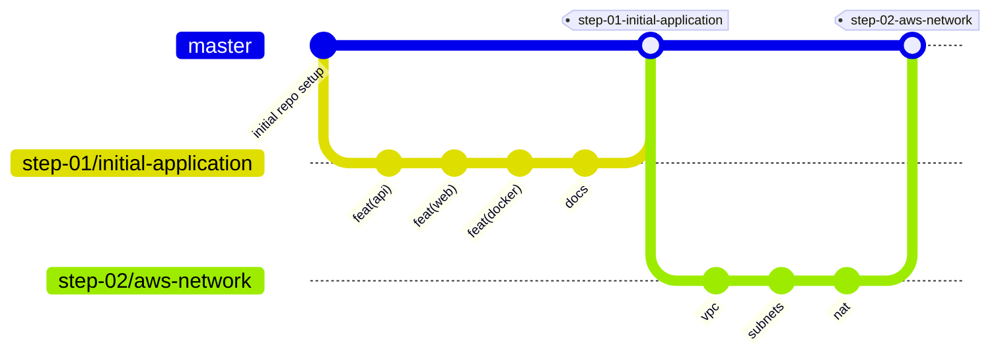

# Contributing

A few simple rules so the history stays easy to read. This repo is also learning material, so a clean history is part of the lesson.

## The flow

`master` is the main branch. It always holds finished, working steps.

1. Start from an up-to-date `master`.
2. Make a branch for one piece of work.
3. Commit in small steps.
4. Open a pull request into `master`.
5. Merge it once it is reviewed and `make test` passes.



Nobody pushes straight to `master`.

```bash
git switch master
git pull
git switch -c step-02/aws-network
# ...work, commit...
git push -u origin step-02/aws-network
```

## Branch names

The repo is built in steps (see [docs/steps](docs/steps/README.md)). Each step gets its own branch, named after the step number and the work it contains:

```
step-<NN>/<what-the-step-builds>
```

| step | branch |
|---|---|
| 1 | `step-01/initial-application` |
| 2 | `step-02/aws-network` |
| 3 | `step-03/database-and-secrets` |
| 4 | `step-04/containers-on-ecs` |
| 5 | `step-05/cdn-and-waf` |
| 6 | `step-06/scheduled-jobs` |
| 7 | `step-07/observability` |
| 8 | `step-08/ci-cd` |
| 9 | `step-09/rebuild-and-replicate` |

Work that is not a whole step gets a branch named after what it does:

```
<type>/<short-description>
```

- lowercase, words joined with `-`
- short: 2 to 5 words
- one topic per branch

| type | use it for | example |
|---|---|---|
| `feat` | a new feature | `feat/monitor-pause-button` |
| `fix` | a bug fix | `fix/rollup-midnight-results` |
| `docs` | documentation only | `docs/local-setup-windows` |
| `infra` | AWS or Terraform work outside a step | `infra/nat-cost-tweak` |
| `ci` | GitHub Actions and pipelines | `ci/backend-tests` |
| `refactor` | same behaviour, cleaner code | `refactor/api-handlers` |
| `test` | tests only | `test/netguard-ipv6` |
| `chore` | tooling, dependencies, cleanup | `chore/bump-gorm` |

## Commit messages

We use [Conventional Commits](https://www.conventionalcommits.org/):

```
<type>(<scope>): <what changed>

<why, if it is not obvious>
```

**type** is one of the types in the table above (`feat`, `fix`, `docs`, `infra`, `ci`, `refactor`, `test`, `chore`).

**scope** is the part of the repo you touched:

| scope | what |
|---|---|
| `api` | Go API handlers |
| `jobs` | check, rollup, scheduler |
| `db` | models, migrations, queries |
| `web` | React frontend |
| `docker` | Dockerfiles, `compose.yaml` |
| `make` | Makefile |
| `network`, `security`, `rds`, `ecs`, `edge`, `jobs`, `observability`, `cicd` | AWS and Terraform parts (from step 02 on) |
| `terraform` | Terraform layout, Makefile targets, shared settings |
| `docs` | when the type is not `docs` but the change is |

**Subject line rules:**

- say what the commit does, as an order: "add", not "added" or "adds"
- lowercase, no full stop at the end
- 50 characters or less
- leave one empty line before the body

**The body** says *why*, not *what*. The diff already shows what. Skip it when the subject says enough.

Good:

```
feat(jobs): skip check run when previous one is busy

Checks can take longer than the interval when many sites are slow.
Without a lock, two runs overlap and save duplicate results.
```

```
fix(web): show error when admin token is wrong
```

```
docs: add windows steps to local development guide
```

Not good:

```
update stuff
Fixed bug.
feat: Added new feature for the monitors page and also fixed the header and changed some styles
```

The last one mixes three changes. Split it into three commits.

**Breaking changes:** add `!` after the scope, and explain in the body.

```
feat(api)!: rename expected_status to expect_status
```

## Pull requests

- Title uses the same format as a commit subject, for example `feat: step 01 initial application`.
- A step PR can be big. Keep the commits inside it small, so the history reads like the steps of a recipe.
- Merge with a merge commit, not squash. Learners should be able to see every small commit.
- Fill in the template: what, why, how you tested it.
- `make test` must pass.

## Tags

When a step is merged into `master`, it gets a tag with the same name as its branch, but using `-` instead of `/`:

```
step-01-initial-application
step-02-aws-network
...
```

So anyone can jump to the end of any step:

```bash
git switch --detach step-01-initial-application
```

## Checkpoints

A tag marks the commit where a step was first merged, and never moves. A **checkpoint branch** marks the end of a step including later fixes to that step. Learners start each step from the checkpoint of the one before. See [docs/steps](docs/steps/README.md#checkpoints-the-end-of-each-step) for why.

After a step's pull request is merged:

```bash
git switch master
git pull
git tag -a step-02-aws-network -m "Step 02: AWS network"
git branch checkpoint/step-02 master
git push origin step-02-aws-network checkpoint/step-02
```

When a fix for an earlier step lands on `master` later, move that step's checkpoint forward with only the fix:

```bash
git switch checkpoint/step-02
git cherry-pick <fix commit>
make test
git push origin checkpoint/step-02
```

Checkpoint branches are never force-pushed and never get work from a later step.
