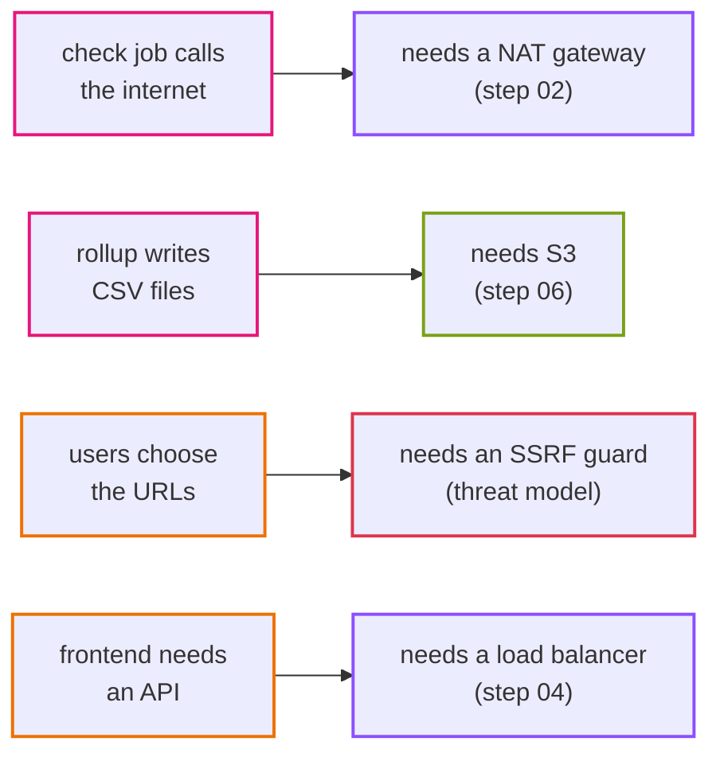

# 0001. Uptime monitor as the sample app

- Status: Accepted
- Date: 2026-09-28

## Context

The app exists to carry the AWS architecture. It must need a frontend, an API, a database and a scheduled batch job, and each of these must have a real reason to exist. It must also stay small enough to build in about a week, because the infrastructure is the point.

## Options

1. **Todo / notes app.** Everyone knows it. But there is no natural batch job, and nothing ever calls the internet, so the scheduler and the NAT gateway would be fake.
2. **Exchange-rate tracker.** A daily job fetches rates from a public API. It has a real batch job and real outbound traffic, but users hardly write anything.
3. **Uptime monitor.** Users add URLs, a job checks them on a schedule and calls the internet, and a nightly rollup writes reports.

## Decision

Uptime monitor. Every part has a job:

- the check job **must** reach the internet from a private subnet, so the NAT gateway (or its alternatives) is needed for real
- the rollup job writes files, which gives S3 a real use
- user-supplied URLs create a real security problem (SSRF), which gives the threat model something concrete
- everyone understands "is the site up?" without explanation

## Consequences

- We must guard against SSRF from day one (`internal/netguard`).
- `check_results` grows quickly, so rollup has to delete old rows.
- There are no user accounts. One admin token protects writes. That is enough for a reference app, not for a real product.

## When we would change this

If the batch side ever needs heavy fan-out (thousands of monitors), the single check task would be replaced by a queue (SQS) and workers. That would be a new ADR.
