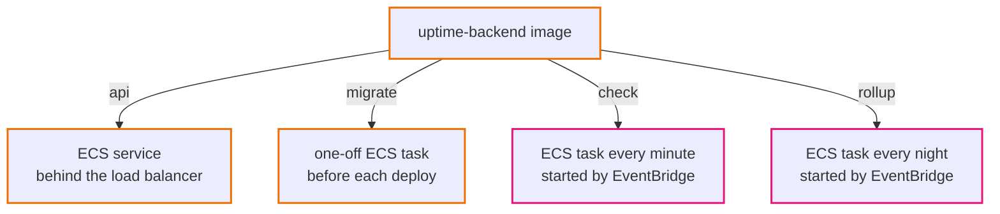

# 0002. One backend image, many commands

- Status: Accepted. How `migrate` runs on AWS changed in [0012](0012-migrate-as-init-container.md).
- Date: 2026-09-28

## Context

The backend has four jobs: serve the API, run migrations, check monitors and roll up results. They share the models, the database code and the settings.

## Options

1. **Separate programs and images** for the API and the jobs. Each image is smaller and focused. But the shared code has to be versioned twice, and there are two pipelines and two images that can drift apart.
2. **One program, chosen by command** (`uptime api`, `uptime check`...), built into one image.

## Decision

One program, one image. Each container, and later each ECS task definition, runs the same image with a different command.

## Consequences

- One build, one security scan, one tag per release. The API and the jobs are always the same version.
- A job task carries the API code it does not use. At this size (about 22 MB) that does not matter.
- `dev-scheduler` exists only for local use. On AWS, EventBridge Scheduler starts `check` and `rollup` directly.

## When we would change this

If the jobs need very different dependencies, resources or release timing from the API (for example a heavy reporting library), we would split them.
