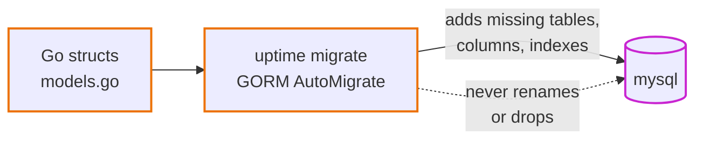

# 0003. GORM AutoMigrate for the schema, for now

- Status: Accepted
- Date: 2026-09-28

## Context

We use GORM as the ORM on MySQL. The tables have to be created and updated somehow, and learners need to understand it without extra tools.

## Options

1. **GORM AutoMigrate.** The Go structs are the schema. It creates missing tables, columns and indexes, and never drops anything. No extra tool to learn.
2. **Versioned SQL migrations** (goose, golang-migrate). Every change is a numbered SQL file that can be reviewed and rolled back. That is safer for production, but it is one more tool and one more concept on day one.

## Decision

AutoMigrate, run by the `migrate` command. Locally that is its own Compose service; on AWS it will be a one-off ECS task before each deploy.

## Consequences

- Adding a column is just adding a struct field.
- Renaming or deleting a column is **not** handled. AutoMigrate leaves the old column in place.
- There is no record of which change happened when, apart from git history.

## When we would change this

The first time we need to rename a column, move data, or roll a schema change back, we switch to versioned migrations. That switch is itself a useful lesson.
