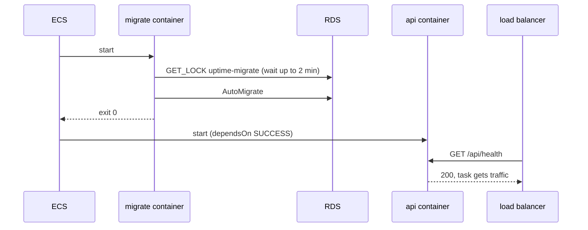

# 0012. Run migrate as a container that starts before the API in every task

- Status: Accepted
- Date: 2026-09-29

## Context

ADR 0002 planned `migrate` as a one-off ECS task "before each deploy". Writing the deploy showed a problem: the new migrate task must use the **new** image, but in our setup a new task definition only exists once Terraform has applied it, and that same apply also starts the new API tasks. Getting the order right needs either two applies with different image tags, or a deploy script that builds task definitions outside Terraform.

The tables are managed by GORM AutoMigrate (ADR 0003): it only adds tables and columns, never drops or renames, and running it twice is safe.

## Options

1. **One-off migrate task run by the deploy pipeline** before the service update. The classic answer. Needs the pipeline to register a task definition for the new image first, so Terraform no longer owns all task definitions.
2. **Migrate inside the `api` command** at start-up. Simple, but every API process would need permission to change the schema, and a failed migration would look like a crashing API.
3. **An init container**: each API task has two containers from the same image. `migrate` runs first and exits. `api` starts only if `migrate` exited with code 0 (`dependsOn: SUCCESS`).

## Decision

Option 3. When several API tasks start at once, their migrate containers take turns on a MySQL lock (`uptime-migrate`, `db.WaitForLock`, up to two minutes). The first one changes the tables; the others find nothing to do.

## Consequences

- One Terraform apply deploys everything, in the right order, for any image.
- If a migration fails, the new tasks never start, the old tasks keep serving, and the deployment circuit breaker rolls back.
- Each task start runs a migrate that usually does nothing, which adds a second or two.
- During a rolling deploy, old API tasks run against the new schema for a minute. That is safe only because AutoMigrate never removes or renames anything. The check and rollup task definitions update in the same apply, so a scheduled job with new code can also meet the old schema for up to a minute; it fails that one run and succeeds on the next.

## When we would change this

- When we need a rename, a drop or a data migration (ADR 0003 already says we would move to versioned migrations then), those must run exactly once and in a planned order: we would go back to a one-off migrate task run by the pipeline, with expand-and-contract migrations.
