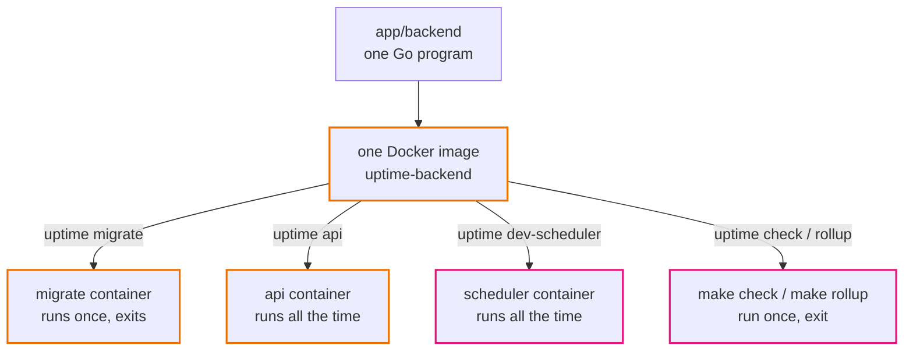
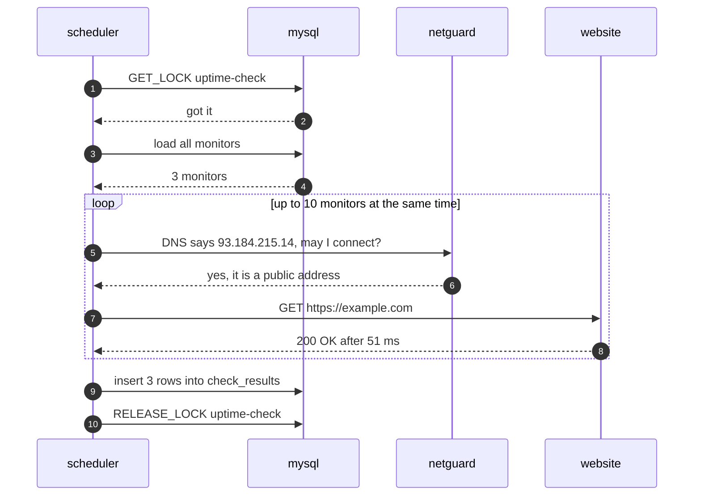
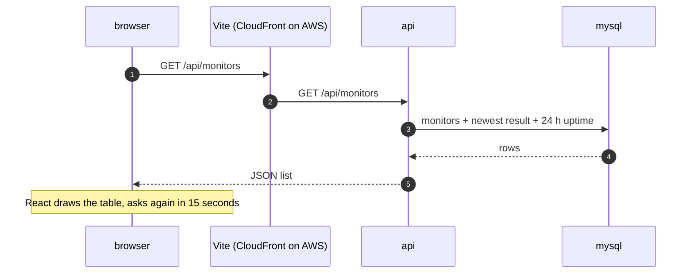
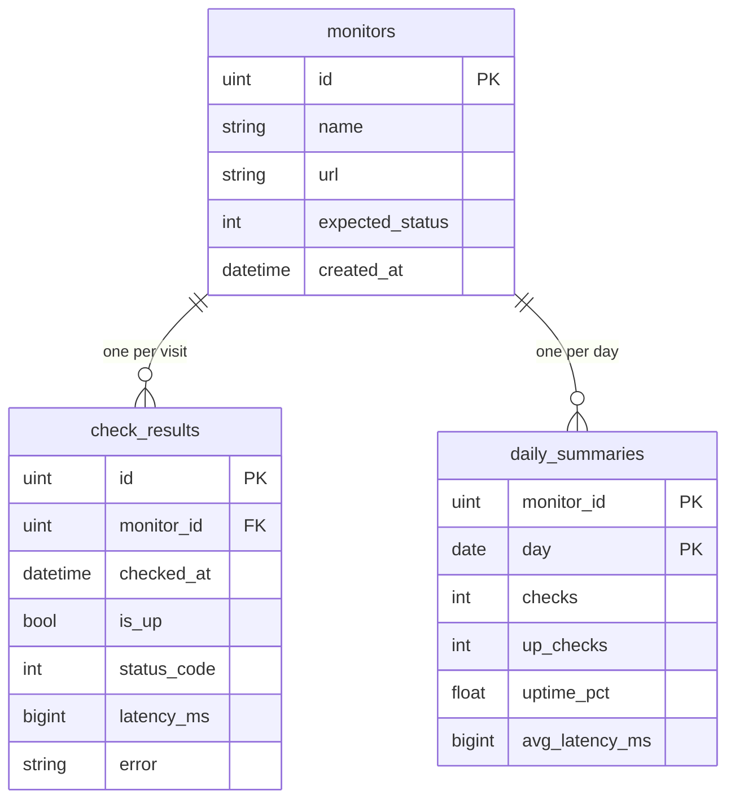
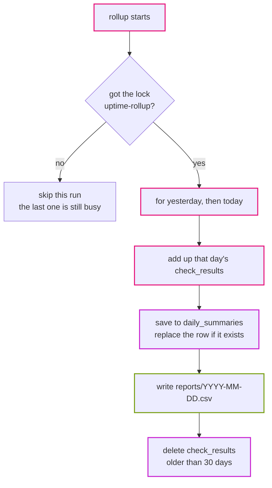
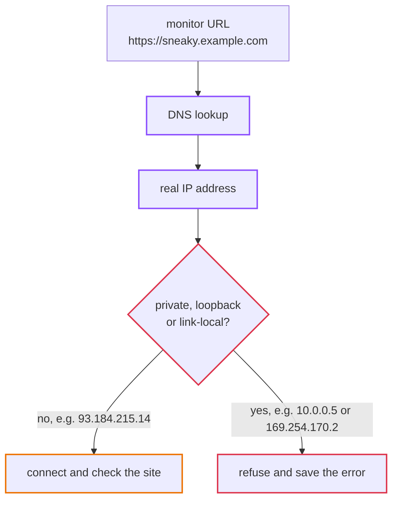
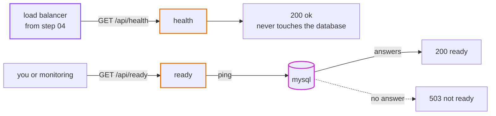
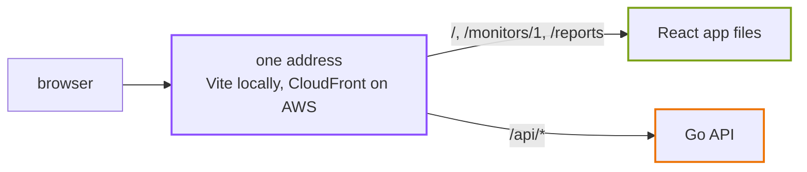

# How the app works

This page explains what each piece does and why it is built that way. You do not need AWS knowledge to follow it.

## The four pieces

<p align="center"></p>

**web** (`app/web`) is the React app you see in the browser. It never talks to the database. It only calls the API, always on paths starting with `/api`.

**api** (`app/backend`, command `api`) is a Go HTTP server. It reads monitors and results from the database and sends them to the web app as JSON. Adding or deleting a monitor needs the admin token.

**mysql** keeps all the data in three tables (see [The data](#the-data)).

**scheduler** runs two jobs:

- **check** visits every monitor once and saves the result.
- **rollup** adds up each day's results, writes a CSV report and deletes raw results older than 30 days.

## One program, many jobs

The API and the jobs are the same Go program. You choose what it does with the first word:

```bash
uptime api            # run the HTTP API
uptime migrate        # create or update the tables
uptime seed           # add example monitors
uptime check          # check every monitor once, then exit
uptime rollup         # build daily summaries and the report, then exit
uptime dev-scheduler  # run check and rollup on a timer (local only)
```

Why one program? They share the same database code and the same table definitions, and they are built and tested together. There is one Docker image to build, scan and deploy. Each container simply starts it with a different command. In `compose.yaml`, look at `command:` on the `migrate`, `api` and `scheduler` services.



## Life of one check

The first half happens in the background, on a timer:



1. The scheduler's timer fires (every minute locally).
2. It asks MySQL for a lock named `uptime-check`. If the previous check is still running, it skips this turn, so two checks never overlap.
3. It loads every monitor from the `monitors` table.
4. It visits up to 10 monitors at the same time. Each visit has a 10-second limit.
5. For each one it writes down: up or down, the status code, how long it took, and the error if there was one.
6. It saves all results to `check_results` in one insert.
7. It releases the lock and waits for the next turn.

Then, when you open the web app:



8. The browser asks `GET /api/monitors`.
9. The Vite dev server passes the request to the Go API (on AWS, CloudFront will do this).
10. The API finds the newest result and the 24-hour uptime for each monitor and sends back JSON.
11. React shows the list. It asks again every 15 seconds.

## The data

Three tables. Every result and every summary belongs to one monitor.



Here is what the rows look like.

**monitors**: what to watch.

| column | example |
|---|---|
| id | 1 |
| name | Example website |
| url | https://example.com |
| expected_status | 200 |
| created_at | 2026-09-28 10:02:18 |

**check_results**: one row per visit. This table grows fastest, which is why rollup deletes old rows.

| column | example |
|---|---|
| monitor_id | 1 |
| checked_at | 2026-09-28 10:03:00 |
| is_up | true |
| status_code | 200 |
| latency_ms | 51 |
| error | *(empty when up)* |

**daily_summaries**: one row per monitor per day, filled by rollup.

| column | example |
|---|---|
| monitor_id | 1 |
| day | 2026-09-28 |
| checks | 1440 |
| up_checks | 1438 |
| uptime_pct | 99.86 |
| avg_latency_ms | 63 |

Deleting a monitor also deletes its results and summaries (foreign keys with `ON DELETE CASCADE`).

The tables are created by GORM from the structs in `app/backend/internal/models/models.go`, when `migrate` runs.

## Running rollup twice is safe

Rollup can run many times a day, and the same day can be summarised again. Each summary row is **replaced**, never added twice. The table's key is `(monitor_id, day)`, and the insert uses "on duplicate key, update".

Rollup also redoes yesterday every time, so results that came in just before midnight are counted.



## Why the checker refuses private addresses

Anyone with the admin token picks a URL, and our server visits it. That is dangerous. Imagine someone adds:

- `http://169.254.170.2/...`: on AWS, this address hands out the container's own credentials
- the database's address
- any other private server inside our network

The server would visit those places for them. This attack is called **SSRF** (server-side request forgery).

So the checker refuses private and internal addresses. It checks the **real IP address after the DNS lookup**, right before connecting, not just the text of the URL. A normal-looking name like `sneaky.example.com` could point to `10.0.0.5`, and checking the text would miss that. The code is in `app/backend/internal/netguard`.



Locally we set `ALLOW_PRIVATE_TARGETS=true` in `compose.yaml` so the app can watch its own API at `http://api:8080`. On AWS it stays `false`. You can see the guard work locally:

```bash
docker compose run --rm -e ALLOW_PRIVATE_TARGETS=false api check
```

Then open the **Our own API** monitor. The newest check fails with `blocked: 172.x.x.x is a private or internal address`.

## Health and ready

The API has two status endpoints, and they answer different questions:

- `GET /api/health` asks "is the process alive?" It never touches the database.
- `GET /api/ready` asks "can it do real work?" It pings the database.



On AWS the load balancer will use `health`. If it used `ready`, a short database hiccup would make the load balancer think every API container is broken and replace them all, which makes things worse.

## Why there is no CORS setup



The browser only ever talks to one address. Locally Vite sends `/api/*` to the API. On AWS, CloudFront will do the same. Since the page and the API come from the same origin, the browser has no cross-origin rules to check.
