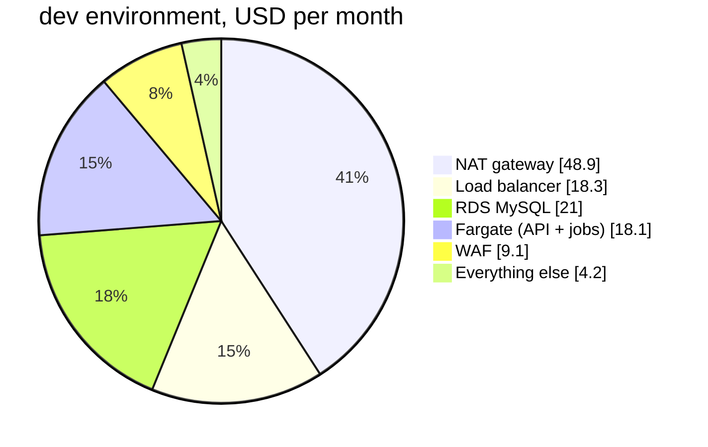

# What it costs

Everything in this repo runs in **Tokyo (`ap-northeast-1`)**. This page lists what each piece costs there, what a whole environment costs per month, and what a study session costs per hour.

**Read this first:**

- These are on-demand list prices in US dollars, written down in September 2026. AWS changes prices, and Tokyo is about 20 to 30% more expensive than `us-east-1`. Before you build anything, check the numbers yourself (see [Check a price yourself](#check-a-price-yourself)).
- Taxes are not included. In Japan, AWS adds 10% consumption tax.
- New AWS accounts get free credits or free-tier usage. Check what your account has in the Billing console. This page assumes you pay for everything.
- A month is 730 hours.

## The prices we use

| Service | What you pay for | Tokyo price |
|---|---|---|
| NAT gateway | each hour it exists | $0.062 / hour |
| | each GB that goes through it | $0.062 / GB |
| Public IPv4 address | each hour, attached or not (the NAT's Elastic IP; an internet-facing load balancer has one per zone) | $0.005 / hour |
| S3 gateway endpoint | nothing | free |
| Interface VPC endpoint | each hour, in each zone | $0.014 / hour / zone |
| Data between zones | each GB, in each direction | $0.01 / GB |
| Application Load Balancer | each hour | $0.0243 / hour |
| | load balancer capacity units (LCU) | $0.008 / LCU-hour |
| Fargate, ARM (Graviton) | vCPU | $0.04045 / vCPU-hour |
| | memory | $0.00442 / GB-hour |
| RDS MySQL `db.t4g.micro`, single-AZ | each hour | about $0.025 / hour |
| RDS MySQL `db.t4g.small`, Multi-AZ | each hour (two machines) | about $0.098 / hour |
| RDS gp3 storage | each GB-month (double with Multi-AZ) | about $0.138 / GB-month |
| Secrets Manager | each secret | $0.40 / month |
| | API calls | $0.05 / 10,000 calls |
| CloudWatch Logs | data sent in | $0.76 / GB |
| | data kept | $0.033 / GB-month |
| CloudWatch alarms | each standard alarm | $0.10 / month |
| CloudWatch custom metrics | each metric (ours come from log lines) | $0.30 / month |
| CloudWatch dashboards | the first 3 in an account | free |
| ECR | images stored | $0.10 / GB-month |
| S3 Standard | data stored | $0.025 / GB-month |
| CloudFront | first 1 TB out and 10 million requests each month | free |
| WAF | each web ACL | $5.00 / month |
| | each rule or managed rule group | $1.00 / month |
| | requests | $0.60 / million |
| EventBridge Scheduler | first 14 million runs each month | free |
| Route 53 | each hosted zone | $0.50 / month |
| ACM public certificates | used with CloudFront or a load balancer | free |
| EC2 `t4g.nano` | each hour (only for the step 02 test machine) | about $0.0054 / hour |

## One environment, per month

What the finished app (after step 08) costs to leave running for a month.

| Piece | dev and staging | prod | Why prod differs |
|---|---|---|---|
| NAT gateway + Elastic IP | $48.91 (1) | $97.82 (2) | one per zone ([ADR 0006](adr/0006-nat-gateways-per-environment.md)) |
| Load balancer (internal), low traffic | $18.30 | $18.30 | internal, so no public IPv4 cost ([ADR 0005](adr/0005-three-subnet-tiers-api-in-private.md)) |
| API on Fargate | $8.99 (1 task, 0.25 vCPU, 0.5 GB) | $35.96 (2 tasks, 0.5 vCPU, 1 GB) | two tasks in two zones |
| Check job, every minute | $9.00 | $9.00 | |
| Rollup job, every hour | $0.15 | $0.15 | |
| RDS MySQL + 20 GB storage | $21.01 (`db.t4g.micro`) | $77.06 (`db.t4g.small`, Multi-AZ) | a standby in the second zone |
| Secrets Manager (2 secrets + calls) | $1.25 | $1.25 | |
| CloudWatch: logs, 10 alarms, 3 custom metrics | $2.40 | $3.10 | more log data |
| WAF (1 web ACL, 4 rules) | $9.10 | $9.10 | |
| ECR, S3, CloudFront, Scheduler | under $0.50 | under $1.00 | |
| **Total, about** | **$120 / month** | **$253 / month** | |
| **Per hour, about** | **$0.16** | **$0.35** | |

Optional: a domain in Route 53 adds $0.50 a month for the hosted zone, plus about $15 a year to register a `.com` name.

Where the money goes in dev:



The NAT gateway is the biggest single cost of a quiet environment. It is also the first thing to delete when you stop for the day.

### How the check job number is worked out

EventBridge Scheduler starts a new Fargate task every minute. Fargate bills from the moment it starts pulling the image until the task stops, with a minimum of one minute.

```
one task-minute = (0.25 vCPU x $0.04045 + 0.5 GB x $0.00442) / 60 = $0.000205
runs per month  = 60 x 24 x 30.4                                  = 43,800
per month       = 43,800 x $0.000205                              = about $9.00
```

A long-running worker task with a timer inside would cost about the same ($8.99), because the one-minute minimum means a task every minute is billed like a task that never stops. [ADR 0014](adr/0014-eventbridge-scheduler-runs-ecs-tasks.md) explains why we still start a fresh task each time.

Without the free S3 gateway endpoint, each of those 43,800 starts would pull the image layers through the NAT gateway: about 430 GB, or $27 a month extra.

## Per step: what it costs while you work

Each step adds pieces. This is the running total per hour while everything from that step and the ones before it exists (dev sizes).

| After step | What is added | Adds per hour | Running total per hour |
|---|---|---|---|
| 02 network | NAT gateway + Elastic IP; a `t4g.nano` test machine while you test | $0.067 (+ $0.006) | $0.07 |
| 03 database | RDS `db.t4g.micro`, 2 secrets, reports bucket | $0.030 | $0.10 |
| 04 containers | internal load balancer, 1 API task, ECR | $0.038 | $0.14 |
| 05 edge | CloudFront (free tier), WAF | $0.012 | $0.15 |
| 06 jobs | check task every minute, rollup every hour | $0.013 | $0.16 |
| 07 observability | 10 alarms, 3 custom metrics, log data | $0.003 | $0.16 |
| 08 CI/CD | GitHub Actions (free for public repos), IAM roles (free) | $0 | $0.16 |

A three-hour study session at the end of the track costs about $0.50. A dev environment forgotten for a month costs about $120. **Every step ends with a clean-up section. Do it.**

## Ways to spend less

1. **Destroy what you are not using.** Each stack can be destroyed and rebuilt in minutes: `make tf-destroy env=dev stack=<stack>`, in reverse order (see step 09).
2. **Turn the NAT gateway off** between sessions: set `nat_gateway_mode = "none"` in `envs/dev/network.tfvars` and apply. Saves $1.61 a day. Checks and image pulls stop working until you turn it back on.
3. **Stop the database.** RDS can be stopped for up to 7 days (you still pay for storage). AWS starts it again by itself after 7 days.
4. **Set up a budget alert** before anything else. `terraform/bootstrap` makes one if you give it your email (step 02, section 8.2). The first two budgets in an account are free.
5. **Use ARM (Graviton) for Fargate.** It is about 20% cheaper than x86 for the same size. We already do.

## Check a price yourself

Prices change. Two ways to check:

1. The [AWS Pricing Calculator](https://calculator.aws/). Pick region **Asia Pacific (Tokyo)**.
2. The Price List API, from your own terminal. For example, the NAT gateway hourly price in Tokyo:

```bash
aws pricing get-products --region us-east-1 --service-code AmazonEC2 \
  --filters Type=TERM_MATCH,Field=regionCode,Value=ap-northeast-1 \
            Type=TERM_MATCH,Field=usagetype,Value=APN1-NatGateway-Hours \
  --query 'PriceList[0]' --output text \
  | jq -r '.terms.OnDemand[].priceDimensions[] | "\(.description): \(.pricePerUnit.USD)"'
```

You should see one line, something like `$0.062 per NAT Gateway Hour: 0.0620000000`. The Price List API only answers from `us-east-1` (and a few other regions), which is why the command says `--region us-east-1` even though the price is for Tokyo.

To find the bill after it happens, open **Billing and Cost Management, Cost Explorer**, group by **Tag: Environment** or **Tag: Stack**. Every resource Terraform makes carries those tags.
