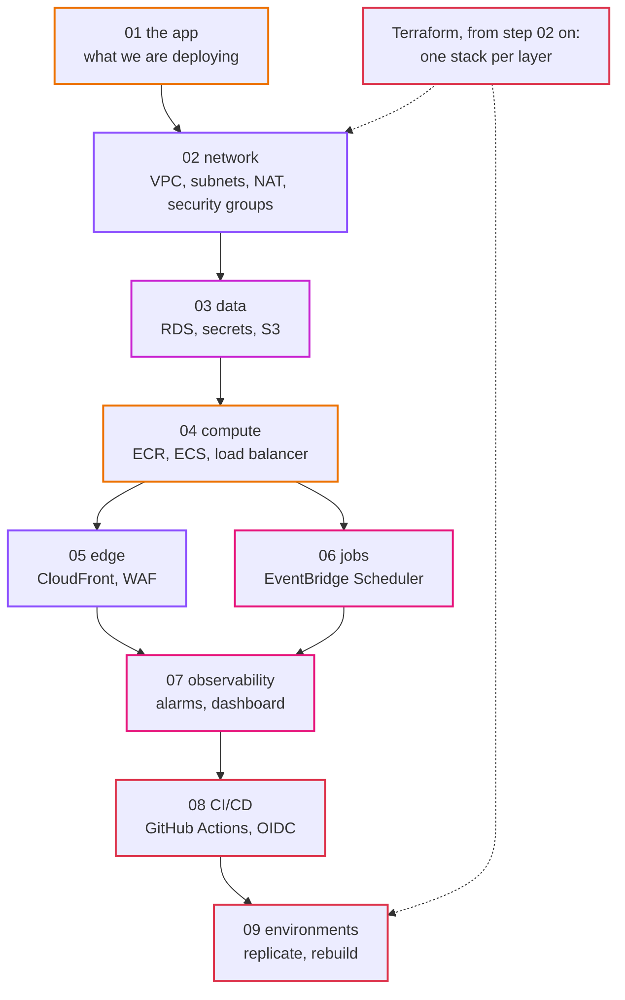

# Learning path

How to learn from this repo on your own: in what order, how long it takes, how to study each step so it sticks, and how to know you really understood it.

## Who this is for

You can use a terminal and read code, and you have seen a web app before. You do not need to know AWS, Terraform, Docker or Go. Every new word is explained the first time it appears.

By the end you will have built, broken, rebuilt and automated a small production system on AWS, and you will be able to explain every decision in it.

## The map

Each step depends on the one before. Do them in order.

## How long it takes

About 25 to 30 hours of focused work, plus waiting for AWS. A realistic plan is two sessions a week for five weeks:

| Week | Sessions | Steps | Hands-on time | AWS cost if you clean up after each session |
|---|---|---|---|---|
| 1 | 2 | 01, 02 | 5 to 6 h | under $1 |
| 2 | 2 | 03, 04 | 7 h | about $1.50 |
| 3 | 2 | 05, 06 | 5 h | about $1.50 |
| 4 | 2 | 07, 08 | 4 to 5 h | about $1 |
| 5 | 2 | 09, review | 4 to 5 h | about $1.50 |

Leaving everything running for the five weeks instead costs about $150. The clean-up section of each step is part of the lesson. See [costs.md](costs.md).

## How to study one step

Every step has a **guide** (in `docs/steps`) and a **workbook** (in `docs/workbook`). Use both, in this order:

1. **Before the session (20 minutes):** read the guide's "What you will be able to do", the words table and the design section. Look at the diagram until you can say what each box is. Write the answers to the workbook's "Understand" questions in your own words, even if they are wrong. Being wrong on paper first makes the right answer stick.
2. **Build by hand (the console).** Slowly. Read every screen. The console shows options Terraform hides behind defaults.
3. **Test it** with the commands in the workbook. Compare what you see with what the guide says you should see. If it differs, stop and find out why before going on. That difference is where the learning is.
4. **Break it on purpose.** Predict what will happen *before* you break it. Write your prediction in the workbook's table. Then do it and write what really happened.
5. **Delete the hand-built version, then do it in Terraform.** Read the plan before you apply it. Match each resource in the plan to something you clicked.
6. **Answer "check yourself"** without looking. Then open the answers.
7. **Clean up**, and write down what is still running in the session log.

After the session, explain the step to someone else (or to a rubber duck) in two minutes, using the diagram. If you cannot, repeat the part where you got stuck.

## Read the decisions

The `docs/adr` folder explains why each choice was made, what else was considered, and when we would change our minds. Read the ADRs of a step **after** you built it by hand: then you know what the options feel like. For each ADR, ask: *would I have decided the same, for my own project?* If not, write your own ADR with [the template](adr/template.md). That is the best exercise in this repo.

## Checkpoints for yourself

You understood a step when you can do these without the guide:

| After step | You can |
|---|---|
| 01 | draw the four pieces and follow one check through the code |
| 02 | say what makes a subnet public, by pointing at a route table, and price one NAT versus two |
| 03 | connect to RDS over verified TLS from inside the VPC, and show the password is not in state |
| 04 | deploy a new image, watch a bad deploy roll back, and run a one-off task |
| 05 | explain the path of `/` and of `/api/*` from the browser to the origin |
| 06 | find one job run in ECS and in the logs, and explain why two runs cannot overlap |
| 07 | get an email when checks stop, without having predicted why they stopped |
| 08 | merge a change and have it deployed with no AWS keys anywhere |
| 09 | build a new environment from values only, and name what a rebuild does not bring back |

## When you get stuck

1. Read the workbook's "If something goes wrong" table.
2. Read the exact error message, all of it. AWS errors usually name the missing permission, resource or setting.
3. Timeouts on AWS are almost always a security group or a route. Refusals (`AccessDenied`, `401`, `403`) are permissions.
4. `make tf-plan` shows the difference between the code and reality. Drift explains a lot.
5. The [runbook](runbook.md) covers the common failures of the finished system.

## Going further

When you finish, the end of [step 09](steps/09-rebuild-and-replicate.md#where-to-go-from-here) lists directions to go deeper: separate accounts, backups in another region, versioned migrations, blue/green deploys, plans on pull requests, IAM database authentication. Pick one, write an ADR for it first, then build it the same way: by hand, break it, Terraform.

Useful AWS reading, in the order the steps use it:

- [Amazon VPC User Guide](https://docs.aws.amazon.com/vpc/latest/userguide/): route tables, NAT gateways, security groups
- [Amazon RDS for MySQL](https://docs.aws.amazon.com/AmazonRDS/latest/UserGuide/CHAP_MySQL.html): Multi-AZ, backups, TLS
- [Amazon ECS Developer Guide](https://docs.aws.amazon.com/AmazonECS/latest/developerguide/): task definitions, services, IAM roles for tasks
- [Amazon CloudFront Developer Guide](https://docs.aws.amazon.com/AmazonCloudFront/latest/DeveloperGuide/): behaviors, OAC, VPC origins
- [AWS Well-Architected Framework](https://docs.aws.amazon.com/wellarchitected/latest/framework/): the checklist this repo tries to follow at small scale
