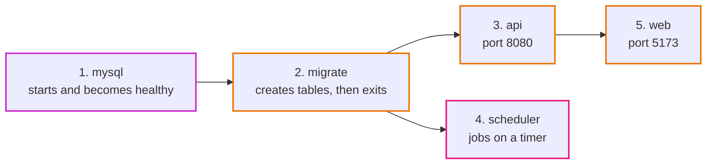
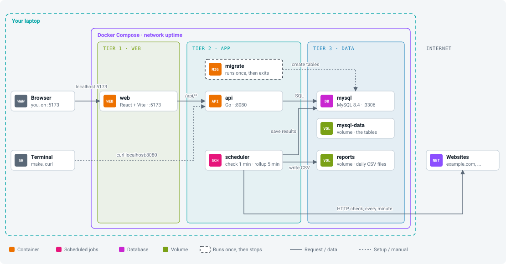
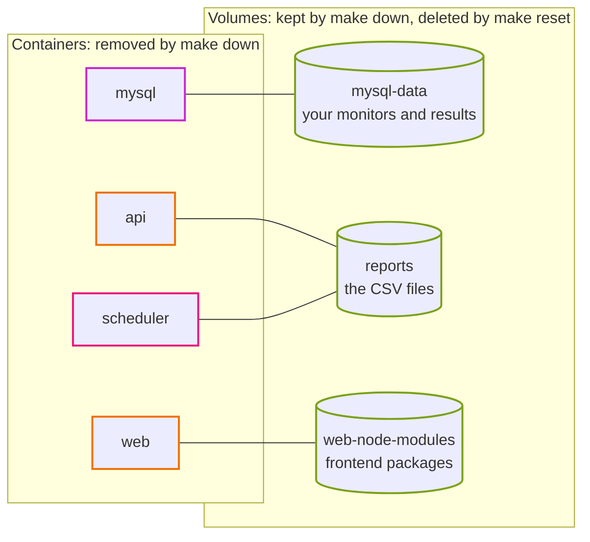

# Run the app on your laptop

This guide takes you from zero to a running app. Every step says what to type and what you should see. If something looks different, check [When something goes wrong](#when-something-goes-wrong) at the end.

## What you need

Three tools. You do **not** need Go, Node or MySQL. They all run inside Docker.

| Tool | Why | Check it works |
|---|---|---|
| Docker (with Compose) | runs every part of the app | `docker compose version` |
| make | gives us short commands | `make --version` |
| git | downloads the code | `git --version` |

How to install them:

- **Mac:** install [Docker Desktop](https://www.docker.com/products/docker-desktop/). `make` and `git` come with the Xcode command line tools (`xcode-select --install`).
- **Windows:** install [WSL 2](https://learn.microsoft.com/windows/wsl/install) and Docker Desktop, then run every command inside the Ubuntu (WSL) terminal, not PowerShell.
- **Linux:** install Docker Engine and the Compose plugin from [docs.docker.com](https://docs.docker.com/engine/install/). `make` and `git` come from your package manager.

Before you go on, make sure Docker is running. `docker ps` should print a table header, not an error.

## Step 1: Get the code

```bash
git clone git@github.com:shadreza/aws-three-tier-cloud-ref-architecture.git
cd aws-three-tier-cloud-ref-architecture
```

Type `make`. You should see a list of commands. Everything else in this guide uses them.

## Step 2: Start the app

```bash
make up
```

The first time takes a few minutes. Docker downloads MySQL, Go and Node images and builds the backend. Later starts take seconds.

Here is what starts, in order:



1. **mysql**: the database. The others wait until it is healthy.
2. **migrate**: creates the tables, then stops. That is normal. It is supposed to exit.
3. **api**: the Go API on port 8080.
4. **scheduler**: runs the check job every minute and the rollup job every 5 minutes.
5. **web**: installs the frontend packages, then serves the React app on port 5173.

## Step 3: Check it is running

```bash
make ps
```

You should see `mysql`, `api`, `scheduler` and `web` with status `Up` (or `running`). `migrate` is not listed because it already finished.

This is how the containers are wired. Only three of them (web, api, mysql) open a port on your laptop. The scheduler needs none, because nobody calls it: it calls others.

<p align="center"></p>

Inside Docker, containers find each other by name (`api`, `mysql`). From your laptop you use `localhost` and the port.

Ask the API if it is alive:

```bash
curl http://localhost:8080/api/health
```

You should get `{"status":"ok"}`.

## Step 4: Open the app

Go to <http://localhost:5173>.

You should see **"Nothing is being watched yet"**. If the page does not load, the web container may still be installing packages. Run `make logs s=web` and wait for a line with `Local: http://localhost:5173/`, then refresh.

## Step 5: Add example monitors

```bash
make seed
```

This adds three monitors:

- **Example website** (`https://example.com`) should turn **Up**.
- **Broken on purpose** points to a site that does not exist, so it turns **Down**. That is how you see what a failure looks like.
- **Our own API** is the app watching itself.

The scheduler checks them within a minute. The page refreshes by itself every 15 seconds. Too slow? Run the check yourself:

```bash
make check
```

## Step 6: Add your own monitor

Adding and deleting needs the **admin token**. Locally it is:

```
local-dev-token
```

1. Paste it into the **Admin token** box at the top right and click **Save**.
2. Fill in the **Add a monitor** form, for example name `GitHub`, URL `https://github.com`.
3. Click **Add monitor**.

Try adding `http://169.254.170.2`. Nothing happens except an error message. The app refuses private addresses on purpose; [how-it-works.md](app/how-it-works.md#why-the-checker-refuses-private-addresses) explains why.

## Step 7: Look at one monitor

Click a monitor's name. You will see:

- **Recent checks**: one small bar per check. Green is up, red is down. Hover a bar for details.
- **Daily summary**: filled by the rollup job, which runs every 5 minutes locally.

## Step 8: Get a report

Open **Reports** in the top menu. Each day has a CSV file you can download and open in Excel or Google Sheets. To make one right now:

```bash
make rollup
```

## Step 9: Watch the jobs work

```bash
make logs s=scheduler
```

Every minute you should see a line like:

```json
{"level":"INFO","msg":"check finished","monitors":3,"up":2,"down":1}
```

Press `Ctrl+C` to stop watching. The app keeps running.

## Step 10: Look inside the database

```bash
make db
```

You are now at a `mysql>` prompt. Try:

```sql
SHOW TABLES;
SELECT id, name, url FROM monitors;
SELECT monitor_id, checked_at, is_up, latency_ms FROM check_results ORDER BY id DESC LIMIT 5;
SELECT * FROM daily_summaries;
```

Type `exit` to leave.

## Step 11: Stop the app

```bash
make down
```

Your data is kept. `make up` brings everything back as you left it.

That works because Docker keeps two kinds of things apart:



To start completely fresh (this **deletes** the database and reports):

```bash
make reset
```

## Changing the code

- **Frontend** (`app/web/src`): save the file and the browser updates by itself.
- **Backend** (`app/backend`): run `make restart` to rebuild and restart the Go containers.
- **Tests**: `make test` runs the Go tests and type-checks the frontend.

## Settings

The defaults work out of the box. To change one, copy `.env.example` to `.env` and edit it.

| Setting | Default | What it does |
|---|---|---|
| `WEB_PORT` | `5173` | port for the web app |
| `API_PORT` | `8080` | port for the API |
| `MYSQL_PORT` | `3306` | port for MySQL on your machine |
| `ADMIN_TOKEN` | `local-dev-token` | token needed to add or delete monitors |
| `DEV_CHECK_EVERY` | `1m` | how often the local scheduler checks monitors |
| `DEV_ROLLUP_EVERY` | `5m` | how often the local scheduler builds reports |

After changing `.env`, run `make up` again.

## When something goes wrong

**`port is already allocated`**
Something else on your machine uses that port, often a local MySQL on 3306. Set a different port in `.env` (for example `MYSQL_PORT=3307`) and run `make up`.

**The web page shows `Could not load monitors: Request failed (502)` or (500)**
The API is not ready yet, or it stopped. Run `make ps`. If `api` is missing, run `make logs s=api` to see why.

**`migrate` failed**
Run `make logs s=migrate`. Most of the time MySQL was still starting. Run `make up` again.

**The page loads forever the first time**
The web container is still running `npm ci`. Check with `make logs s=web`.

**Everything is weird and I want to start over**
`make reset`, then `make up`, then `make seed`.
