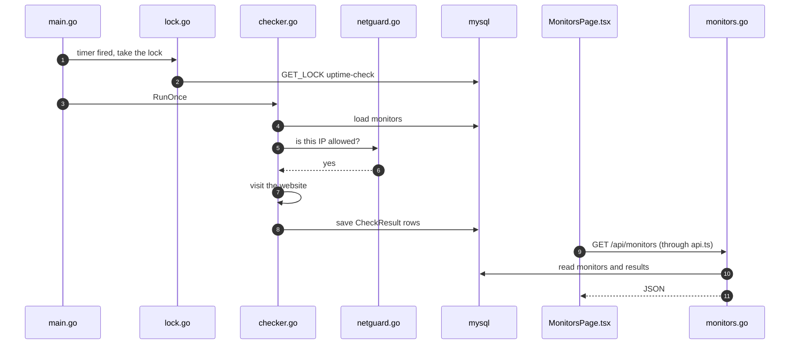
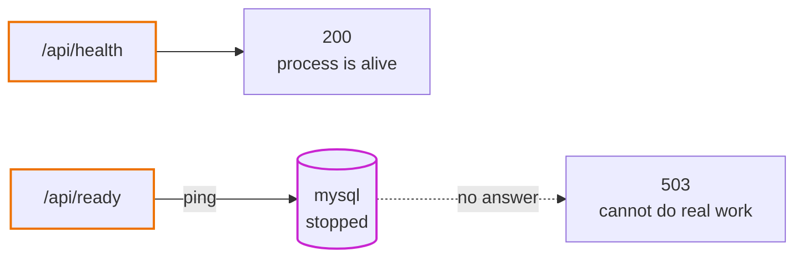

# Step 01: Understand the application

Before we put anything on AWS, we need to know exactly what we are putting there. In this step you run the app on your laptop, follow one piece of data through it from start to end, and read why it was built this way.

No AWS account is needed yet.

- **Time:** about 1 to 2 hours
- **You need:** Docker, make, git ([how to install](../local-development.md#what-you-need))
- **Branch:** `step-01/initial-application`
- **Workbook:** [docs/workbook/01-understand-the-application.md](../workbook/01-understand-the-application.md) (checklists, commands in order, a log to fill in)

## What you will be able to do after this step

- Say in one sentence what the app does.
- Name the four pieces (web, api, database, scheduler) and say what each one does.
- Start, stop and reset the whole app with `make`.
- Follow one check from the scheduler to the database to your screen.
- Explain why the app refuses private addresses.
- Explain the difference between `/api/health` and `/api/ready`.

## 1. Get the big picture

Read the top of the [README](../../README.md), down to **How the pieces fit**.

The whole app in one sentence: **you give it web addresses, it checks them every minute, and shows you which ones are up.**

<p align="center"></p>

Find the four pieces:

| Piece | What it does | Where the code is |
|---|---|---|
| web | the pages you see in the browser | `app/web` |
| api | answers the web app's questions with data | `app/backend`, command `api` |
| mysql | keeps all the data | a ready-made Docker image |
| scheduler | visits every website on a timer and writes down what happened | `app/backend`, commands `check` and `rollup` |

Notice that api and scheduler are the **same program**. [ADR 0002](../adr/0002-one-backend-image-many-commands.md) explains why.

## 2. Run it

Follow [local-development.md](../local-development.md) from Step 1 to Step 9. Short version:

```bash
make up
make seed
```

Open <http://localhost:5173>. Wait until you see one monitor **Up**, one **Down** and our own API **Up**.

Keep the app running for the rest of this step.

## 3. Follow one check from start to end

This is the most important part of the step. Read [how-it-works.md, "Life of one check"](../app/how-it-works.md#life-of-one-check), then find each part in the code yourself:

| What happens | Open this file | Look for |
|---|---|---|
| The timer fires | `app/backend/cmd/uptime/main.go` | `runDevScheduler` |
| Only one check runs at a time | `app/backend/internal/db/lock.go` | `GET_LOCK` |
| Every monitor gets visited | `app/backend/internal/checker/checker.go` | `RunOnce`, `checkOne` |
| Private addresses are refused | `app/backend/internal/netguard/netguard.go` | `DialControl` |
| The result is saved | `app/backend/internal/models/models.go` | `CheckResult` |
| The web app asks for the list | `app/web/src/api.ts` | `listMonitors` |
| The API answers | `app/backend/internal/api/monitors.go` | `listMonitors` |
| The page shows it | `app/web/src/pages/MonitorsPage.tsx` | the table |

The same journey as a picture. Each box is a file you can open:



Now watch it happen live. In one terminal:

```bash
make logs s=scheduler
```

In a second terminal, run a check yourself:

```bash
make check
```

Then look at the rows it saved:

```bash
make db
```

```sql
SELECT monitor_id, checked_at, is_up, latency_ms, error FROM check_results ORDER BY id DESC LIMIT 5;
exit
```

You just followed one piece of data all the way: scheduler, internet, database, API, browser.

## 4. Read the decisions

Every important choice has a short note called an ADR. Read all three. Each takes about 3 minutes:

1. [0001: Why an uptime monitor](../adr/0001-uptime-monitor-as-sample-app.md)
2. [0002: Why one program for the API and the jobs](../adr/0002-one-backend-image-many-commands.md)
3. [0003: Why GORM AutoMigrate for the tables](../adr/0003-gorm-automigrate-for-schema.md)

For each one, ask yourself: *what would make us change this decision?* The answer is at the bottom of each ADR.

## 5. Try it yourself

Small experiments. Each one shows something we will need on AWS.

**a) Add your own monitor.**
Save the token `local-dev-token` in the top right box, then add `https://github.com`. Wait a minute, or run `make check`.

**b) Try to add a private address.**
Add `http://169.254.170.2`. It is refused. Read [why](../app/how-it-works.md#why-the-checker-refuses-private-addresses). On AWS this address hands out secret credentials, so this check matters.

**c) Turn on the guard for our own API.**

```bash
docker compose run --rm -e ALLOW_PRIVATE_TARGETS=false api check
```

Open **Our own API**. The newest check failed with `blocked: ... private or internal address`. Same code, different setting, and the guard works.

**d) Switch off the database and watch the two status endpoints.**

```bash
docker compose stop mysql
curl -i http://localhost:8080/api/health
curl -i http://localhost:8080/api/ready
```



`health` still answers `200` but `ready` answers `503`. The process is alive, but it cannot do real work. In step 04, the load balancer will use `health`. Read [why](../app/how-it-works.md#health-and-ready).

Start the database again:

```bash
docker compose start mysql
```

After a few seconds, `ready` is back to `200`. The API reconnects by itself.

**e) Change a setting.**
Change `WEB_PORT` to `5174` in a `.env` file (copy `.env.example`), run `make up`, and open the app on the new port. Settings come from the environment, not from the code. On AWS they will come from the ECS task definition.

## 6. Check yourself

Try to answer without looking. The answers are below.

1. Which piece talks to the internet?
2. Why can the web app call `/api/monitors` without any CORS setup?
3. What stops two check runs from saving the same results twice?
4. Why does rollup summarise yesterday again every time?
5. The load balancer checks `/api/ready` and the database has a 10-second hiccup. What goes wrong?

<details>
<summary>Answers</summary>

1. The **scheduler** (the check job). On AWS it will sit in a private subnet, so it needs a NAT gateway to reach the internet. That is a big part of step 02.
2. The browser only ever talks to one address. Vite, and later CloudFront, forwards `/api/*` to the API, so there is no second origin.
3. The MySQL lock `uptime-check` in `lock.go`. If a run is still busy, the next one skips its turn.
4. Results that arrived just before midnight still get counted. It is safe because each summary row is replaced, not added again.
5. Every API container fails the check, so the load balancer thinks they are all broken and replaces them. A small database hiccup becomes a full outage. That is why the load balancer uses `/api/health`.

</details>

## Clean up

```bash
make down      # stop, keep the data
make reset     # stop and delete everything, if you want a fresh start
```

## Next

[Step 02: AWS network](README.md). We build the private network the app will live in, and find out what actually makes a subnet "public".
