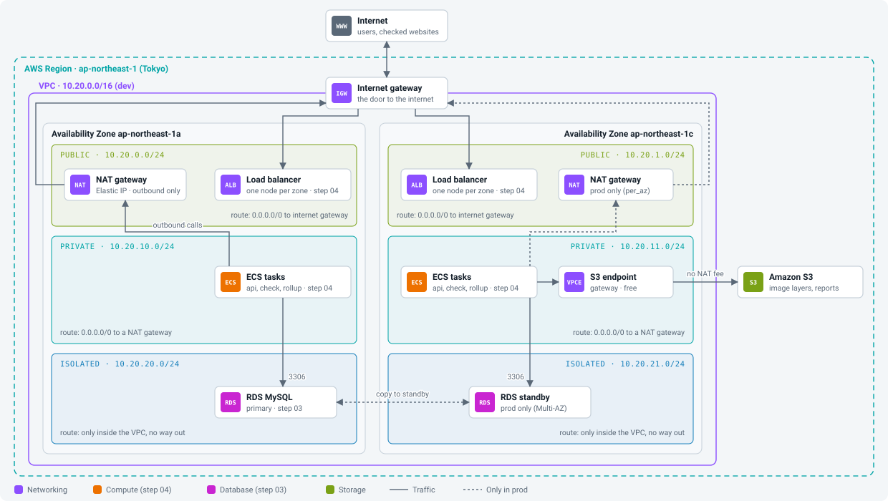
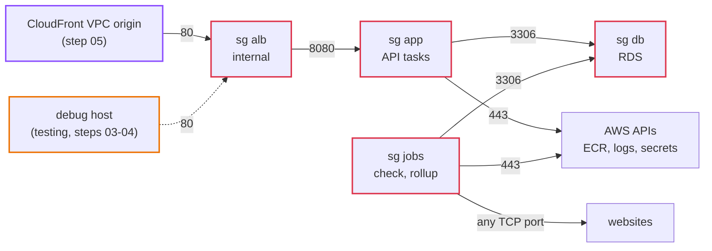
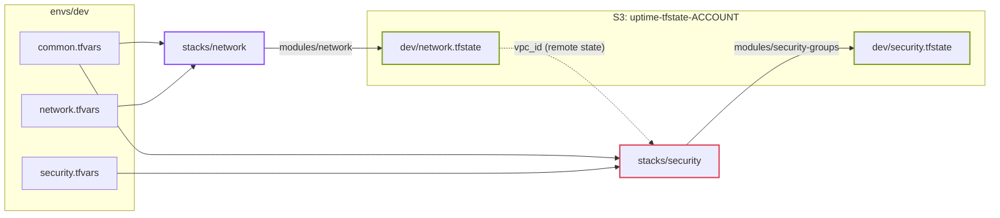

# Step 02: AWS network

In step 01 the app lived on one Docker network on your laptop. Now we build the network it will live in on AWS: a VPC in Tokyo with public, private and isolated subnets in two Availability Zones, an internet gateway, a NAT gateway, and the security groups that decide who may talk to whom.

Nothing of the app runs yet. This step is only roads and doors. But every later step depends on getting this right, and it is the step where most AWS bills and most security holes are born.

You build it three times: on paper, by hand in the console, and in Terraform.

- **Time:** about 3 to 4 hours
- **Cost:** about $0.07 an hour while it exists (mostly the NAT gateway). About $0.20 for the whole step if you clean up at the end. See [costs.md](../costs.md).
- **You need:** an AWS account where you can create VPCs and IAM roles, the [AWS CLI v2](https://docs.aws.amazon.com/cli/latest/userguide/getting-started-install.html), `jq`, Docker, make
- **Branch:** `step-02/aws-network`

## What you will be able to do after this step

- Say what makes a subnet public, private or isolated, and prove it with a route table.
- Explain why the API sits in a private subnet and the database in an isolated one.
- Choose between one NAT gateway and one per zone, and say what each costs in Tokyo.
- Build a VPC by hand in the console, and then the same VPC with Terraform.
- Break outbound internet on purpose and fix it again.
- Create a new environment (dev, staging, prod) by changing values, not code.

## 1. Words you need

| Word | What it means |
|---|---|
| **Region** | A part of the world where AWS has data centers. Ours is Tokyo, `ap-northeast-1`. |
| **Availability Zone (AZ)** | One or more data centers inside a region, with their own power and network. Tokyo has `1a`, `1c` and `1d`. There is no `1b` for new accounts. |
| **VPC** | Your own private network inside a region. Nothing gets in or out unless you say so. |
| **CIDR** | A way to write a range of IP addresses. `10.20.0.0/16` means every address that starts with `10.20.` (65,536 of them). `/24` is 256 addresses. |
| **Subnet** | A slice of the VPC's range that lives in exactly one AZ. |
| **Route table** | A list of rules: "traffic for these addresses goes there". Every subnet uses one. |
| **Internet gateway (IGW)** | The VPC's door to the internet. Free. Works both ways. |
| **NAT gateway** | Lets things in private subnets call out to the internet, but never lets the internet call in. Lives in a public subnet. Costs money every hour. |
| **Elastic IP (EIP)** | A fixed public IPv4 address. The NAT gateway uses one. |
| **Security group (SG)** | A firewall around each network card. It says which traffic may come in and go out. It remembers connections, so replies are always allowed. |
| **VPC endpoint** | A private path from the VPC to an AWS service, without going through the internet. The S3 **gateway** endpoint is free. |

## 2. The design

<p align="center"></p>

### What makes a subnet public

Not its name. Only its route table:

| Subnet | Route table says for `0.0.0.0/0` (everything outside the VPC) | So it can |
|---|---|---|
| public | go to the **internet gateway** | talk to the internet both ways (if the thing has a public IP) |
| private | go to the **NAT gateway** | call out, but nobody outside can start a connection to it |
| isolated | nothing, there is no such route | only talk to other things inside the VPC |

Every route table also has one route you cannot remove: `10.20.0.0/16 local`. That is why all subnets in the VPC can reach each other (if the security groups allow it).

### Where each piece goes

| Piece | Tier | Why there |
|---|---|---|
| NAT gateway | public | it needs the internet gateway to send traffic out |
| load balancer (step 04) | **private** | only CloudFront needs to reach it, and CloudFront can do that from inside the VPC (a *VPC origin*, step 05); so it gets no public address at all |
| API tasks (step 04) | **private** | only the load balancer needs to reach them; nobody should reach them directly |
| check and rollup tasks (step 06) | private | they call websites, so they need outbound internet, but nothing calls them |
| RDS MySQL (step 03) | **isolated** | it never needs the internet; with no route out, a mistake in a security group still cannot expose it |

Why not put the API in a public subnet? It would work. Plenty of people do it to skip the NAT gateway. But then the only thing between the internet and the API is one security group rule, and the API's outgoing IP address changes with every task. [ADR 0005](../adr/0005-three-subnet-tiers-api-in-private.md) has the full comparison.

And the load balancer? The usual picture has it in the public subnets. Then anyone on the internet can reach it, and you spend effort making sure only CloudFront does. CloudFront **VPC origins** let CloudFront place its own network interfaces in our private subnets and call an *internal* load balancer over AWS's private network. The public subnets end up holding only the NAT gateway. It also saves $7.30 a month: an internet-facing load balancer pays for a public IPv4 address in each zone.

### The addresses

Each environment gets its own `/16`, so they could be connected later without clashing:

| Environment | VPC | public | private | isolated |
|---|---|---|---|---|
| dev | `10.20.0.0/16` | `10.20.0.0/24`, `10.20.1.0/24` | `10.20.10.0/24`, `10.20.11.0/24` | `10.20.20.0/24`, `10.20.21.0/24` |
| staging | `10.30.0.0/16` | `10.30.0.0/24`, ... | `10.30.10.0/24`, ... | `10.30.20.0/24`, ... |
| prod | `10.40.0.0/16` | `10.40.0.0/24`, ... | `10.40.10.0/24`, ... | `10.40.20.0/24`, ... |

The first `/24` of each tier is in `1a`, the second in `1c`. The gaps (2 to 9, 12 to 19) leave room to add a third zone later.

### One NAT gateway or two?

A NAT gateway lives in one zone. If that zone fails, every private subnet that routes through it loses the internet.

| Mode | NAT gateways | Tokyo cost / month | If zone `1a` fails |
|---|---|---|---|
| `single` (dev, staging) | 1 | $48.91 | checks stop in both zones |
| `per_az` (prod) | 2 | $97.82 | checks keep running in `1c` |

Other options we looked at, and why not: interface endpoints for every AWS service (about $102 a month, and the checker still cannot reach websites), a NAT instance on EC2 (about $5 a month, but we would have to patch and babysit it), and public tasks with no NAT (covered above). See [ADR 0006](../adr/0006-nat-gateways-per-environment.md).

The S3 **gateway endpoint** is always on. It is free, and it keeps container image downloads (ECR stores layers in S3) away from the NAT gateway's $0.062 per GB. With a check task every minute, that saves about $27 a month.

### Who may talk to whom

Security groups point at each other, not at IP addresses. "The `app` group may reach the `db` group on 3306" stays true whatever IPs the tasks get.



| Group | In | Out |
|---|---|---|
| `alb` | 80 from CloudFront's VPC origin (step 05) and the debug host (step 04) | 8080 to `app` |
| `app` | 8080 from `alb` | 3306 to `db`, 443 to anywhere (AWS APIs) |
| `jobs` | nothing | 3306 to `db`, any TCP port to anywhere (websites) |
| `db` | 3306 from `app` and `jobs` | nothing |

Two things that surprise people:

- `jobs` may connect to any port on the internet because a monitor can be `https://example.com:8443`. The network rule is wide on purpose. The code in `internal/netguard` is what stops the checker from reaching private addresses like the database or `169.254.169.254` (step 01).
- There is no rule for DNS. Security groups do not filter traffic to the VPC's own DNS server.

## 3. Before you start

### Log in from your terminal

Use an IAM Identity Center (SSO) user or an IAM user that can manage VPC, EC2 and IAM. Not the root user.

This repo never runs AWS commands for you. You run every `aws` and `make tf-*` command yourself, and you can read each one before you run it.

```bash
aws configure sso          # or: aws configure, for an access key
export AWS_PROFILE=uptime  # the profile name you chose
export AWS_REGION=ap-northeast-1
aws sts get-caller-identity
```

You should see your account and user:

```json
{
    "UserId": "AROA...:you",
    "Account": "123456789012",
    "Arn": "arn:aws:sts::123456789012:assumed-role/AdministratorAccess/you"
}
```

Write down the `Account` number. You need it in section 8.

### Set up a budget alert first

Before building anything that costs money, make AWS email you when spending goes up. In section 8, Terraform does this for you. If you want it now, do it by hand: **Billing and Cost Management, Budgets, Create budget, Use a template, Monthly cost budget**, $50, your email.

### Pick the region in the console

Open the [VPC console](https://ap-northeast-1.console.aws.amazon.com/vpcconsole/home?region=ap-northeast-1). Check the top right corner says **Asia Pacific (Tokyo)**. Everything in this step goes there.

## 4. Build it by hand

The console has a **VPC and more** wizard that makes all of this in one click. Do not use it this time. Clicking each piece yourself is the point.

Name everything `uptime-dev-...` so it is easy to find and delete later.

### 4.1 The VPC

**Your VPCs, Create VPC, VPC only.**

- Name: `uptime-dev`
- IPv4 CIDR: `10.20.0.0/16`
- No IPv6

After it is created, select it, **Actions, Edit VPC settings**, and check that **Enable DNS resolution** and **Enable DNS hostnames** are both on. RDS and VPC endpoints need DNS names.

### 4.2 Six subnets

**Subnets, Create subnet**, pick `uptime-dev`, and add all six in one go:

| Name | AZ | CIDR |
|---|---|---|
| `uptime-dev-public-1a` | `ap-northeast-1a` | `10.20.0.0/24` |
| `uptime-dev-public-1c` | `ap-northeast-1c` | `10.20.1.0/24` |
| `uptime-dev-private-1a` | `ap-northeast-1a` | `10.20.10.0/24` |
| `uptime-dev-private-1c` | `ap-northeast-1c` | `10.20.11.0/24` |
| `uptime-dev-isolated-1a` | `ap-northeast-1a` | `10.20.20.0/24` |
| `uptime-dev-isolated-1c` | `ap-northeast-1c` | `10.20.21.0/24` |

Right now all six are the same. None of them is public yet, whatever the name says. They all use the VPC's **main route table**, which only has the `local` route.

### 4.3 The internet gateway

**Internet gateways, Create internet gateway**, name `uptime-dev`. Then **Actions, Attach to VPC**, `uptime-dev`.

The door exists now, but no route leads to it yet.

### 4.4 The public route table

**Route tables, Create route table**, name `uptime-dev-public`, VPC `uptime-dev`.

- **Routes, Edit routes, Add route:** destination `0.0.0.0/0`, target **Internet Gateway**, `uptime-dev`.
- **Subnet associations, Edit subnet associations:** tick `uptime-dev-public-1a` and `uptime-dev-public-1c`.

Those two subnets are now public. That one route is the whole difference.

### 4.5 The NAT gateway

**NAT gateways, Create NAT gateway.**

- Name: `uptime-dev-1a`
- Subnet: `uptime-dev-public-1a` (a NAT gateway must sit in a **public** subnet)
- Connectivity type: **Public**
- **Allocate Elastic IP**

It takes one or two minutes to become **Available**. The clock (and the bill, $0.062 an hour) starts now.

### 4.6 Private route tables, one per zone

Create two route tables: `uptime-dev-private-1a` and `uptime-dev-private-1c`.

For each one:

- **Routes:** `0.0.0.0/0` to **NAT Gateway** `uptime-dev-1a`.
- **Subnet associations:** its own private subnet.

Why two tables when both point at the same NAT? So that moving to one NAT per zone later only means changing one route, not moving subnets around. The Terraform version does the same.

### 4.7 The isolated route table

Create `uptime-dev-isolated`, associate both isolated subnets, and **add no routes**. It only has `local`.

### 4.8 The S3 gateway endpoint

**Endpoints, Create endpoint.**

- Name: `uptime-dev-s3`
- Type: **AWS services**
- Service: `com.amazonaws.ap-northeast-1.s3`, the one of type **Gateway**
- VPC: `uptime-dev`
- Route tables: both private tables

Open `uptime-dev-private-1a` again. There is a new route whose destination is a **prefix list** (`pl-...`, the S3 address ranges in Tokyo) and whose target is the endpoint. S3 traffic now takes that route instead of the NAT gateway, because a more specific route always wins.

### 4.9 Security groups

**Security groups, Create security group**, VPC `uptime-dev`, four times: `uptime-dev-alb`, `uptime-dev-app`, `uptime-dev-jobs`, `uptime-dev-db`.

A new security group allows **all outbound** traffic by default. Delete that rule in each one, then add the rules from the table in [section 2](#who-may-talk-to-whom). For a rule that points at another group, pick **Custom** as the source or destination and start typing `sg-` or the group's name.

Leave the `alb` inbound rules empty for now. Steps 04 and 05 add them.

### 4.10 Look at what you built

Now check it from the terminal. First find the VPC ID:

```bash
VPC=$(aws ec2 describe-vpcs --filters Name=tag:Name,Values=uptime-dev \
  --query 'Vpcs[0].VpcId' --output text)
echo $VPC
```

You should see something like `vpc-0a1b2c3d4e5f67890`.

The subnets:

```bash
aws ec2 describe-subnets --filters Name=vpc-id,Values=$VPC \
  --query 'sort_by(Subnets,&CidrBlock)[].[Tags[?Key==`Name`]|[0].Value,CidrBlock,AvailabilityZone]' \
  --output table
```

You should see six rows, sorted by address, each in the zone from the table in 4.2.

The routes, which is where public, private and isolated really live:

```bash
aws ec2 describe-route-tables --filters Name=vpc-id,Values=$VPC \
  --query 'RouteTables[].{table:Tags[?Key==`Name`]|[0].Value, routes:Routes[].[DestinationCidrBlock||DestinationPrefixListId, GatewayId||NatGatewayId]}' \
  --output json
```

You should see:

- `uptime-dev-public`: `10.20.0.0/16 local` and `0.0.0.0/0 igw-...`
- `uptime-dev-private-1a` and `-1c`: `local`, `0.0.0.0/0 nat-...` and `pl-... vpce-...`
- `uptime-dev-isolated`: only `local`
- one table with no name: the VPC's main table, which no subnet uses any more

## 5. Test it

A network with nothing in it is hard to test, so we borrow a tiny machine for an hour: one `t4g.nano` EC2 instance (about $0.005 an hour). We reach it through an **EC2 Instance Connect Endpoint**, which is free and lets you open a shell on a machine in a private or isolated subnet without giving it a public IP or opening SSH to the internet.

### 5.1 Two security groups for the test

- `uptime-dev-test-eice`: no inbound. Outbound: SSH (22) to `uptime-dev-test-host`.
- `uptime-dev-test-host`: inbound SSH (22) from `uptime-dev-test-eice`. Outbound: all traffic to `0.0.0.0/0` (the default rule, keep it).

You will need to create both first and then edit the first one's outbound rule, because each one points at the other.

### 5.2 The endpoint

**VPC, Endpoints, Create endpoint**, type **EC2 Instance Connect Endpoint**, VPC `uptime-dev`, subnet `uptime-dev-private-1a`, security group `uptime-dev-test-eice`. It takes a few minutes to become available.

### 5.3 The test machine

**EC2, Launch instance.**

- Name: `uptime-dev-test`
- AMI: **Amazon Linux 2023**, architecture **64-bit (Arm)**
- Instance type: `t4g.nano`
- Key pair: **Proceed without a key pair** (Instance Connect pushes a short-lived key for you)
- Network: VPC `uptime-dev`, subnet `uptime-dev-private-1a`, **Auto-assign public IP: Disable**, security group `uptime-dev-test-host`

When it is running: select it, **Connect, EC2 Instance Connect, Connect using EC2 Instance Connect Endpoint**, pick your endpoint, **Connect**. A shell opens in the browser.

### 5.4 What a private subnet can do

In that shell:

```bash
curl -s -o /dev/null -w '%{http_code}\n' https://example.com
```

You should see `200`. The machine has no public IP, and it still reached the internet: out through the NAT gateway.

```bash
curl -s https://checkip.amazonaws.com
```

You should see one IP address. Compare it with the NAT gateway's Elastic IP in the console. They are the same. Every check the app makes will come from this address.

Now the other direction. On your laptop:

```bash
aws ec2 describe-instances --filters Name=tag:Name,Values=uptime-dev-test \
  --query 'Reservations[].Instances[].[PrivateIpAddress,PublicIpAddress]' --output text
```

You should see a `10.20.10.x` address and `None`. There is nothing on the internet you could even try to connect to.

## 6. Break it on purpose

Keep the browser shell open. It goes through the Instance Connect Endpoint, which lives inside the VPC, so it keeps working while you break the internet.

**a) Take away the NAT route.**
In `uptime-dev-private-1a`, delete the `0.0.0.0/0` route. In the shell:

```bash
curl -s -m 5 -o /dev/null -w '%{http_code}\n' https://example.com; echo "exit $?"
```

You should see `000` and `exit 28` (timed out). The machine and the NAT gateway are both still fine. Only the route is gone, and without it the packets have nowhere to go. Put the route back and try again: `200`.

**b) Take away the internet gateway route.**
In `uptime-dev-public`, delete `0.0.0.0/0`. Run the same `curl` from the private machine. It fails again, even though the private route to the NAT is still there. The NAT gateway sends traffic out through the internet gateway, so it breaks when its own subnet stops being public. Put the route back.

**c) Does S3 still work without the NAT?**
Delete the private `0.0.0.0/0` route again, then:

```bash
curl -s -m 5 -o /dev/null -w '%{http_code}\n' https://s3.ap-northeast-1.amazonaws.com/
```

You should see `403` or `405`, not `000`: S3 answered (it refuses us, which is fine, we did not sign the request). S3 traffic goes through the gateway endpoint, not the NAT. Then try `https://sts.ap-northeast-1.amazonaws.com/` and see it time out: other AWS services still need the NAT. Put the route back.

**d) Move the machine into an isolated subnet.**
Launch a second `t4g.nano` the same way, but in `uptime-dev-isolated-1a`. Connect through the same endpoint (it works, because the endpoint and the machine are both in the VPC and `local` routes cover the whole VPC). Run the `curl`. It fails, and there is no route you can fix it with from inside the subnet. That is where the database will live.

**e) "Public" subnet, no public IP.**
Launch one more in `uptime-dev-public-1a` with **Auto-assign public IP: Disable**. It cannot reach the internet either. A public subnet sends traffic to the internet gateway, but the internet gateway only translates addresses for things that have a public IP. Things in a public subnet without one are stuck. That is why the NAT gateway needs an Elastic IP.

## 7. Delete the hand-built network

We rebuild all of it in Terraform next, so delete the console version first. Order matters, because AWS refuses to delete things that are still in use:

1. **EC2, Instances:** terminate every `uptime-dev-test*` machine. Wait until they show **Terminated**.
2. **VPC, Endpoints:** delete the Instance Connect Endpoint and the S3 endpoint.
3. **NAT gateways:** delete `uptime-dev-1a`. Wait until it shows **Deleted** (a minute or two).
4. **Elastic IPs:** select the NAT's address, **Actions, Release Elastic IP addresses**. An Elastic IP that is not attached to anything still costs $0.005 an hour.
5. **Your VPCs:** select `uptime-dev`, **Actions, Delete VPC**. This also deletes its subnets, route tables, security groups and the internet gateway.

Check that nothing is left:

```bash
aws ec2 describe-vpcs --filters Name=tag:Name,Values=uptime-dev --query 'Vpcs[].VpcId'
aws ec2 describe-nat-gateways --filter Name=state,Values=available --query 'NatGateways[].NatGatewayId'
aws ec2 describe-addresses --query 'Addresses[].PublicIp'
```

You should see `[]` three times.

## 8. The same network in Terraform

### 8.1 How the Terraform code is laid out

```
terraform/
  bootstrap/            the state bucket and a budget, once per AWS account
  modules/
    network/            VPC, subnets, gateways, route tables, S3 endpoint
    security-groups/    the four security groups and their rules
  stacks/
    network/            uses modules/network
    security/           uses modules/security-groups, reads network's outputs
  envs/
    dev/                backend.hcl, common.tfvars, network.tfvars, security.tfvars
    staging/
    prod/
```

- A **module** is a reusable recipe. It has no idea which environment it is in.
- A **stack** is what you plan and apply. Each stack has its own state file, so a change to the security groups cannot touch the VPC by mistake.
- An **environment** folder holds only values. dev, staging and prod run the same stack code; only the values differ. For example `nat_gateway_mode` is `single` in dev and `per_az` in prod.

[ADR 0007](../adr/0007-terraform-layout-stacks-and-environments.md) says why we chose this over workspaces or a copy of the code per environment.



Terraform runs in Docker (`hashicorp/terraform:1.16`), like everything else here. The `make tf-*` commands pass your `~/.aws` folder and `AWS_PROFILE` into the container.

### 8.2 Bootstrap: the state bucket

Terraform writes down what it built in a **state file**. On a team that file must live somewhere shared and safe, not on one laptop. We use an S3 bucket with versioning (every old copy is kept for 90 days) and locking (two people cannot apply at once).

The bucket cannot store its own state, so `terraform/bootstrap` keeps a local state file. Run it once per AWS account:

```bash
make tf-bootstrap account_id=123456789012 budget_email=you@example.com
```

Terraform shows the plan and asks `Do you want to perform these actions?`. You should see `Plan: 7 to add` (the bucket, five settings on it, and the budget). Type `yes`. At the end:

```
state_bucket = "uptime-tfstate-123456789012"
```

AWS sends a confirmation email for the budget. Nothing else needs clicking.

`terraform/bootstrap/terraform.tfstate` is now on your laptop. It is ignored by git. Keep it, or you will have to import the bucket to change it later.

### 8.3 Fill in the environment

Open `terraform/envs/dev/backend.hcl` and `terraform/envs/dev/common.tfvars` and replace `000000000000` with your account ID in both. That is the only change needed. Commit both files: an account ID is not a secret, and in step 08 GitHub Actions reads them from the repository.

`common.tfvars` also sets `account_id`, which goes into the provider's `allowed_account_ids`. If your terminal is logged in to a different account, Terraform stops with `Error: AWS account ID not allowed` before it changes anything.

### 8.4 Plan and apply the network

```bash
make tf-plan env=dev stack=network
```

You should see a list of resources to create and, at the end:

```
Plan: 25 to add, 0 to change, 0 to destroy.
```

Read the plan. Find the six subnets, the three route tables, the NAT gateway and its Elastic IP. Then:

```bash
make tf-apply env=dev stack=network
```

It takes two or three minutes, most of it waiting for the NAT gateway. At the end you should see `Apply complete! Resources: 25 added` and the outputs:

```
azs                 = ["ap-northeast-1a", "ap-northeast-1c"]
isolated_subnet_ids = ["subnet-...", "subnet-..."]
nat_public_ips      = ["13.xxx.xxx.xxx"]
private_subnet_ids  = ["subnet-...", "subnet-..."]
public_subnet_ids   = ["subnet-...", "subnet-..."]
vpc_cidr            = "10.20.0.0/16"
vpc_id              = "vpc-..."
```

Where does 25 come from?

| What | Count |
|---|---|
| VPC, its emptied default security group, internet gateway | 3 |
| subnets | 6 |
| public routing: 1 table, 1 route, 2 associations | 4 |
| private routing: 2 tables, 2 routes, 2 associations | 6 |
| isolated routing: 1 table, 2 associations | 3 |
| Elastic IP, NAT gateway, S3 endpoint | 3 |

With `per_az` it is 27: one more NAT gateway and Elastic IP.

### 8.5 Plan and apply the security groups

```bash
make tf-plan env=dev stack=security
make tf-apply env=dev stack=security
```

You should see `Plan: 12 to add` (4 groups and 8 rules; the two `alb` inbound rules come later). This stack reads `vpc_id` from the network stack's state file. Try applying security before network in a fresh environment and it fails with `Unable to find remote state`: stacks go in order.

### 8.6 Compare with what you built by hand

Run the three commands from [4.10](#410-look-at-what-you-built) again. The results should look the same as your console build, with names like `uptime-dev-private-ap-northeast-1a`. Every resource also has tags:

```bash
aws ec2 describe-vpcs --filters Name=tag:Name,Values=uptime-dev --query 'Vpcs[0].Tags' --output table
```

You should see `Project=uptime`, `Environment=dev`, `Stack=network`, `ManagedBy=terraform`. Cost Explorer can group the bill by these tags.

### 8.7 Drift: when someone clicks in the console

In the console, open the `uptime-dev-private-ap-northeast-1a` route table and delete its `0.0.0.0/0` route, the same thing you did in experiment 6a. Then:

```bash
make tf-plan env=dev stack=network
```

You should see `Plan: 1 to add`: Terraform noticed the missing route and wants to put it back. This is called **drift**. Apply to fix it. From now on, change this network only through Terraform.

### 8.8 One NAT per zone, the prod way

Try the prod setting in dev for a moment. In `terraform/envs/dev/network.tfvars` set `nat_gateway_mode = "per_az"`, then plan:

You should see `Plan: 2 to add, 1 to change`: a second Elastic IP and NAT gateway, and the `1c` private route pointing at the new NAT. No subnet moves. Do not apply it (it doubles the NAT bill); set it back to `single`.

### 8.9 A second environment

Making staging is only values. Look at `terraform/envs/staging/`: same files, `10.30.0.0/16`. If you want to see it work, fill in the account ID and run the same two plans with `env=staging`. You get a second, separate VPC with its own state files (`staging/network.tfstate`). Delete it again with `make tf-destroy env=staging stack=security` and then `stack=network`, or it costs another $49 a month.

Environments can also live in separate AWS accounts, which is what most companies do for prod. Give `envs/prod` that account's ID and its own state bucket, and log in to that account before you run the commands.

## 9. Check yourself

1. A subnet is called `public-1a` and has a machine with a public IP, but the machine cannot reach the internet. Where do you look first?
2. Why does the NAT gateway need to be in a public subnet?
3. Why is the database in an isolated subnet, when a security group already blocks the internet?
4. Zone `1a` goes down in dev. What happens to the checks in `1c`? And in prod?
5. The S3 endpoint is free. Why do we have to pay for the NAT gateway at all?
6. The `jobs` security group allows any TCP port to anywhere. Why is that not a hole?
7. What stops you from running `make tf-apply env=prod` while logged in to the dev account?

<details>
<summary>Answers</summary>

1. The route table used by that subnet. If it has no `0.0.0.0/0` to an internet gateway, the subnet is not public, whatever its name says.
2. The NAT gateway sends traffic out through the internet gateway. Only a subnet with a route to the internet gateway can do that.
3. Defense in depth. A security group can be edited by mistake. With no route to the internet, a wrong rule still cannot expose the database.
4. In dev, both private route tables point at the NAT in `1a`, so checks stop everywhere. In prod, `1c` has its own NAT, so checks in `1c` keep working.
5. The check job must reach websites, and tasks must reach AWS APIs that do not have a free gateway endpoint (ECR's API, CloudWatch Logs, Secrets Manager). Only S3 and DynamoDB have gateway endpoints.
6. The checker needs to reach any port a monitor uses. What makes it safe is `internal/netguard`, which refuses private and internal addresses after the DNS lookup, right before connecting. The security group cannot see what a hostname resolves to; the code can.
7. `allowed_account_ids` in the provider. `envs/prod/common.tfvars` has the prod account ID, and Terraform stops before planning if the credentials belong to another account.

</details>

## Clean up

Every hour this network exists costs about $0.067, mostly the NAT gateway. If you are going on to step 03 today, keep it. Otherwise:

```bash
make tf-destroy env=dev stack=security
make tf-destroy env=dev stack=network
```

Each one shows what it will delete and asks for `yes`. You should see `Destroy complete! Resources: 12 destroyed` and then `25 destroyed`. Security first, because its groups live inside the VPC.

Keep the state bucket from `terraform/bootstrap`. It costs almost nothing and every later step uses it.

## Next

Step 03: the database. We put RDS MySQL in the isolated subnets, keep its password in Secrets Manager, and move the daily reports from a Docker volume to S3.
