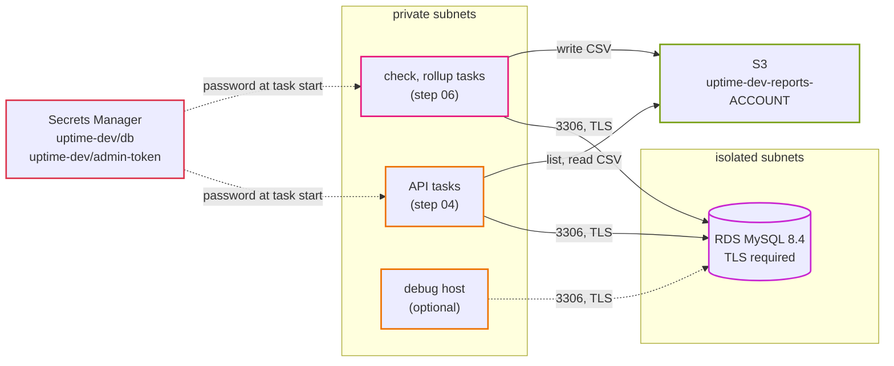

# Step 03: Database and secrets

The network from step 02 is empty. Now we put the data in it: a MySQL database on RDS in the isolated subnets, its password in Secrets Manager, and an S3 bucket for the daily reports.

The app also changes a little in this step. It learns two things it needs on AWS: talk to MySQL over TLS, and write reports to S3 instead of a folder.

- **Time:** about 3 hours (RDS takes 5 to 10 minutes to create, twice)
- **Cost:** about $0.03 an hour on top of step 02, so about $0.10 an hour in total. See [costs.md](../costs.md).
- **You need:** step 02 applied with Terraform (`network` and `security` stacks in dev)
- **Branch:** `step-03/database-and-secrets`

## What you will be able to do after this step

- Create an RDS MySQL database in isolated subnets and connect to it from inside the VPC.
- Explain what a DB subnet group and a parameter group are for.
- Force every database connection to use TLS, and see a plain connection get refused.
- Keep a password out of git, out of `.tfvars` files and out of the Terraform state file.
- Say when Multi-AZ is worth paying for.
- Explain why the reports move from a Docker volume to S3.

## 1. Words you need

| Word | What it means |
|---|---|
| **RDS** | Relational Database Service. AWS runs MySQL for you: installs it, patches it, backs it up. |
| **DB instance** | One RDS database server. Its size is its **instance class**, for example `db.t4g.micro`. |
| **DB subnet group** | The list of subnets RDS may put the database in. Ours: the two isolated subnets. |
| **Parameter group** | MySQL settings (what normally goes in `my.cnf`). You cannot edit the defaults, so you make your own. |
| **Multi-AZ** | RDS keeps a second copy in another zone and switches to it by itself if the first one fails. |
| **Endpoint** | The DNS name you connect to, like `uptime-dev.xxxx.ap-northeast-1.rds.amazonaws.com`. It keeps working after a failover. |
| **Point-in-time restore** | RDS keeps backups and logs, so you can make a new database as it was at any second within the backup window. |
| **Secrets Manager** | An AWS service that stores secrets (passwords, tokens) encrypted, and lets you control who can read them. |
| **TLS** | Encryption for a network connection, the same thing that puts the lock in your browser. |
| **CA bundle** | The certificates that prove a server is who it says it is. RDS uses Amazon's own, so the app needs a copy. |
| **S3 bucket** | A place to keep files ("objects"). Each file has a key, like `reports/2026-09-29.csv`. |

## 2. The design



### The database

| | dev and staging | prod |
|---|---|---|
| engine | MySQL 8.4 | MySQL 8.4 |
| instance | `db.t4g.micro` (2 vCPU burst, 1 GB) | `db.t4g.small` (2 vCPU burst, 2 GB) |
| Multi-AZ | no | yes |
| storage | 20 GB gp3, grows up to 100 GB | same |
| backups | 1 day | 7 days |
| deletion protection | off | on |
| cost in Tokyo | about $21 / month | about $77 / month |

Why MySQL 8.4 and not 8.0: RDS standard support for 8.0 ended in July 2026, and staying on it now costs an extra extended-support fee. Why not Aurora: the smallest Aurora instance costs about four times a `db.t4g.micro`, and Aurora Serverless v2 cannot pause because our check job writes every minute. [ADR 0008](../adr/0008-rds-mysql-single-az-dev-multi-az-prod.md) has the full list.

Is Multi-AZ worth $56 a month? In prod, yes: a zone failure or a maintenance reboot takes one or two minutes instead of the time it takes someone to notice and restore a backup. In dev, no.

### The password

The password is created by Terraform, sent to RDS and to Secrets Manager, and then forgotten. It is never in git, never in a `.tfvars` file, and never in the Terraform state file. ECS reads it from Secrets Manager when a task starts (step 04).

This uses a Terraform feature from version 1.11: an **ephemeral** value (it exists only while Terraform runs) passed through **write-only** arguments (AWS receives them; Terraform does not store them). [ADR 0009](../adr/0009-database-password-write-only-no-rotation.md) explains why we did not use RDS's own automatic password rotation yet.

### The reports

Locally, the rollup job and the API share a Docker volume. On Fargate each task has its own disk that disappears when the task stops, so a report written by the rollup task would be gone before the API could serve it. The reports move to S3, behind the same `reports.Store` interface the app already has. [ADR 0010](../adr/0010-reports-on-s3.md).

## 3. What changed in the app

Three small changes. Nothing changes locally unless you set the new variables.

| Setting | Locally | On AWS | Code |
|---|---|---|---|
| `DB_TLS_CA` | empty: plain connection to the `mysql` container | `/app/certs/rds-global-bundle.pem` | `internal/db/db.go`, `buildDSN` |
| `REPORT_BUCKET` | empty: reports go to `REPORT_DIR` | `uptime-dev-reports-ACCOUNT` | `cmd/uptime/main.go`, `reportStore` |
| `REPORT_PREFIX` | not used | `reports/` (the default) | `internal/reports/s3.go` |

- The Docker image now contains the RDS CA bundle, downloaded from `truststore.pki.rds.amazonaws.com` at build time (`app/backend/Dockerfile`).
- When `DB_TLS_CA` is set, the app encrypts the connection **and** checks that the certificate belongs to `DB_HOST`. Encryption without that check would still let someone in the middle pretend to be the database.
- `internal/reports/s3.go` is the S3 version of the store. `s3_test.go` tests it with a fake S3 client, so `make test` still needs no AWS.

Try the TLS check locally. The local MySQL has a self-signed certificate, so the app must refuse it:

```bash
make up
docker compose run --rm -e DB_TLS_CA=/app/certs/rds-global-bundle.pem api migrate
```

You should see warnings like this, ten times, and then the command gives up:

```
"msg":"database not ready yet, trying again","attempt":1,"error":"tls: failed to verify certificate: x509: certificate is not valid for any names, but wanted to match mysql"
```

That is what we want: the certificate is not one RDS signed, so the app does not trust it. Press Ctrl+C.

## 4. Build it by hand

Make sure the step 02 network exists:

```bash
make tf-output env=dev stack=network
```

You should see `vpc_id`, the subnet IDs and `nat_public_ips`. If you destroyed it at the end of step 02, apply `network` and `security` again (step 02, section 8).

### 4.1 DB subnet group

**RDS console, Subnet groups, Create DB subnet group.**

- Name: `uptime-dev-byhand`
- VPC: `uptime-dev`
- Availability Zones: `ap-northeast-1a`, `ap-northeast-1c`
- Subnets: the two **isolated** ones (`10.20.20.0/24`, `10.20.21.0/24`)

RDS will only ever put this database in those subnets.

### 4.2 Parameter group

**Parameter groups, Create parameter group.**

- Engine type: MySQL Community, family `mysql8.4`
- Type: DB Parameter Group
- Name: `uptime-dev-byhand`

Open it, **Edit**, search `require_secure_transport`, set it to `1`, save.

### 4.3 The database

**Databases, Create database, Full configuration.**

| Setting | Value |
|---|---|
| Engine | MySQL, version 8.4 (the newest 8.4.x) |
| Template | Free tier or Dev/Test |
| Availability | Single-AZ DB instance deployment |
| DB instance identifier | `uptime-dev-byhand` |
| Master username | `uptime` |
| Credentials management | **Managed in AWS Secrets Manager** |
| Instance class | Burstable, `db.t4g.micro` |
| Storage | gp3, 20 GB, autoscaling up to 100 GB |
| VPC | `uptime-dev` |
| DB subnet group | `uptime-dev-byhand` |
| Public access | **No** |
| VPC security group | choose existing: `uptime-dev-db` (remove `default`) |
| Certificate authority | `rds-ca-rsa2048-g1` |
| Initial database name (under Additional configuration) | `uptime` |
| DB parameter group | `uptime-dev-byhand` |
| Backup retention | 1 day |
| Log exports | Error log, Slow query log |
| Deletion protection | off |

**Create database.** It takes 5 to 10 minutes.

We picked **Managed in AWS Secrets Manager** here because it is the simplest way to click through. RDS creates a secret and rotates the password every 7 days by itself. The Terraform version in section 8 does it differently, on purpose; [ADR 0009](../adr/0009-database-password-write-only-no-rotation.md) says why.

### 4.4 The reports bucket

**S3 console, Create bucket.**

- Name: `uptime-dev-byhand-reports-ACCOUNT` (your account ID; bucket names are global)
- Region: Asia Pacific (Tokyo)
- Object Ownership: ACLs disabled
- Block all public access: **on**
- Default encryption: SSE-S3

## 5. Test it

We need something inside the VPC that is allowed to reach the database. Turn on the debug host that the `security` stack can make for you: a `t4g.nano` with the MySQL client and the RDS CA bundle already installed, reachable through an EC2 Instance Connect Endpoint, and allowed into the `db` and `alb` security groups.

In `terraform/envs/dev/security.tfvars` set `enable_debug_host = true`, then:

```bash
make tf-plan env=dev stack=security
make tf-apply env=dev stack=security
```

You should see `Plan: 9 to add` (the endpoint, the instance, two security groups, five rules) and an output `debug_host_instance_id = "i-..."`. The endpoint takes a few minutes.

Connect from your terminal:

```bash
aws ec2-instance-connect ssh --instance-id i-xxxxxxxx --connection-type eice
```

You should get a shell prompt like `[ec2-user@ip-10-20-10-x ~]$`. (You can also use **EC2, Connect, EC2 Instance Connect Endpoint** in the console.)

### 5.1 Get the password

The console database keeps its password in a secret RDS made, named like `rds!db-xxxx`. On your laptop:

```bash
SECRET=$(aws rds describe-db-instances --db-instance-identifier uptime-dev-byhand \
  --query 'DBInstances[0].MasterUserSecret.SecretArn' --output text)
aws secretsmanager get-secret-value --secret-id "$SECRET" --query SecretString --output text | jq -r .password
aws rds describe-db-instances --db-instance-identifier uptime-dev-byhand \
  --query 'DBInstances[0].Endpoint.Address' --output text
```

You should see a long random password and an address like `uptime-dev-byhand.xxxx.ap-northeast-1.rds.amazonaws.com`.

### 5.2 Connect with TLS

On the debug host:

```bash
DB=uptime-dev-byhand.xxxx.ap-northeast-1.rds.amazonaws.com
mysql -h $DB -u uptime -p --ssl-ca=rds-ca.pem --ssl-verify-server-cert uptime
```

Paste the password. You should see the `MariaDB [uptime]>` prompt (the client is MariaDB's, the server is MySQL). Check the connection is encrypted:

```sql
SHOW STATUS LIKE 'Ssl_version';
SELECT @@version, @@require_secure_transport;
exit
```

You should see `TLSv1.3` (or `TLSv1.2`), then `8.4.x` and `1`.

### 5.3 The DNS name

```bash
dig +short $DB
```

You should see a `10.20.20.x` or `10.20.21.x` address: the database is in an isolated subnet. From your laptop, the same name does not help you: there is no route in.

## 6. Break it on purpose

**a) Connect without TLS.**

```bash
mysql -h $DB -u uptime -p --ssl=0 uptime
```

You should see `ERROR 3159 (HY000): Connections using insecure transport are prohibited while --require_secure_transport=ON.` That is the parameter group at work.

**b) Trust the wrong certificate.**

```bash
curl -so wrong.pem https://letsencrypt.org/certs/isrgrootx1.pem
mysql -h $DB -u uptime -p --ssl-ca=wrong.pem --ssl-verify-server-cert uptime
```

You should see an error about the certificate (for example `self-signed certificate in certificate chain` or `certificate verify failed`). The server is real, but we told the client to trust someone else. This is what the app's `DB_TLS_CA` check protects against.

**c) Take away the security group rule.**
In the console, remove the inbound rule `3306 from uptime-dev-debug-host` from `uptime-dev-db`. Try to connect again. It hangs, then says `Can't connect to server ... (110)`: a timeout, not a refusal. A security group drops packets quietly. When you see a timeout on AWS, think "security group or route". Put the rule back (or run `make tf-apply` for the `security` stack again after a plan; Terraform puts it back because it is drift).

**d) Optional: watch a failover.** This costs about $0.03 extra for the hour. Modify `uptime-dev-byhand` to **Multi-AZ DB instance**, apply immediately, and wait until it shows **Available** again (10 to 20 minutes). Then on the debug host run this loop:

```bash
while true; do date +%T; dig +short $DB; sleep 5; done
```

and on your laptop:

```bash
aws rds reboot-db-instance --db-instance-identifier uptime-dev-byhand --force-failover
```

You should see the IP address change from one subnet to the other after a minute or two. The name stays the same, which is why the app connects by name.

## 7. Delete the hand-built version

On your laptop:

```bash
aws rds delete-db-instance --db-instance-identifier uptime-dev-byhand \
  --skip-final-snapshot --delete-automated-backups
aws rds wait db-instance-deleted --db-instance-identifier uptime-dev-byhand
aws rds delete-db-parameter-group --db-parameter-group-name uptime-dev-byhand
aws rds delete-db-subnet-group --db-subnet-group-name uptime-dev-byhand
aws s3 rb s3://uptime-dev-byhand-reports-ACCOUNT --force
```

The wait takes 5 to 10 minutes and prints nothing. The last command prints `remove_bucket: uptime-dev-byhand-reports-ACCOUNT`. The secret RDS made is deleted together with the database.

Keep the debug host; section 8 uses it.

## 8. The same thing in Terraform

### 8.1 The code

```
terraform/modules/rds-mysql/        subnet group, parameter group, instance, the db secret
terraform/modules/private-bucket/   a bucket with public access blocked, encryption, TLS only
terraform/stacks/data/              uses both, plus the admin token secret
terraform/envs/dev/data.tfvars      the sizes for dev
```

Open `terraform/modules/rds-mysql/main.tf` and find these parts:

```hcl
ephemeral "random_password" "db" { ... }        # a password that only exists during this run

resource "aws_db_instance" "this" {
  password_wo         = ephemeral.random_password.db.result   # sent to AWS, never stored
  password_wo_version = var.password_version                  # change it to set a new one
  ...
}

resource "aws_secretsmanager_secret_version" "db" {
  secret_string_wo         = jsonencode({ ..., password = ephemeral.random_password.db.result })
  secret_string_wo_version = var.password_version
}
```

Compare `envs/dev/data.tfvars` with `envs/prod/data.tfvars`. Same code; prod gets `db.t4g.small`, Multi-AZ, 7 days of backups, deletion protection and a final snapshot.

### 8.2 Apply

```bash
make tf-plan env=dev stack=data
```

You should see `Plan: 13 to add`. Look for the password in the plan: the database shows `password_wo = (write-only attribute)`. There is no value to see.

```bash
make tf-apply env=dev stack=data
```

This takes 5 to 10 minutes, almost all of it RDS. At the end:

```
admin_token_secret_arn = "arn:aws:secretsmanager:ap-northeast-1:...:secret:uptime-dev/admin-token-..."
db_address             = "uptime-dev.xxxx.ap-northeast-1.rds.amazonaws.com"
db_secret_arn          = "arn:aws:secretsmanager:ap-northeast-1:...:secret:uptime-dev/db-..."
reports_bucket         = "uptime-dev-reports-123456789012"
...
```

### 8.3 Prove the password is not in the state

The state file is in S3. Download it and search it:

```bash
aws s3 cp s3://uptime-tfstate-ACCOUNT/dev/data.tfstate - | grep -c '"password_wo"'
aws s3 cp s3://uptime-tfstate-ACCOUNT/dev/data.tfstate - | grep '"password_wo"'
```

You should see `1`, and then `"password_wo": null,`. Terraform knows the argument exists, not what was in it. Now read the real password from Secrets Manager:

```bash
aws secretsmanager get-secret-value --secret-id uptime-dev/db --query SecretString --output text | jq .
```

You should see the JSON with `username`, `password`, `host`, `port` and `dbname`.

### 8.4 Connect and create the tables

Connect from the debug host as in 5.2, with the new address and password. The `uptime` database exists but is empty:

```sql
SHOW TABLES;
```

You should see `Empty set`. The app's `migrate` command makes the tables in step 04, when the app runs on ECS.

### 8.5 Rotate the password

In `envs/dev/data.tfvars`, add `db_password_version = 2`. Plan:

You should see two changes: the database (`password_wo_version` 1 to 2, update in-place) and the secret version (a new value). Nothing is destroyed. Apply. Your old password now fails (`ERROR 1045 (28000): Access denied`), the new one from Secrets Manager works. Running app tasks would need a restart to pick it up (step 04 shows how).

## 9. Check yourself

1. Why is the database in the isolated subnets and not the private ones?
2. What does the DB subnet group decide?
3. The app connects with TLS but does not check the certificate. What can still go wrong?
4. A teammate adds `db_password = "..."` to `data.tfvars` "just for dev". What is wrong with that?
5. `mysql` says `Can't connect ... (110)`. What do you check first?
6. Why can the reports not stay on the task's own disk on Fargate?
7. Why does prod pay for Multi-AZ and dev does not?

<details>
<summary>Answers</summary>

1. It never needs the internet. With no route out, a mistake in a security group still cannot expose it or let it send data out.
2. Which subnets (and so which zones) RDS may place the database and its standby in.
3. Anyone who can get between the app and the database could pretend to be the database with their own certificate and read everything. Checking the certificate against the RDS CA and the host name stops that.
4. `.tfvars` files are in git, and the value would end up in the state file too. Secrets go in Secrets Manager, and Terraform only sends them through write-only arguments.
5. Error 110 is a timeout: packets are dropped. That is a security group or a route, not a wrong password (that would be `1045 Access denied`).
6. Each Fargate task has its own disk that disappears when it stops. The rollup task writes the file and exits, and the API tasks never had access to that disk.
7. In prod a zone failure or maintenance reboot should cost a minute or two, not an outage until someone restores a backup. In dev an outage costs nothing, and Multi-AZ would more than double the database bill.

</details>

## Clean up

If you go on to step 04 today, keep the database. Turn the debug host off either way:

```bash
# set enable_debug_host = false in envs/dev/security.tfvars
make tf-plan env=dev stack=security
make tf-apply env=dev stack=security
```

You should see `9 destroyed` in the apply.

To stop paying for the database until next time:

```bash
make tf-destroy env=dev stack=data
```

You should see `Destroy complete! Resources: 13 destroyed`. Dev does not keep a final snapshot, so the data is gone. The secrets are deleted at once in dev (`secret_recovery_days = 0`), so you can apply again later with the same names.

If you keep the database but not the NAT gateway, see [costs.md, Ways to spend less](../costs.md#ways-to-spend-less).

## Next

[Step 04: Containers on ECS](04-containers-on-ecs.md). We push the app's image to ECR, run the API on Fargate in the private subnets, and put a load balancer in front of it.
