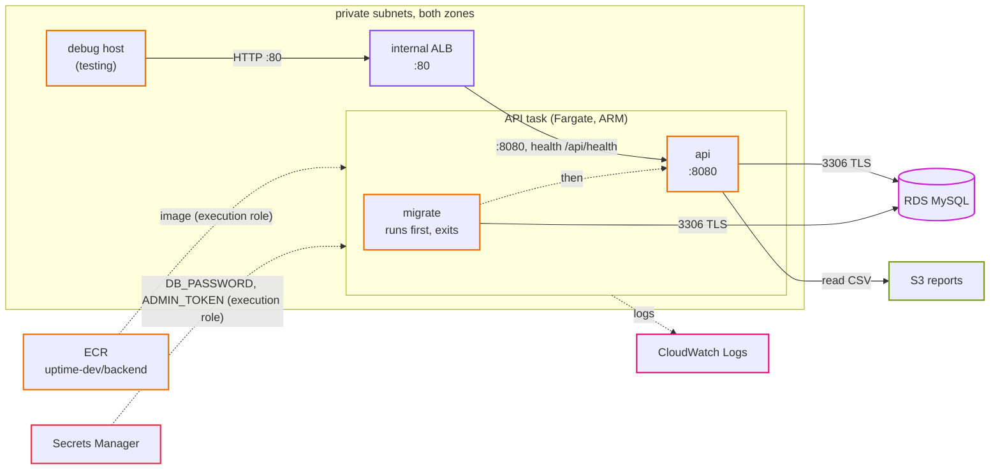
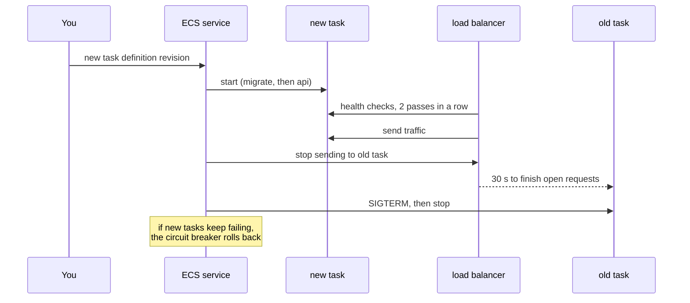

# Step 04: Containers on ECS

The network and the database are ready. Now the app itself moves in: we push the backend image to ECR, run the API on ECS Fargate in the private subnets, and put an internal load balancer in front of it. We also prepare the `check` and `rollup` tasks that step 06 will put on a schedule.

At the end of this step the API runs on AWS and answers from inside the VPC. Nobody on the internet can reach it yet; CloudFront opens the front door in step 05.

- **Time:** about 4 hours
- **Cost:** about $0.04 an hour on top of steps 02 and 03, so about $0.14 an hour in total. See [costs.md](../costs.md).
- **You need:** steps 02 and 03 applied with Terraform in dev, Docker with `buildx` (Docker Desktop has it; on Linux install the `docker-buildx` plugin)
- **Branch:** `step-04/containers-on-ecs`

## What you will be able to do after this step

- Build an ARM container image on any laptop and push it to ECR.
- Explain cluster, task definition, task and service, and how they fit together.
- Tell the execution role from the task role, and give each only what it needs.
- Run the API behind an internal load balancer and check it from inside the VPC.
- Deploy a new version with no downtime, watch a bad deploy roll itself back, and roll back by hand.
- Run any app command (`seed`, `check`, `rollup`) as a one-off task.

## 1. Words you need

| Word | What it means |
|---|---|
| **Container image** | A packaged program with everything it needs to run. Ours is the Go binary on a tiny base image. |
| **ECR** | Elastic Container Registry: AWS's private place to store images. |
| **Tag** | A name for one version of an image, like `3f9c2a1b7d0e`. Our tags are git commits and can never be reused. |
| **ECS** | Elastic Container Service: runs containers for you. |
| **Fargate** | The ECS mode where AWS also runs the servers. You only say how much CPU and memory each task gets. |
| **Cluster** | A named group for your tasks and services. With Fargate it is just a label; there are no machines in it. |
| **Task definition** | The recipe: which image, which command, how much CPU and memory, which settings and secrets, where logs go. Every change makes a new **revision**. |
| **Task** | One running copy of a task definition. Each gets its own network card and private IP in a subnet. |
| **Service** | Keeps N tasks running, replaces the ones that die, registers them with the load balancer, and does rolling deploys. |
| **Execution role** | The IAM role ECS itself uses *before* the app starts: pull the image, read secrets, create log streams. |
| **Task role** | The IAM role the app uses *inside* the container, for example to write to S3. |
| **Target group** | The list of task IPs the load balancer may send requests to, with a health check. |
| **Internal load balancer** | A load balancer with only private IPs. Only things inside the VPC can reach it. |
| **Init container** | A container in a task that runs first and exits, before the main container starts. Our `migrate`. |

## 2. The design

<p align="center"></p>



### What runs

| Task definition | Containers | Started by | Security group | Task role may |
|---|---|---|---|---|
| `uptime-dev-api` | `migrate` (runs first), then `api` | the ECS service, always | `app` | read `reports/*` in S3 |
| `uptime-dev-check` | `app` running `check` | EventBridge Scheduler (step 06), or you | `jobs` | write `reports/*` in S3 |
| `uptime-dev-rollup` | `app` running `rollup` | EventBridge Scheduler (step 06), or you | `jobs` | write `reports/*` in S3 |

All three use the same image and the same **execution role**, which may pull from ECR, read the two secrets and write logs. Nothing else.

| | dev and staging | prod |
|---|---|---|
| API task size | 0.25 vCPU, 0.5 GB | 0.5 vCPU, 1 GB |
| API tasks | 1 | 2 to 4, CPU autoscaling at 60% |
| log retention | 14 days | 90 days |
| cost | about $9 a month for the API, $18 for the load balancer | about $36 for the API, $18 for the load balancer |

### Why these choices

- **Fargate, not EC2 or Kubernetes.** No servers to patch. EKS's control plane alone would cost more than our API. [ADR 0011](../adr/0011-ecs-fargate-arm-with-pinned-image-tags.md).
- **ARM (Graviton).** About 20% cheaper. The Dockerfile cross-compiles, so building an ARM image on an x86 laptop takes seconds and needs no emulation.
- **An internal load balancer.** It has no public address. CloudFront reaches it in step 05; until then you test it from the debug host.
- **`migrate` inside every API task.** One apply deploys schema and code in the right order. When several tasks start at once they queue on a MySQL lock. [ADR 0012](../adr/0012-migrate-as-init-container.md).
- **The image tag lives in SSM** (`/uptime-dev/image-tag`), not in a Terraform variable, so every apply (by you, or by CI in step 08) runs the version that was chosen last, not whatever someone typed.

### What a rolling deploy looks like



## 3. Before you start

Steps 02 and 03 must be applied in dev. Turn on the debug host (step 03, section 5) if it is off: in `terraform/envs/dev/security.tfvars` set `enable_debug_host = true`, then plan and apply the `security` stack. It is the only thing that can reach an internal load balancer until step 05.

Check the data stack is there:

```bash
make tf-output env=dev stack=data
```

You should see `db_address`, `db_secret_arn`, `admin_token_secret_arn` and `reports_bucket`.

## 4. Build it by hand

We build one API service by hand, with its own names (`-byhand`) so it does not clash with Terraform later. The network, security groups, database and secrets from steps 02 and 03 stay; we use them.

### 4.1 A repository and an image

**ECR console, Create repository.** Name `uptime-dev-byhand/backend`, tag immutability **Immutable**, scan on push **on**.

Push the image from your laptop. Replace `ACCOUNT`:

```bash
REGISTRY=ACCOUNT.dkr.ecr.ap-northeast-1.amazonaws.com
aws ecr get-login-password --region ap-northeast-1 | docker login --username AWS --password-stdin $REGISTRY
TAG=$(git rev-parse --short=12 HEAD)
docker buildx build --platform linux/arm64 --provenance=false \
  -t $REGISTRY/uptime-dev-byhand/backend:$TAG --push app/backend
```

You should see `Login Succeeded`, then the build, and at the end a line with `pushing manifest for .../uptime-dev-byhand/backend:3f9c2a1b7d0e`. Look at the repository in the console: one image, architecture `arm64`, and after a minute a scan result.

Try pushing the same tag again. You should see `tag invalid: The image tag '...' already exists ... and cannot be overwritten because the repository is immutable`. Good: a tag always means one exact image.

### 4.2 Two roles

**IAM console, Roles, Create role**, trusted entity **AWS service**, use case **Elastic Container Service Task**.

1. `uptime-dev-byhand-execution`: attach **AmazonECSTaskExecutionRolePolicy**. Then **Add permissions, Create inline policy, JSON**:

   ```json
   {
     "Version": "2012-10-17",
     "Statement": [{
       "Effect": "Allow",
       "Action": "secretsmanager:GetSecretValue",
       "Resource": [
         "arn:aws:secretsmanager:ap-northeast-1:ACCOUNT:secret:uptime-dev/db-*",
         "arn:aws:secretsmanager:ap-northeast-1:ACCOUNT:secret:uptime-dev/admin-token-*"
       ]
     }]
   }
   ```

   (Secret ARNs end in six random characters, hence the `-*`.)

2. `uptime-dev-byhand-api`: no managed policy. Inline policy (why `ListBucket` has no prefix limit: S3 only says "no such key" to callers that may list the bucket; everyone else gets "access denied", and a missing report would become a 500 instead of a 404):

   ```json
   {
     "Version": "2012-10-17",
     "Statement": [
       {"Effect": "Allow", "Action": "s3:ListBucket", "Resource": "arn:aws:s3:::uptime-dev-reports-ACCOUNT"},
       {"Effect": "Allow", "Action": "s3:GetObject", "Resource": "arn:aws:s3:::uptime-dev-reports-ACCOUNT/reports/*"}
     ]
   }
   ```

### 4.3 A log group and a cluster

**CloudWatch, Log groups, Create log group:** `/ecs/uptime-dev-byhand/api`, retention 1 week.

**ECS console, Clusters, Create cluster:** name `uptime-dev-byhand`, infrastructure **AWS Fargate** only. It is created in seconds: there is nothing in it.

### 4.4 The task definition

**Task definitions, Create new task definition with JSON.** Paste this, and replace `ACCOUNT`, `TAG`, the `DB_HOST` value (from `make tf-output env=dev stack=data name=db_address`) and the two secret ARNs (from the same output):

```json
{
  "family": "uptime-dev-byhand-api",
  "requiresCompatibilities": ["FARGATE"],
  "networkMode": "awsvpc",
  "cpu": "256",
  "memory": "512",
  "runtimePlatform": {"cpuArchitecture": "ARM64", "operatingSystemFamily": "LINUX"},
  "executionRoleArn": "arn:aws:iam::ACCOUNT:role/uptime-dev-byhand-execution",
  "taskRoleArn": "arn:aws:iam::ACCOUNT:role/uptime-dev-byhand-api",
  "containerDefinitions": [
    {
      "name": "migrate",
      "image": "ACCOUNT.dkr.ecr.ap-northeast-1.amazonaws.com/uptime-dev-byhand/backend:TAG",
      "command": ["migrate"],
      "essential": false,
      "environment": [
        {"name": "DB_HOST", "value": "uptime-dev.xxxx.ap-northeast-1.rds.amazonaws.com"},
        {"name": "DB_USER", "value": "uptime"},
        {"name": "DB_NAME", "value": "uptime"},
        {"name": "DB_TLS_CA", "value": "/app/certs/rds-global-bundle.pem"}
      ],
      "secrets": [
        {"name": "DB_PASSWORD", "valueFrom": "DB_SECRET_ARN:password::"}
      ],
      "logConfiguration": {"logDriver": "awslogs", "options": {
        "awslogs-group": "/ecs/uptime-dev-byhand/api", "awslogs-region": "ap-northeast-1", "awslogs-stream-prefix": "app"}}
    },
    {
      "name": "api",
      "image": "ACCOUNT.dkr.ecr.ap-northeast-1.amazonaws.com/uptime-dev-byhand/backend:TAG",
      "command": ["api"],
      "essential": true,
      "dependsOn": [{"containerName": "migrate", "condition": "SUCCESS"}],
      "portMappings": [{"containerPort": 8080, "protocol": "tcp"}],
      "environment": [
        {"name": "DB_HOST", "value": "uptime-dev.xxxx.ap-northeast-1.rds.amazonaws.com"},
        {"name": "DB_USER", "value": "uptime"},
        {"name": "DB_NAME", "value": "uptime"},
        {"name": "DB_TLS_CA", "value": "/app/certs/rds-global-bundle.pem"},
        {"name": "REPORT_BUCKET", "value": "uptime-dev-reports-ACCOUNT"}
      ],
      "secrets": [
        {"name": "DB_PASSWORD", "valueFrom": "DB_SECRET_ARN:password::"},
        {"name": "ADMIN_TOKEN", "valueFrom": "ADMIN_TOKEN_SECRET_ARN"}
      ],
      "logConfiguration": {"logDriver": "awslogs", "options": {
        "awslogs-group": "/ecs/uptime-dev-byhand/api", "awslogs-region": "ap-northeast-1", "awslogs-stream-prefix": "app"}}
    }
  ]
}
```

Look at what is and is not in there. The password is not: only the ARN of the secret it lives in. `DB_PASSWORD` appears in the container's environment when the task starts, read by ECS with the execution role.

### 4.5 The load balancer

**EC2 console, Target groups, Create target group.**

- Target type: **IP addresses** (each Fargate task has its own IP)
- Name: `uptime-dev-byhand-api`, protocol HTTP, port **8080**, VPC `uptime-dev`
- Health check path: `/api/health`. Advanced: healthy threshold 2, unhealthy 3, interval 15 s.
- Do not register any targets. The ECS service does that.

**Load balancers, Create load balancer, Application Load Balancer.**

- Name: `uptime-dev-byhand`
- Scheme: **Internal**
- VPC `uptime-dev`, zones `1a` and `1c`, the two **private** subnets
- Security group: `uptime-dev-alb` only
- Listener HTTP:80, forward to `uptime-dev-byhand-api`

### 4.6 The service

**ECS, Clusters, `uptime-dev-byhand`, Services, Create.**

| Setting | Value |
|---|---|
| Compute | Launch type, FARGATE, platform LATEST |
| Task definition | `uptime-dev-byhand-api`, latest revision |
| Service name | `uptime-dev-byhand-api` |
| Desired tasks | 1 |
| Deployment | Rolling update, min 100%, max 200%, **deployment circuit breaker with rollback** on |
| Networking | VPC `uptime-dev`, the two private subnets, security group `uptime-dev-app` only, **public IP off** |
| Load balancing | Application Load Balancer, existing `uptime-dev-byhand`, listener 80, target group `uptime-dev-byhand-api`, container `api 8080:8080` |

Create it and open the **Tasks** tab. You should see a task go through `PROVISIONING`, `PENDING` and `RUNNING`. Open it: the `migrate` container shows **Exited, exit code 0**, and `api` shows **Running**. In the target group, the task's IP goes from `initial` to `healthy` in about 30 seconds.

If the task stops instead, the **Stopped reason** on the task says why. The usual ones:

| Stopped reason | Cause |
|---|---|
| `ResourceInitializationError: unable to pull secrets` | the execution role cannot read a secret, or a secret ARN is wrong |
| `CannotPullContainerError` | wrong image tag, or the task has no route to ECR (NAT or S3 endpoint missing) |
| `Essential container in task exited` with `migrate` exit code 1 | open the log group: usually a wrong `DB_HOST` or password |

## 5. Test it

On the debug host (`aws ec2-instance-connect ssh --instance-id i-... --connection-type eice`):

```bash
ALB=internal-uptime-dev-byhand-xxxx.ap-northeast-1.elb.amazonaws.com   # from the console
curl -s http://$ALB/api/health; echo
curl -s http://$ALB/api/ready; echo
curl -s http://$ALB/api/monitors; echo
```

You should see `{"status":"ok"}`, `{"status":"ready"}` (so the API reached RDS over TLS) and `[]` (no monitors yet).

Now look at the load balancer's name from your laptop:

```bash
dig +short internal-uptime-dev-byhand-xxxx.ap-northeast-1.elb.amazonaws.com
```

You should see two `10.20.1x.x` addresses. The name is public DNS, but it points at private IPs. There is no way to reach them from the internet.

Add a monitor from the debug host. Get the admin token on your laptop first:

```bash
aws secretsmanager get-secret-value --secret-id uptime-dev/admin-token --query SecretString --output text
```

Then on the debug host:

```bash
TOKEN=paste-it-here
curl -s -X POST http://$ALB/api/monitors -H "Authorization: Bearer $TOKEN" \
  -H 'Content-Type: application/json' -d '{"name":"Example","url":"https://example.com","expected_status":200}'; echo
```

You should see the new monitor as JSON, with `"id":1`. Without the header you get `401`.

Watch the logs from your laptop:

```bash
aws logs tail /ecs/uptime-dev-byhand/api --follow
```

You should see `database tables are up to date` from the `migrate` container, `api listening`, and one JSON line per request you made with `curl`, with `method`, `path`, `status` and `duration_ms`. The load balancer's health checks (every 15 seconds, from one load balancer node per zone) are not logged: `logRequests` in `internal/api/server.go` skips `/api/health` so they do not drown out everything else. Press Ctrl+C to stop.

## 6. Break it on purpose

**a) Kill the task.** In the console, select the running task, **Stop**. Within a minute the service starts a new one, and the target group shows the old IP `draining` and the new one `initial`, then `healthy`. That is what a service is for.

**b) Deploy an image that does not exist.** Create a new revision of the task definition with the tag `doesnotexist` in both containers, and update the service to use it. Watch the **Deployments** tab. New tasks fail with `CannotPullContainerError`. After a few failures (about 5 to 10 minutes) the deployment shows `ROLLBACK_IN_PROGRESS`, and the service goes back to the last revision that worked. During all of it, the old task kept serving: run the `curl` loop below on the debug host to see that it never failed.

```bash
while true; do date +%T; curl -s -m 2 http://$ALB/api/health; echo; sleep 2; done
```

**c) Take away the secret.** Remove the inline policy from `uptime-dev-byhand-execution` and force a new deployment (**Update service, Force new deployment**). New tasks stop with `ResourceInitializationError: unable to pull secrets or registry auth`. The app never started, because ECS could not build its environment. Put the policy back.

**d) Block the load balancer.** In the `uptime-dev-app` security group, delete the inbound rule from `uptime-dev-alb`. In a minute the target shows `unhealthy` (`Request timed out`), and `curl` from the debug host returns `502` or `504`. Then the service replaces the task, because the load balancer says it is broken, and the new one is unhealthy too. Put the rule back. (Or apply the `security` stack: Terraform restores it.)

## 7. Delete the hand-built version

In this order:

1. ECS: update the service to 0 tasks, then **Delete service**. Then **Delete cluster**.
2. EC2: delete the load balancer `uptime-dev-byhand`, then the target group.
3. ECS: task definitions, `uptime-dev-byhand-api`, deregister all revisions (optional; they cost nothing).
4. IAM: delete the two `uptime-dev-byhand-*` roles.
5. CloudWatch: delete the log group.
6. ECR: delete the repository `uptime-dev-byhand/backend` (tick "delete images").

## 8. The same thing in Terraform

### 8.1 The code

```
terraform/modules/ecr-repository/   repository, immutable tags, scan on push, lifecycle rules
terraform/modules/internal-alb/     load balancer, target group, listener
terraform/modules/ecs-task/         a Fargate ARM task definition
terraform/modules/ecs-service/      task definition + service + rolling deploy + optional autoscaling
terraform/stacks/registry/          the ECR repository (applied first: the image must exist before any task)
terraform/stacks/compute/           cluster, logs, IAM roles, the API service, the check and rollup task definitions
```

Open `terraform/stacks/compute/main.tf`. The `app_environment` and `app_secrets` locals are the same settings you typed into the JSON in 4.4, built from the outputs of the `data` stack. The execution role and the two task roles match what you clicked in 4.2, with one difference: the `jobs` role may write reports, the `api` role may only read them.

### 8.2 The repository

```bash
make tf-plan env=dev stack=registry
make tf-apply env=dev stack=registry
```

You should see `Plan: 2 to add` (the repository and its lifecycle policy) and the output `backend_repository_url = "ACCOUNT.dkr.ecr.ap-northeast-1.amazonaws.com/uptime-dev/backend"`.

### 8.3 Push an image and choose it

```bash
make image-push env=dev
```

This does what you did by hand in 4.1: log in to ECR, build for `linux/arm64`, push with the git commit as the tag. It refuses to run if `app/backend` has uncommitted changes, because then the tag would not describe the code. At the end it prints the tag. Then:

```bash
make image-use env=dev tag=3f9c2a1b7d0e
```

You should see `{"Version": 1, "Tier": "Standard"}`. The parameter `/uptime-dev/image-tag` now says which image dev runs.

### 8.4 The compute stack

```bash
make tf-plan env=dev stack=compute
```

You should see `Plan: 17 to add`. In prod it is 19: the two extra resources are the autoscaling target and policy, because prod runs 2 to 4 tasks. Apply it:

```bash
make tf-apply env=dev stack=compute
```

It takes about three minutes (the load balancer and the first task). At the end you should see `alb_dns_name = "internal-uptime-dev-xxxx.ap-northeast-1.elb.amazonaws.com"`, the image, and `run_task_network`.

Test from the debug host, like in section 5:

```bash
curl -s http://internal-uptime-dev-xxxx.ap-northeast-1.elb.amazonaws.com/api/ready; echo
```

You should see `{"status":"ready"}`.

### 8.5 Run a one-off command

The `check` and `rollup` task definitions exist but nothing starts them yet (step 06). You can start any of them by hand, and even change the command. Add the example monitors with `seed`, using the rollup task definition:

```bash
NET=$(make -s tf-output env=dev stack=compute name=run_task_network)
aws ecs run-task --cluster uptime-dev --launch-type FARGATE \
  --task-definition uptime-dev-rollup \
  --network-configuration "$NET" \
  --overrides '{"containerOverrides":[{"name":"app","command":["seed"]}]}' \
  --query 'tasks[0].taskArn' --output text
```

You should see a task ARN. After about a minute:

```bash
aws logs tail /ecs/uptime-dev/jobs --since 5m
```

You should see `example monitors added` with `"count":2` (on AWS the app does not add "Our own API", because private addresses are not allowed). Run a check the same way with `--task-definition uptime-dev-check` and no overrides, and look for `check finished` with `"up":1,"down":1`.

Then run `rollup`, and look in S3:

```bash
aws s3 ls s3://uptime-dev-reports-ACCOUNT/reports/
```

You should see today's file, like `2026-09-29.csv`. On the debug host, `curl -s http://$ALB/api/reports` now lists it. The rollup task wrote it to S3 with the jobs role; the API read it with the api role.

### 8.6 Deploy a change, then roll back

Make a small change you can see. In `app/backend/internal/api/server.go`, in `health`, change `map[string]string{"status": "ok"}` to `map[string]string{"status": "ok", "version": "2"}`. Commit it, then:

```bash
make image-push env=dev
make image-use env=dev tag=<the new tag>
make tf-plan env=dev stack=compute
```

You should see `3 to add, 1 to change, 3 to destroy` or similar: three new task definition revisions (api, check, rollup) replace the old ones, and the service changes to the new api revision. Apply it, and run the `curl` loop from 6b on the debug host while it deploys. It never fails, and after two or three minutes the answer changes to `{"status":"ok","version":"2"}`. Undo the change in git afterwards; it was only for this test.

To roll back, choose the old tag and apply again:

```bash
make image-use env=dev tag=<the old tag>
make tf-plan env=dev stack=compute
make tf-apply env=dev stack=compute
```

The same image, byte for byte, is running again, because tags cannot be overwritten.

## 9. Check yourself

1. What is the difference between the execution role and the task role? Which one reads `DB_PASSWORD`?
2. A task stops with `CannotPullContainerError: ... i/o timeout`. The tag is right. What do you look at?
3. Why is the load balancer's health check `/api/health` and not `/api/ready`?
4. Two API tasks start at the same moment. What stops both `migrate` containers from changing the tables at once?
5. Why does the compute stack read the image tag from SSM instead of a Terraform variable?
6. The API task role can read reports but not write them. Why does that matter?
7. You deploy a broken image. What happens to your users?

<details>
<summary>Answers</summary>

1. The execution role is used by ECS before the app starts: pull the image, read secrets, create log streams. The task role is used by the app itself. The execution role reads `DB_PASSWORD` from Secrets Manager and puts it in the container's environment; the app never calls Secrets Manager.
2. The network path to ECR: the private route table's `0.0.0.0/0` to the NAT gateway, the NAT gateway itself, and the S3 gateway endpoint (image layers come from S3). Also the `app` or `jobs` security group must allow outbound 443.
3. `/api/ready` checks the database. If the database has a hiccup, every task would fail the check, and the load balancer and ECS would replace all of them: a small database problem becomes a full outage (step 01).
4. The MySQL lock `uptime-migrate`. The second `migrate` waits (up to two minutes) for the first to finish, then finds nothing to do.
5. So every apply, by anyone, runs the version that was chosen last. With a variable, forgetting `-var image_tag=...` or typing an old one would silently roll the app back.
6. Least privilege. If someone finds a bug in the API that lets them make it call S3, they still cannot overwrite or plant reports.
7. Nothing. New tasks start next to the old ones; they never become healthy, so the load balancer never sends them traffic. The circuit breaker stops the deploy and rolls back, and the old tasks keep serving the whole time.

</details>

## Clean up

If you go on to step 05 today, keep everything. Otherwise, the cheapest way to pause is to destroy compute (load balancer and tasks) and keep the image:

```bash
make tf-destroy env=dev stack=compute
```

You should see `Destroy complete! Resources: 17 destroyed`. The `registry` stack costs cents; keep it so you do not have to push again. Turn the debug host off in the `security` stack if you do not need it. The database and NAT gateway still cost money; see the clean-up sections of steps 02 and 03.

## Next

[Step 05: CloudFront and WAF](05-cdn-and-waf.md). We put the web app on S3, put CloudFront in front of it and of the internal load balancer, and add a firewall.
