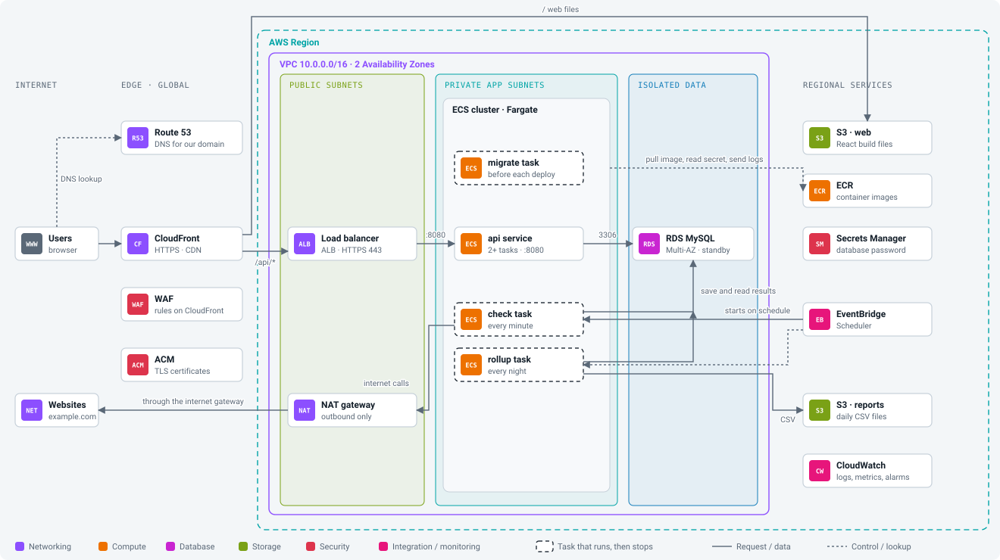
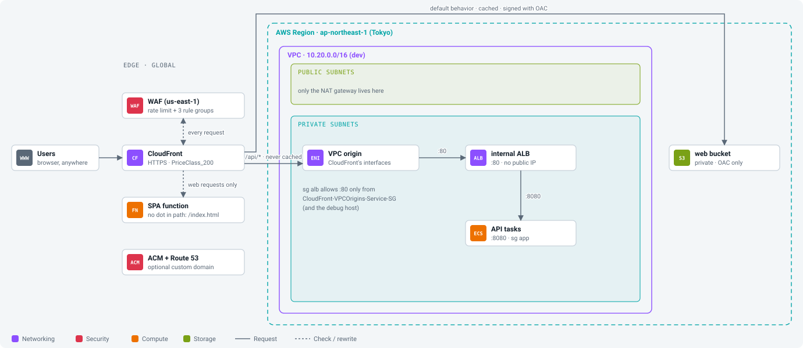
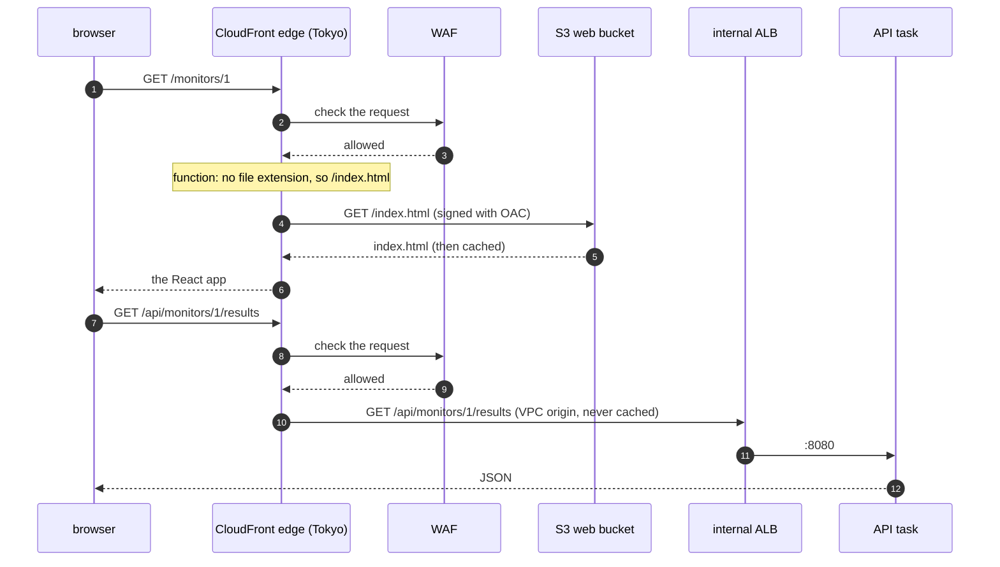

# Step 05: CloudFront and WAF

The API runs on AWS, but only the debug host can reach it. In this step we open the front door: CloudFront serves the React app from a private S3 bucket and forwards `/api/*` to the internal load balancer through a **VPC origin**. A web application firewall (WAF) sits in front of both.

At the end you can open the app in your browser at `https://dxxxx.cloudfront.net` (or your own domain), from anywhere, and the load balancer, the tasks and the database still have no public address.

- **Time:** about 3 hours (CloudFront changes take a few minutes each)
- **Cost:** CloudFront is inside the free tier at our traffic (1 TB and 10 million requests a month). WAF is about $9 a month, or $0.012 an hour. About $0.15 an hour in total now. See [costs.md](../costs.md).
- **You need:** steps 02 to 04 applied with Terraform in dev, with the API service running
- **Branch:** `step-05/cdn-and-waf`
- **Workbook:** [docs/workbook/05-cdn-and-waf.md](../workbook/05-cdn-and-waf.md) (checklists, commands in order, a log to fill in)

## What you will be able to do after this step

- Serve a single-page app from a private S3 bucket through CloudFront with Origin Access Control.
- Send `/api/*` to an internal load balancer through a CloudFront VPC origin.
- Explain cache behaviors, cache policies and origin request policies, and why the API is never cached.
- Make deep links like `/monitors/1` work without breaking API errors.
- Put AWS WAF in front of CloudFront, and watch it block an attack and a flood.
- Deploy a new version of the web app without users getting a mix of old and new files.

## 1. Words you need

| Word | What it means |
|---|---|
| **CloudFront** | AWS's CDN (content delivery network): servers in hundreds of cities that answer users from nearby and pass the rest to your origins. |
| **Edge location** | One of those CloudFront sites. Tokyo and Osaka have several. |
| **Distribution** | One CloudFront setup, with its own `dxxxx.cloudfront.net` name. |
| **Origin** | Where CloudFront fetches from: our web bucket, and our load balancer. |
| **Cache behavior** | A rule: "requests for this path go to this origin, cached like this". The default behavior catches everything else. |
| **Cache policy** | How long to keep responses and which parts of the request make them different. |
| **Origin request policy** | Which headers, cookies and query strings CloudFront passes to the origin. |
| **Origin Access Control (OAC)** | CloudFront signs its requests to S3, and the bucket only accepts requests signed by our distribution. The bucket stays private. |
| **VPC origin** | CloudFront places network interfaces in our private subnets and talks to an internal load balancer from there. |
| **CloudFront Function** | A few lines of JavaScript that run at the edge on every request, for example to rewrite a path. |
| **Invalidation** | Telling CloudFront to forget a cached file now instead of when it expires. |
| **WAF** | Web application firewall: rules that look at each HTTP request and block the bad ones. |
| **Web ACL** | One WAF setup: a list of rules, attached to a CloudFront distribution. |

## 2. The design

<p align="center"></p>

This step's part of it, in more detail:

<p align="center"></p>

### What happens to one request



### The two behaviors

| Path | Origin | Cache | Passes to origin | Methods |
|---|---|---|---|---|
| `/api/*` | internal load balancer, through the VPC origin | never (`Managed-CachingDisabled`) | everything except `Host` (`Managed-AllViewerExceptHostHeader`), so `Authorization` reaches the API | all |
| everything else | web bucket, through OAC | yes (`Managed-CachingOptimized`) | nothing extra | `GET`, `HEAD` |

Both add security headers (`Managed-SecurityHeadersPolicy`: HSTS, `X-Content-Type-Options`, `X-Frame-Options` and more), and both redirect plain HTTP to HTTPS.

### Deep links

`/monitors/1` is not a file. It is a page the React router draws in the browser. If CloudFront asks S3 for `/monitors/1`, S3 answers `403` (the bucket does not say "not found" to someone who may not list it).

The common fix is a "custom error response": turn every `403` and `404` into `index.html`. But that applies to the whole distribution, so a real `404` from the API (say, a deleted monitor) would come back as a web page with status `200`. Instead, a tiny **CloudFront Function** on the web behavior only rewrites any path without a dot to `/index.html`. `/assets/index-xL97jjkb.js` still loads as a file, and the API is never touched.

### The firewall

| Rule | What it does | Cost / month |
|---|---|---|
| `rate-limit-per-ip` | blocks one IP for a while after 2,000 requests in 5 minutes | $1 |
| `AWSManagedRulesAmazonIpReputationList` | addresses AWS has seen scanning and attacking | $1 |
| `AWSManagedRulesCommonRuleSet` | cross-site scripting, path traversal, huge bodies, missing User-Agent... | $1 |
| `AWSManagedRulesKnownBadInputsRuleSet` | request patterns used against known bugs (Log4j and others) | $1 |
| the web ACL itself | | $5 |

Plus $0.60 per million requests. The WAF for CloudFront must be created in `us-east-1`, because CloudFront is global.

### Why like this

- **Private bucket + OAC**, not a public S3 website: the bucket never needs to be public, and S3 website endpoints cannot do HTTPS.
- **VPC origin**, not a public load balancer locked down with IP lists and secret headers: there is nothing public to lock down. Traffic from CloudFront to the load balancer stays in AWS's network.
- **Price class 200**: it includes Japan. Price class 100, the cheapest, only uses edges in North America and Europe, so a user in Tokyo would be served from across the Pacific.

[ADR 0013](../adr/0013-cloudfront-vpc-origin-and-waf.md) has the options we did not take.

## 3. Before you start

The API service from step 04 must be running:

```bash
make tf-output env=dev stack=compute name=alb_dns_name
```

You should see `internal-uptime-dev-xxxx.ap-northeast-1.elb.amazonaws.com`. Build the web app once:

```bash
make web-build
```

You should see `✓ built in ...` and a folder `app/web/dist` with `index.html` and `assets/`.

## 4. Build it by hand

### 4.1 A bucket for the web files

**S3, Create bucket:** `uptime-dev-byhand-web-ACCOUNT`, Tokyo, ACLs disabled, **block all public access**, SSE-S3. Upload the build:

```bash
aws s3 sync app/web/dist s3://uptime-dev-byhand-web-ACCOUNT
```

You should see `upload:` lines for `index.html` and the files in `assets/`. Now try to read it directly:

```bash
curl -s -o /dev/null -w '%{http_code}\n' https://uptime-dev-byhand-web-ACCOUNT.s3.ap-northeast-1.amazonaws.com/index.html
```

You should see `403`. The bucket is private, as it should be.

### 4.2 The VPC origin

**CloudFront console, VPC origins, Create VPC origin.**

- Name: `uptime-dev-byhand-alb`
- Origin ARN: the load balancer `uptime-dev` (from step 04)
- Protocol: **HTTP only**, port 80

Its status is **Deploying** for several minutes. While it deploys, CloudFront adds a security group to our VPC called **`CloudFront-VPCOrigins-Service-SG`**. Find it in **EC2, Security groups**.

Then edit `uptime-dev-alb`: **inbound, add rule**, HTTP (80), source **Custom**, pick `CloudFront-VPCOrigins-Service-SG`. Now CloudFront's interfaces, and only those (plus the debug host), may reach the load balancer.

### 4.3 The SPA function

**CloudFront, Functions, Create function:** name `uptime-dev-byhand-spa`, runtime `cloudfront-js-2.0`. Code:

```javascript
function handler(event) {
  var request = event.request;
  if (!request.uri.includes('.')) {
    request.uri = '/index.html';
  }
  return request;
}
```

**Save**, then **Publish**. On the **Test** tab, try the URI `/monitors/1` (you should see it become `/index.html`) and `/assets/app.js` (unchanged).

### 4.4 The distribution

**CloudFront, Create distribution.**

| Setting | Value |
|---|---|
| Origin | the bucket `uptime-dev-byhand-web-ACCOUNT` (pick it from the list, not the website endpoint) |
| Origin access | **Origin access control settings**, **Create new OAC** (defaults: sign requests) |
| Viewer protocol policy | Redirect HTTP to HTTPS |
| Cache policy | `CachingOptimized` |
| Response headers policy | `SecurityHeadersPolicy` |
| Function associations | Viewer request: CloudFront Functions, `uptime-dev-byhand-spa` |
| Web Application Firewall | **Do not enable security protections** (we add our own in 4.5) |
| Price class | **Use North America, Europe, Asia, Middle East, and Africa** |
| Default root object | `index.html` |

After you create it, CloudFront shows a banner: **the S3 bucket policy needs to be updated**. Click **Copy policy**, open the bucket's **Permissions, Bucket policy**, paste, save. Read the policy: it allows `cloudfront.amazonaws.com` to read, but only when `AWS:SourceArn` is this distribution.

Now add the API. **Origins, Create origin:** origin domain, choose the **VPC origin** `uptime-dev-byhand-alb`. Then **Behaviors, Create behavior:**

| Setting | Value |
|---|---|
| Path pattern | `/api/*` |
| Origin | the VPC origin |
| Viewer protocol policy | Redirect HTTP to HTTPS |
| Allowed methods | GET, HEAD, OPTIONS, PUT, POST, PATCH, DELETE |
| Cache policy | `CachingDisabled` |
| Origin request policy | `AllViewerExceptHostHeader` |
| Response headers policy | `SecurityHeadersPolicy` |

Wait until **Last modified** shows a date instead of **Deploying** (about 5 minutes).

### 4.5 The firewall

**WAF & Shield console**, region **Global (CloudFront)**, **Web ACLs, Create web ACL.**

- Name: `uptime-dev-byhand`, resource type **Amazon CloudFront distributions**, add the distribution
- Rules, **Add managed rule groups**, AWS managed: **Amazon IP reputation list**, **Core rule set**, **Known bad inputs**
- **Add my own rules, Rate-based rule:** name `rate-limit-per-ip`, limit 2000, evaluation window 5 minutes, action Block
- Default action: **Allow**

## 5. Test it

Open `https://dxxxx.cloudfront.net` in your browser (from the distribution's page). You should see the Uptime app with the monitors you seeded in step 04, showing the results of the check you ran by hand there. Nothing runs checks on a schedule yet; from step 06 on they update by themselves. Click a monitor, then reload the page on `/monitors/1`: it still loads, thanks to the function.

From your terminal:

```bash
CF=https://dxxxx.cloudfront.net
curl -sI $CF/ | grep -iE '^(http|x-cache|strict-transport|content-type)'
curl -sI $CF/ | grep -iE '^x-cache'
curl -s $CF/api/health; echo
curl -sI $CF/api/health | grep -iE '^(x-cache|cache-control)'
```

You should see:

- `HTTP/2 200`, `content-type: text/html`, `strict-transport-security: max-age=31536000` and `x-cache: Miss from cloudfront` the first time, `Hit from cloudfront` the second time
- `{"status":"ok"}` from the API, with `x-cache: Miss from cloudfront` every time: the API is never cached

Add a monitor through the web app with the admin token (from Secrets Manager, step 04). It works: `POST /api/monitors` went through CloudFront, the WAF, the VPC origin and the load balancer to the API.

## 6. Break it on purpose

**a) The load balancer shuts the door.** Remove the `CloudFront-VPCOrigins-Service-SG` rule from `uptime-dev-alb`. Reload the app. The page still loads (it comes from S3), but the monitor list fails, and:

```bash
curl -s -o /dev/null -w '%{http_code}\n' $CF/api/health
```

shows `504` after about 30 seconds: CloudFront waited for the origin and gave up. Put the rule back.

**b) Without the function.** In the distribution, remove the function association from the default behavior and wait for it to deploy. Open `$CF/monitors/1` directly: you get an XML page with `AccessDenied`. That is S3 saying "no such file, and you may not list". Put the function back.

**c) An attack.**

```bash
curl -s -o /dev/null -w '%{http_code}\n' "$CF/api/monitors?q=<script>alert(1)</script>"
```

You should see `403`. The common rule set's cross-site scripting rule blocked it before it reached our VPC. In the web ACL's **Overview**, sampled requests show the block and the rule that did it (after a minute or two).

**d) A flood.** Send 3,000 requests quickly from your laptop:

```bash
seq 1 3000 | xargs -P 30 -I{} curl -s -o /dev/null -w '%{http_code}\n' $CF/api/health | sort | uniq -c
```

You should see mostly `200`. Run it again within a minute or two and you should see a growing number of `403`: the rate rule noticed your IP. The block lifts by itself a few minutes after you stop. (The rate rule counts over a 5-minute window and takes a little while to react; it stops floods, not a single burst.)

## 7. Delete the hand-built version

1. **WAF:** in the web ACL, remove the association with the distribution, then delete the web ACL.
2. **CloudFront:** select the distribution, **Disable**, wait until it shows **Disabled** (5 to 15 minutes), then **Delete**.
3. **CloudFront, VPC origins:** delete `uptime-dev-byhand-alb` (only possible once no distribution uses it).
4. **CloudFront, Functions:** delete `uptime-dev-byhand-spa`. **Origin access, Control settings:** delete the OAC.
5. **S3:** empty and delete `uptime-dev-byhand-web-ACCOUNT`.
6. **EC2, Security groups:** remove the `CloudFront-VPCOrigins-Service-SG` rule from `uptime-dev-alb`. The section 8 apply creates a new VPC origin and the same kind of rule again, managed by Terraform this time.

## 8. The same thing in Terraform

### 8.1 The code

```
terraform/modules/waf-cloudfront/   the web ACL and its four rules
terraform/modules/cdn/              OAC, VPC origin, SPA function, distribution, optional certificate and DNS
terraform/stacks/edge/              uses both, the web bucket and its policy, the load balancer rule
terraform/envs/dev/edge.tfvars      optional domain
```

`stacks/edge/providers.tf` has two AWS providers: the normal one in Tokyo, and `aws.us_east_1` for the WAF and the certificate. The WAF module gets the `us-east-1` one as its default:

```hcl
module "waf" {
  source    = "../../modules/waf-cloudfront"
  providers = { aws = aws.us_east_1 }
  ...
}
```

The load balancer rule at the end of `stacks/edge/main.tf` looks up `CloudFront-VPCOrigins-Service-SG` by name, after the VPC origin exists, and allows it in. It is the same rule you added by hand in 4.2.

### 8.2 Apply

```bash
make tf-plan env=dev stack=edge
make tf-apply env=dev stack=edge
```

You should see `Plan: 11 to add` without a domain. The apply takes 5 to 15 minutes; the distribution and the VPC origin are the slow parts. At the end:

```
distribution_domain_name = "dxxxx.cloudfront.net"
url                      = "https://dxxxx.cloudfront.net"
web_bucket               = "uptime-dev-web-ACCOUNT"
```

If the apply fails with `no matching EC2 Security Group found` for `CloudFront-VPCOrigins-Service-SG`, the VPC origin was not ready yet when Terraform looked. Run plan and apply again; the second time it is there.

### 8.3 Deploy the web app

```bash
make web-deploy env=dev
```

This builds the app, uploads `assets/` with `Cache-Control: public,max-age=31536000,immutable`, uploads everything else (mainly `index.html`) with `Cache-Control: no-cache`, and invalidates `/index.html`. At the end it prints the invalidation ID.

Why two kinds of files? Vite puts a hash of the content in every asset's name (`index-xL97jjkb.js`). A changed file gets a new name, so an old name can be cached forever. `index.html` keeps its name and says which assets to load, so it must never be stale. A browser that loads the new `index.html` gets the new assets; one that still has the old `index.html` gets the old assets, which are still in the bucket. Nobody gets a mix.

Open the `url` output in your browser. You should see the app.

### 8.4 Optional: your own domain

If you have a domain in Route 53 (a hosted zone in this account), set in `envs/dev/edge.tfvars`:

```hcl
domain_name    = "uptime-dev.example.com"
hosted_zone_id = "Z0123456789ABCDEFGHIJ"
```

Plan again. You should see `5 to add, 1 to change`: a certificate in `us-east-1`, its DNS validation record, the validation, two alias records (`A` and `AAAA`), and the distribution gets the new name and certificate. The apply waits until ACM has validated the certificate (a few minutes). Then `https://uptime-dev.example.com` works.

## 9. Check yourself

1. Why does the web bucket not need to be public?
2. Why is `/api/*` never cached, even `GET /api/monitors`?
3. `Authorization` must reach the API. Which setting makes that happen?
4. Why a CloudFront Function for deep links, and not a custom error response?
5. The WAF is in `us-east-1` and the app is in Tokyo. Why?
6. After a web deploy, why do we only invalidate `/index.html`?
7. A user in Osaka opens the app. Which price class makes sure they are served from Japan?
8. Name three things that would have to go wrong for someone on the internet to reach the database directly.

<details>
<summary>Answers</summary>

1. Origin Access Control: CloudFront signs every request to S3, and the bucket policy only allows `cloudfront.amazonaws.com` when the request comes from our distribution (`AWS:SourceArn`).
2. The answers change every minute and differ per request (IDs, the admin token). A cached answer would show old data, or worse, one user's response to another.
3. The origin request policy `Managed-AllViewerExceptHostHeader` on the `/api/*` behavior. The cache policy is `CachingDisabled`, so headers do not need to be part of a cache key.
4. A custom error response applies to every origin, so API errors (a real `404`) would become `200` with `index.html`. The function runs only on the web behavior and only rewrites paths without a file extension.
5. CloudFront is a global service, and AWS keeps its configuration in `us-east-1`. WAF web ACLs and ACM certificates used by CloudFront must be there too.
6. Asset names change whenever their content changes, so new assets never collide with cached old ones. Only `index.html` keeps its name.
7. `PriceClass_200` (or `PriceClass_All`). `PriceClass_100` does not include edge locations in Asia.
8. For example: the database would need a route to the internet (it is isolated), a public IP (it has none), and a security group rule letting the internet in (it only allows `app` and `jobs`). Any one of these alone keeps it unreachable.

</details>

## Clean up

To stop paying for WAF, destroy the edge stack:

```bash
make tf-destroy env=dev stack=edge
```

You should see `Destroy complete! Resources: 11 destroyed`. It takes 5 to 15 minutes because CloudFront disables the distribution before it deletes it. Afterwards, check **EC2, Security groups** for `CloudFront-VPCOrigins-Service-SG`. CloudFront made it, not Terraform, so if it is still there once no VPC origin uses the VPC, delete it by hand; otherwise it stops `make tf-destroy ... stack=network` from deleting the VPC later. CloudFront itself costs nothing when idle, so if you come back tomorrow you can also keep it; the WAF's monthly fee is charged per hour it exists.

## Next

[Step 06: Scheduled jobs](06-scheduled-jobs.md). EventBridge Scheduler starts the `check` task every minute and `rollup` every hour, and the app finally checks websites by itself.
