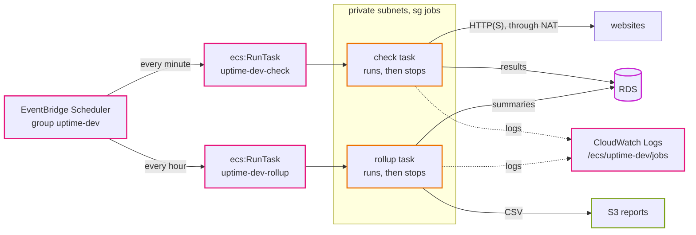
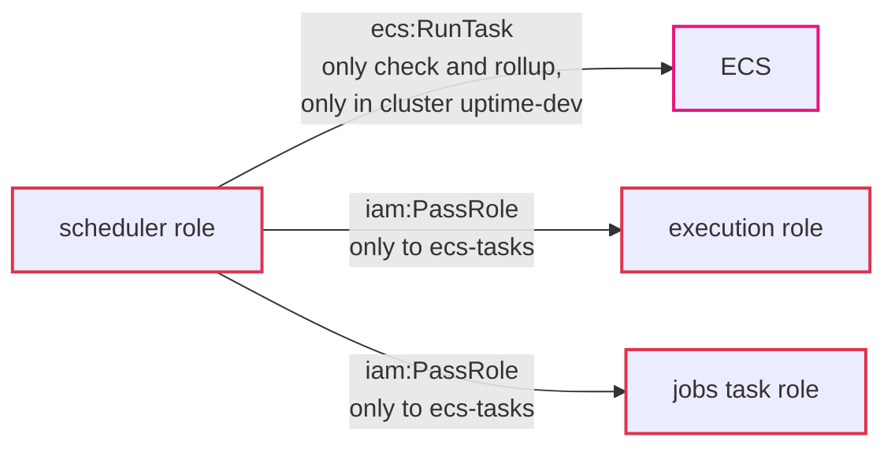

# Step 06: Scheduled jobs

Everything is in place except the heartbeat. Locally, the `scheduler` container runs `check` every minute and `rollup` every few minutes. On AWS that container does not exist. Instead, **EventBridge Scheduler** starts a fresh ECS task from the `check` task definition every minute and from `rollup` every hour.

After this step the app does its job on its own: it checks every website every minute, keeps daily summaries, and writes a report to S3.

- **Time:** about 2 hours
- **Cost:** about $9 a month for the check task and $0.15 for rollup; the scheduler itself is free at this volume. About $0.16 an hour in total now. See [costs.md](../costs.md).
- **You need:** steps 02 to 05 applied in dev
- **Branch:** `step-06/scheduled-jobs`

## What you will be able to do after this step

- Start ECS tasks on a schedule with EventBridge Scheduler.
- Write the IAM role a scheduler needs, and explain `iam:PassRole`.
- Find one job run in ECS and in the logs, and say how long it took.
- Show that two overlapping runs cannot save the same results twice.
- Pause and resume jobs in one environment without deleting anything.

## 1. Words you need

| Word | What it means |
|---|---|
| **EventBridge Scheduler** | A managed cron. It calls an AWS API on a schedule; for us, ECS `RunTask`. |
| **Schedule** | One entry: when (`rate(1 minute)`), what (the target) and with which role. |
| **Schedule group** | A folder for schedules. We use one per environment: `uptime-dev`. |
| **Target** | What the schedule calls. Ours: "run one Fargate task from this task definition, in these subnets, with this security group". |
| **Flexible time window** | Lets the scheduler start the job any time within a window, to spread load. We turn it off: checks should be on time. |
| **`iam:PassRole`** | Permission to hand an IAM role to a service. Starting a task hands it an execution role and a task role, so the scheduler needs this. |
| **Task definition revision** | Each change to a task definition makes a new numbered revision. An ARN without the number means "the newest". |

## 2. The design



| Schedule | When | Retries | Why |
|---|---|---|---|
| `check` | `rate(1 minute)` | none | the next run is only a minute away |
| `rollup` | `rate(1 hour)` | 2, within an hour | it redoes yesterday and today every time, so any run catches up |

Both run in the private subnets with the `jobs` security group (no inbound, any TCP port out). The target points at the task definition **without** a revision number, so a deploy in step 08 only has to apply the `compute` stack: the next run picks up the new image by itself.

### The role the scheduler needs



Why `PassRole`? Without it, anyone who may start tasks could start one with *any* role in the account, including an admin role, and use the task to act as that role. `PassRole` limited to exactly these two roles closes that door.

### Why not a long-running container with timers?

We could run `dev-scheduler` as an ECS service, like locally. It would cost about the same (Fargate bills at least one minute per task, so a task every minute costs about as much as one that never stops). But a fresh task per run gives each run its own log stream and exit code, a stuck run cannot block the next ones, and deploys do not restart any timers. [ADR 0014](../adr/0014-eventbridge-scheduler-runs-ecs-tasks.md) also compares EventBridge rules and Lambda.

## 3. Before you start

Check the compute stack has the new outputs this step needs. Apply it once (nothing changes in AWS; only the outputs are added):

```bash
make tf-plan env=dev stack=compute
make tf-apply env=dev stack=compute
make tf-output env=dev stack=compute name=check_task_definition_arn_latest
```

You should see `No changes. Your infrastructure matches the configuration.` in the plan, except `Changes to Outputs`, and then `arn:aws:ecs:ap-northeast-1:ACCOUNT:task-definition/uptime-dev-check` (no `:3` at the end).

## 4. Build it by hand

**EventBridge console, Scheduler, Schedules, Create schedule.**

| Setting | Value |
|---|---|
| Name | `check-byhand` |
| Schedule group | default |
| Occurrence | Recurring, **Rate-based**, 1 minute |
| Flexible time window | **Off** |
| Target | **Amazon ECS, RunTask** |
| ECS cluster | `uptime-dev` |
| Task definition | `uptime-dev-check`, revision **latest** |
| Task count | 1 |
| Launch type | FARGATE, platform LATEST |
| Subnets | the two private subnets |
| Security groups | `uptime-dev-jobs` |
| Auto-assign public IP | **Off** |
| Retry policy | off (0 retries) |
| Dead-letter queue | none |
| Permissions | **Create new role for this schedule** |

Create it. Then open the role the console made (IAM, Roles, `Amazon_EventBridge_Scheduler_ECS_...`) and read its policy. It allows `ecs:RunTask` on the check task definition and `iam:PassRole` on the two roles, close to what our Terraform version does.

## 5. Test it

Within two minutes, tasks start. Watch them:

```bash
aws ecs list-tasks --cluster uptime-dev --family uptime-dev-check --desired-status STOPPED \
  --query 'length(taskArns)'
```

You should see the number grow by about one per minute (ECS keeps stopped tasks visible for about an hour).

Look at one run in detail:

```bash
TASK=$(aws ecs list-tasks --cluster uptime-dev --family uptime-dev-check --desired-status STOPPED \
  --query 'taskArns[0]' --output text)
aws ecs describe-tasks --cluster uptime-dev --tasks $TASK \
  --query 'tasks[0].{created:createdAt,started:startedAt,stopped:stoppedAt,exit:containers[0].exitCode,reason:stoppedReason}'
```

You should see `exit: 0`, `reason: Essential container in task exited`, and times showing that about 20 to 40 seconds pass between `created` and `started` (Fargate finding capacity and pulling the image), and a few seconds between `started` and `stopped` (the check itself).

The logs:

```bash
aws logs tail /ecs/uptime-dev/jobs --since 5m --format short
```

You should see `check finished` with `"monitors":2,"up":1,"down":1` every minute.

Open the app through CloudFront. The monitors now update by themselves, and the 24-hour uptime column fills in.

## 6. Break it on purpose

**a) Five runs at once.** First make a check take a while: add a monitor for `https://httpbin.org/delay/8` through the app (the page waits 8 seconds before it answers). Then start five check tasks with one command, so they start within a second or two of each other:

```bash
NET=$(make -s tf-output env=dev stack=compute name=run_task_network)
aws ecs run-task --cluster uptime-dev --launch-type FARGATE --count 5 \
  --task-definition uptime-dev-check --network-configuration "$NET" --query 'length(tasks)'
aws logs tail /ecs/uptime-dev/jobs --since 3m --format short | grep -E 'check finished|skipping run'
```

You should see `5`, and after a minute a mix of lines: one or two `check finished`, and the rest `skipping run, previous one still going`. The MySQL lock `uptime-check` let one run work and turned the others away, so no two runs visited the websites and saved results at the same time. Delete the slow monitor afterwards.

**b) Take away `PassRole`.** Edit the console-made role and remove the `iam:PassRole` statement. Wait two minutes. No new tasks start. In **CloudWatch, Metrics, Scheduler**, `TargetErrorCount` goes up for `check-byhand`. The scheduler tried, and ECS said no. Nothing appears in the task list or in the app's logs, which is why step 07 adds an alarm on that metric. Put the statement back.

**c) Cut the internet.** Remove the private route table's `0.0.0.0/0` route (step 02, experiment 6a) in `1a`. Tasks placed in that zone now fail with `CannotPullContainerError` or `ResourceInitializationError`: they cannot reach ECR's API to log in or Secrets Manager to read the password. The S3 endpoint still works for image layers, but the task never gets that far. Put the route back, or apply the `network` stack.

**d) Pause.** Disable `check-byhand` in the console. Checks stop, and after a few minutes the app shows the last check getting older. Nothing is deleted; enable it and checks resume.

## 7. Delete the hand-built version

Delete the schedule `check-byhand`, then the IAM role the console made for it (it is not deleted with the schedule).

## 8. The same thing in Terraform

### 8.1 The code

`terraform/stacks/jobs/main.tf` has three parts:

- `local.jobs`: the two jobs, their schedules and retry settings
- the scheduler role: `ecs:RunTask` on `uptime-dev-check:*` and `uptime-dev-rollup:*` only, with the condition `ecs:cluster = uptime-dev`; `iam:PassRole` on the two roles only, with `iam:PassedToService = ecs-tasks.amazonaws.com`
- one `aws_scheduler_schedule` per job, created with `for_each`

Look at `envs/dev/jobs.tfvars`: `schedules_enabled = true`. Setting it to `false` pauses the jobs in that environment.

### 8.2 Apply

```bash
make tf-plan env=dev stack=jobs
make tf-apply env=dev stack=jobs
```

You should see `Plan: 5 to add` (the role, its policy, the group, two schedules). At the end:

```
schedule_group = "uptime-dev"
schedules = {
  "check"  = "rate(1 minute)"
  "rollup" = "rate(1 hour)"
}
```

Run the checks from section 5 again. Within the hour a rollup runs too:

```bash
aws logs tail /ecs/uptime-dev/jobs --since 2h --format short | grep -E 'day summarised|old results deleted'
aws s3 ls s3://uptime-dev-reports-ACCOUNT/reports/
```

You should see `day summarised` twice (yesterday and today) and `old results deleted`, and today's CSV in the bucket, also listed on the app's **Reports** page.

### 8.3 Pause and resume

Set `schedules_enabled = false` in `envs/dev/jobs.tfvars`, plan and apply. You should see `2 to change`: both schedules become `DISABLED`. Set it back to `true` and apply again.

## 9. Check yourself

1. Why does the schedule target the task definition ARN without a revision?
2. What could someone do with `ecs:RunTask` but no limit on `iam:PassRole`?
3. A check is scheduled at 10:00:00. When does it actually visit the websites, roughly?
4. The check job has 0 retries and rollup has 2. Why the difference?
5. The scheduler cannot start tasks. Where do you see that, given that no task and no log line appears?
6. Why is running `check` twice at once harmless?

<details>
<summary>Answers</summary>

1. So each run uses the newest revision. A deploy creates a new revision; without the number, the schedules keep working without being changed.
2. Start a task with a more powerful role than intended (any role that trusts ECS tasks), and use the task to act with that role's permissions.
3. About 20 to 60 seconds later. Fargate has to find capacity, create the network interface, pull the image and read the secrets before the command runs.
4. A missed check is replaced a minute later; retrying it would only pile up tasks. A missed rollup would leave today's summary out of date for an hour, and rollup is safe to repeat.
5. The Scheduler metrics in CloudWatch, `TargetErrorCount` and `InvocationDroppedCount`. Step 07 puts an alarm on them.
6. The MySQL lock `uptime-check`: the second run sees the lock is taken and exits without doing anything. The one run that works saves its results in one insert.

</details>

## Clean up

The check task every minute costs about $0.30 a day. To pause it without deleting anything, set `schedules_enabled = false` and apply the `jobs` stack. To remove the schedules:

```bash
make tf-destroy env=dev stack=jobs
```

You should see `Destroy complete! Resources: 5 destroyed`.

## Next

[Step 07: Observability](07-observability.md). Logs are there; now we add the alarms that tell us when something breaks, before a user does.
