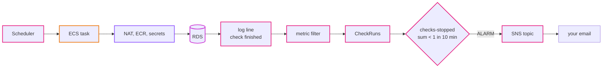

# Step 07: Observability

The app runs by itself now. That also means it can break by itself, at 3 in the morning, with nobody looking. In this step we make it tell us: alarms on the things that matter, an email when one fires, a dashboard to look at, and saved log queries for when we need to dig.

- **Time:** about 2 hours
- **Cost:** about $2.40 a month in dev (10 alarms, 3 custom metrics, a little log data). See [costs.md](../costs.md).
- **You need:** steps 02 to 06 applied in dev, and an email address you can read
- **Branch:** `step-07/observability`

## What you will be able to do after this step

- Say which failures you want to hear about, and pick a metric for each.
- Turn JSON log lines into metrics with a metric filter.
- Build an alarm that fires on *silence*, not only on errors.
- Send alarms to email through SNS, and test the whole path without breaking anything.
- Find the slowest API requests and the latest errors with Logs Insights.
- Read a dashboard that shows the app from the load balancer to the database.

## 1. Words you need

| Word | What it means |
|---|---|
| **Metric** | A number over time, like `CPUUtilization` every minute. AWS services publish many for free. |
| **Namespace** | A folder for metrics: `AWS/RDS`, `AWS/ApplicationELB`, or our own `Uptime/dev`. |
| **Dimension** | Which thing a metric is about, like `DBInstanceIdentifier = uptime-dev`. |
| **Statistic** | How data points are combined over a period: `Sum`, `Average`, `Minimum`, or a percentile like `p95`. |
| **Alarm** | Watches one metric and changes state: `OK`, `ALARM`, or `INSUFFICIENT_DATA`. |
| **Missing data** | What an alarm does when the metric has no data points. We choose per alarm. |
| **Metric filter** | A rule that watches a log group and turns matching lines into a metric. |
| **SNS topic** | A mailbox for notifications. Alarms send to it, and it forwards to email (or chat, or a pager). |
| **Logs Insights** | A query language for CloudWatch Logs, good at JSON logs. |
| **p95** | 95% of requests were faster than this. Averages hide the slow requests; p95 shows them. |

## 2. The design

### What we want to hear about

Start from failures, not from metrics:

| Failure | How we notice | Alarm |
|---|---|---|
| The API returns errors | load balancer counts `5xx` from the tasks | `api-5xx`: more than 5 in 5 minutes |
| The load balancer itself fails requests | `5xx` made by the load balancer (no healthy task, timeouts) | `alb-5xx`: more than 5 in 5 minutes |
| The app is down | no task passes its health check | `api-no-healthy-tasks`: fewer than 1 for 3 minutes |
| The app is slow | response time at p95 | `api-slow`: over 1 second, twice in a row |
| The database is overloaded | CPU | `db-cpu-high`: over 80% for 15 minutes |
| The database is about to be slowed down | `t4g` CPU credits | `db-cpu-credits-low`: under 20 |
| The disk is filling up | free storage | `db-storage-low`: under 2 GB |
| The scheduler cannot start jobs | Scheduler's own error count | `scheduler-errors`: any in 5 minutes |
| **Checks stopped happening, for any reason** | our `CheckRuns` metric, from the logs | `checks-stopped`: no finished run in 10 minutes |
| The code logs errors | our `Errors` metric, from the logs | `app-errors`: more than 5 in 5 minutes |

The most useful one is `checks-stopped`. It does not care *why*: the scheduler role, the NAT gateway, ECR, the database password, a bug. If anything in the chain breaks, check runs stop finishing, the metric goes silent, and the alarm fires. That is why it treats missing data as **breaching**.



### Metrics from logs

The app writes JSON logs (step 01), so a metric filter can match fields, not just text:

| Metric (namespace `Uptime/dev`) | Log group | Pattern | Value |
|---|---|---|---|
| `CheckRuns` | `/ecs/uptime-dev/jobs` | `{ $.msg = "check finished" \|\| $.msg = "no monitors to check" }` | 1 |
| `MonitorsDown` | `/ecs/uptime-dev/jobs` | `{ $.msg = "check finished" }` | the `down` field |
| `Errors` | both log groups | `{ $.level = "ERROR" }` | 1 |

These names are now a contract. If someone renames the log message `check finished` in `internal/checker/checker.go`, two metrics silently stop, and `checks-stopped` fires. That is the right outcome, but it is good to know why.

### What we did not add

- **Container Insights**: per-task metrics, billed per metric. ECS already publishes the service's CPU and memory for free, which is enough for one service.
- **Tracing** (X-Ray, OpenTelemetry): valuable with many services calling each other. We have one API; the request log has `duration_ms`.
- **An external tool**: another account and another bill.

[ADR 0015](../adr/0015-cloudwatch-alarms-from-metrics-and-logs.md) has the details.

## 3. Build it by hand

### 3.1 A topic and your email

**SNS console, Topics, Create topic:** Standard, name `uptime-dev-byhand-alerts`. Then **Create subscription:** protocol Email, your address. AWS sends an email with **Confirm subscription**. Click it. Until you do, the subscription says `Pending confirmation` and nothing is delivered.

### 3.2 The heartbeat metric

**CloudWatch, Log groups, `/ecs/uptime-dev/jobs`, Metric filters, Create metric filter.**

- Pattern: `{ $.msg = "check finished" }`
- **Test pattern** against the recent log events. You should see matches, one per minute.
- Filter name `check-runs-byhand`, namespace `Uptime/byhand`, metric name `CheckRuns`, value `1`, default value `0`

Metrics only start from the moment the filter exists. Wait five minutes, then find **Metrics, All metrics, Uptime/byhand**.

### 3.3 The alarm

**CloudWatch, Alarms, Create alarm, Select metric:** `Uptime/byhand`, `CheckRuns`.

- Statistic **Sum**, period **10 minutes**
- Condition: **Lower than 1**
- Additional configuration, **Treat missing data as bad (breaching threshold)**
- Notification: in ALARM, send to `uptime-dev-byhand-alerts`; add a second one for OK
- Name: `uptime-dev-byhand-checks-stopped`

## 4. Test it

### 4.1 The notification path, without breaking anything

You can force an alarm into a state. It goes back by itself at the next evaluation.

```bash
aws cloudwatch set-alarm-state --alarm-name uptime-dev-byhand-checks-stopped \
  --state-value ALARM --state-reason "Testing the email path"
```

The command prints nothing. Within a minute you should get an email titled `ALARM: "uptime-dev-byhand-checks-stopped" in Asia Pacific (Tokyo)`, and a minute or so later an `OK` email, because the real data says checks are running.

### 4.2 A real failure

Pause the checks: set `schedules_enabled = false` in `envs/dev/jobs.tfvars` and apply the `jobs` stack (step 06, section 8.3). Wait. Within 10 to 20 minutes you should get the `ALARM` email. Nobody told CloudWatch that the scheduler was paused; it noticed the silence. Resume the schedules; the `OK` email follows about 10 minutes later.

### 4.3 Logs Insights

**CloudWatch, Logs Insights**, select `/ecs/uptime-dev/api`, and run:

```
fields @timestamp, method, path, status, duration_ms
| filter msg = "request"
| sort duration_ms desc
| limit 20
```

You should see the slowest API requests of the chosen time range, with their paths. Then select `/ecs/uptime-dev/jobs` and run:

```
fields @timestamp, monitors, up, down
| filter msg = "check finished"
| stats count(*) as runs, max(down) as max_down by bin(1h)
```

You should see about 60 runs per hour and the most websites that were down at once.

## 5. Break it on purpose

**a) Take the API down.** In the ECS console, update the service `uptime-dev-api` to 0 desired tasks. The app in the browser shows errors. Within about 4 minutes, `api-no-healthy-tasks` fires (after step 8 you have that alarm; with only the hand-built one, watch `HealthyHostCount` drop to 0 in the target group's **Monitoring** tab). Set it back to 1 in the console. An apply of the `compute` stack would **not** fix this: the service module tells Terraform to ignore `desired_count`, because in prod autoscaling owns that number. Knowing which tool owns which setting is part of running a system.

**b) Get blocked by the WAF.** Run the attack request from step 05 (6c) ten times. On the dashboard (after section 6), the **WAF** widget shows `BlockedRequests`. Nothing alarms, and that is a choice: blocked attacks are the WAF doing its job, not an incident.

**c) Create an error.** Delete a monitor that does not exist:

```bash
curl -s -X DELETE https://dxxxx.cloudfront.net/api/monitors/999999 -H "Authorization: Bearer $TOKEN"; echo
```

You should see `{"error":"monitor not found"}` with status `404`. That is not an error in the app's sense (the user made a mistake), so no `ERROR` log line and no alarm. Errors are for problems we have to fix, not for mistakes users make.

## 6. Delete the hand-built version, then Terraform

Delete the alarm, the metric filter and the SNS topic (with its subscription) you made by hand.

### 6.1 The code

`terraform/stacks/observability/main.tf`:

- the SNS topic and an optional email subscription (`alert_email`)
- three metric filters
- `local.alarms`: all ten alarms as data, one `aws_cloudwatch_metric_alarm` with `for_each`. Adding an alarm is adding five lines to that map.
- three saved Logs Insights queries (**Logs Insights, Saved queries**, folder `uptime-dev`)
- one dashboard with nine widgets. The WAF widget reads from `us-east-1`, where CloudFront's WAF lives.

Set your email in `terraform/envs/dev/observability.tfvars`:

```hcl
alert_email = "you@example.com"
```

### 6.2 Apply

```bash
make tf-plan env=dev stack=observability
make tf-apply env=dev stack=observability
```

You should see `Plan: 20 to add`. Confirm the new subscription email. At the end:

```
alarms        = ["uptime-dev-alb-5xx", "uptime-dev-api-5xx", ..., "uptime-dev-scheduler-errors"]
dashboard_url = "https://ap-northeast-1.console.aws.amazon.com/cloudwatch/home?region=ap-northeast-1#dashboards/dashboard/uptime-dev"
```

Open the dashboard. Some alarms start in `INSUFFICIENT_DATA` until their metrics have a few data points; that is normal. After 10 minutes, `checks-stopped` should be `OK`.

Test the path once more with `set-alarm-state` on `uptime-dev-checks-stopped`.

## 7. Check yourself

1. Why does `checks-stopped` treat missing data as breaching, and `api-5xx` as not breaching?
2. Why is `api-slow` on p95 and not on the average?
3. Someone renames the log message `check finished` to `checks done`. What happens?
4. Why is there no alarm on WAF blocked requests?
5. The subscription is `Pending confirmation`. What do you get when an alarm fires?
6. Why is `db-cpu-credits-low` useful for a `db.t4g.micro`, even when CPU looks fine?

<details>
<summary>Answers</summary>

1. For `checks-stopped`, silence *is* the failure: no data means no check finished. For `api-5xx`, no data means no errors were counted, which is good.
2. An average of many fast requests hides a few very slow ones. p95 says "1 in 20 requests is slower than this", which is what users notice.
3. `CheckRuns` and `MonitorsDown` stop getting data, and after 10 minutes `checks-stopped` fires, even though checks still run. The fix is to update the metric filter pattern together with the code.
4. A block is the WAF working. An alarm that fires on normal attacks trains people to ignore alarms.
5. Nothing. SNS does not deliver to unconfirmed email subscriptions.
6. `t4g` instances earn CPU credits while idle and spend them when busy. When credits run out, the CPU is held down to its baseline, and the database gets slow even though `CPUUtilization` never showed 100%.

</details>

## Clean up

The alarms and metrics cost about $2 a month and are useful as long as the environment exists. Keep them while the app runs. When you tear the environment down, destroy this stack first (it reads all the others):

```bash
make tf-destroy env=dev stack=observability
```

You should see `Destroy complete! Resources: 20 destroyed`.

## Next

[Step 08: CI/CD](08-ci-cd.md). Every push to `master` tests, builds and deploys by itself, and no one needs AWS keys on their laptop to do it.
