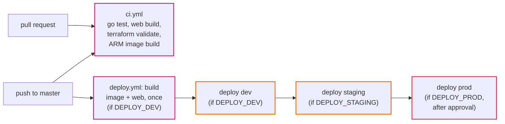
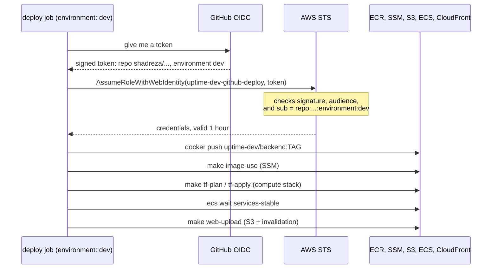

# Step 08: CI/CD

So far you deploy by hand: push an image, choose it, apply compute, upload the web app. It works, but it needs AWS credentials on your laptop, and nothing stops you from deploying code that does not even compile.

In this step GitHub Actions takes over. Every pull request is tested. Every merge to `master` builds the image and the web app **once**, and deploys that same build to dev, then (if you want) staging, then prod after someone approves. No AWS keys are stored anywhere.

- **Time:** about 2 to 3 hours
- **Cost:** GitHub Actions is free for public repositories, including ARM runners. The IAM role and the OIDC provider are free. See [costs.md](../costs.md).
- **You need:** steps 02 to 07 applied in dev, admin rights on the GitHub repository, and the [GitHub CLI](https://cli.github.com/) (`gh`) logged in (optional; everything can also be clicked)
- **Branch:** `step-08/ci-cd`

## What you will be able to do after this step

- Explain CI and CD, and what each workflow in `.github/workflows` does.
- Let GitHub Actions use AWS without storing any keys, through OIDC.
- Write a deploy role that can deploy and nothing else.
- Build once and promote the same image through several environments.
- Require a person to approve a prod deploy.
- Watch a bad change stop at CI, and a deploy fail safely when it needs more than it is allowed.

## 1. Words you need

| Word | What it means |
|---|---|
| **CI** | Continuous integration: every change is built and tested automatically, before it is merged. |
| **CD** | Continuous delivery / deployment: every merged change is deployed automatically (sometimes with an approval step). |
| **Workflow** | A YAML file in `.github/workflows` that says when to run and what to do. |
| **Job, step, runner** | A workflow has jobs; a job runs on a fresh machine (a runner) and has steps. `ubuntu-24.04-arm` is an ARM runner. |
| **Artifact** | Files one job saves for later jobs, like our image and web build. |
| **GitHub environment** | A named target (`dev`, `staging`, `prod`) with its own variables and protection rules, like required reviewers. |
| **OIDC** | OpenID Connect. GitHub signs a short token saying "this is repository X, environment Y". AWS checks the signature and hands out credentials for one hour. |
| **Identity provider (IdP)** | The AWS object that says "trust tokens signed by GitHub". One per account. |
| **Trust policy** | The part of an IAM role that says *who* may use it. Ours: only jobs in this repository and this environment. |

## 2. The design

### The two workflows



`ci.yml` has no access to AWS at all. It runs the same `make` targets you run: `test-backend`, `test-web`, `tf-validate`, plus an ARM image build.

`deploy.yml` builds the backend image on an ARM runner and saves it (`docker save`), builds the web app, and uploads both as artifacts. Then `deploy-environment.yml` runs once per environment:



The same `make` targets you used by hand. There is only one way to deploy.

### What the deploy role may do

| May | May not |
|---|---|
| push to `uptime-dev/backend` in ECR | push to another environment's repository |
| read and write `/uptime-dev/image-tag` in SSM | read secrets |
| read `dev/*` state, write `dev/compute.tfstate` | write any other stack's state |
| register task definitions, update the `uptime-dev-api` service, pass `uptime-dev-*` roles to ECS tasks | change the network, security groups, the database, IAM, CloudFront settings, WAF |
| upload to the web bucket, invalidate the distribution | anything in prod (that is a different role) |

If a merged change needs more (a new security group rule, a bigger database), the deploy's apply fails with `AccessDenied`. That is the point: infrastructure changes are applied by a person, and the next deploy goes through.

### Why OIDC and not access keys

An access key never expires and has to be stored in GitHub. If it leaks (a log, a malicious action, a fork), it works from anywhere until someone notices. An OIDC credential lasts an hour, cannot be copied out ahead of time, and only works for a job running in this repository and this environment. [ADR 0016](../adr/0016-github-actions-oidc-deploys.md).

## 3. Build it by hand: trust GitHub

The OIDC provider is one per AWS account. `terraform/bootstrap` now makes it (`github_oidc = true` by default). Run the bootstrap again; it only adds what is new:

```bash
make tf-bootstrap account_id=ACCOUNT budget_email=you@example.com
```

You should see `Plan: 1 to add` (`aws_iam_openid_connect_provider.github`) and, after `yes`, the output `github_oidc_provider_arn = "arn:aws:iam::ACCOUNT:oidc-provider/token.actions.githubusercontent.com"`.

Look at it in **IAM, Identity providers**. The audience is `sts.amazonaws.com`. The provider alone gives nobody anything; roles decide who may use it.

To see the trust policy idea by hand, open **IAM, Roles, Create role, Web identity**, pick the GitHub provider and audience, and fill in your organisation (`shadreza`), repository and, under **GitHub environment**, `dev`. Look at the trust policy the console generates (the `sub` condition), then **Cancel**. Terraform makes the real one next.

## 4. Terraform and GitHub setup

### 4.1 The deploy role

`terraform/envs/dev/cicd.tfvars` names the repository that may deploy:

```hcl
github_repository = "shadreza/aws-three-tier-cloud-ref-architecture"
```

If you forked the repo, change it to yours. Then:

```bash
make tf-plan env=dev stack=cicd
make tf-apply env=dev stack=cicd
```

You should see `Plan: 2 to add` (the role and its policy) and:

```
deploy_role_arn = "arn:aws:iam::ACCOUNT:role/uptime-dev-github-deploy"
```

### 4.2 The GitHub environments

With `gh` (or in the repository's **Settings, Environments**):

```bash
REPO=shadreza/aws-three-tier-cloud-ref-architecture
gh api -X PUT repos/$REPO/environments/dev
gh variable set AWS_DEPLOY_ROLE_ARN --repo $REPO --env dev \
  --body "arn:aws:iam::ACCOUNT:role/uptime-dev-github-deploy"
gh variable set DEPLOY_DEV --repo $REPO --body true
gh variable set DEPLOY_STAGING --repo $REPO --body false
gh variable set DEPLOY_PROD --repo $REPO --body false
```

The first command prints the environment as JSON; the others print `✓ Created variable ...`. These are **variables**, not secrets: a role ARN is not secret, it is useless without a valid GitHub token. `DEPLOY_DEV` switches the whole deploy workflow on; until it is `true`, merges to `master` only run `ci`.

For prod later: create the `prod` environment, add **Required reviewers** (yourself or the team) in its settings, set its own `AWS_DEPLOY_ROLE_ARN` from `make tf-output env=prod stack=cicd`, and set `DEPLOY_PROD` to `true`.

### 4.3 Protect `master`

In **Settings, Branches** (or **Rules**), add a rule for `master`: require a pull request, and require the status checks `backend`, `web`, `terraform` and `image` from `ci`. Now nothing reaches `master`, and so nothing is deployed, without passing CI.

## 5. Test it

### 5.1 CI on a pull request

Make a branch with a small change, for example in `app/backend/internal/api/server.go` add `"version": "3"` to the `health` response (as in step 04, 8.6). Push it and open a pull request. In the **Checks** tab you should see four jobs from `ci` go green in a few minutes.

### 5.2 A deploy

Merge the pull request (with a merge commit, as the repo rules say). In **Actions**, a `deploy` run starts: `build`, then `dev`. Open the `dev` job. You should see:

- `log in to AWS (OIDC, no stored keys)` succeed, and nowhere a key
- `push the image` pushing `uptime-dev/backend:<commit>`
- the Terraform plan with the three task definitions replaced and the service updated
- `wait until the API service is stable` take two or three minutes
- a summary at the top with the URL

Then:

```bash
curl -s https://dxxxx.cloudfront.net/api/health; echo
```

You should see the new response. Nobody ran a command on a laptop.

## 6. Break it on purpose

**a) Code that does not compile.** On a branch, break a Go file (delete a closing brace) and push. `ci` fails in the `backend` and `image` jobs. With branch protection, the merge button stays grey. Nothing is deployed.

**b) Another repository tries to use the role.** The trust policy only accepts `repo:shadreza/aws-three-tier-cloud-ref-architecture:environment:dev`. A fork, or a job in this repository without `environment: dev`, gets `Not authorized to perform sts:AssumeRoleWithWebIdentity`. You can see this by temporarily removing the `environment:` line from `deploy-environment.yml` on a branch and running the workflow with **Run workflow** on that branch (the token's `sub` becomes `repo:...:ref:refs/heads/<branch>`). Undo the change.

**c) A change that needs more than a deploy.** On a branch, change `log_retention_days = 14` to `30` in `terraform/envs/dev/compute.tfvars`, and merge it. The deploy runs (the file is in `deploy.yml`'s `paths`), the plan shows two log groups to update, and the apply fails:

```
Error: setting CloudWatch Logs Log Group (/ecs/uptime-dev/api) retention policy: ... AccessDenied: ... is not authorized to perform: logs:PutRetentionPolicy
```

The deploy role may register task definitions and update the service, not change log groups. The image did not change, so the log groups were the only change in the plan, and nothing was applied. (In a plan with several changes, Terraform applies the ones it is allowed to, stops at the refusal, and the state records exactly what happened, so the next apply picks up from there.) A person applies it (`make tf-plan env=dev stack=compute` and `make tf-apply ...`), then re-runs the failed workflow, which now has nothing left but the deploy itself.

**d) An approval.** With `DEPLOY_PROD = true` and required reviewers on `prod`, merge a change. The `prod` job shows **Waiting for review**. Nothing happens in prod until someone clicks **Approve and deploy**, and GitHub records who did.

## 7. Check yourself

1. What stops a fork of this repository from deploying to your AWS account?
2. Why does CI build the image on an ARM runner?
3. The deploy role can register task definitions and pass roles. What stops it from passing an admin role to a task?
4. Why build once and pass artifacts, instead of building in each environment's job?
5. A deploy fails with `AccessDenied` on `logs:PutRetentionPolicy`. What happened, and what do you do?
6. Two merges land 30 seconds apart. What happens?

<details>
<summary>Answers</summary>

1. The role's trust policy: `sub` must be exactly `repo:shadreza/aws-three-tier-cloud-ref-architecture:environment:dev`. A fork's tokens say a different repository.
2. The image runs on ARM (Graviton) Fargate. Building natively on ARM is fast and also catches ARM-only problems. (The Dockerfile cross-compiles, so an x86 build would also produce a correct ARM binary; the ARM runner just avoids any emulation.)
3. `iam:PassRole` is limited to `uptime-dev-*` roles and only to `ecs-tasks.amazonaws.com`.
4. So prod runs exactly the bytes that were tested in dev and staging. A second build could pick up a newer base image or dependency.
5. The merged change touched more than a deploy (here the log groups), which the deploy role may not change. A person plans and applies the compute stack by hand, then re-runs the deploy.
6. Both `deploy` runs start, but the environment jobs share a `concurrency` group per environment, so the second waits for the first to finish. Terraform's state lock would also stop them from applying at the same time.

</details>

## Clean up

Nothing here costs money. If you want to stop automatic deploys, disable the `deploy` workflow in **Actions**, or delete the role:

```bash
make tf-destroy env=dev stack=cicd
```

You should see `Destroy complete! Resources: 2 destroyed`.

## Next

[Step 09: Rebuild and replicate](09-rebuild-and-replicate.md). We make a second environment from values only, then tear dev down to nothing and build it again from zero, and see how long it takes.
