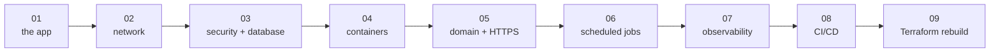
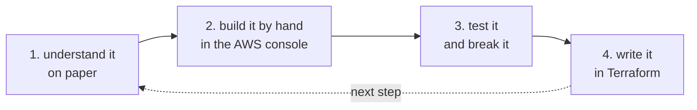

# The steps

This repo is built one step at a time. Each step adds one layer, and each step has its own branch and tag, so you can always jump to the end of any step and look around.

Do them in order. Every step expects that you finished the one before.



| Step | What you learn and build | Branch / tag | Status |
|---|---|---|---|
| [01](01-understand-the-application.md) | The application: what it does, how the pieces talk, how to run it | `step-01/initial-application` | ready |
| 02 | AWS network: VPC, subnets, route tables, internet and NAT gateways | `step-02/aws-network` | next |
| 03 | Security groups, the database on RDS, secrets | `step-03/security-and-database` | planned |
| 04 | Containers on ECS Fargate behind a load balancer | `step-04/containers-on-ecs` | planned |
| 05 | Domain name, HTTPS, CloudFront, WAF | `step-05/domain-https-cdn` | planned |
| 06 | Scheduled jobs with EventBridge Scheduler | `step-06/scheduled-jobs` | planned |
| 07 | Logs, metrics, alarms | `step-07/observability` | planned |
| 08 | CI/CD with GitHub Actions | `step-08/ci-cd` | planned |
| 09 | Tear it all down and rebuild it from zero with Terraform | `step-09/terraform-rebuild` | planned |

From step 02 on, each AWS step works the same way:



1. Understand the idea first, on paper.
2. Build it by hand in the AWS console, so you see every piece.
3. Test it, and break it on purpose to see what happens.
4. Write the same thing in Terraform.

To look at the finished state of a step:

```bash
git fetch --tags
git switch --detach step-01-initial-application
```

Go back to the latest version with `git switch master`.
