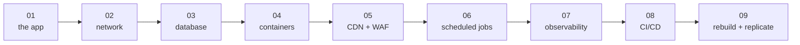
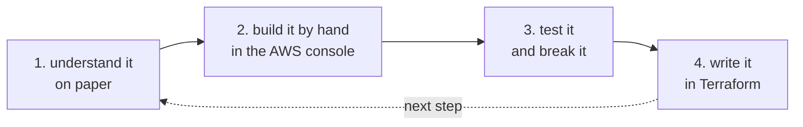

# The steps

This repo is built one step at a time. Each step adds one layer and has its own branch. Once a step is merged it also gets a tag and a checkpoint branch, so you can always jump to the end of any finished step and look around.

Do them in order. Every step expects that you finished the one before.



| Step | What you learn and build | Terraform stacks | Branch | Status |
|---|---|---|---|---|
| [01](01-understand-the-application.md) | The application: what it does, how the pieces talk, how to run it | | `step-01/initial-application` | done |
| [02](02-aws-network.md) | VPC, subnets, route tables, internet and NAT gateways, security groups, Terraform layout | `network`, `security` | `step-02/aws-network` | ready |
| [03](03-database-and-secrets.md) | RDS MySQL in isolated subnets, the password in Secrets Manager, reports on S3 | `data` | `step-03/database-and-secrets` | ready |
| [04](04-containers-on-ecs.md) | ECR, ECS Fargate, the API behind an internal load balancer, IAM roles for tasks | `registry`, `compute` | `step-04/containers-on-ecs` | ready |
| [05](05-cdn-and-waf.md) | CloudFront in front of S3 and the internal load balancer, WAF, HTTPS, optional domain | `edge` | `step-05/cdn-and-waf` | ready |
| [06](06-scheduled-jobs.md) | EventBridge Scheduler starting the check and rollup tasks | `jobs` | `step-06/scheduled-jobs` | ready |
| [07](07-observability.md) | Logs, metrics, alarms, a dashboard, email alerts | `observability` | `step-07/observability` | ready |
| [08](08-ci-cd.md) | GitHub Actions with OIDC: test, build, push, deploy | `cicd` | `step-08/ci-cd` | ready |
| [09](09-rebuild-and-replicate.md) | Make staging from values only, tear everything down, rebuild from zero | all | `step-09/rebuild-and-replicate` | ready |

Each step has a **workbook** next to its guide, in [docs/workbook](../workbook/README.md): checklists per phase, the Terraform commands in order with what you should see, blanks for values later steps need, and a session log. Read the guide, work through the workbook.

Also see the [learning path](../learning-path.md) (how to study this on your own), the [teaching guide](../teaching-guide.md) (running it as a course) and the [runbook](../runbook.md) (operating the finished system).

From step 02 on, each AWS step works the same way:



1. Understand the idea first, on paper, including what it costs in Tokyo.
2. Build it by hand in the AWS console, so you see every piece.
3. Test it, and break it on purpose to see what happens.
4. Delete the hand-built version and write the same thing in Terraform.

You run every AWS command yourself. The docs print the exact command and what you should see after it; nothing in this repo calls AWS on its own.

What the whole track costs, step by step: [costs.md](../costs.md).

## Checkpoints: the end of each step

Every finished step has two markers:

| Marker | Example | What it points at | Does it move? |
|---|---|---|---|
| tag | `step-01-initial-application` | the exact commit where the step was first merged | never |
| checkpoint branch | `checkpoint/step-01` | the end of the step **plus any fixes** found later for that step | only forward, only with fixes |

Why both? Step 01 was merged, and afterwards we found that a `.gitignore` rule had kept the `internal/reports` package out of git, so a fresh clone did not build. The tag still points at the broken commit, on purpose: it is history. `checkpoint/step-01` points at the fixed version. **To start a step, use the checkpoint of the step before it.** Checkpoints are created when a step is merged into `master`; a step that is still a pull request has only its branch.

```bash
git fetch --all --tags
git switch -c my-step-02 checkpoint/step-01     # start step 02 from a working step 01
git switch --detach step-01-initial-application  # look at step 01 exactly as first merged
```

Go back to the latest version with `git switch master`.

A checkpoint never gets features from a later step. If a fix lands on `master` after step 03 is merged, and the bug belongs to step 02, the fix is cherry-picked onto `checkpoint/step-02` too. [CONTRIBUTING.md](../../CONTRIBUTING.md#checkpoints) has the commands.
