# Episode 0: Design before code

*From Laptop to Tokyo, part one. About 10 minutes.*

> Zayn had the Terraform open in one window and an AI assistant in the other. In twenty minutes the assistant had written a VPC, three kinds of subnets, a NAT gateway and a database. It all looked right.
>
> "Done," Zayn said. "Do you want to review it before I apply?"
>
> Kian scrolled for a while. "Why two NAT gateways?"
>
> "It said that's best practice."
>
> "It is, sometimes. It's also $98 a month before the app has done a single thing. What happens to the app if you only have one?"
>
> Zayn opened their mouth and closed it again.
>
> "That's not a Terraform question," Kian said. "The code is fine. I just don't know yet whether it's the right code, and neither do you. Let's close the editor for a bit."

## What this series is about

For a long time, the hard part of putting an app on AWS was the typing. You had to learn a lot of syntax and a lot of API names before anything worked. Today an assistant writes that code faster than you can read it, and it usually runs.

What it can't do is make the decisions for you. Every line of infrastructure code carries a choice somebody made: this runs in two zones, not three; the database has no route to the internet; the check job starts a fresh container every minute instead of running forever. If you don't know why those choices were made, you can't tell whether the code in front of you is right for your app, and you can't fix it at 3 a.m. when it isn't.

So this series stays away from the code. We follow Zayn and Kian as they take one small app from a laptop to AWS in Tokyo, and we look at the questions they ask on the way. The Terraform for everything exists in this repo, and each episode links to it. You won't need it to follow along.

## What we mean by system thinking

People use "system thinking" to mean a lot of things. In this series it means five habits, and you'll see them in every episode.

Start from what the app needs, not from the service list. AWS has more than two hundred services. We don't pick any of them until the app gives us a reason. The first two episodes are only about the app and its requirements, and there's no AWS in them at all.

Draw the boundaries. Where does each piece live, and who is allowed to reach it? Most security problems on AWS come from a boundary nobody drew on purpose.

Follow the data. Pick one piece of data and trace it from the moment it's created to the moment it's deleted. You'll find the pieces you forgot.

Ask what breaks. Every part will fail one day. The useful question is what the user sees when it does, and whether that's acceptable. Sometimes it is. A good design fails in ways you picked in advance.

Put a price on it. A design without a cost is a wish. Every episode says what its part costs per month in Tokyo, and what we'd have to pay to make it more reliable.

There's one more habit that runs under all of them: write down what you didn't choose, and when you'd change your mind. This repo keeps those notes as ADRs (architecture decision records, short files that each hold one decision). We quote them a lot.

## How the series is built

```mermaid
flowchart LR
    subgraph one["Part one: know what you're building"]
        e1["1 · the app"] --> e2["2 · what good means"] --> e3["3 · the laptop version"]
    end
    subgraph two["Part two: one domain at a time"]
        e4["4 · leaving the laptop"] --> e5["5 · network"] --> e6["6 · identity"] --> e7["7 · data"] --> e8["8 · compute"]
        e8 --> e9["9 · front door"]
        e8 --> e10["10 · timers"]
        e9 --> e11["11 · observability"]
        e10 --> e11
        e11 --> e12["12 · delivery"]
    end
    subgraph three["Part three: put it together"]
        e13["13 · the whole picture"] --> e14["14 · 10x and 100x"]
    end
    e3 --> e4
    e12 --> e13
    classDef compute stroke:#ED7100,stroke-width:2px
    classDef jobs stroke:#E7157B,stroke-width:2px
    classDef database stroke:#C925D1,stroke-width:2px
    classDef network stroke:#8C4FFF,stroke-width:2px
    classDef security stroke:#DD344C,stroke-width:2px
    class e5,e9 network
    class e6 security
    class e7 database
    class e8 compute
    class e10,e11 jobs
```

*Read it left to right. Part two follows the order you'd build things in: nothing can run before it has a network, and nothing should run before we know who's allowed to do what.*

Part one looks at the app on its own. Part two goes through one domain at a time: network, identity, data, compute, the front door (DNS, certificates and the CDN), scheduled work, observability and delivery. Part three puts the pieces together into one picture with one monthly bill, and then asks what would change if the app had to handle ten or a hundred times the load.

Each domain episode has the same shape. A short scene sets up the question. We explain the idea in plain words before any AWS name appears, because the idea outlives the service. Then comes the AWS answer with diagrams, the Tokyo price, what we didn't pick, a "what breaks if" thought experiment, a few questions to check yourself, and a link to the hands-on step if you want to build it.

## Why Tokyo

Most of the clients this series was written for are in Japan, and so are their users. Tokyo (`ap-northeast-1`) is a few milliseconds away from them, keeps the data in the country, and is where most of our real projects run. It's also 20 to 30% more expensive than `us-east-1`, and some things (CloudFront's certificates and firewall) still have to live in `us-east-1` anyway. We'll get to why in episode 9.

All prices in the series are Tokyo list prices in US dollars, checked in September 2026, without the 10% Japanese consumption tax. They come from [costs.md](../costs.md). Prices move, so check them before you plan a real budget.

## What you need

Curiosity, and some patience with questions that don't have one right answer. You don't need an AWS account to read the series. If you want to build along, each episode ends with a link to the matching step guide, which walks you through it by hand in the console first and then in Terraform.

> "So what do we do first?" Zayn asked.
>
> "You tell me what your app does," Kian said. "Properly. Like I've never seen it."

Next: [Episode 1: Meet the app](01-meet-the-app.md)
