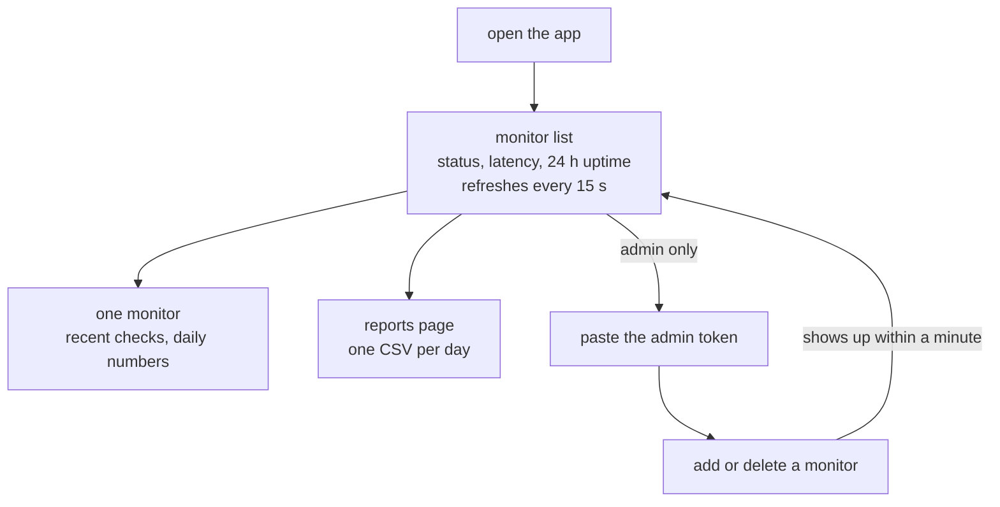
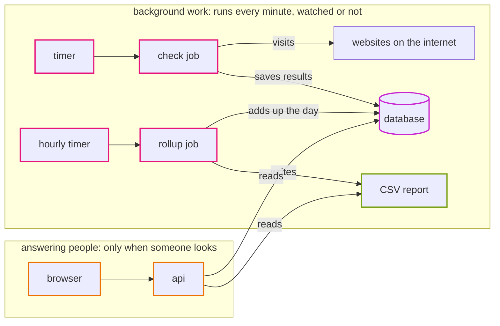
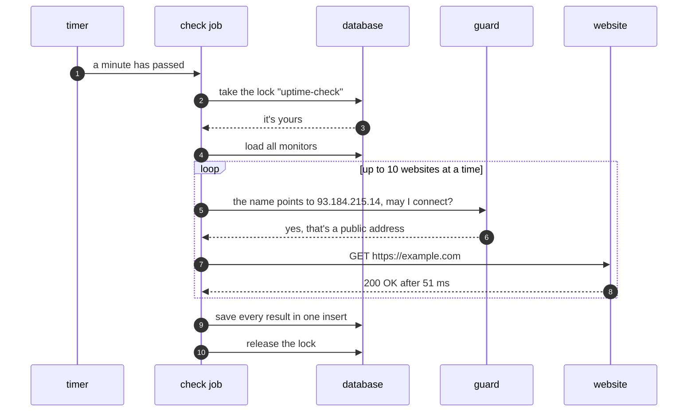
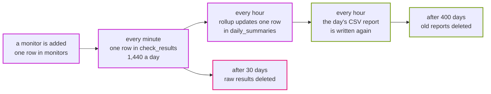

# Episode 1: Meet the app

*From Laptop to Tokyo, part one. About 15 minutes.*

> "It's an uptime monitor," Zayn said. "You add a website, it checks it every minute, and you see if it's up."
>
> "Who's 'you'?"
>
> "Whoever opens the page."
>
> "Anyone? Can anyone add websites, too?"
>
> "No, that needs the admin token. Everyone else just looks."
>
> Kian wrote *two kinds of people* on the whiteboard. "And when nobody has the page open?"
>
> "The checks keep running. That's the whole point of it."
>
> Kian wrote *two kinds of work* under the first line. "Then walk me through one check. From the timer to the screen. Don't skip the boring parts."

## The whole app in one sentence

You give it web addresses, it checks them every minute, and it shows you which ones are up.

If you can't say what an app does in one sentence, you'll struggle to decide what matters when you design where it runs. The rest of this episode fills in the details behind that sentence.

## Who uses it

A viewer opens the page to see what's up and what's down. There's no login. The list refreshes itself every 15 seconds. A viewer can click into one monitor to see its recent checks and daily numbers, or open the reports page and download a day's CSV file.

An admin can do all of that, and can also add and delete monitors, after pasting an admin token (a long secret string) into a box in the corner. There are no user accounts, just one token that protects every change. That's fine for a learning app and not fine for a real product, and [ADR 0001](../adr/0001-uptime-monitor-as-sample-app.md) says so.

*Every path a viewer can take only reads. The one path that changes anything needs the token.*

## The four pieces

| Piece | What it does |
|---|---|
| web | the pages you see: a React app running in the browser |
| api | a Go program that answers the web app's questions with data |
| database | MySQL, holding every monitor, check result and daily summary |
| scheduler | runs two jobs on a timer: check visits every website, rollup adds up each day |

The api and the jobs are the same Go program. The first word on the command line picks what it does: `uptime api`, `uptime check`, `uptime rollup`, and a few others. So there's one program to build, one container image to scan and one version to deploy, and that makes a lot of later decisions simpler ([ADR 0002](../adr/0002-one-backend-image-many-commands.md)).

## Two kinds of work

This is the most useful thing to notice about Uptime: it does two very different kinds of work, and they only meet in the database.

*One half writes, the other half reads, and the database is the only thing both touch.*

The background half runs whether anyone is looking or not. Every minute the check job visits every website and writes down what happened; every hour the rollup job adds up the day. (On the laptop, rollup runs every five minutes so you can watch it work.) If this half stops, nobody notices for a while. The history just quietly gets a hole in it.

The answering half only does something when a person opens the page. Most of the day it's idle. When it breaks, people notice immediately, because they see an error.

Most web apps are almost all answering work. Uptime's most important work is the background half, and that half calls out to the internet on its own. That one fact shapes more of the AWS design than anything else in the app. It's why we'll need a way for private machines to reach the internet (episode 5), a scheduler (episode 11), and an alarm that fires on silence (episode 12).

## Life of one check

The walk Kian asked for:

*People usually leave steps 2 and 3 out when they draw this. They're what stops two checks from ever running at once.*

The lock is the part to remember. Before doing anything, the check job asks MySQL for a named lock. If the previous check is still running, the lock is taken, and this one skips its turn. The job then visits up to 10 websites at a time, with 10 seconds allowed for each, and writes down the result: up or down, status code, how long it took, and the error if there was one. Everything is saved in one insert.

Then someone opens the page. The browser asks the api for the monitors, the api asks the database for each one's newest result and its uptime over the last 24 hours, and React draws the table. Fifteen seconds later the browser asks again.

## Follow the data

Pick one piece of data and follow it for its whole life. You'll find things a diagram of boxes never shows.

*Each monitor creates 1,440 rows a day. Most of what happens after the second box is there to keep that number under control.*

A monitor is a single row. Every check adds a row to `check_results`, so each monitor adds 1,440 rows a day, and that table would grow forever without the rollup job. Rollup adds each day into one row per monitor in `daily_summaries`, writes a CSV report, and deletes raw results older than 30 days. On AWS, reports older than 400 days are deleted too ([ADR 0010](../adr/0010-reports-on-s3.md)).

Rollup is safe to run as often as you like. Each summary row is replaced, never added twice: the table's key is the monitor plus the day, and the save says "if the row exists, update it." Every run also redoes yesterday, so checks that landed just before midnight still count. A job you can run twice with the same result is called idempotent. That property matters in episode 11, when a scheduler we don't control starts our jobs.

## The one thing it must never do

Anyone with the admin token picks a URL, and our server goes and visits it. Now imagine someone adds the database's address, or an address inside our network that hands out credentials. Our server would visit it for them. This attack is called SSRF (server-side request forgery).

So the check job refuses private and internal addresses, and the timing matters. It checks the actual IP address the name resolved to, right before connecting. Checking the text of the URL wouldn't be enough, because `sneaky.example.com` can point at `10.0.0.5`. The code lives in `app/backend/internal/netguard`, and every outbound request goes through it. Remember it for episode 5, where a firewall rule will look far too permissive until you know this guard exists.

## Alive isn't the same as ready

The api answers two small status questions. `GET /api/health` asks whether the process is alive, and never touches the database. `GET /api/ready` asks whether it can do real work, and pings the database to find out.

In episode 8, a load balancer will ask one of them every 15 seconds and replace any container that fails. If it asked `ready`, a ten-second database hiccup would make every container look broken at the same moment, and they'd all be replaced together, turning a small problem into an outage. So the load balancer asks `health`, and `ready` is there for people and for monitoring.

## What the app needs from any home

Before we pick a single cloud service, here's what this app needs from wherever it runs. Every episode in part two exists to meet one of these.

| The app needs to | Domain | Episode |
|---|---|---|
| take requests from browsers | front door, network | 5, 9, 10 |
| call any website from inside our network | network | 5 |
| keep two secrets: the database password and the admin token | identity and secrets | 6 |
| keep rows safely, and keep files | data | 7 |
| run the api all the time | compute | 8 |
| run check every minute and rollup every hour | scheduled work | 11 |
| tell us when the background half stops | observability | 12 |

The list is interesting for what it leaves out: user accounts, search, a message queue, a cache. The app doesn't need any of them, so the design won't include them.

Why an uptime monitor at all? Because it makes every part earn its place. A to-do app never calls the internet and has no background job, so half the architecture would be pretend. Here, the check job really needs outbound internet from a private network, rollup really writes files, and user-chosen URLs are a real security problem. And everyone understands "is the site up?" without an explanation.

## Check yourself

1. The database stops answering for five minutes, then comes back. What does each half of the app do, and what's lost for good?
2. A colleague suggests the load balancer should check `/api/ready`, "because it's more thorough." What do you tell them?
3. An admin adds `http://internal-dashboard.example.com`. The name looks public. What does the check job do, and why?

Answers

1. The answering half: `/api/health` stays `200`, `/api/ready` says `503`, and the page loads but the list fails until the database is back. The background half: checks can't take the lock or save results, so about five minutes of results are missing for good. The next rollup adds up whatever is there.
2. That a short database hiccup would fail every container's check at once, and they'd all be replaced together. The load balancer should only ask "is this process alive?"
3. It resolves the name first. If the address is private (say `10.0.3.7`), the guard refuses the connection and the check is saved as an error. If it's public, the check goes ahead. The text of the URL doesn't decide anything.

## Try it

Run the app on your laptop and follow one check yourself: [Step 01: Understand the application](../steps/01-understand-the-application.md). It takes about an hour and only needs Docker. [How the app works](../app/how-it-works.md) has more detail on each piece.

> Kian looked at the board. Two kinds of people, two kinds of work, one database in the middle.
>
> "How many websites does the client want to watch?"
>
> Zayn checked the email. "They didn't say."
>
> "Then that's the next thing we find out. Ten and ten thousand are different systems."

**Next:** [Episode 2: What good means](02-what-good-means.md)
