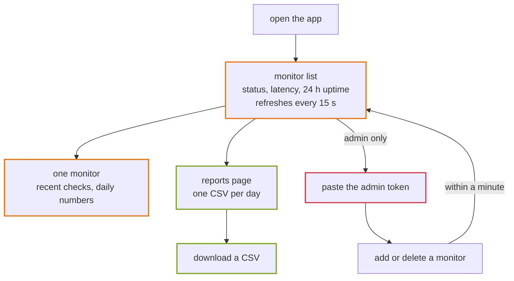
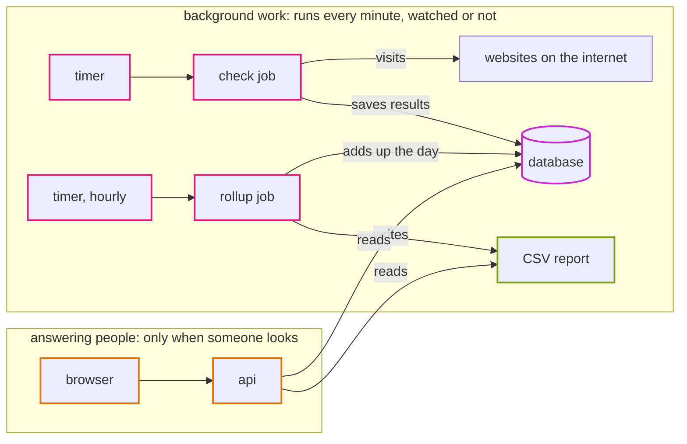
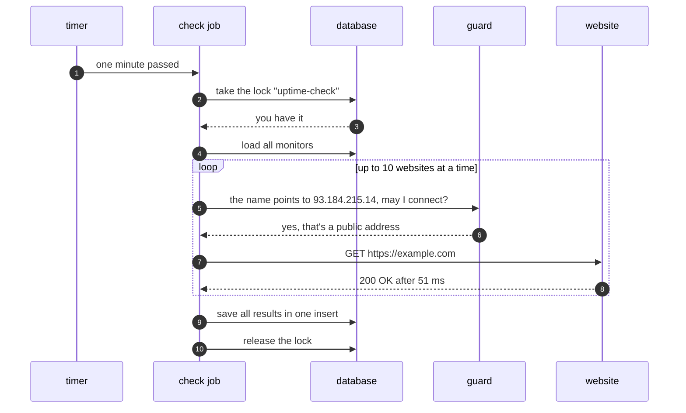
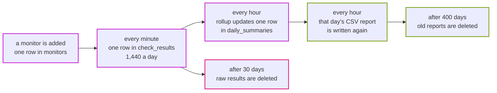
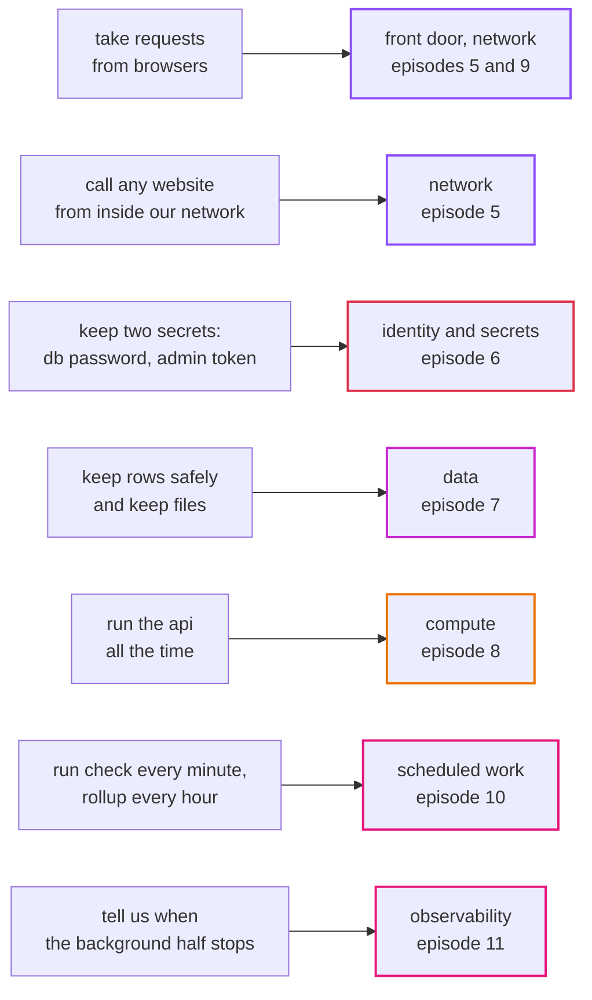

# Episode 1: Meet the app

*From Laptop to Tokyo, part one. About 15 minutes.*

> "It's an uptime monitor," Zayn said. "You add a website, it checks it every minute, and you see if it's up."
>
> "Who's 'you'?"
>
> "Whoever opens the page."
>
> "Anyone? Can anyone add websites too?"
>
> "No, you need the admin token for that. Everyone else just looks."
>
> Kian wrote *two kinds of people* on the whiteboard. "And when nobody has the page open, does anything happen?"
>
> "Sure. The checks keep running. That's the whole point."
>
> Kian wrote *two kinds of work* under it. "Then that's where we start. Walk me through one check, from the timer to the screen. Don't skip anything."

## The whole app in one sentence

You give it web addresses, it checks them every minute, and it shows you which ones are up.

That sentence is short on purpose. If you can't describe an app in one sentence, you'll have a hard time deciding what matters when you design where it runs. Everything else in this episode fills in the details.

## Who uses it

Two kinds of people use Uptime, and they want different things.

A viewer opens the page to see what's up and what's down. There's no login. The list refreshes itself every 15 seconds, and a viewer can click into one monitor to see its recent checks and daily numbers, or open the reports page and download a CSV file for a day.

An admin does everything a viewer does, and can also add and delete monitors. To do that they paste an admin token (a long secret string) into a box in the top corner. There are no user accounts. One token protects every write. That's enough for a learning app and not enough for a real product, and [ADR 0001](../adr/0001-uptime-monitor-as-sample-app.md) says so plainly.

*A viewer only ever goes down the left side. The admin path is short, and it's the only one that changes anything.*

## The four pieces

Uptime is built from four pieces. You'll meet them again in every episode, in a new place each time.

| Piece | What it does |
|---|---|
| web | the pages you see, a React app in the browser |
| api | a Go program that answers the web app's questions with data |
| database | MySQL, which keeps every monitor, every check result and every daily summary |
| scheduler | runs two jobs on a timer: **check** visits every website, **rollup** adds up each day |

The api and the scheduler's jobs are the same Go program. You pick what it does with the first word on the command line: `uptime api`, `uptime check`, `uptime rollup`, and a few more. There's one program to build, one image to scan and one version to deploy. Keep that in mind, because it makes a lot of later decisions simpler. [ADR 0002](../adr/0002-one-backend-image-many-commands.md) explains the choice.

## Two kinds of work

Here's the most useful thing to notice about this app. It does two very different kinds of work, and they only meet in the database.

*The top half writes. The bottom half reads. The database is the only thing both halves touch.*

The background work runs whether anyone is watching or not. Every minute, the check job visits every website and writes down what happened. Every hour, the rollup job adds up the day. If this half stops, nobody notices right away, and that makes it dangerous. The history just quietly gets a hole in it.

The answering work only happens when someone opens the page. Most of the day it does nothing. When it breaks, people notice at once, because the page shows an error.

Most web apps are all answering work: requests come in, answers go out. Uptime is unusual because its most important work is the background half, and because that half makes its own calls out to the internet. That one fact will decide more of our AWS design than anything else. It's why we'll need a way for private machines to reach the internet (episode 5), a scheduler (episode 10), and an alarm that fires on silence (episode 11).

## Life of one check

Let's follow one check from the timer to the screen, the way Kian asked.

*Steps 2 and 3 are the part people skip when they draw this. They're also the part that keeps two checks from ever running at the same time.*

1. The timer fires once a minute.
2. The check job asks the database for a lock called `uptime-check`. If the last check is still running, it doesn't get the lock, and it skips this turn. Two checks never overlap.
3. It loads every monitor.
4. It visits up to 10 websites at the same time, with a 10-second limit on each visit.
5. Before each visit, a guard looks at the real IP address the name points to and refuses private addresses. More on that below.
6. It writes down what happened: up or down, the status code, how long it took, and the error if there was one.
7. It saves all results in one insert and releases the lock.

Then someone opens the page. The browser asks the api for the list of monitors, the api asks the database for each monitor's newest result and its uptime over the last 24 hours, and React draws the table. Fifteen seconds later, it asks again.

## Follow the data

Now pick one piece of data and follow it for its whole life. This habit finds problems that no diagram of boxes will show you.

*One monitor creates 1,440 rows a day. Everything after the second box exists to keep that number under control.*

A monitor is one row in the `monitors` table. Every check adds a row to `check_results`, so one monitor adds 1,440 rows a day. That's the table that grows, and it's why the rollup job exists: it adds each day's results into one row per monitor in `daily_summaries`, writes a CSV report, and deletes raw results older than 30 days. On AWS, reports older than 400 days are deleted too ([ADR 0010](../adr/0010-reports-on-s3.md)).

Two details make the rollup job safe to run as often as you like. Each summary row is replaced, never added twice: the table's key is the monitor and the day, and the save says "if this row exists, update it". And every run redoes yesterday as well as today, so checks that landed just before midnight still get counted. A job you can run twice without harm is called *idempotent*. We'll lean on that in episode 10, when a scheduler we don't control starts the jobs for us.

## The one thing it must never do

Anyone with the admin token picks a URL, and our server goes and visits it. Think about that for a second. What if someone adds the database's address? Or an address inside our own network that hands out credentials? Our server would visit those places for them. This attack is called SSRF, server-side request forgery.

So the check job refuses private and internal addresses. The important part is *when* it checks: right before connecting, on the real IP address the name resolved to. Checking the text of the URL isn't enough, because `sneaky.example.com` could point at `10.0.0.5`. The guard lives in `app/backend/internal/netguard`, and every outbound request goes through it.

Keep this one in your pocket. In episode 5 we'll allow the check job to connect to any port on the internet, and it will look like a hole in the firewall. It isn't, and this guard is the reason.

## Alive is not the same as ready

The api answers two small status questions:

- `GET /api/health` asks "is the process alive?" It never touches the database.
- `GET /api/ready` asks "can it do real work?" It asks the database for a ping.

That looks like a detail. It isn't. In episode 8, a load balancer will ask one of these every 15 seconds and replace any container that fails. If it asked `ready`, a ten-second database hiccup would make every container look broken at once, and they'd all be replaced together. A small problem would turn into a full outage. So the load balancer asks `health`, and `ready` is for people and for monitoring.

## What the app asks of any home

Before we pick a single cloud service, here's what this app needs from wherever it runs. Everything in part two exists to meet one of these needs.

*Every need on the left comes from something we saw in the app. Not one of them comes from a service list.*

Notice what isn't on the list. No user accounts, no search, no message queue, no cache. The app doesn't need them, so the design won't have them. Adding things because "real systems have them" is how small apps end up with big bills.

## Why an uptime monitor at all

This app was picked on purpose, and it's worth saying why. A to-do app has no background job and never calls the internet, so half the architecture would be pretend. Uptime makes every part earn its place: the check job really needs outbound internet from a private network, the rollup really writes files, and user-chosen URLs create a real security problem. Everyone understands "is the site up?" without an explanation. [ADR 0001](../adr/0001-uptime-monitor-as-sample-app.md) has the options that lost.

## What breaks if the database disappears for five minutes

Try this before reading on. The database stops answering for five minutes and then comes back. What does each half of the app do?

What happens

The answering half: `/api/health` still says `200`, because the process is fine. `/api/ready` says `503`. The page loads but the list fails. When the database is back, the api reconnects by itself.

The background half: each check can't get its lock or save its results, so about five minutes of check results are simply missing. Nobody gets them back. The hourly rollup, when it next runs, adds up whatever is there, so the day's uptime is calculated from fewer checks.

Is that acceptable? For this app, probably yes. Five missing minutes in a month of history is a small gap. But you can only say "yes" if you asked the question, and episode 2 is where we ask it properly.

## Check yourself

1. Which piece of the app talks to the internet on its own, without anyone asking it to?
2. Why can the rollup job safely run twice in the same hour?
3. Why does the guard check the IP address and not the URL text?
4. A load balancer checks `/api/ready` and the database has a 10-second hiccup. What goes wrong?
5. The two halves of the app share one thing. What is it, and why does that matter?

Answers

1. The check job. It visits every website every minute, and it's the reason the design will need outbound internet access from a private network.
2. Each summary row is replaced, not added again, because the table's key is the monitor and the day. Running it twice gives the same result as running it once.
3. A harmless-looking name can point at a private address. Only the address the name resolves to, checked right before connecting, tells the truth.
4. Every api container fails the check at the same moment, so they're all treated as broken and replaced together. A short hiccup becomes an outage.
5. The database. If it's slow or gone, both halves suffer, so its design (episode 7) matters more than anything else in the data layer.

## Try it

Run the app on your laptop and follow one check yourself: [Step 01: Understand the application](../steps/01-understand-the-application.md). It takes about an hour, needs only Docker, and the workbook has the commands in order. For more detail on each piece, read [how the app works](../app/how-it-works.md).

> Kian looked at the whiteboard. Two kinds of people, two kinds of work, one database in the middle.
>
> "Good. Now, how many websites?"
>
> "What do you mean?"
>
> "The client. How many websites do they want to watch? Ten? Ten thousand? It changes everything."

Next: [Episode 2: What good means](02-what-good-means.md)
