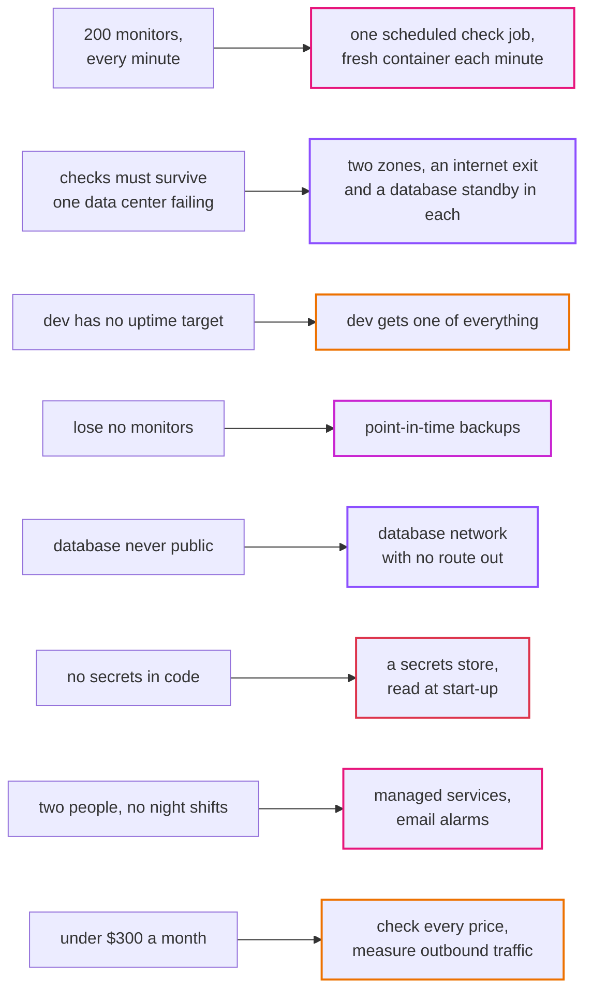

```mermaid
flowchart LR
    down["site goes down"] -- "up to 60 s<br/>until the next check" --> due["check is due"]
    due -- "20 to 60 s<br/>container starts" --> run["check runs"]
    run -- "a few seconds" --> saved["result saved"]
    saved -- "up to 15 s<br/>page refresh" --> seen["someone sees it"]
    classDef jobs stroke:#E7157B,stroke-width:2px
    classDef compute stroke:#ED7100,stroke-width:2px
    classDef database stroke:#C925D1,stroke-width:2px
    class due,run jobs
    class saved database
    class seen compute
```

# Episode 2: What good means

*From Laptop to Tokyo, part one. About 20 minutes.*

> The client's email was four lines long.
>
> *We look after about 200 websites for our customers. We want to know within a few minutes when one goes down. Keep a month of detail and a year of daily reports. Production shouldn't cost more than about $300 a month.*
>
> "That's it?" Zayn said. "That's not much to go on."
>
> "It's more than most people get," Kian said. "There are four numbers in there. Let's see what each one does to the design, and then let's find the numbers they forgot to give us."
>
> "Such as?"
>
> "Such as what happens when we're down. They didn't say, so they'll assume never. We'd better decide what we can promise before someone else decides it for us."

## Two kinds of requirements

Episode 1 was about what the app does: add monitors, check them, show results, write reports. Those are the functional requirements, and they barely change when you move from a laptop to the cloud.

This episode is about the other kind: how well it has to do those things. How many, how fast, how often it may be down, how much data it may lose, how much it may cost. These are called non-functional requirements, or quality attributes. They're the ones that decide the architecture. Two apps with the same features and different quality requirements can end up looking nothing alike.

The trouble is that clients rarely state them. If you don't ask, they end up as surprises later. So we go through them one at a time, write a number down for each, and say which part of the design that number pushes on.

## Back-of-the-envelope numbers

You don't need a spreadsheet for this. You need a few multiplications and the honesty to write down what you're guessing. Here's the one number the client gave us that drives everything else: 200 monitors, checked once a minute.

### How many checks

```
checks per day   = 200 monitors x 1,440 minutes          = 288,000
checks per month = 288,000 x 30.4 days                    = about 8.75 million
```

That's also the number of rows written to `check_results`, and the number of outbound requests leaving our network. Keep it in mind, because it's going to come back three times.

### How long one check run takes

The check job visits 10 websites at a time, and gives each one up to 10 seconds.

```
typical run  = 200 monitors / 10 at a time x 0.2 s per site  = about 4 seconds
worst case   = 200 monitors / 10 at a time x 10 s timeout    = 200 seconds
```

The typical case is easy. The worst case is the interesting one. If a lot of sites are slow at the same time (a big hosting company has a bad hour, say), one run takes more than a minute. The next run finds the lock taken and skips its turn. Nothing breaks and nothing is counted twice, but a few minutes of checks are thinner than usual.

We accept that at 200 monitors. We also now know where the design's first limit is: somewhere in the low thousands of monitors, one check job every minute stops being enough, and the answer is a queue with several workers. [ADR 0001](../adr/0001-uptime-monitor-as-sample-app.md) already says so. Episode 14 comes back to it.

### How much data

A row in `check_results` is small: a few numbers, a timestamp, and an error message that's usually empty. Call it about 100 bytes with its index. We keep 30 days of raw results.

```
rows kept    = 8.75 million a month, 30 days' worth
storage      = 8.75 million x 100 bytes                   = under 1 GB
summaries    = 200 rows a day, 73,000 a year               = a few MB
reports      = one CSV a day, about 10 KB                  = about 4 MB for 400 days
```

Under a gigabyte of real data. The smallest database disk we'd buy anyway is 20 GB. Storage isn't where this design gets hard, and it's useful to know that early so we don't spend time on it.

### How many people read it

The client's staff watch the list. Say five people have the page open during the working day. The page asks for new data every 15 seconds.

```
reads = 5 people x 4 requests a minute                     = 20 requests a minute
```

That's one request every three seconds. The smallest container we can rent can handle it many times over. The answering half of the app is tiny.

### How much goes out through the network

Here's the one that surprised us. The check job doesn't only look at the status code: it reads up to 1 MB of each page, so the timing includes the download (`app/backend/internal/checker/checker.go`). Every one of those bytes comes back in through our network's exit point, and on AWS that exit point charges per gigabyte. We'll meet it in episode 5 as the NAT gateway, at $0.062 per GB in Tokyo.

```
if the average page is 20 KB:  8.75 million x 20 KB  = about 175 GB a month  = about $11
if the average page is 100 KB: 8.75 million x 100 KB = about 875 GB a month  = about $54
```

We don't know the average page size of the client's 200 sites. Nobody does yet. But that's a range from $11 to $54 a month, on a $300 budget, driven by one line of code. The repo's cost sheet ([costs.md](../costs.md)) was worked out for a handful of test monitors and doesn't include it.

So we write it down as an open question: measure the real traffic once the app runs (episode 11 shows where), and if it's high, change the check to read less of each page. A code change that saves money on infrastructure is exactly the kind of decision this series is about.

## The numbers they forgot to give us

### How fresh is "within a few minutes"?

The client wants to know within a few minutes when a site goes down. Let's add up the delays:



*The worst case is a bit over two minutes. The second box is a cost of the design choice in episode 10, and we'll see why it's worth paying.*

About two minutes in the worst case. That meets "a few minutes", and it tells us something else: we don't need checks every ten seconds, so we don't need an always-on worker for them. A fresh container every minute is fine.

### How often may it be down?

"Never" isn't a number. A common way to talk about this is a percentage of time the system works, over a month of 730 hours:

| Target | Down time allowed per month |
|---|---|
| 99% | about 7.3 hours |
| 99.5% | about 3.7 hours |
| 99.9% | about 44 minutes |
| 99.99% | about 4.4 minutes |

Each extra nine costs a lot more than the one before. 99.99% means surviving almost any single failure without a human, which means two of everything in two places, and people on call.

Here's where episode 1 pays off. The app has two halves, and they don't need the same target.

The background half (the checks) is what the client is really paying for. If it stops, the history gets a hole and nobody is told a customer's site went down. For production we want it to keep running when one data center fails. That's a real requirement, and it will cost money in several places: a second exit to the internet (episode 5) and a standby database (episode 7).

The answering half (the page) matters less than you'd think. If it's down for ten minutes but the checks keep running, nothing is lost. The history is complete, and the page catches up when it comes back. We'll aim for the page to survive the same single-data-center failure, since it's cheap to do (two small containers instead of one), but we won't pay for more than that.

And the development environment gets no target at all. If dev is down for a day, nobody outside the team cares. That one decision cuts the dev bill roughly in half.

### How much data may we lose?

Two more numbers people forget. RPO (recovery point objective) is how much recent data you can afford to lose. RTO (recovery time objective) is how long you can afford to take to get back.

| Data | Can we lose the last few minutes? | Why |
|---|---|---|
| the monitor list | no | the admin typed it by hand; it's small and precious |
| check results | yes | a few missing minutes in a month of history is a small gap |
| daily summaries and reports | mostly | rollup rebuilds today and yesterday from the results every hour |

So the database needs backups we can restore to a point in time, and in production a copy in a second data center that takes over by itself in a minute or two. We'll build exactly that in episode 7. What we won't build is a copy in a second region. If all of Tokyo is lost, getting back will take hours, and we'll say so out loud instead of pretending otherwise.

### What must never happen

Some requirements aren't numbers. They're lines we won't cross, and writing them down now stops them from being traded away later for convenience:

- The database is never reachable from the internet, not even by mistake.
- No password or token is ever stored in code, in config files in git, or in the infrastructure tool's records.
- The check job never visits a private address (the guard from episode 1).
- Every part of the system can do only what it needs, and nothing else.

### Who runs it

Two people, neither of whom wants to be woken up at night to patch a server. That's a requirement too, and a big one. It pushes us toward services where AWS does the patching, the backups and the restarts, even when they cost a bit more than doing it ourselves. It also means alerts go to email, not to a pager rota, and that the system should fix most problems on its own before a human is needed.

### Where it runs

Users and data are in Japan. That points at Tokyo, and episode 4 goes into what that choice costs.

## From requirements to decisions

Put it all together and each requirement starts pushing on the design. This is the whole point of the exercise: every later decision should trace back to something on this page.



*Left: what the client needs, including the parts they didn't say. Right: what that forces us to build. Nothing on the right exists without a reason on the left.*

## What it costs

We can't price the design before we've designed it, but we can check the budget is realistic. The finished system in this repo costs about $120 a month for dev and about $253 a month for production in Tokyo ([costs.md](../costs.md)). Production is more than twice dev almost entirely because of the "survive one data center failing" requirement: a second internet exit, a standby database and a second api container.

Add the $11 to $54 of outbound traffic we found above, and production lands between about $265 and $305. That's right at the edge of the client's $300. It's good to know that now, not after the first bill. It's also a good reason to measure the traffic early.

## What we didn't design for

Just as useful as what we'll build is what we won't:

- Thousands of monitors. The single check job has a ceiling. We'll show what replaces it in episode 14, but we won't pay for it now.
- Losing all of Tokyo. Backups stay in the same region. Recovering from a regional disaster would take hours, and would need a second region we don't have.
- User accounts. One admin token, as the client agreed.
- Checks faster than once a minute. The client said "a few minutes", and faster checks would change the whole job design.

Each of these is a line in a document somewhere, with the reason. If the client asks for one of them later, we know what it will cost to change.

## What breaks if the client triples the monitors

Next spring the client takes on another agency's customers, and the list goes from 200 to 600 monitors overnight. Which of our numbers change, and does anything break?

<details>
<summary>What happens</summary>

Checks per month go to about 26 million. The typical check run goes from about 4 seconds to about 12. Still fine.

The worst case goes from 200 seconds to 600. Slow hours now skip a lot of runs, so the history during a bad hour gets noticeably thin. That's the first thing to watch.

Stored rows go to about 26 million, still around 3 GB. The database doesn't care.

Outbound traffic triples, to somewhere between $33 and $160 a month. That's the number that could break the budget, which is why measuring it and reading less of each page matter so much.

Nothing breaks on day one. But you can see which two numbers you'd watch, and that's exactly what a design review should tell you.

</details>

## Check yourself

1. Why do the two halves of the app get different availability targets?
2. The check job's worst case is 200 seconds, but checks are every 60 seconds. Why isn't that a bug?
3. Which requirement makes production cost about twice as much as dev?
4. What's the difference between RPO and RTO?
5. Why does "two people, no night shifts" count as an architecture requirement?

<details>
<summary>Answers</summary>

1. They fail differently. If the page is down, nothing is lost; the history is intact when it comes back. If the checks stop, the history gets holes and nobody is warned. The client is paying for the checks.
2. The lock. A run that finds the lock taken skips its turn, so nothing overlaps or doubles. We lose resolution during a bad hour, which is acceptable at 200 monitors and would stop being acceptable at a few thousand.
3. Surviving the loss of one data center. It needs a second internet exit, a standby database and a second api container.
4. RPO is how much recent data you can afford to lose. RTO is how long you can afford to take to recover.
5. It rules out anything we'd have to patch, babysit or restart by hand, and pushes us toward managed services and self-healing designs, even when they cost a little more.

</details>

## Try it

There's nothing to build in this episode, but there's something to measure. With the app running locally ([Step 01](../steps/01-understand-the-application.md)), add ten real websites and look at how long a check run takes in the scheduler's logs (`make logs s=scheduler`). Then open [costs.md](../costs.md) and find the three biggest numbers in the dev column. By the end of the series you'll know why each one is there.

> "So we can do it for $300," Zayn said.
>
> "Probably. If the pages are small." Kian put the pen down. "Now show me how it runs today. On your laptop. Every container."

Next: [Episode 3: The laptop version](03-the-laptop-version.md)
