# Episode 2: What good means

*From Laptop to Tokyo, part one. About 18 minutes.*

> The client's reply was four lines long.
>
> *We look after about 200 websites for our customers. We want to know within a few minutes when one goes down. Keep a month of detail and a year of daily reports. Production shouldn't cost more than about $300 a month.*
>
> "That's it?" Zayn said. "That's not much to go on."
>
> "It's more than most people get," Kian said. "There are four numbers in there. Let's see what each one does to the design. Then we find the numbers they forgot."
>
> "Such as?"
>
> "Such as how often we're allowed to be down. They didn't say, so they'll assume never."

## Two kinds of requirements

Episode 1 covered what the app does: add monitors, check them, show results, write reports. Those are functional requirements, and they barely change when the app moves from a laptop to the cloud.

This episode is about how well it has to do those things: how many, how fast, how often it may be down, how much data it may lose, what it may cost. These are non-functional requirements, sometimes called quality attributes. They decide the architecture. Two apps with identical features and different quality requirements can end up looking nothing alike.

Clients rarely state them, and when you don't ask, they come back as surprises. So we'll go through them one at a time, write a number down for each, and note which part of the design that number pushes on.

## Back-of-the-envelope numbers

You don't need a spreadsheet for this, just a few multiplications and the honesty to mark what you're guessing. One number from the email drives most of the others: 200 monitors, checked once a minute.

### Checks

```
checks per day   = 200 monitors x 1,440 minutes   = 288,000
checks per month = 288,000 x 30.4 days             = about 8.75 million
```

That's also the number of rows written to `check_results`, and the number of requests leaving our network. It comes back three more times in this episode.

### One check run

The check job visits 10 websites at a time and gives each one up to 10 seconds.

```
typical run = 200 monitors / 10 at a time x 0.2 s per site  = about 4 seconds
worst case  = 200 monitors / 10 at a time x 10 s timeout    = 200 seconds
```

The typical case is nothing. The worst case is more interesting. If a lot of sites are slow at once (a big hosting company has a bad hour), a single run takes longer than a minute, the next run finds the lock taken, and it skips its turn. Nothing breaks and nothing gets counted twice, but those minutes have fewer checks than they should.

At 200 monitors we can live with that. It also shows us where the design will hit its first limit: somewhere in the low thousands of monitors, one check job per minute stops being enough, and the fix is a queue with several workers. [ADR 0001](../adr/0001-uptime-monitor-as-sample-app.md) already says so, and episode 15 works it out.

### Data

A row in `check_results` holds a few numbers, a timestamp and an error message that's usually empty. Call it about 100 bytes with its index, and we keep 30 days of them.

```
raw results kept = 8.75 million x 100 bytes            = under 1 GB
daily summaries  = 200 rows a day, 73,000 a year        = a few MB
reports          = one CSV a day, about 10 KB           = about 4 MB over 400 days
```

That's under a gigabyte of real data, and the smallest database disk we'd buy is 20 GB. Storage is not where this design gets hard, and knowing that early saves us from spending time on it.

### Readers

Say five of the client's staff keep the page open during the working day. The page asks for fresh data every 15 seconds, which gives 5 × 4 = 20 requests a minute, or one every three seconds. The smallest container you can rent handles that many times over. The answering half of the app is tiny.

### Traffic out through the network

> Zayn was halfway through the sums when they stopped. "Hang on. The checker doesn't just look at the status code."
>
> "What else does it do?"
>
> "It reads the page. Up to a megabyte, so the timing includes the download. I wrote that on purpose." Zayn pulled up `checker.go`. "Every one of those bytes comes back into our network, doesn't it?"
>
> Kian leaned in. "And the way out of a private network on AWS charges per gigabyte. Keep going."

Zayn was right. Every page the checker reads comes back through our network's exit point, which on AWS is the NAT gateway (episode 5), at $0.062 per GB in Tokyo.

```
average page 20 KB:   8.75 million x 20 KB   = about 175 GB a month  = about $11
average page 100 KB:  8.75 million x 100 KB  = about 875 GB a month  = about $54
```

Nobody knows the average page size of the client's 200 sites yet. But the range runs from $11 to $54 a month, on a $300 budget, and it comes from one line of code. The repo's cost sheet ([costs.md](../costs.md)) was worked out for a handful of test monitors and doesn't include it.

We wrote it down as an open question: measure the real traffic once the app is running (episode 12 shows where), and if it's high, change the check to read less of each page.

## The numbers they forgot

### Fresh enough

The client wants to know "within a few minutes" when a site goes down. Here are the delays, end to end:

```mermaid
flowchart LR
    down["site goes down"] -- "up to 60 s<br/>until the next check" --> due["check is due"]
    due -- "20 to 60 s<br/>container starts" --> run["check runs"]
    run -- "a few seconds" --> saved["result saved"]
    saved -- "up to 15 s<br/>page refresh" --> seen["someone sees it"]
    classDef jobs stroke:#E7157B,stroke-width:2px
    classDef compute stroke:#ED7100,stroke-width:2px
    classDef database stroke:#C925D1,stroke-width:2px
    class due,run jobs
    class saved database
    class seen compute
```



*About two minutes in the worst case. The second delay comes from a choice in episode 11, and we'll see why it's worth paying.*

Two minutes counts as "a few". It also tells us we don't need checks every ten seconds, so we don't need an always-on worker for them. A fresh container every minute will do.

### Allowed downtime

"Never" isn't a number. The usual way to talk about uptime is the share of a month (730 hours) the system works:

| Target | Downtime allowed per month |
|---|---|
| 99% | about 7.3 hours |
| 99.5% | about 3.7 hours |
| 99.9% | about 44 minutes |
| 99.99% | about 4.4 minutes |

Each extra nine costs far more than the one before. At 99.99% you survive almost any single failure without a human, which means two of everything in two places and someone on call.

Episode 1 said the app has two halves, and they don't need the same target. The background half (the checks) is what the client pays for: if it stops, the history gets holes and nobody hears that a customer's site went down. In production we want it to keep running when one data center fails, and that will cost money in two places: a second exit to the internet (episode 5) and a standby database (episode 7).

The answering half matters less than you'd expect. If the page is down for ten minutes while the checks carry on, nothing is lost. We'll still make it survive a data center failing, because two small containers instead of one is cheap, but we won't pay for more.

The development environment gets no target at all. If dev is down for a day, nobody outside the team cares, and that decision alone roughly halves its bill.

### How much data we may lose

Two more numbers people forget. RPO (recovery point objective) is how much recent data you can afford to lose. RTO (recovery time objective) is how long you can take to get back.

| Data | Can we lose the last few minutes? | Why |
|---|---|---|
| the monitor list | no | the admin typed it in by hand; small and precious |
| check results | yes | a few missing minutes in a month of history is a small gap |
| summaries and reports | mostly | rollup rebuilds today and yesterday every hour |

So the database needs backups we can restore to a point in time, and in production a copy in a second data center that takes over in a minute or two. What we won't build is a copy in another region. If all of Tokyo goes down, the app waits for Tokyo, because the backups are there too. We'd rather say that plainly now than let the client find out during an outage.

### Lines we won't cross

Some requirements aren't numbers. They're lines, and writing them down stops them from being traded away later for convenience:

- the database can never be reached from the internet, not even by mistake
- no password or token is ever stored in code, in config files in git, or in the infrastructure tool's records
- the check job never visits a private address
- every part of the system can do only what it needs to

### Who runs it

Two people, and neither wants to be woken at night to patch a server. That's a requirement too, and a big one. It pushes us toward services where AWS does the patching, backups and restarts, even when they cost a bit more than doing it ourselves. It means alerts go to email rather than a pager, and that the system should repair most problems before a human is needed. The rest of the series leans on this line, and it's the reason behind several decisions that look expensive at first.

### Where it runs

The users and the data are in Japan, which points at Tokyo. Episode 4 covers what that costs.

## From requirements to decisions

Every later decision should trace back to something on this page:

| Requirement | What it forces | Episode |
|---|---|---|
| 200 monitors, checked every minute | one scheduled check job, a fresh container each minute | 11 |
| checks survive one data center failing (prod) | two zones, with an internet exit and a database copy in each | 5, 7 |
| dev has no uptime target | dev gets one of everything | 5, 7, 8 |
| lose no monitors | point-in-time backups | 7 |
| database never public | a subnet with no route out | 5 |
| no secrets in code or state | a secrets store, read at start-up | 6 |
| two people, no night shifts | managed services, self-healing deploys, email alarms | 7, 8, 12 |
| about $300 a month | a price on every piece; measure outbound traffic | 14 |

## What it costs

We can't price a design we haven't made yet, but we can check the budget is realistic. The finished system in this repo costs about $120 a month for dev and about $253 for production in Tokyo ([costs.md](../costs.md)). Production costs more than twice as much almost entirely because of "survive one data center failing": a second internet exit, a standby database and a second api container.

Add the $11 to $54 of outbound traffic and production lands between about $265 and $305 a month, right at the edge of the client's $300. Better to know that now than after the first bill.

## What we won't design for

We're leaving a few things out on purpose. Thousands of monitors would need a different check design (episode 15), and we won't pay for it now. Losing all of Tokyo means waiting for Tokyo. There are no user accounts beyond the one admin token, which the client agreed to. And checks stay at once a minute, because the client asked for "a few minutes" and faster checks would change the whole job design.

Each of these is written down with its reason, so if the client asks for one later, we can say what it costs to change.

## Check yourself

1. Next spring the client takes on another agency's customers, and the list grows from 200 to 600 monitors overnight. Which numbers change, and which one would you watch first?
2. The client's operations lead asks for "99.99% uptime." What do you ask back before agreeing?
3. A teammate proposes cutting the dev bill by removing the dev database's backups entirely. Is that fine? What would you check first?

<details>
<summary>Answers</summary>

1. Checks go to about 26 million a month, the typical run to about 12 seconds (fine), the worst case to 600 seconds (bad hours get very thin), stored data to about 3 GB (fine), and outbound traffic triples to somewhere between $33 and $160 a month. Watch the traffic first, because it could break the budget; the worst-case run length comes second.
2. Uptime of what? The checks and the page have different costs and different impact. Then: how much are they willing to pay, and who answers alerts at night? 99.99% means surviving almost any failure with no human involved, which is a different budget and a different team.
3. Dev has no uptime target, but "no backups" also means a bad migration or a mistaken delete can't be undone, even in dev. Check whether anyone relies on dev data (demos, test fixtures). Keeping one day of backups costs almost nothing, which is what this repo does.

</details>

## Try it

There's nothing to build yet, but there is something to measure. With the app running locally ([Step 01](../steps/01-understand-the-application.md)), add ten real websites and watch how long each check run takes in the scheduler's logs (`make logs s=scheduler`). Then open [costs.md](../costs.md) and find the three biggest numbers in the dev column. By the end of the series you'll know why each one is there.

> "So, $300," Kian said. "Doable?"
>
> "If the pages are small," Zayn said. "And if they're not, I can fix it in about four lines."

**Next:** [Episode 3: The laptop version](03-the-laptop-version.md)
