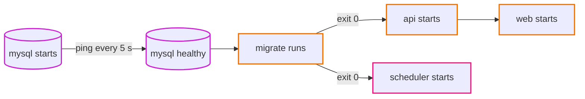
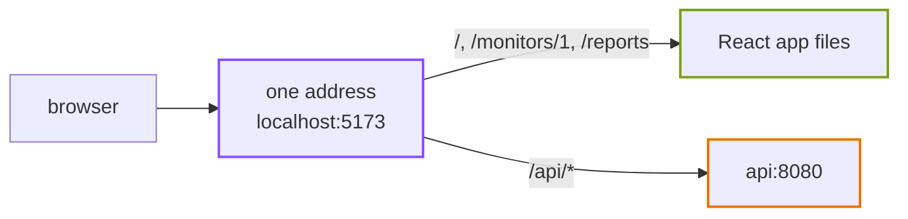

# Episode 3: The laptop version

*From Laptop to Tokyo, part one. About 15 minutes.*

> Zayn typed `make up`. Logs scrolled past, and thirty seconds later the page loaded on `localhost:5173` with three monitors: two up, one down.
>
> "There. Everything runs."
>
> "On one machine, on one network, with the password `uptime`," Kian said. "Which is right for a laptop. I'm not complaining. I want to know what each container is pretending to be."
>
> "Pretending?"
>
> "Your MySQL container is pretending to be a database someone else looks after. Your scheduler is pretending to be a clock. Docker does a lot of jobs for you without asking. On AWS every one of those jobs needs a new owner."

## What's running

The whole local setup is one file, `compose.yaml`, with five services. Docker Compose (a tool that starts several containers together from one description) brings them up with `make up`.

<p align="center"></p>

*Everything inside the laptop border shares one Docker network. The only arrow that leaves the laptop is the scheduler's, going out to the websites.*

| Service | What it runs | Lifetime |
|---|---|---|
| `mysql` | MySQL 8.4 | always on |
| `migrate` | `uptime migrate`: creates or updates the tables | runs once, then exits |
| `api` | `uptime api`: the Go API on port 8080 | always on |
| `scheduler` | `uptime dev-scheduler`: check every minute, rollup every 5 minutes | always on |
| `web` | the React app with Vite (a development server that reloads the page when you change code), on port 5173 | always on |

Three named volumes (disks that survive container restarts) hold the data: MySQL's files, the CSV reports and the web app's `node_modules`.

`migrate`, `api` and `scheduler` are the same image, `uptime-backend:local`, with different commands. In `compose.yaml` they share one block of settings, so you can see "one program, many commands" right in the file.

## The start-up order

The five services can't start in just any order. The api needs tables, the tables need a running database, and a database takes a while to be ready after its container starts. Compose enforces the order for us:



*MySQL starts and Compose pings it every 5 seconds until it answers. Only then does `migrate` create the tables, and only if `migrate` exits with code 0 do the api and the scheduler start. The web server comes last.*

Three settings in `compose.yaml` make this happen: a health check on `mysql`, `migrate` waiting for `service_healthy`, and the api and scheduler waiting for `service_completed_successfully`. There's no Compose on AWS. Someone still has to enforce this order on every deploy, including the moment when several copies of the api start at once. Episode 8 shows who.

## One address for the browser

The browser only ever talks to `localhost:5173`. Page requests get the React files from Vite. Anything under `/api` gets passed on by Vite to the api container at `http://api:8080`.



*The browser never finds out there are two things behind that address.*

Browsers are strict about pages that call an address other than the one they came from. The rules are called CORS (cross-origin resource sharing), and they need extra headers and extra care on the server. With a single address the question never comes up. The repo keeps this as a rule, and on AWS a CDN takes over Vite's job (episode 10).

## Settings come from outside

The Go program reads every setting from environment variables: where the database is, the password, the admin token, where to write reports. On the laptop the values sit in plain text in `compose.yaml`:

```yaml
DB_HOST: mysql
DB_PASSWORD: uptime
ADMIN_TOKEN: ${ADMIN_TOKEN:-local-dev-token}
ALLOW_PRIVATE_TARGETS: "true"
```

On a laptop that's fine, since the database can't be reached from anywhere else and holds nothing that matters. It also shows something good about the code: nothing is hardcoded. The same image will run on AWS with different values and not one line of Go changed.

## What the laptop is hiding

This is the list Kian was after. Each row is a job that Docker or the laptop does without being asked, and each one needs an owner on AWS.

| On the laptop | What changes on AWS | Episode |
|---|---|---|
| every container can reach every other container on any port | we decide who may reach whom; everything else is blocked | 5 |
| MySQL's port is open on your laptop | the database has no path from the internet at all | 5 |
| the check job reaches the internet through your home router | private machines need a managed, paid exit to the internet | 5 |
| passwords are `uptime` and `local-dev-token`, in a file in git | secrets live in a secrets store and are read at start-up | 6 |
| no encryption anywhere | encrypted connections to the database and to the browser | 7, 9 |
| the api and the scheduler share the reports volume | containers don't share disks; reports go to object storage | 7 |
| no backups; `make reset` is a feature | automatic backups, and a standby copy in production | 7 |
| Compose restarts crashed containers and orders start-up | a service keeps containers running; an init container migrates first | 8 |
| `ALLOW_PRIVATE_TARGETS=true`, so the app can check itself | always `false`; the guard is on | 8 |
| the scheduler is a container with timers inside, always on | a managed scheduler starts a fresh job every minute | 11 |
| logs are `docker compose logs` | central logs, metrics, and alarms that email us | 12 |
| you deploy with `make up` | a pipeline tests, builds and deploys, with no keys on laptops | 13 |
| if the laptop dies, everything dies | two data centers, so one can fail | 4 onwards |
| it's free | every part has a price per hour | all |

None of this shows up in a local demo, which is why "it works on my laptop" tells you so little about whether a design is ready for the cloud.

## From laptop to cloud

Every local piece has a cloud home. This table is the spine of part two: each domain episode takes one or two rows and works out the details. The AWS names won't mean much yet, and that's fine.

| On the laptop | What it becomes | On AWS | Episode |
|---|---|---|---|
| one Docker network | a private network with separate areas for public, app and data | a VPC with three kinds of subnets | 5 |
| plain-text passwords | a secrets store, and a permission for each piece | Secrets Manager and IAM roles | 6 |
| `mysql` container | a database someone else patches and backs up | RDS for MySQL | 7 |
| `reports` volume | files any container can read or write | an S3 bucket | 7 |
| `api` container | containers that are restarted and replaced for us | ECS on Fargate, behind a load balancer | 8 |
| `migrate` container | a step that runs before every new api container | an init container in each api task | 8 |
| `web` container and Vite | files served close to users, one address for everything | S3 and CloudFront | 9, 10 |
| `scheduler` container | a clock that starts a job and then gets out of the way | EventBridge Scheduler | 11 |
| `docker compose logs` | logs, metrics and alarms in one place | CloudWatch and SNS | 12 |
| `make up` | a pipeline with no stored keys | GitHub Actions with OIDC | 13 |

One thing has no row on purpose. Nothing on a laptop plays the part of "two data centers" or "a firewall between tiers", because a laptop has no such thing. Those don't come from any local piece. They come from the requirements in episode 2, and we add them in episodes 4 and 5.

## Check yourself

1. You run `make reset`, which deletes the volumes. What's gone, what comes back with `make up`, and what does that tell you about infrastructure-as-code on AWS?
2. A teammate wants to keep the reports on the container's own disk on AWS, "like on the laptop." What goes wrong?
3. On AWS, three api containers start at the same moment during a deploy. Which laptop behavior do we now need to rebuild ourselves, and why is it harder than on the laptop?

<details>
<summary>Answers</summary>

1. Every monitor, result, summary and report is gone; the code and settings aren't, so `make up` gives you a working, empty app in a minute. On AWS it's the same: the Terraform rebuilds all the infrastructure in about 35 minutes (hands-on [step 09](../steps/09-rebuild-and-replicate.md)), but the data only comes back if you planned backups.
2. On the laptop the api and the scheduler share a volume. On AWS each container has its own disk, which disappears when it stops. The rollup job would write the report and exit, and the api would never see it.
3. The start-up order: tables must exist before the api starts. Compose did this for one api container on one machine. With three containers starting together, three migrations could try to change the tables at once, so the answer needs a lock as well (episode 8).

</details>

## Try it

Follow [local-development.md](../local-development.md) to run the app, then do the experiments in [Step 01, section 5](../steps/01-understand-the-application.md#5-try-it-yourself): switch on the guard, stop the database and watch `/api/health` and `/api/ready` disagree, and change a setting without touching the code.

**Next:** [Episode 4: Leaving the laptop](04-leaving-the-laptop.md)
