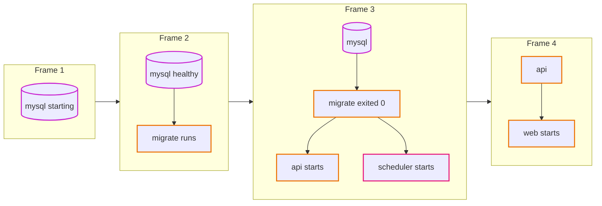
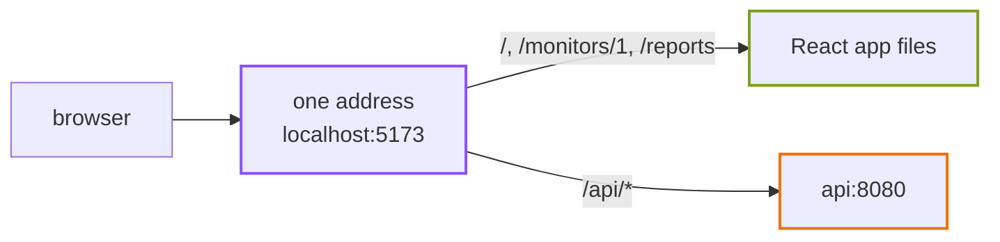
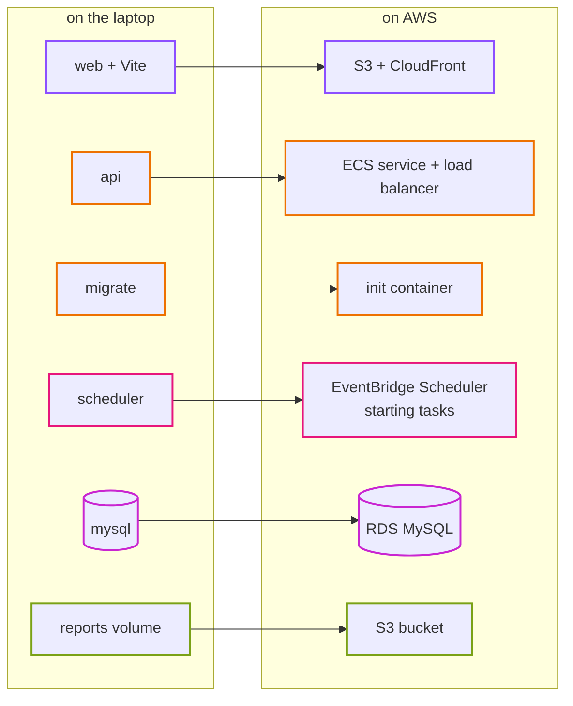

# Episode 3: The laptop version

*From Laptop to Tokyo, part one. About 15 minutes.*

> Zayn typed `make up`, and a wall of logs scrolled past. Thirty seconds later the page loaded on `localhost:5173`, with three monitors: two up, one down.
>
> "There. Everything runs."
>
> "Everything runs on one machine, on one network, with the password `uptime`," Kian said. "Which is exactly right for a laptop. I'm not criticizing it. I want to know what each container is pretending to be."
>
> "Pretending?"
>
> "The MySQL container is pretending to be a database somebody else looks after. Your scheduler container is pretending to be a clock. Docker is quietly doing a lot of jobs for you, and on AWS every one of those jobs needs a new owner. Let's find them all."

## What's running

The local setup is one file, `compose.yaml`, and five services. Docker Compose (a tool that starts several containers together, from one description) brings them all up with `make up`.

<p align="center"></p>

*Everything inside the laptop border shares one Docker network. The only arrow that leaves the laptop is the scheduler's, going out to the websites.*

| Service | What it runs | Lifetime |
|---|---|---|
| `mysql` | MySQL 8.4, the database | always on |
| `migrate` | `uptime migrate`: creates or updates the tables | runs once, then exits |
| `api` | `uptime api`: the Go API on port 8080 | always on |
| `scheduler` | `uptime dev-scheduler`: runs check every minute and rollup every 5 minutes | always on |
| `web` | the React app with Vite (a development server that reloads the page when you change code), on port 5173 | always on |

Three named volumes (disks that survive when containers restart) hold the data: one for MySQL's files, one for the CSV reports, and one for the web app's `node_modules`.

Notice that `migrate`, `api` and `scheduler` are all the same image, `uptime-backend:local`, with a different command. In `compose.yaml` they share one block of settings. That's the "one program, many commands" idea from episode 1, and you can see it in the file.

## The start-up order

The five services can't start in any order. The api needs tables, the tables need a running database, and a database takes a while to become ready after its container starts. Compose handles this for us:



*Frame 1: MySQL starts, and Compose pings it every 5 seconds until it answers. Frame 2: once it's healthy, `migrate` creates the tables. Frame 3: only if `migrate` exits with code 0 do the api and the scheduler start. Frame 4: the web server starts last.*

Three rules make this work, and they're all in `compose.yaml`: a health check on `mysql`, `migrate` waiting for `service_healthy`, and `api` and `scheduler` waiting for `service_completed_successfully`. On AWS there's no Compose. Somebody still has to enforce this order, on every deploy, even when several copies of the api start at the same moment. Episode 8 shows how.

## One address for the browser

The browser only ever talks to one address: `localhost:5173`. When it asks for a page, Vite serves the React files. When it asks for anything under `/api`, Vite passes the request on to the api container at `http://api:8080`.



*The browser never learns that there are two things behind that address.*

Why bother? Browsers are strict about pages that call a different address from the one they came from. The rules are called CORS (cross-origin resource sharing), and they need extra headers and extra care on the server. With one address, the question never comes up. The repo keeps that as a rule: the browser talks to one origin, and on AWS a CDN will play the part Vite plays here (episode 9).

## Settings come from outside

The Go program reads every setting from environment variables: where the database is, the password, the admin token, where to put reports. Locally, those values sit in plain text in `compose.yaml`:

```yaml
DB_HOST: mysql
DB_PASSWORD: uptime
ADMIN_TOKEN: ${ADMIN_TOKEN:-local-dev-token}
ALLOW_PRIVATE_TARGETS: "true"
```

That's fine on a laptop. The database can't be reached from anywhere else and holds nothing that matters. It also shows us something good about the code: nothing is hardcoded. The same image will run on AWS with different values, and not one line of Go changes. When a new environment only needs different values, and never different code, you've done something right.

## What the laptop is hiding

Here's the list Kian was after. Each row is a job Docker or the laptop does for us without being asked, and each one needs an owner on AWS.

| On the laptop | Why it's fine here | What changes on AWS | Episode |
|---|---|---|---|
| every container can reach every other container on any port | it's all yours, on one machine | we decide who may reach whom, and everything else is blocked | 5 |
| MySQL's port is open on your laptop | only you can reach it | the database has no path from the internet at all | 5 |
| the check job reaches the internet through your home router | your router does the address translation | private machines need a managed exit to the internet, and it costs money | 5 |
| passwords are `uptime` and `local-dev-token`, in a file in git | nothing to steal | secrets live in a secrets store and are read at start-up | 6 |
| no encryption anywhere | traffic never leaves the machine | encrypted connections to the database and to the browser | 7, 9 |
| the reports volume is shared by the api and the scheduler | they're on the same disk | containers don't share disks; reports go to object storage | 7 |
| backups: none | `make reset` is a feature | automatic backups, and a standby copy in production | 7 |
| Compose restarts crashed containers and orders start-up | one machine, one tool | a service keeps containers running, and an init container runs migrations first | 8 |
| `ALLOW_PRIVATE_TARGETS=true`, so the app can check itself | handy for a demo | always `false`; the guard is on | 8 |
| the scheduler is a container with timers inside, always on | cheap and simple | a managed scheduler starts a fresh job every minute | 10 |
| logs: `docker compose logs` | you're sitting in front of it | central logs, metrics, and alarms that email us | 11 |
| deploy: you run `make up` | one person, one laptop | a pipeline tests, builds and deploys, with no keys on laptops | 12 |
| if the laptop dies, everything dies | it's a laptop | two data centers, so one can fail | 4 onwards |
| it's free | it's your electricity | every part has a price per hour | all |

Look at how long that list is. None of it shows up in a local demo, which is why "it works on my laptop" tells you very little about whether a design is ready for the cloud. The app is the same. Everything around it is new.

## The map from laptop to cloud

Every local piece has a cloud home. This table is the spine of the rest of the series: each part-two episode takes one or two rows and works out the details. The AWS names mean nothing yet, and that's fine. We'll earn every one of them.

| On the laptop | What it needs to become | On AWS | Episode |
|---|---|---|---|
| one Docker network | a private network with separate areas for public, app and data | a VPC with three kinds of subnets | 5 |
| plain-text passwords | a secrets store and per-piece permissions | Secrets Manager and IAM roles | 6 |
| `mysql` container | a database someone else patches and backs up | RDS for MySQL | 7 |
| `reports` volume | files any container can read and write | an S3 bucket | 7 |
| `api` container | containers that are restarted and replaced for us | ECS on Fargate, behind a load balancer | 8 |
| `migrate` container | a step that runs before every new api container | an init container in each api task | 8 |
| `web` container and Vite | static files served close to users, and one address for everything | S3 and CloudFront | 9 |
| `scheduler` container | a clock that starts a job and then gets out of the way | EventBridge Scheduler | 10 |
| `docker compose logs` | logs, metrics and alarms in one place | CloudWatch and SNS | 11 |
| `make up` | a pipeline with no stored keys | GitHub Actions with OIDC | 12 |



*Six arrows, six episodes. The app's code doesn't change along any of them. Only the settings do.*

One row is missing from the map on purpose. The laptop has nothing that plays the part of "two data centers" or "a firewall between tiers", because a laptop has no such thing. Those don't come from any local piece. They come from the requirements in episode 2, and we'll add them in episodes 4 and 5.

## What breaks if you run `make reset`

`make reset` stops everything and deletes the volumes. Think of it as a small disaster drill. What's gone, and what would you have needed to get it back?

<details>
<summary>What happens</summary>

Every monitor, every check result, every summary and every report is gone. The code and the settings are untouched, so `make up` gives you a working, empty app in a minute.

That's the whole lesson of infrastructure-as-code in one command: the house comes back, the furniture doesn't. On AWS, the Terraform can rebuild every piece of infrastructure in about 35 minutes ([step 09](../steps/09-rebuild-and-replicate.md)), but the data only comes back if we planned for it with backups. Episode 7 is where we do.

</details>

## Check yourself

1. Why does the api wait for `migrate` to finish instead of just waiting for MySQL?
2. Why doesn't the web app need any CORS setup?
3. Name two things the laptop does for the check job that AWS won't do for free.
4. Why is it a good sign that the password sits in plain text in `compose.yaml`?
5. Which local piece has no direct AWS equivalent, and what replaces it?

<details>
<summary>Answers</summary>

1. The api expects the tables to exist. MySQL being up only means the server answers; the tables are created by `migrate`.
2. The browser only talks to one address. Vite (and later CloudFront) passes `/api/*` on to the api, so there's no second origin.
3. Reaching the internet (your home router translates addresses; on AWS that's a paid NAT gateway), and starting it on a timer (the always-on scheduler container becomes a managed scheduler).
4. Not the plain text itself, but what it shows: the password comes from an environment variable, not from the code. On AWS the same image gets it from a secrets store instead.
5. The `scheduler` container. On AWS nothing runs all the time with timers inside; a managed scheduler starts a fresh check job every minute and a rollup job every hour.

</details>

## Try it

Follow [local-development.md](../local-development.md) to run the app, then do the experiments in [Step 01, section 5](../steps/01-understand-the-application.md#5-try-it-yourself): turn on the guard, stop the database and watch `/api/health` and `/api/ready` disagree, and change a setting without touching the code.

> "Fourteen rows," Zayn said, looking at the table. "I didn't know my laptop did so much."
>
> "Nobody does, until they move." Kian closed the laptop. "Next time we leave it behind. First question: where, exactly, is the cloud?"

Next: [Episode 4: Leaving the laptop](04-leaving-the-laptop.md)
