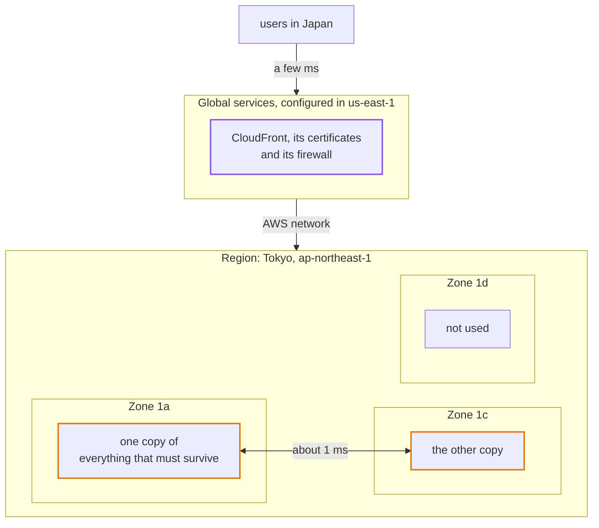
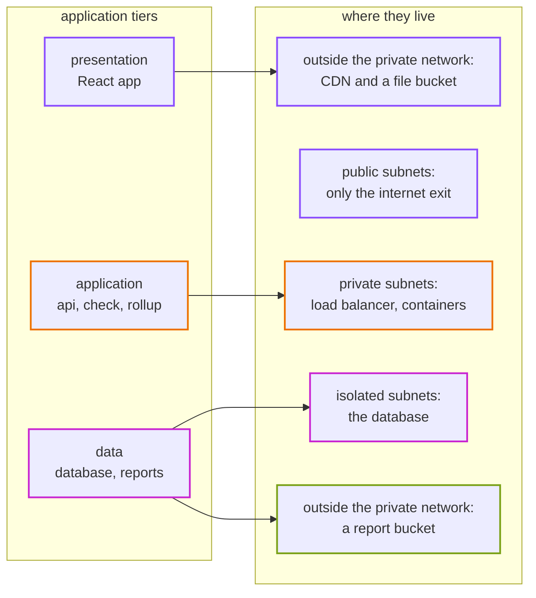
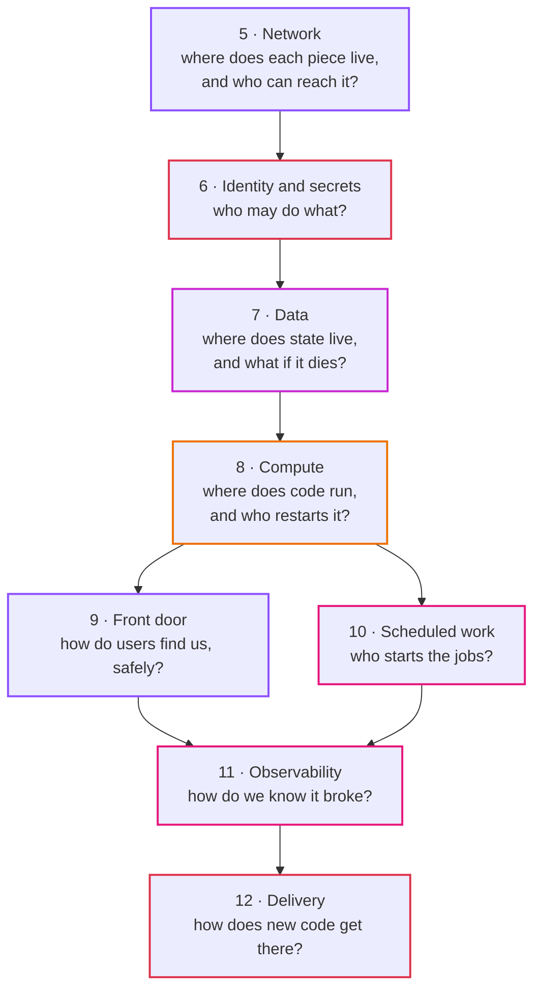

# Episode 4: Leaving the laptop

*From Laptop to Tokyo, part two. About 20 minutes.*

> "Where is the cloud, though?" Zayn asked. "Physically. When I pick Tokyo, what am I picking?"
>
> Kian drew three boxes on the whiteboard, a few centimeters apart. "Buildings. Several of them, in and around Tokyo, each with its own power and its own network links. AWS groups them into zones, and the zones into a region. When you pick Tokyo, you're picking which group of buildings your stuff lives in."
>
> "And if one building has a fire?"
>
> "Then whatever you only put in that building is gone for a while. Which is the first design question: how many buildings do we need, and what goes in each one?"

## The idea: someone else's computers, in specific places

"The cloud" sounds like it's everywhere. It isn't. Every container you run and every byte you store sits on a real machine in a real building, and the building's location decides three things you care about: how far your users' requests have to travel, which country's laws apply to your data, and what the building can survive.

Cloud providers organize their buildings in two layers.

A region is a part of the world, like Tokyo or Osaka or northern Virginia. Regions are far apart and almost fully independent: a problem in one very rarely touches another. You pick a region for your app, and almost everything you build lives only there.

An Availability Zone (AZ) is one or more data centers inside a region, with separate power, cooling and network links, a few kilometers from the other zones. Close enough that talking between them takes about a millisecond. Far enough apart that a fire, a flood or a power cut normally only takes down one. When the rest of this series says "survive a data center failing", it means "survive a zone failing".

The design question is how you spread your system across zones. Everything you run in only one zone goes down when that zone does.

## The AWS answer: Tokyo, two zones

AWS calls Tokyo `ap-northeast-1`. New accounts can use three zones there: `ap-northeast-1a`, `1c` and `1d`. There's no `1b` for new accounts, which confuses everyone the first time.

We use two of them, `1a` and `1c` ([ADR 0004](../adr/0004-tokyo-region-two-zones.md)).

*Our system lives in two of Tokyo's three zones. A few global pieces sit in front of it and are configured from `us-east-1`, for reasons we'll get to in episode 9.*

Why two zones and not one? Some things simply need two: a load balancer must have subnets in at least two zones, and a database standby has to be in a different zone from the main copy. And our production requirement from episode 2 says the checks must keep running when one zone fails. One zone can't do that.

Why not three? Three zones survive a failure with more spare room, but in our design every zone gets its own exit to the internet in production, and each one costs about $49 a month. For a system with one or two containers per zone, the third zone buys very little. If we ever grow to many containers per zone, so that losing one zone would overload the others, we'd add it.

One odd detail: zone names are shuffled per AWS account. Your `1a` may be a different building from someone else's `1a`. Only the zone IDs (like `apne1-az4`) mean the same building everywhere. Inside one account it doesn't matter. It matters when two accounts try to line up their zones, and it's a good trivia question for interviews.

### Why Tokyo

| Region | Distance to users in Japan | Data stays in Japan | Price | Notes |
|---|---|---|---|---|
| Tokyo, `ap-northeast-1` | a few milliseconds | yes | about 20 to 30% more than `us-east-1` | most services arrive early |
| Osaka, `ap-northeast-3` | a few milliseconds | yes | similar to Tokyo | smaller; a good second region for disaster recovery later |
| Northern Virginia, `us-east-1` | about 150 milliseconds | no | the cheapest | gets new features first |

The users and the data are in Japan, and most of our clients care where their data lives. Tokyo wins, even at the higher price. Osaka stays on the list as the place a second copy would go if we ever need to survive losing all of Tokyo, which episode 2 decided we won't pay for yet.

A few AWS services are global rather than regional. CloudFront (the CDN we'll use in episode 9) is one of them, and its configuration, certificates and firewall have to be created in `us-east-1`, even when everything else is in Tokyo. It looks strange in the code. It's not a mistake.

## Who looks after what

On your laptop, you're responsible for everything: the hardware, the operating system, Docker, the app. On AWS the work is split between you and AWS, and the split moves depending on which service you use. AWS calls this the shared responsibility model.

| Layer | A virtual machine (EC2) | A managed container (Fargate) | A managed database (RDS) | Object storage (S3) |
|---|---|---|---|---|
| buildings, power, hardware | AWS | AWS | AWS | AWS |
| the host's operating system | **you** | AWS | AWS | AWS |
| patching the database engine | **you**, if you install one | not applicable | AWS | not applicable |
| backups | **you** | not applicable | AWS, if you switch them on | AWS keeps copies across zones |
| your container image and code | **you** | **you** | not applicable | not applicable |
| network rules and who may connect | **you** | **you** | **you** | **you** |
| permissions, secrets, encryption settings | **you** | **you** | **you** | **you** |
| your data | **you** | **you** | **you** | **you** |

*Read down a column. The further right you go, the more AWS takes off your hands. The bottom three rows never move: they're always yours.*

This table explains a lot of the choices coming up. Episode 2 said two people, no night shifts. That means we pick services from the right-hand side of the table whenever the price is reasonable: containers without servers to patch, a database AWS patches and backs up. The bottom three rows are where our effort goes, because no service will ever take them over. Most security incidents on AWS happen there, in a network rule or a permission somebody got wrong, not in AWS's buildings.

## Three tiers, and why the word means two things

This series is about a "three-tier" system. The phrase is used in two ways, and mixing them up causes a lot of confusion, so let's pull them apart now.

Application tiers describe what the software does:

- the presentation tier: what the user sees. For us, the React app.
- the application tier: the logic. Our api and our jobs.
- the data tier: where state lives. Our database and our report files.

Network tiers describe where things sit in the network, and in our design they're three kinds of subnets (slices of the private network, episode 5):

- public: can be reached from the internet, if something has a public address.
- private: can call out to the internet, but nothing outside can call in.
- isolated: can't reach the internet at all, in either direction.

They don't line up one to one. Here's where each application tier actually lives:

*Notice the public subnets hold none of our three tiers. They only hold the door our private machines use to call out.*

Two things surprise people here. The presentation tier isn't inside our private network at all: the React app is just files, served from storage through a CDN. And nothing we wrote lives in the public subnets. The usual textbook picture puts the load balancer there. We don't, and episode 5 explains why.

## The domains

Moving to the cloud isn't one big job. It's eight smaller ones, and each has its own question. The rest of part two takes them in this order:

*Each arrow means "needs the one above it first". You can't place a database without a network, and you can't start a container without knowing what it's allowed to do.*

The order isn't arbitrary. It's the order the pieces depend on each other, and it's the order you'd build them in. It's also the order the Terraform in this repo is split into: one "stack" per layer, each with its own state file, each reading the outputs of the ones below it ([ADR 0007](../adr/0007-terraform-layout-stacks-and-environments.md)). A mistake in the observability layer can't touch the network.

Some people split the domains differently, for example putting DNS and certificates in their own domain, or storage apart from data. That's fine. What matters is that every piece has a place, and that you know which pieces depend on which.

## One design, three environments

We'll run the same system three times: dev for trying things, staging for testing a release before it goes out, and prod for the client. They use the same design and the same code. Only the values differ: sizes, how many copies, how long backups are kept, whether deletion is protected.

That's a rule worth writing down early: environments differ by values, never by code. The moment prod has "one extra thing" that dev doesn't, you can no longer test prod's design anywhere else. Episode 13 lists every value that differs, and there's no `if prod` anywhere in the code.

Each environment gets its own private network range so they could be connected later without clashing: `10.20.0.0/16` for dev, `10.30.0.0/16` for staging, `10.40.0.0/16` for prod. Big companies also put each environment in its own AWS account, so a mistake in dev physically can't reach prod. That's the recommended setup, and the repo supports it, but it isn't required to learn from it.

## What it costs to exist

Here's the mindset change that catches every newcomer: on the cloud, most things cost money for every hour they exist, not for every time they're used. A database that nobody queries costs the same as a busy one. A month is 730 hours, and the meter runs through every one of them.

The finished dev environment costs about $0.16 an hour, whether anyone uses it or not. That's about $120 a month. A forgotten dev environment is a common way to burn money, which is why every step in this repo ends with a clean-up section, and why the first thing the Terraform creates is a budget alert.

Tokyo prices are 20 to 30% higher than `us-east-1`. AWS adds 10% consumption tax in Japan, and none of the prices in this series include it. New accounts often get free credits, so check yours before you panic at the numbers. All of it is in [costs.md](../costs.md).

## What we didn't pick

**Everything in one zone.** Cheaper, and simpler. But a load balancer needs two zones, a database standby needs two zones, and the production requirement says we survive one failing. We use one zone's worth of everything in dev where we can (one internet exit, one database), and two in prod.

**Three zones.** More headroom when a zone fails. Not worth a third internet exit at our size.

**Osaka or `us-east-1` as the main region.** Osaka is smaller; `us-east-1` is cheaper but far from users and outside Japan.

**Two regions.** Survives losing all of Tokyo. Roughly doubles the cost and adds a lot of moving parts. Not what the client asked for.

## What breaks if zone `1a` goes dark

It's a Tuesday afternoon and zone `ap-northeast-1a` loses power. Before you open the answer, think about the three layers we'll build: the internet exit, the containers, the database.

What happens

It depends on the environment, and that's the point.

In dev there's one internet exit, in `1a`, and one database, also in `1a`. The containers in `1c` are still running, but they can't reach the internet and they can't reach the database. The whole app is effectively down until the zone comes back. We accepted that in episode 2.

In prod there's an internet exit in each zone, a standby database in `1c` that takes over in a minute or two, and api containers in both zones. The page keeps loading, and after a short gap the checks carry on from `1c`. That's what the extra $130 a month buys.

The same event, two very different outcomes, and both were chosen on purpose.

## Check yourself

1. What's the difference between a region and an Availability Zone?
2. Why does our design use two zones and not one, or three?
3. Why do some settings for a Tokyo app have to be created in `us-east-1`?
4. In the shared responsibility model, which three rows are always yours?
5. The React app is part of the presentation tier. Which network subnet does it live in?

Answers

1. A region is a separate area of the world with its own set of data centers. A zone is one or more data centers inside a region, with separate power and network, close to the others but far enough away to fail independently.
2. Some pieces need two (the load balancer, the database standby), and prod must survive one zone failing. A third zone would add a third internet exit in prod for little gain at our size.
3. CloudFront is a global service, and its certificates and firewall have to be created in `us-east-1`.
4. Network rules, permissions and secrets, and your data. No managed service takes those over.
5. None. It's static files served from storage through the CDN, outside our private network.

## Try it

Read the words table in [Step 02, section 1](../steps/02-aws-network.md#1-words-you-need), then [ADR 0004](../adr/0004-tokyo-region-two-zones.md). If you have an AWS account, open the VPC console, pick Asia Pacific (Tokyo) in the top right corner, and find the list of zones your account can use.

> "Two buildings," Zayn said. "OK. But what's actually in them? Where does the database go, and how does the api reach it, and how does the check job reach the internet?"
>
> "That's the network," Kian said. "And it's where most bills and most security holes are born. Bring coffee."

Next: [Episode 5: Network](05-network.md)
