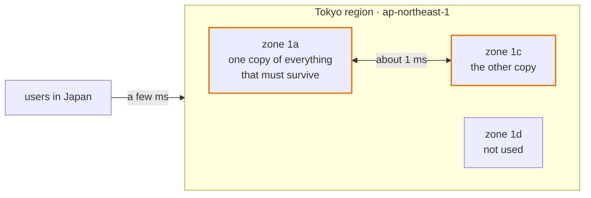
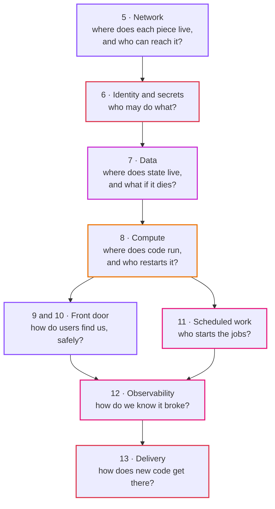

# Episode 4: Leaving the laptop

*From Laptop to Tokyo, part two. About 16 minutes.*

> "Where is the cloud, though?" Zayn asked. "Physically. When I pick Tokyo, what am I picking?"
>
> Kian drew three boxes on the whiteboard, a little apart. "Buildings. Several of them around Tokyo, each with its own power and network links. AWS groups them into zones, and the zones into a region."
>
> "And if one building has a fire?"
>
> "Then whatever you put only in that building is gone for a while." Kian capped the pen. "So: how many buildings do we need, and what goes in each?"

## Someone else's computers, in specific places

"The cloud" sounds like it's everywhere. It isn't. Every container and every byte sits on a real machine in a real building, and the building's location decides three things: how far your users' requests travel, which country's laws cover your data, and what disasters you survive.

Cloud providers organize their buildings in two layers.

A region is a part of the world: Tokyo, Osaka, northern Virginia. Regions are far apart and almost fully independent, so a problem in one very rarely touches another. You pick a region for your app, and nearly everything you build lives only there.

An Availability Zone (AZ) is one or more data centers inside a region, with separate power, cooling and network links, a few kilometers from the other zones. They're close enough that talking between them takes about a millisecond, and far enough apart that a fire, flood or power cut normally takes out only one. When this series says "survive a data center failing", it means "survive a zone failing".

So the design question becomes how to spread the system across zones. Anything you run in only one zone goes down when that zone does.

## Tokyo, two zones

AWS calls Tokyo `ap-northeast-1`. New accounts can use three zones there: `1a`, `1c` and `1d`. There's no `1b` for new accounts, which catches everyone out once. We use `1a` and `1c` ([ADR 0004](../adr/0004-tokyo-region-two-zones.md)).

*Two of Tokyo's three zones hold a copy of everything that has to survive. The third stays empty.*

Why not one zone? Some pieces need two by definition: a load balancer needs subnets in at least two zones, and a database standby has to live in a different zone from the main copy. On top of that, episode 2 said production checks must keep running when a zone fails, and one zone can't do that.

Why not three? A third zone survives a failure with more room to spare. But in our design every zone gets its own exit to the internet in production, at about $49 a month each, and with one or two containers per zone the third zone buys very little. If we grow to many containers per zone, so that losing one would overload the rest, we'll add it.

One oddity: zone names are shuffled per AWS account. Your `1a` might be a different building from someone else's `1a`. Only zone IDs (like `apne1-az4`) name the same building everywhere. Inside one account it doesn't matter; it only matters when two accounts try to line up their zones.

### Why Tokyo and not somewhere cheaper

| Region | Distance to users in Japan | Data stays in Japan | Price |
|---|---|---|---|
| Tokyo, `ap-northeast-1` | a few milliseconds | yes | about 20 to 30% more than `us-east-1` |
| Osaka, `ap-northeast-3` | a few milliseconds | yes | similar to Tokyo; a smaller region |
| Northern Virginia, `us-east-1` | about 150 milliseconds | no | the cheapest, and gets new features first |

Our users and our data are in Japan, and most of our clients care where their data lives. Tokyo wins despite the price. Osaka stays on the list as the place a second copy would go if we ever need to survive losing Tokyo entirely.

A few AWS services are global rather than regional, and some of their settings have to be created in `us-east-1` even when everything else is in Tokyo. Episode 9 explains why when we get there.

## Who looks after what

On your laptop you're responsible for everything: the hardware, the operating system, Docker, the app. On AWS the work is split between you and AWS, and where the split falls depends on the service. AWS calls this the shared responsibility model.

| Layer | A virtual machine (EC2) | A managed container (Fargate) | A managed database (RDS) | Object storage (S3) |
|---|---|---|---|---|
| buildings, power, hardware | AWS | AWS | AWS | AWS |
| the host operating system | **you** | AWS | AWS | AWS |
| patching the database engine | **you**, if you install one | not applicable | AWS | not applicable |
| backups | **you** | not applicable | AWS, once you switch them on | AWS keeps copies across zones |
| your container image and code | **you** | **you** | not applicable | not applicable |
| network rules: who may connect | **you** | **you** | **you** | **you** |
| permissions, secrets, encryption settings | **you** | **you** | **you** | **you** |
| your data | **you** | **you** | **you** | **you** |

*Read down a column: the further right you go, the more AWS takes off your hands. The bottom three rows never move.*

This table explains many of the choices ahead. Two people with no night shifts means picking from the right-hand side of the table whenever the price is reasonable: containers without servers to patch, a database AWS patches and backs up. Our effort then goes into the bottom three rows, because no service will ever take them over. Most security incidents on AWS happen there, in a network rule or a permission someone got wrong, rather than in AWS's buildings.

## Three tiers, two meanings

This series is about a "three-tier" system, and the phrase is used in two different ways. Mixing them up causes a lot of confusion.

Application tiers describe what the software does. The presentation tier is what the user sees (our React app). The application tier is the logic (our api and jobs). The data tier is where state lives (our database and report files).

Network tiers describe where things sit in the network. In our design they're three kinds of subnets (slices of the private network, coming in episode 5): public subnets can be reached from the internet, private ones can call out but can't be called, and isolated ones can't reach the internet in either direction.

They don't line up one to one:

| Application tier | Where it actually lives |
|---|---|
| presentation: the React app | outside the private network entirely, as files served through a CDN |
| application: api, check, rollup | private subnets, behind a load balancer that's also private |
| data: the database | isolated subnets |
| data: the report files | outside the private network, in a storage bucket |
| (none of ours) | public subnets, which hold only the door our private machines use to call out |

The presentation tier isn't inside our network at all, and nothing we wrote lives in the public subnets. The textbook picture puts the load balancer there. We don't, and episode 5 explains why.

## The domains

Moving to the cloud isn't one big job. It's eight smaller ones, each with its own question, and the rest of part two takes them in this order:

*Each arrow means "needs the one above it first". You can't place a database without a network, and you can't start a container without knowing what it may do.*

This is the order the pieces depend on each other, and so the order you'd build them. The Terraform in this repo is split the same way: one "stack" per layer, each with its own state file, each reading the outputs of the ones below it ([ADR 0007](../adr/0007-terraform-layout-stacks-and-environments.md)). A mistake in the observability layer can't touch the network.

Other people slice the domains differently, putting DNS and certificates in their own domain, say, or storage apart from data. That's fine.

## The meter runs when nothing happens

On the cloud, most things charge for every hour they exist, not for every time they're used. A database nobody queries costs as much as a busy one. A month is 730 hours, and the meter runs through all of them.

The finished dev environment costs about $0.16 an hour whether anyone uses it or not, which is about $120 a month. A forgotten dev environment is one of the most common ways teams waste money. That's why every step guide in this repo ends with a clean-up section, and why the first thing the Terraform creates is a budget alert.

## Check yourself

1. It's a Tuesday afternoon and zone `1a` loses power. What happens to the app in dev, and in prod? (Think about the internet exit, the containers and the database.)
2. The client's finance team notices `us-east-1` is 25% cheaper and asks to move. What do you tell them?
3. A new teammate says, "We use managed services, so security is AWS's problem." Which three rows of the responsibility table do you point at?

Answers

1. In dev there's one internet exit and one database, both in `1a`. Containers in `1c` keep running but can't reach the internet or the database, so the app is effectively down until the zone recovers. We accepted that in episode 2. In prod there's an exit in each zone, a database standby in `1c` that takes over in a minute or two, and api containers in both zones, so after a short gap everything carries on from `1c`. That difference is most of the extra $130 a month.
2. It would add about 150 ms to every request from Japan, move the data out of the country, and some clients have rules about that. The saving is real, but it's the wrong trade for these users. Osaka is the option if they want a second Japanese region.
3. Network rules, permissions and secrets, and the data itself. No managed service takes those over, and they're where most incidents happen.

## Try it

Read the words table in [Step 02, section 1](../steps/02-aws-network.md#1-words-you-need), then [ADR 0004](../adr/0004-tokyo-region-two-zones.md). If you have an AWS account, open the VPC console, pick **Asia Pacific (Tokyo)** at the top right, and look at the list of zones your account can use.

> "Two buildings," Zayn said. "Fine. But what goes in them? Where does the database go, and how does the check job get out to the internet?"

**Next:** [Episode 5: Network](05-network.md)
