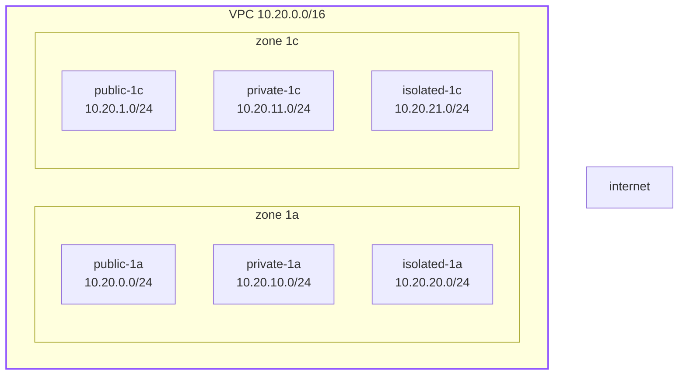
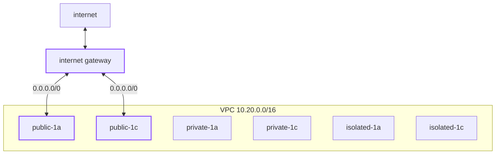
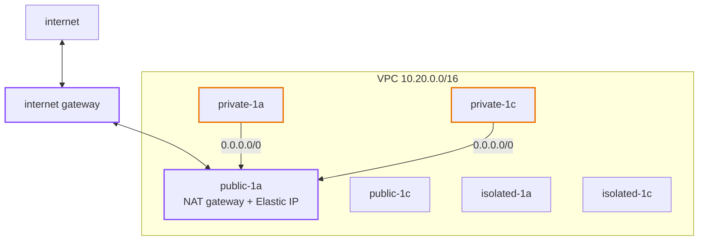
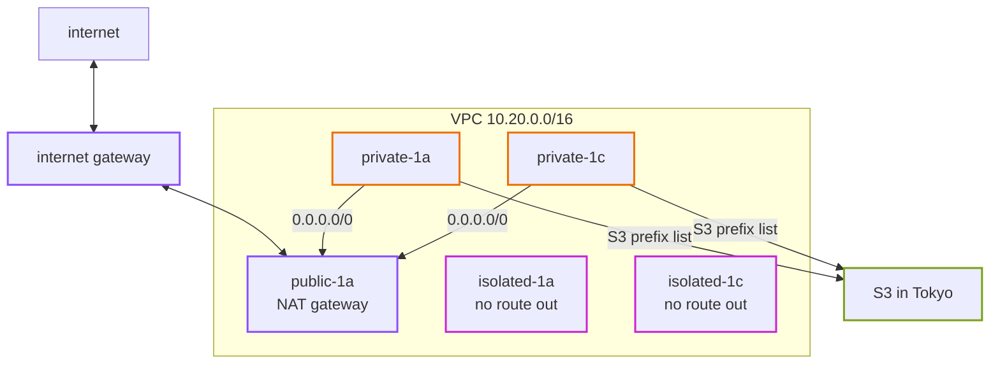
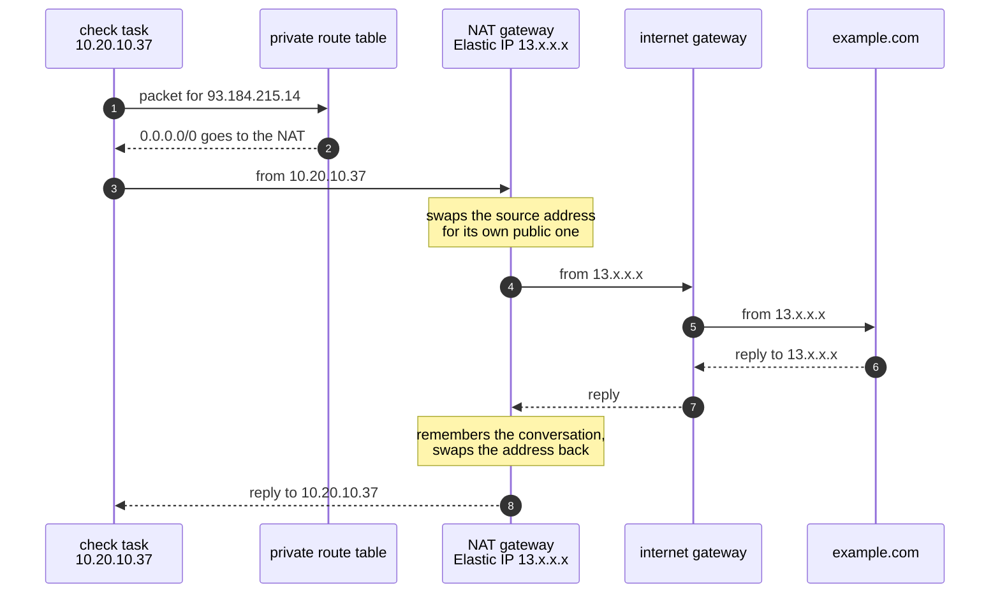
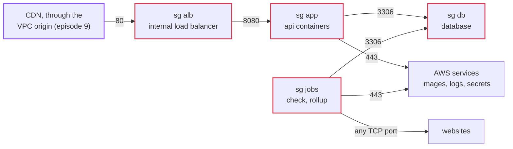

# Episode 5: Network

*From Laptop to Tokyo, part two. About 25 minutes.*

> Kian put a blank sheet of paper on the table. "Draw every arrow in the app. Every time one thing talks to another."
>
> Zayn drew for a few minutes. Browser to web. Browser to api. Api to database. Check job to database. Check job to the websites.
>
> "Now, which arrows are allowed to start from the outside?"
>
> "Only the browser ones."
>
> "And which things should never be reachable from the outside at all?"
>
> "The database. The api, directly. The jobs." Zayn paused. "Actually, almost everything."
>
> "So the network's job is mostly saying no," Kian said. "The trick is saying yes to exactly the right five arrows, and making the most dangerous ones impossible, not just forbidden."

## The idea: a private network with rooms and doors

Forget AWS for a minute. Think of the network as a building you design yourself.

The building has an address range: a block of private addresses only you use, like every address that starts with `10.20.`. Nothing outside knows or cares about these addresses.

You split the building into rooms, each with a slice of the addresses. Each room is in one of the data centers from episode 4. Things in the same building can always reach each other by address, if the firewall lets them.

Every room has a routing sign that says where traffic for the outside world goes. This sign, and only this sign, decides what kind of room it is:

- A room whose sign points at the front door can talk to the internet both ways, if the thing inside has a public address. We call it public.
- A room whose sign points at an exit-only door can call out, but nobody outside can start a conversation with it. The exit-only door swaps the private address for its own public one on the way out, and swaps it back on the way in. This swap is called NAT (network address translation). We call it private.
- A room with no sign for the outside world can only talk inside the building. We call it isolated.

Then, around every single machine, there's a firewall that lists what may come in and go out. The good kind remembers conversations: if a machine was allowed to start one, the replies get back in automatically. And the rules name groups of machines, not addresses. "The app group may reach the database group on port 3306" stays true no matter which addresses the containers get today.

That's the whole idea. Everything below is AWS's names for it.

## The AWS answer

| The idea | AWS name | What it costs |
|---|---|---|
| the building and its address range | **VPC** (virtual private cloud) | free |
| a room | **subnet** | free |
| the routing sign | **route table** | free |
| the front door | **internet gateway** | free |
| the exit-only door | **NAT gateway**, with a fixed public address (an **Elastic IP**) | $0.062 an hour, plus $0.062 per GB through it |
| a firewall around each machine | **security group** | free |
| a private tunnel straight to one AWS service | **VPC endpoint** | the S3 one is free |

### Building it, frame by frame

Watch the network go from useless to useful, one piece at a time. This is also the order you build it in by hand in [step 02](../steps/02-aws-network.md).

**Frame 1: a VPC and six subnets.** The VPC gets `10.20.0.0/16` (every address starting `10.20.`, about 65,000 of them). Six subnets, three kinds in each of our two zones, each `/24` (256 addresses). Right now all six are the same. Nothing gets in or out, whatever their names say.

*Every subnet has only one route so far: "10.20.0.0/16 stays local". They can reach each other and nothing else.*

**Frame 2: the front door.** Attach an internet gateway, and give the two public subnets a route table that says "everything else (`0.0.0.0/0`) goes to the internet gateway". That one route is the whole difference between a public subnet and any other.

*The public subnets can now reach the internet, as long as the thing inside has a public address. Nothing of ours will.*

**Frame 3: the exit-only door.** Put a NAT gateway in `public-1a`, with an Elastic IP. Give each private subnet its own route table: "everything else goes to the NAT gateway". The NAT gateway itself sends traffic out through the internet gateway, which is why it has to sit in a public subnet.

*The arrows only go one way at the start: private subnets can open connections out, and the replies come back through the NAT. Nothing outside can open a connection in.*

Why two private route tables when both point at the same NAT gateway? So that giving prod a second NAT gateway later only means changing where one route points. No subnet moves.

**Frame 4: the room with no door, and a private tunnel.** The isolated subnets get a route table with no route out at all. And the private route tables get one more route: a free **S3 gateway endpoint**, which sends traffic for S3 straight to S3 inside AWS's network instead of through the NAT gateway.

*When two routes match, the more specific one wins, so S3 traffic takes the tunnel. That will matter a lot for the bill.*

**Frame 5: firewalls.** Four security groups, one per kind of thing, pointing at each other. We'll look at them closely in a moment.

That's the network. It's the map in [step 02](../steps/02-aws-network.md):

*The map so far. Green bands are public, teal are private, blue are isolated. The public subnets hold only the NAT gateway.*

### What goes where

| Piece | Subnet | Why there |
|---|---|---|
| NAT gateway | public | it needs the internet gateway to send traffic out |
| load balancer (episode 8) | **private** | only the CDN needs to reach it, and the CDN can do that from inside the VPC |
| api containers (episode 8) | private | only the load balancer needs to reach them |
| check and rollup jobs (episode 10) | private | they call websites, so they need to get out, but nothing calls them |
| database (episode 7) | **isolated** | it never needs the internet, so it gets no way to reach it |

Two of these deserve a second look.

The database is isolated, even though a firewall already blocks the internet. A security group is one rule that someone can edit, on a bad day, by mistake. A missing route can't be fixed by a firewall rule, from inside or outside. With the database in a subnet that has no route out, a wrong security group still can't expose it or let it send data anywhere. This is defense in depth: two independent protections, so one mistake isn't enough.

The load balancer is private, and that's unusual. The textbook picture puts it in the public subnets, where anyone on the internet can reach it, and then spends effort making sure only the CDN does. CloudFront has a feature called VPC origins: it places its own network cards inside our private subnets and talks to an internal load balancer from there, over AWS's network. So our load balancer never gets a public address at all. The public subnets end up holding only the NAT gateway. It also saves $7.30 a month, because an internet-facing load balancer pays for a public address in each zone. Episode 9 has the details, and [ADR 0005](../adr/0005-three-subnet-tiers-api-in-private.md) has the full comparison.

### One packet's path

Here's what happens when the check job visits `https://example.com` from a private subnet.

*The website only ever sees the NAT gateway's address. Every check the app makes comes from that one IP, so a site owner can allowlist us.*

And the same task starting up, pulling its container image: the image's layers live in S3, so that traffic matches the S3 route, takes the free gateway endpoint, and never touches the NAT gateway.

### Who may talk to whom

The security groups are where the five arrows from Kian's sheet of paper become rules.

*Arrows point at groups, not addresses. Anything not drawn here is blocked.*

| Group | May receive | May send |
|---|---|---|
| `alb` | port 80 from the CDN's VPC origin | port 8080 to `app` |
| `app` | port 8080 from `alb` | port 3306 to `db`, port 443 to anywhere (AWS services) |
| `jobs` | nothing | port 3306 to `db`, any TCP port to anywhere (websites) |
| `db` | port 3306 from `app` and `jobs` | nothing |

Two things here surprise people.

The jobs group may connect to any port on the internet. That looks like a hole, and it's on purpose. A monitor can be `https://example.com:8443`, so the check job has to reach any port. What stops it from reaching the database or AWS's internal credential address isn't the security group, which can't see what a name resolves to. It's the guard in the code from episode 1, which checks the real IP address right before connecting. The network rule is wide; the code rule is narrow. Each does what it's good at.

There's no rule for DNS. Security groups don't filter traffic to the VPC's own DNS server, so looking up names just works.

One more habit worth building: when a security group blocks something, the packets are dropped quietly. You get a timeout, not an error. When something on AWS hangs and then times out, think "security group or route" first.

## What it costs

| Item | Tokyo price | Dev, per month | Prod, per month |
|---|---|---|---|
| NAT gateway | $0.062 an hour | $45.26 (one) | $90.52 (two) |
| its Elastic IP | $0.005 an hour | $3.65 | $7.30 |
| data through the NAT | $0.062 per GB | depends on traffic | depends on traffic |
| VPC, subnets, route tables, internet gateway, security groups | free | $0 | $0 |
| S3 gateway endpoint | free | $0 | $0 |
| data between zones | $0.01 per GB each way | pennies | pennies |

The NAT gateway is the biggest fixed cost of a quiet dev environment: $48.91 of the $120. It does nothing but let private containers reach the internet, and it charges whether or not they do.

Then there's the per-GB charge, which is where the free S3 endpoint earns its place. A check task starts every minute, 43,800 times a month, and every start downloads the container image, about 10 MB. Through the NAT, that would be about 430 GB and $27 a month for nothing. Through the endpoint, it's free.

And remember the open question from episode 2: the check job reads up to 1 MB of each page. With 200 monitors, the data coming back through the NAT could cost anywhere from $11 to $54 a month. The network design can't fix that. The code can, by reading less.

## One NAT gateway or two?

A NAT gateway lives in one zone. If that zone fails, every private subnet whose route points at it loses the internet.

| Mode | NAT gateways | Cost a month | If zone `1a` fails |
|---|---|---|---|
| `single` (dev, staging) | 1 | $48.91 | checks stop in both zones |
| `per_az` (prod) | 2 | $97.82 | checks keep running in `1c` |

This is the decision from the opening scene of the prologue, and now we can answer it properly. In dev an outage costs nothing, so one. In prod the checks must survive a zone failing, so two. It's one variable, `nat_gateway_mode`, set per environment ([ADR 0006](../adr/0006-nat-gateways-per-environment.md)). That's what "it depends" looks like when you actually answer it.

## What we didn't pick

**Put the containers in public subnets with public addresses, and skip the NAT.** It works, and plenty of people do it to save $49 a month. But then the only thing between the internet and the api is one security group rule, each container pays for a public address, and every container leaves from a different address, so nobody can allowlist the checker. We'd write it down as a choice for a throwaway environment, not do it by default.

**Two kinds of subnet instead of three.** The database would sit in a private subnet with a route to the NAT gateway, which it never needs. That's a door left open for no reason.

**Private tunnels (interface endpoints) to every AWS service instead of a NAT.** The containers need to reach several AWS services: the image registry, logs, secrets. Each interface endpoint costs $0.014 an hour per zone. Five of them in two zones is about $102 a month, more than two NAT gateways, and the check job still can't reach websites. We'd add some of them if traffic through the NAT grew to many GB a day.

**A NAT instance**: a tiny virtual machine doing the address swap, about $5 a month. We'd have to patch it, watch it and replace it when it fails. That trades money for work, and the requirements said two people, no night shifts.

**An internet-facing load balancer.** Covered above: more to lock down, a public address per zone, and nothing gained once the CDN can reach inside.

## What breaks if

Try each of these in your head before opening the answers. They're also real experiments in [step 02](../steps/02-aws-network.md#6-break-it-on-purpose).

Someone deletes the private route to the NAT gateway

The containers in that subnet can't reach the internet or AWS services any more. The NAT gateway and the containers are both fine. Only the routing sign is gone, and without it packets have nowhere to go. Checks time out; new containers can't start, because they can't log in to the image registry or read their secrets. The image layers would still download, through the S3 endpoint, but the task never gets that far.

Someone deletes the public route to the internet gateway

The private containers lose the internet too, even though their route to the NAT gateway is still there. The NAT gateway sends traffic out through the internet gateway, so it breaks the moment its own subnet stops being public. It's a good reminder that "public" is one route, and a lot depends on it.

Someone launches a machine in a public subnet without a public address

It can't reach the internet. A public subnet sends traffic to the internet gateway, but the internet gateway only translates addresses for things that have a public one. Everything else is stuck. That's exactly why the NAT gateway needs its own Elastic IP.

Someone removes the rule that lets the app group reach the database

The api's database connections hang and then time out. No error message, no refusal, just silence. `/api/ready` starts answering `503`. This is the "timeout means security group or route" habit in action.

## Check yourself

1. A subnet called `public-1a` has a machine with a public IP, and it can't reach the internet. Where do you look first?
2. Why does the NAT gateway have to be in a public subnet?
3. Why is the database in an isolated subnet, when a security group already blocks the internet?
4. The S3 endpoint is free. Why do we still pay for the NAT gateway?
5. The jobs group allows any TCP port to anywhere. Why isn't that a hole?
6. Zone `1a` fails. What happens to checks in `1c`, in dev and in prod?

Answers

1. The route table that subnet uses. If it has no `0.0.0.0/0` route to an internet gateway, the subnet isn't public, whatever it's called.
2. It sends traffic out through the internet gateway, and only a subnet with a route to the internet gateway can do that.
3. Defense in depth. A security group can be edited by mistake. With no route out, a wrong rule still can't expose the database.
4. The check job has to reach websites, and containers have to reach AWS services that don't have a free gateway endpoint (the image registry's API, logs, Secrets Manager). Only S3 and DynamoDB have gateway endpoints.
5. The checker needs to reach whatever port a monitor uses. The code's guard refuses private addresses after the name is resolved, which a security group can't do.
6. In dev both private subnets route through the one NAT in `1a`, so checks stop everywhere. In prod, `1c` has its own NAT, so checks there keep running.

## Try it

Build this network twice, by hand in the console and then in Terraform, and break it on purpose: [Step 02: AWS network](../steps/02-aws-network.md), with its [workbook](../workbook/02-aws-network.md). About three hours and $0.20 if you clean up at the end.

> "Five arrows," Zayn said. "And everything else is a no."
>
> "For the network, yes." Kian tapped the arrow from the api to the database. "But the network only knows which *machine* is talking. It has no idea which *program*, or whether that program should be allowed to read the database password. That's a different kind of boundary."

Next: [Episode 6: Identity and secrets](06-identity-and-secrets.md)
