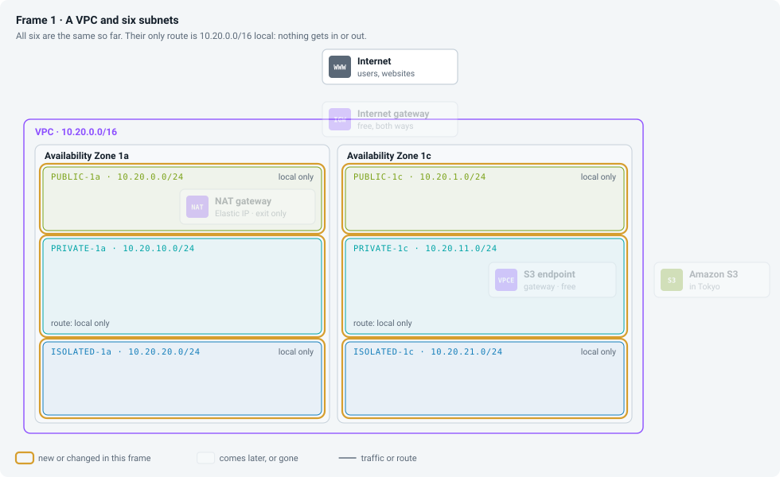
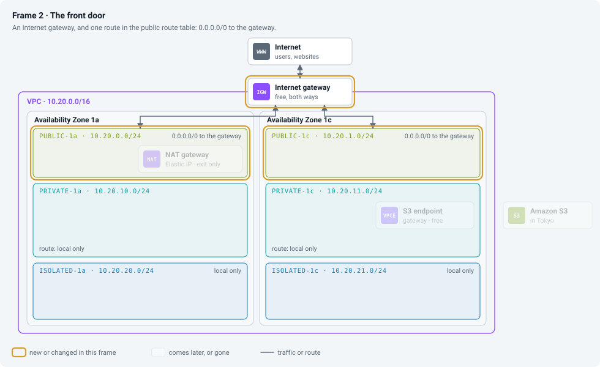
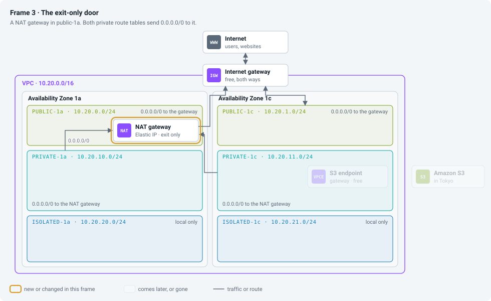
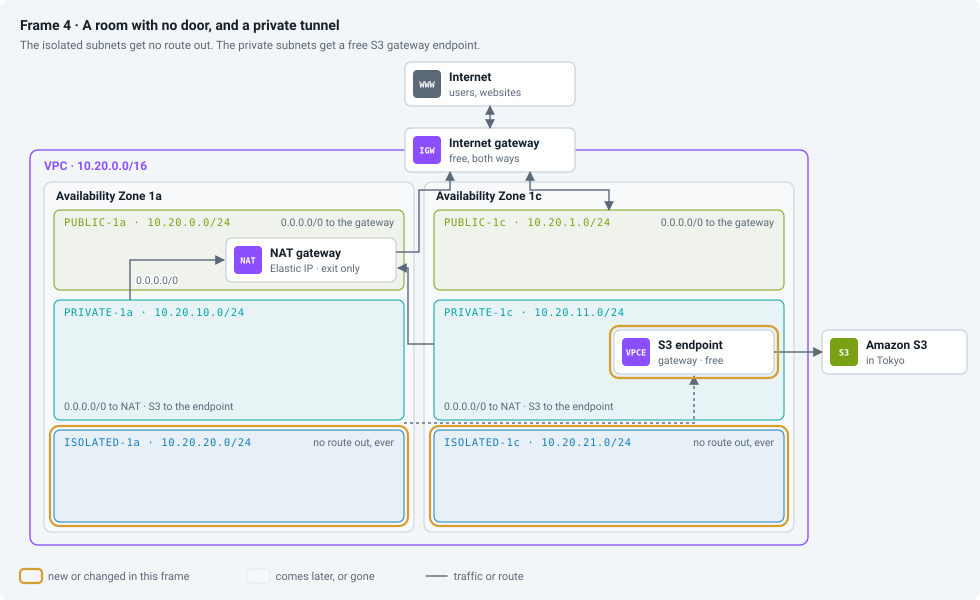
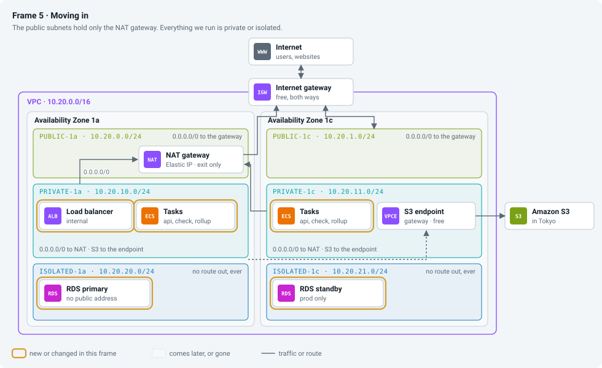
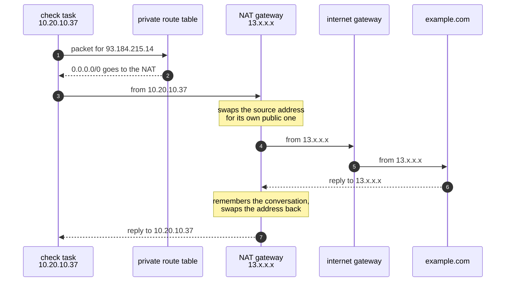
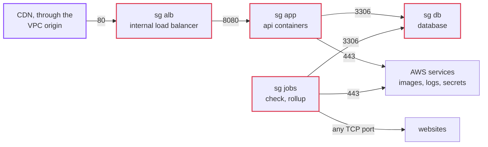

# Episode 5: Network

*From Laptop to Tokyo, part two. About 20 minutes.*

> Kian put a blank sheet of paper on the table. "Draw every arrow in the app. Every time one thing talks to another."
>
> Zayn drew for a few minutes. Browser to web. Browser to api. Api to database. Check job to database. Check job to the websites.
>
> "Which of those start from outside?"
>
> "Only the browser ones."
>
> "And what should nobody outside ever be able to reach?"
>
> "The database. The api, directly. The jobs." Zayn looked at the sheet. "Nearly everything, actually."
>
> "So most of the network's job is saying no," Kian said. "The trick is saying yes to exactly those five arrows, and making the dangerous ones impossible rather than just forbidden."

## A building with rooms and doors

Forget AWS for a moment and think of the network as a building you design yourself.

The building has an address range, a block of private addresses only you use. Addresses are written in a short form called CIDR: `10.20.0.0/16` means "every address that starts with `10.20.`", about 65,000 of them, and `10.20.10.0/24` means "every address that starts with `10.20.10.`", 256 of them. The number after the slash says how much of the address is fixed; a bigger number means a smaller range.

You split the building into rooms, each with a slice of those addresses, and each room sits in one of the zones from episode 4. Everything in the building can reach everything else by address, if the firewall allows it.

Each room has a routing sign that says where traffic for the outside world goes, and that sign alone decides what kind of room it is. A room whose sign points at the front door can talk to the internet both ways, as long as the thing inside has a public address; we call it public. A room whose sign points at an exit-only door can call out, but nothing outside can start a conversation with it. That door swaps the private address for its own public one on the way out and swaps it back on the way in, a trick called NAT (network address translation). We call that room private. A room with no sign for the outside world can only talk inside the building. We call it isolated.

Around every machine sits a firewall listing what may come in and go out. The useful kind remembers conversations, so replies to a connection it allowed always get back in. Its rules name groups of machines rather than addresses: "the app group may reach the database group on port 3306" stays true whatever addresses the containers get today.

AWS has a name for each of these:

| The idea | AWS name | Cost |
|---|---|---|
| the building | VPC (virtual private cloud) | free |
| a room | subnet | free |
| the routing sign | route table | free |
| the front door | internet gateway | free |
| the exit-only door | NAT gateway, with a fixed public address (an Elastic IP) | $0.062 an hour, plus $0.062 per GB |
| the firewall around each machine | security group | free |

## Building it, frame by frame

This is the order you'd build it by hand in [step 02](../steps/02-aws-network.md). Watch what changes in each frame; everything else stays where it is.

*Frame 1. The VPC and six subnets. Their names say public, private and isolated, but right now they're identical: the only route any of them has is "10.20.0.0/16 stays local".*

*Frame 2. An internet gateway, and a route in the public route table that says "everything else (`0.0.0.0/0`) goes to the gateway". That one route is the whole difference between a public subnet and the rest.*

*Frame 3. A NAT gateway in `public-1a`, and both private route tables send `0.0.0.0/0` to it. The NAT gateway itself leaves through the internet gateway, which is why it has to sit in a public subnet.*

*Frame 4. The isolated subnets get no route out, ever. The private route tables get one more route, to a free S3 gateway endpoint that reaches S3 inside AWS's network instead of through the NAT gateway. When two routes match, the more specific one wins, so S3 traffic takes the tunnel.*

*Frame 5. Moving in. The load balancer and the containers go in the private subnets, the database in the isolated ones. The public subnets hold nothing of ours except the NAT gateway.*

Two details from the frames are easy to miss. Each private subnet has its own route table even though both point at the same NAT gateway, so giving prod a second NAT gateway later only means changing where one route points, without moving a subnet. And the "S3 prefix list" behind the endpoint route is simply AWS's published list of S3's address ranges in Tokyo, kept up to date for you.

The full map of this layer, with prod's extras in dashed lines, is [aws-network.svg](../diagrams/aws-network.svg).

## Why things live where they live

The database sits in an isolated subnet, even though a security group already blocks the internet. A security group is a rule someone can edit by mistake on a bad day. A missing route can't be fixed by any firewall rule. With the database in a subnet that has no way out, a wrong security group still can't expose it or let it send data anywhere. Two independent protections, so that one mistake isn't enough, is what people mean by defense in depth.

The load balancer is private too, and that's unusual. The textbook layout puts it in the public subnets, where anyone can reach it, and then works hard to make sure only the CDN does. CloudFront has a feature called VPC origins: it puts its own network interfaces inside our private subnets and talks to an internal load balancer from there, over AWS's network. So our load balancer never gets a public address at all. It saves $7.30 a month as well, since an internet-facing load balancer pays for a public address in each zone ([ADR 0005](../adr/0005-three-subnet-tiers-api-in-private.md)).

The containers are private because nothing should call them directly. The check and rollup jobs need to get out to websites, so they need the NAT gateway, but nothing needs to get in.

## One packet's path

The check job visits `https://example.com` from a private subnet. The round trip looks like this:

*The website only ever sees the NAT gateway's address. Every check the app makes comes from that single IP, so a site owner can allowlist us.*

When the same task starts up and downloads its container image, the image layers come from S3, so that traffic matches the endpoint route and never touches the NAT gateway. That matters for the bill.

## Who may talk to whom

The security groups turn the arrows from Zayn's sheet into rules, plus two arrows nobody drew: the calls every container makes to AWS itself, for images, logs and secrets.

*Arrows point at groups, not addresses. Anything not drawn is blocked.*

The jobs group may connect to any port on the internet, which looks like a hole. It's deliberate. A monitor can be `https://example.com:8443`, so the check job has to reach any port. What stops it from reaching the database or AWS's internal credential address is the guard from episode 1, which checks the real IP address right before connecting. A security group can't see what a name resolves to; the code can.

There's no rule for DNS, because security groups don't filter traffic to the VPC's own DNS server. And when a security group blocks something, it drops the packets silently: you get a timeout, not an error. On AWS, when something hangs and then times out, suspect a security group or a route first.

## One NAT gateway or two

The prologue opened with this question. Now we can answer it.

A NAT gateway lives in one zone. If that zone fails, every private subnet whose route points at it loses the internet.

| Mode | NAT gateways | Cost a month | If zone `1a` fails |
|---|---|---|---|
| `single` (dev, staging) | 1 | $48.91 | checks stop in both zones |
| `per_az` (prod) | 2 | $97.82 | checks keep running in `1c` |

In dev an outage costs nothing, so one. In prod the checks must survive a zone failing, so two. It's a single variable, `nat_gateway_mode`, set per environment ([ADR 0006](../adr/0006-nat-gateways-per-environment.md)).

## What it costs

The NAT gateway is the only part of the network with a price: $0.062 an hour ($45.26 a month) plus $3.65 for its Elastic IP, so $48.91 in dev and $97.82 in prod. Everything else in this episode is free.

On top of the hourly price, every gigabyte through the NAT gateway costs $0.062, and that's where the free S3 endpoint pays for itself. A check task starts every minute, 43,800 times a month, and each start downloads an image of about 10 MB. Through the NAT gateway that would be about 430 GB and $27 a month; through the endpoint it's free. The other per-GB item is the one Zayn found in episode 2: pages coming back from the websites, somewhere between $11 and $54 a month at 200 monitors.

## What we turned down

| Option | Why not | When we'd use it |
|---|---|---|
| containers in public subnets with public IPs, no NAT | one security group rule is all that protects the api; every container pays for a public address; every check leaves from a different IP, so nobody can allowlist us | a throwaway environment, written down as a choice |
| two kinds of subnet instead of three | the database would have a route to the NAT gateway it never needs | never, for this app |
| interface endpoints to every AWS service instead of a NAT | about $102 a month for five of them in two zones, and the check job still can't reach websites | alongside the NAT, once traffic to AWS services reaches many GB a day |
| a NAT instance (a small virtual machine doing the swap) | about $5 a month, but we'd patch it, watch it and replace it ourselves | when money matters more than time, which isn't this team |
| an internet-facing load balancer | more to lock down, a public address per zone, and nothing gained once the CDN can reach inside | if a partner has to call the api directly |

## Check yourself

1. A subnet named `public-1a` holds a machine with a public IP, and the machine can't reach the internet. Where do you look first, and why there?
2. Someone deletes the public route table's `0.0.0.0/0` route, but the private route to the NAT gateway is still there. Can the check job still reach websites?
3. After a change, the api's database connections hang for a while and then time out. There's no error message. What's your first guess?

Answers

1. The route table that subnet uses. If it has no `0.0.0.0/0` route to an internet gateway, the subnet isn't public, whatever it's called. The name means nothing to AWS.
2. No. The NAT gateway sends traffic out through the internet gateway, so it stops working the moment its own subnet stops being public. The private route still points at the NAT gateway, and the NAT gateway has nowhere to send the traffic.
3. A security group rule: probably the one allowing the app group into the database group on 3306 was removed or changed. Blocked packets are dropped silently, so you see a timeout rather than a refusal.

## Try it

Build this network twice, by hand in the console and then in Terraform, and break it on purpose: [Step 02: AWS network](../steps/02-aws-network.md), with its [workbook](../workbook/02-aws-network.md). About three hours, and about $0.20 if you clean up at the end.

> "Five arrows," Zayn said. "Well, seven. And everything else is a no."
>
> Kian tapped the arrow from the api to the database. "The network knows which machine is talking. It has no idea which program, or whether that program should be allowed to read the database password."

**Next:** [Episode 6: Identity and secrets](06-identity-and-secrets.md)
