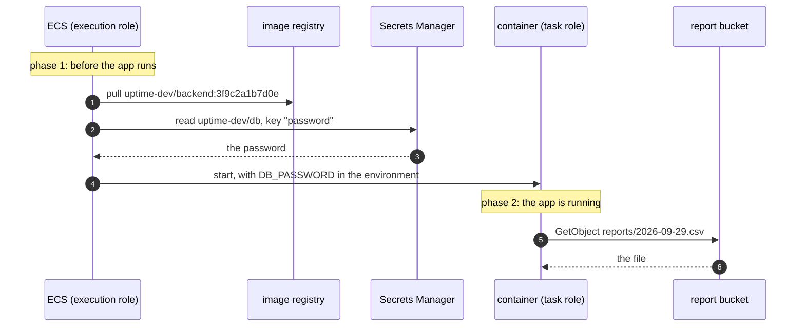
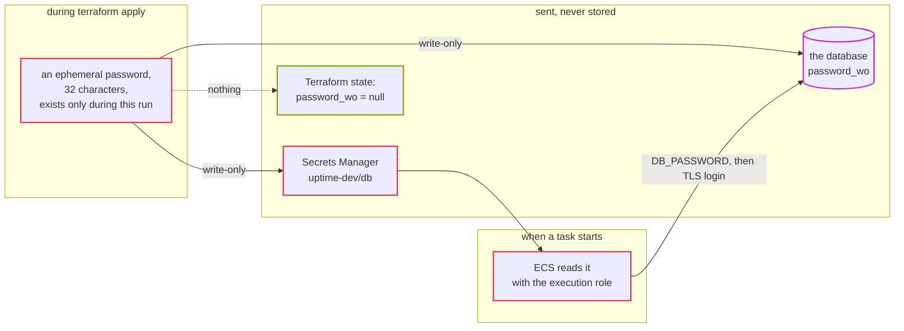

# Episode 6: Identity and secrets

*From Laptop to Tokyo, part two. About 18 minutes.*

> "The api needs the database password," Zayn said. "On the laptop it's in `compose.yaml`. On AWS I'll put it in an environment variable in the task settings."
>
> "Where anyone who can read the task settings can see it," Kian said. "And it lands in the Terraform state file, in plain text."
>
> "A secrets store, then. The api fetches it from there."
>
> "Better. Now the api asks the secrets store for the password. How does the store know it's the api asking? Not someone who broke into the check job. Not me, from my laptop."
>
> Zayn thought about it. "It has to know who's asking."
>
> "On AWS, every call has to say who's asking, and every call gets checked."

## Two questions, every time

Every time anything on AWS does anything (reads a file, starts a container, fetches a secret), AWS asks two questions. Who are you? That's authentication. Are you allowed to do this, to this thing? That's authorization.

On your laptop you never think about it, because you're the only user and every program runs as you. On AWS there are many actors, and each needs its own identity with its own narrow set of permissions: the api, the check job, the service that starts containers, the pipeline that deploys code, and you in the console, among others. The full list is below.

Three principles run through the whole design.

Give each actor exactly what it needs and nothing more. This is called least privilege. If the api only reads reports, it can't write them, so a bug that lets an attacker steer the api into calling S3 still can't overwrite a report.

Prefer temporary credentials to permanent ones. A key that never expires is dangerous for as long as it exists. The better pattern is for an actor to prove who it is and receive credentials that expire within an hour, so a leak stops working soon after.

Read secrets as late as possible, by as few actors as possible. A secret should live in one place built for secrets, be handed only to what needs it, and never pass through code, config files or logs on the way.

This is a different boundary from episode 5. Security groups decide which machine may talk to which. Identity decides which program may call which AWS service. You need both: a container allowed to reach the database's port still needs the password, and a container holding the password still can't reach a database the network keeps it away from.

## IAM roles

AWS's identity service is IAM (identity and access management). It's free, and a handful of words cover most of it.

An IAM user is a permanent identity with a password or long-lived access keys. We avoid them for anything automated. An IAM role is an identity that something assumes to get temporary credentials, usually valid for an hour; every actor in our system uses one. The service that hands out those temporary credentials is called STS (Security Token Service). A role has two policies: a trust policy that says who may assume it ("only ECS tasks", "only this GitHub repository"), and a permission policy that says what it may do and to which resources.

Resources are named by ARNs (Amazon Resource Names), long strings like `arn:aws:s3:::uptime-dev-reports-123456789012` that identify one exact thing in one account. Some resources carry their own resource policy too: our web bucket has one that says "only our CDN may read me".

People sign in through IAM Identity Center (single sign-on), never as the account's root user and never with long-lived keys on a laptop.

### Every actor and what it may do

| Actor | Identity | May do | Episode |
|---|---|---|---|
| ECS, before the app starts | execution role | pull the image, read the two secrets, write logs | 8 |
| the api container | api task role | read `reports/*` in the report bucket | 8 |
| the check and rollup containers | jobs task role | write `reports/*` in the report bucket | 11 |
| the scheduler | scheduler role | start only the check and rollup tasks, only in our cluster, and pass only two roles to ECS | 11 |
| the GitHub deploy job | deploy role, through OIDC | push one image, update one service, upload web files | 13 |
| the CDN | the web bucket's policy | read the web bucket | 10 |
| people | Identity Center sign-in | whatever their job needs | |

*Six automated actors, each with a narrow grant, plus people. None of the six can change the network, the database or IAM itself.*

Identity doesn't appear as a box on any architecture map in this series. It's attached to every arrow instead.

### Two roles for one container

Starting a container on ECS happens in two phases, and each phase uses a different identity. This trips up nearly everyone the first time.

*The app never calls Secrets Manager. ECS reads the secret with its own role and hands it over as an environment variable.*

The execution role is what ECS uses before your code runs. All three kinds of task share it, and it can read exactly two secrets. The task role is what your code uses while it runs: the api's may read reports, the jobs' may write them, and that's the only difference.

So the app has no AWS credentials in its settings at all. The AWS SDK (the library our Go code uses to call AWS) asks ECS for the task role's temporary credentials, and ECS provides them. Nobody copies a key anywhere.

### The `PassRole` trap

The scheduler starts containers for us (episode 11), and starting a container means handing it an execution role and a task role. So the scheduler needs permission to pass roles to ECS, called `iam:PassRole`.

If that permission said "any role", anyone who could edit a schedule could start a container with any role in the account, an administrator role included, and act through it as an administrator. So `PassRole` is limited twice: only the execution role and the jobs task role, and only to the ECS tasks service. The deploy role in episode 13 gets the same limit. Whenever something starts other things, look for its `PassRole` and check that it's narrow; it's one of the most common ways people escalate privileges on AWS.

## Where the secrets live

The system has two secrets, the database password and the admin token, and both live in Secrets Manager, a service that stores secrets encrypted and hands them only to identities you allow. The interesting part is how the password gets there without ever being written down anywhere else.

*Terraform generates a password that exists only while it runs, and sends it to the database and to Secrets Manager through write-only arguments, which AWS receives and Terraform never records. Later, each starting task gets it from ECS and logs in with it.*

The password is never in git, never in a `.tfvars` file and never in the state file. Download the state and search it, and you'll find `"password_wo": null`: Terraform knows the argument exists, not what was in it. This relies on Terraform 1.11 features (ephemeral values and write-only arguments), and step 03 has you prove it yourself ([ADR 0009](../adr/0009-database-password-write-only-no-rotation.md)). The admin token is made the same way, and the one person who needs it reads it from Secrets Manager in the console.

### Rotation, and a mistake

> "We should turn on automatic rotation," Kian said. "RDS can change the password every seven days by itself. Auditors love it."
>
> "What happens to the api when it does?"
>
> "It's in Secrets Manager. The api picks up the new one."
>
> "It doesn't, though," Zayn said. "ECS reads the secret once, when the task starts. After a rotation the running tasks still have the old password. And the api opens new connections all the time. None lives longer than five minutes. So every seven days, every new connection fails until someone restarts the service."
>
> Kian was quiet for a moment. "You're right. I was thinking of an app that keeps its connections open. Write that down."

It's written down in ADR 0009. Rotation here is a deliberate step: bump a version number, apply, restart the service, and accept a few seconds in which new connections fail. The longer-term answer is to have no database password at all. With IAM database authentication, the app asks AWS for a login token that lasts 15 minutes. It's the next step once an auditor asks for regular rotation, and it needs code in the app to refresh the token.

## What it costs

IAM is free. Secrets Manager charges $0.40 per secret per month, so $0.80 for two, plus $0.05 per 10,000 calls. Every task start reads the secrets, which comes to about $0.45 a month. The whole episode costs about $1.25 a month.

## What we turned down

We didn't use IAM users with access keys for the app or the pipeline. Those keys never expire and sit somewhere they can leak. Every actor here uses a role instead.

We didn't give all the containers one shared role. It would have been simpler, but the api would get write access to reports it only needs to read, and a second role costs nothing.

We didn't put the password in the task definition as a plain environment variable. Anyone who can read the task definition, or the Terraform state, could read it. Terraform's `random_password` resource has the same problem, since it stores the value in plain text in the state.

We didn't turn on RDS-managed rotation, for the reason Zayn gave.

We chose Secrets Manager over SSM Parameter Store, which can also store encrypted values and is free for standard parameters. ECS reads either one. Secrets Manager is built for secrets that may be rotated later, and the difference is about a dollar a month. Parameter Store is a perfectly good choice on a tight budget, and we do use it for something that isn't secret: which image version each environment runs (episode 8).

## Check yourself

1. A teammate adds `db_password = "..."` to `data.tfvars`, "just for dev," and commits it. Two days later they remove the line. Is the problem gone? What do you do?
2. On Friday someone narrows the execution role and accidentally removes its permission to read the admin-token secret. Checks keep running all weekend. On Monday an api deploy fails. Why the delay, and what error do you expect?
3. A new service needs to start ECS tasks on its own. Its first draft policy allows `iam:PassRole` on `*`. What do you change, and why?

Answers

1. No. The password is in git history for anyone with repository access, and probably in the state file too. The only fix is to rotate it: bump `db_password_version`, apply the data stack, restart the service.
2. Only the api's task definition uses the admin token; check and rollup tasks only need the database password, so they keep starting every minute. The running api task got its token when it started and never reads it again. The first new api task, at Monday's deploy, can't build its environment and stops with `ResourceInitializationError: unable to pull secrets`. Failures like this can surface days after the change that caused them.
3. Limit it to exactly the roles those tasks need, and only to the ECS tasks service. With `*`, anyone who controls the service could start a task with an administrator role and act through it.

## Try it

The write-only password and the proof that it isn't in the state are in [Step 03, sections 2 and 8](../steps/03-database-and-secrets.md). The two container roles are in [Step 04, section 4.2](../steps/04-containers-on-ecs.md#42-two-roles). The `PassRole` experiment is in [Step 06, section 6](../steps/06-scheduled-jobs.md#6-break-it-on-purpose).

> "So the password lives in two places, and nobody ever typed it," Zayn said. "One is Secrets Manager. The other is the database, and we still haven't decided a single thing about that."

**Next:** [Episode 7: Data](07-data.md)
