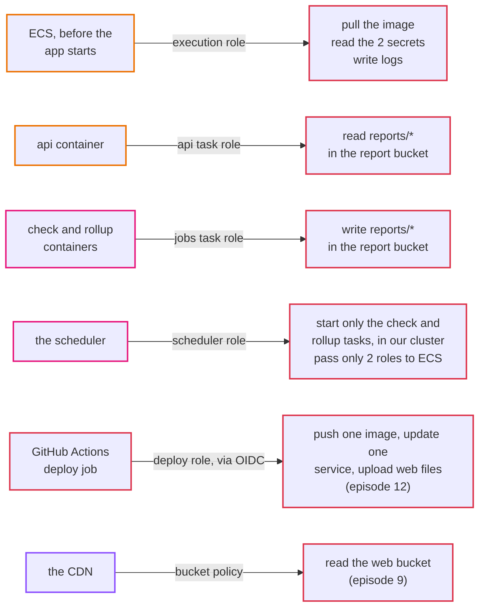
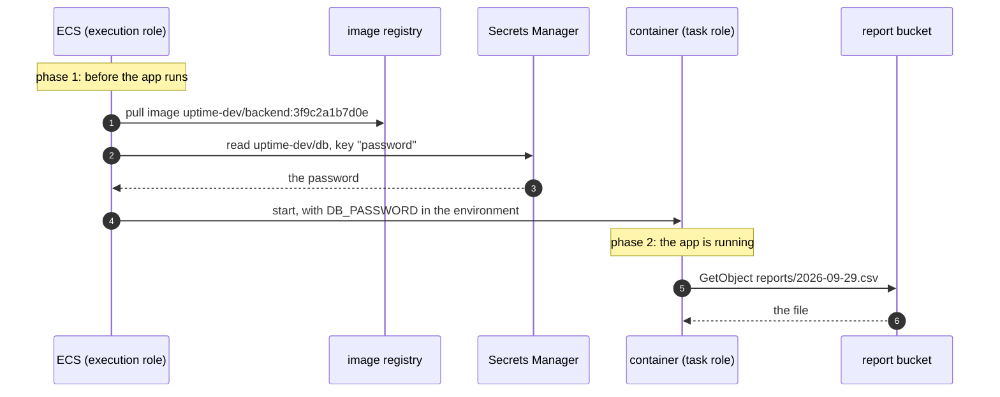
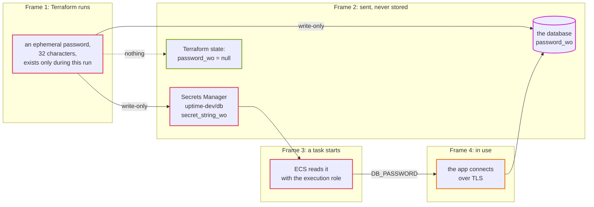

# Episode 6: Identity and secrets

*From Laptop to Tokyo, part two. About 20 minutes.*

> "So the api needs the database password," Zayn said. "On the laptop it's in `compose.yaml`. On AWS I'll put it in an environment variable in the task settings, right?"
>
> "Where anyone who can read the task settings can see it," Kian said. "And it'll end up in the Terraform state file, in a bucket, in plain text. Try again."
>
> "A secrets store, then. The api reads it from there."
>
> "Better. Now: the api asks the secrets store for the password. How does the secrets store know it's the api asking, and not someone who broke into the check job? Or me, from my laptop?"
>
> Zayn thought about it. "It has to know who's asking."
>
> "Everything on AWS has to know who's asking. Every single call. That's this episode."

## The idea: two questions, every time

Every time anything on AWS does anything (reads a file, starts a container, fetches a secret), AWS asks two questions:

1. Who are you? This is *authentication*: proving an identity.
2. Are you allowed to do this, to this thing? This is *authorization*: checking a permission.

On your laptop, you never think about this. You're the only user, and every program runs as you. On AWS there are many actors, and each one needs its own identity with its own, narrow set of permissions. The api is one actor. The check job is another. The service that starts containers is a third. The pipeline that deploys new code is a fourth. You, in the console, are a fifth.

Three principles guide everything in this episode.

Least privilege. Each actor gets exactly what it needs and nothing more. If the api only reads reports, it can't write them. Then a bug in the api that lets an attacker make it call S3 still can't overwrite a report.

Temporary credentials over permanent ones. A password or key that never expires is dangerous in proportion to how long it lives. The better pattern: an actor proves who it is and gets credentials that expire within an hour. If they leak, they stop working soon.

Secrets are read at the last moment, by as few actors as possible. A secret should live in one place built for secrets, be handed only to the thing that needs it, and never be written into code, config files or logs along the way.

And one distinction worth holding onto: episode 5's security groups decide which *machine* may talk to which. That's network identity. This episode decides which *program* may call which AWS service. Both are boundaries, and you need both. A container allowed to reach the database's port still needs the password; a container that has the password still can't reach a database the network won't let it touch.

## The AWS answer: IAM roles

AWS's identity service is called IAM (identity and access management). It's free, and it has a few building blocks you need to know.

| Word | What it means |
|---|---|
| **IAM user** | a permanent identity with a password or long-lived access keys. We avoid these for anything automated. |
| **IAM role** | an identity that something *assumes* to get temporary credentials, usually valid for an hour. Every actor in our system uses a role. |
| **trust policy** | the part of a role that says *who* may assume it: "only ECS tasks", "only the scheduler", "only this GitHub repository". |
| **permission policy** | the part that says *what* the role may do, on which resources. |
| **resource policy** | a policy attached to the thing being accessed (a bucket, a secret) rather than to the caller. Our web bucket has one that says "only our CDN may read me". |
| **`iam:PassRole`** | permission to hand a role to a service. More on this trap below. |

People sign in through IAM Identity Center (single sign-on), never as the account's root user and never with long-lived keys on a laptop.

### Who can call what

Here's every automated actor in the finished system, the role it uses, and what that role allows.

*Six actors, six narrow grants. No actor can do what another one does, and none of them can change the network, the database or IAM itself.*

Identity doesn't show up on the architecture maps in this series, and that's telling. It isn't a box in one place. It's a rule attached to every arrow.

### Two roles for one container

The container roles have a twist that trips up almost everyone. Starting a container on ECS happens in two phases, and each phase uses a different identity.

*The app never calls Secrets Manager itself. ECS reads the secret with its own role and hands it over as an environment variable.*

The execution role is what ECS uses *before* your code runs: pull the image, read the secrets the task definition names, create the log stream. All three kinds of task (api, check, rollup) share one execution role, and it can read exactly two secrets and nothing else.

The task role is what your code uses *while* it runs. The api's task role may read `reports/*` from the report bucket. The jobs' task role may write there. That's the only difference between them, and it's on purpose: the api only shows reports, so it only gets to read them.

The practical upshot: the app has no AWS credentials in its settings at all. It asks the AWS SDK for credentials, and the SDK gets the task role's temporary ones from ECS. Nobody ever copies a key anywhere.

### The `PassRole` trap

The scheduler (episode 10) starts containers for us. Starting a container means handing it an execution role and a task role. So the scheduler needs permission to *pass* roles to ECS.

Here's the trap. If the scheduler's permission said "may pass any role", then anyone who could edit a schedule could start a container with *any* role in the account, including an administrator role, and use that container to act as an administrator. The container becomes a way around every other permission.

So `iam:PassRole` is limited twice: only the execution role and the jobs task role, and only to the ECS tasks service. The deploy role in episode 12 gets the same kind of limit. Whenever you see a service that starts other things, look for `PassRole` and check it's narrow. It's one of the most common privilege escalation paths on AWS.

## Where the secrets live

The system has exactly two secrets: the database password and the admin token. Both live in Secrets Manager, a service that stores secrets encrypted and only hands them to identities you allow.

The interesting part is how the password gets there without ever being written down anywhere else. Follow it, frame by frame.

*Frame 1: Terraform generates a password that exists only while it runs. Frame 2: it sends the password to the database and to Secrets Manager through write-only arguments, which AWS receives and Terraform never records. Frame 3: when a task starts, ECS reads the secret. Frame 4: the app connects with it.*

The password is never in git, never in a `.tfvars` file, and never in the Terraform state file. If you download the state and search it, you find `"password_wo": null`: Terraform knows the argument exists, not what was in it. This uses a feature from Terraform 1.11 (ephemeral values and write-only arguments), and step 03 has you prove it yourself. [ADR 0009](../adr/0009-database-password-write-only-no-rotation.md) has the reasoning.

The admin token is made the same way. The one person who needs it reads it from Secrets Manager in the console, and pastes it into the app.

### Rotation, honestly

Rotating a secret means replacing it with a new one on a schedule. RDS can do this by itself: it keeps the password in Secrets Manager and changes it every 7 days. We didn't turn that on, and it's worth understanding why.

When RDS rotates the password, the running api containers still have the old one in their environment. Their open connections keep working, but every new connection fails until the containers restart. Our api opens new connections all the time (each one lives at most 5 minutes). So automatic rotation would cause an outage every 7 days, until someone noticed and restarted the service.

Instead, rotation is a deliberate step: bump a version number, apply, restart the service. For a few seconds, new connections fail. That's the honest trade-off, written down. The better long-term answer is to have no database password at all (IAM database authentication, where the app asks AWS for a 15-minute login token), and it's on the list for when an auditor asks for regular rotation.

## What it costs

| Item | Tokyo price | Per month |
|---|---|---|
| IAM: users, roles, policies, Identity Center | free | $0 |
| Secrets Manager | $0.40 per secret | $0.80 for two |
| Secrets Manager API calls | $0.05 per 10,000 | about $0.45 (every task start reads two secrets) |
| **Total** | | **about $1.25** |

The cheapest episode in the series, and one of the most important. Security is mostly design, not spending.

## What we didn't pick

**An IAM user with access keys for the app or the pipeline.** Keys that never expire, stored somewhere, with permissions someone has to remember to trim. Every actor here uses a role with temporary credentials instead.

**One role for all the containers.** Simpler, and it would give the api write access to reports and the jobs access they don't need. Two task roles cost nothing extra.

**The password as a plain environment variable in the task definition.** Anyone who can read the task definition, or the Terraform state, could read it.

**Terraform's `random_password` resource.** Easy, but it stores the password in plain text in the state file.

**RDS-managed rotation.** Covered above. Right idea, wrong fit for an app that opens new connections every few minutes.

**SSM Parameter Store instead of Secrets Manager.** It can also store encrypted values, and standard parameters are free. ECS can read from either. We chose Secrets Manager because it's built for secrets that may be rotated later, and the price difference is about a dollar a month. Parameter Store is a perfectly good answer for smaller budgets. We do use it for something that isn't secret: which image version each environment runs (episode 8).

**IAM database authentication, now.** No password at all, and the cleanest design. It needs code in the app to refresh tokens and a separate database user set up with SQL. It's the next step, not the first one.

## What breaks if

The execution role loses permission to read the database secret

New tasks stop before the app even starts, with `ResourceInitializationError: unable to pull secrets`. ECS can't build the container's environment, so it never runs it. Tasks already running are fine, because they got the password when they started. This is a good example of a failure that only shows up at the next deploy, sometimes days after the change that caused it.

The scheduler's role loses <code>iam:PassRole</code>

The scheduler tries to start the check task every minute, and ECS refuses. No task appears, no app log line appears, and the dashboard slowly goes stale. The only trace is an error count on the scheduler's own metrics. That silence is exactly why episode 11 adds an alarm that fires when checks stop happening, whatever the reason.

A teammate adds <code>db_password = "..."</code> to a <code>.tfvars</code> file, "just for dev"

The password is now in git history, readable by anyone with access to the repository, forever, and in the state file too. Deleting the line later doesn't remove it from history. The only fix is to rotate the password. This is why the repo's rules say secrets never go in `.tfvars` or state, and why the design makes that the easy path.

## Check yourself

1. What's the difference between the execution role and the task role? Which one reads the database password?
2. Why does the scheduler need `iam:PassRole`, and why must it be limited to two roles?
3. The api's task role can read reports but not write them. What does that protect against?
4. How can the database password be set on the database without appearing in the Terraform state?
5. Why don't we let RDS rotate the password automatically?

Answers

1. The execution role is used by ECS before the app starts: pull the image, read secrets, create log streams. The task role is used by the app while it runs. The execution role reads the password and puts it in the container's environment; the app never calls Secrets Manager.
2. Starting a task means handing it roles. Without a limit, anyone who can edit a schedule could start a task with an admin role and act as an administrator through it.
3. A bug in the api that lets an attacker make it call S3 still can't overwrite or plant reports.
4. Terraform generates an ephemeral password and sends it through write-only arguments. AWS receives the value; Terraform never records it.
5. Running containers keep the old password in their environment, and our api opens new connections every few minutes. Automatic rotation would break new connections every 7 days until the service was restarted.

## Try it

The secrets and the write-only password are in [Step 03, sections 2 and 8](../steps/03-database-and-secrets.md), including proving the password isn't in the state. The two container roles are in [Step 04, section 4.2](../steps/04-containers-on-ecs.md#42-two-roles). The `PassRole` experiment is in [Step 06, section 6b](../steps/06-scheduled-jobs.md#6-break-it-on-purpose).

> "So every arrow has a lock on it," Zayn said. "The network decides if it can reach, IAM decides if it's allowed."
>
> "And the password only exists in two places, and nobody typed it." Kian nodded. "Good. Now, those two places. One is Secrets Manager. The other one is the thing we've been avoiding. The database."

Next: [Episode 7: Data](07-data.md)
