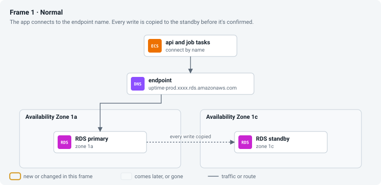
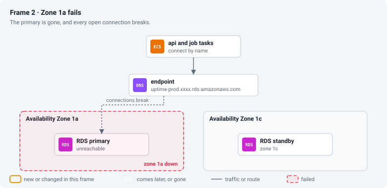
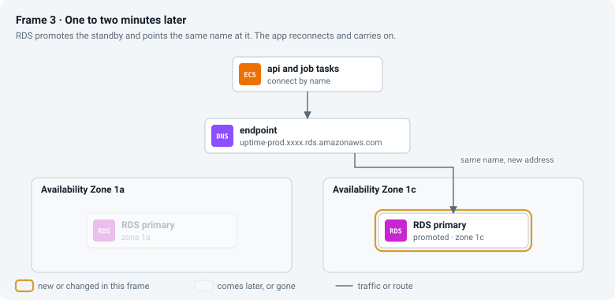
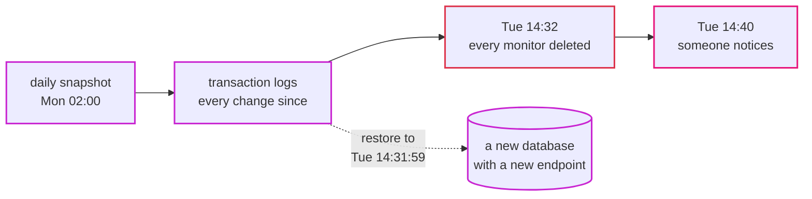

# Episode 7: Data

*From Laptop to Tokyo, part two. About 18 minutes.*

> "Here's a Tuesday," Kian said. "14:32. An admin means to delete one test monitor and deletes all of them instead. Two hundred monitors, typed in by hand over a month. At 14:40 someone notices."
>
> "We'd have a copy," Zayn said. "In the other zone. You said prod gets a standby."
>
> "The standby deleted them too. About a millisecond after the primary did."
>
> Zayn frowned. "Then what was the standby for?"
>
> "A different disaster. That's what this episode is about."

## Start from the disaster

Everything else in the system can be thrown away and rebuilt in minutes: containers, networks, load balancers. They're stateless, meaning they keep nothing between one request and the next, so when one breaks you replace it. The database is different. It's stateful: it holds data you can't get back from anywhere else. And state has to sit somewhere physical, on a disk, in a zone, which is why most hard problems in system design are about state.

The Tuesday story shows the most common confusion about protecting it. There are two separate protections, for two separate kinds of disaster.

A standby is a live copy in another zone. It keeps the database available when hardware or a whole zone fails: the standby takes over, and the app carries on. But it copies every change the moment it happens, mistakes included. Delete every monitor, and the standby deletes them too.

A backup is a copy from the past. It keeps the data durable when something deletes or corrupts it. It does nothing for availability (restoring takes a while), but it's the only thing that gets the monitors back.

You need both. A standby without backups survives a fire and loses to a typo. Backups without a standby survive the typo, but a zone failure leaves you down until someone restores.

Beyond those two, a database needs a machine and a disk that can grow before it fills up, security patches, encrypted connections so nobody in the middle can read or fake the traffic, and no way in from outside (episode 5 already covered that last one). That's a long list of work that never ends, and it's why the team from episode 2 doesn't want to do it by hand.

## RDS for MySQL

RDS (Relational Database Service) runs MySQL for us. It installs it, patches it, backs it up and fails it over. We keep the engine we use locally, MySQL 8.4, so nothing in the app changes.

| | dev and staging | prod |
|---|---|---|
| instance | `db.t4g.micro` (2 vCPU burst, 1 GB memory) | `db.t4g.small` (2 vCPU burst, 2 GB memory) |
| standby in the other zone (Multi-AZ) | no | yes |
| storage | 20 GB gp3, encrypted, grows by itself to 100 GB | same |
| backups kept | 1 day | 7 days |
| deletion protection, final snapshot on delete | off | on |
| cost in Tokyo | about $21 a month | about $77 a month |

Episode 2 worked out that we'd store under 1 GB of real data, so the smallest instances are plenty. None of the interesting decisions here are about size.

Three RDS words come up again later. A DB subnet group is the list of subnets RDS may use; ours holds only the two isolated subnets, so the database and its standby can never land anywhere else. A parameter group is MySQL's settings file as an AWS resource; ours sets `require_secure_transport = 1`, so MySQL refuses any unencrypted connection, even from inside the VPC. And the endpoint is the DNS name the app connects to, like `uptime-prod.xxxx.ap-northeast-1.rds.amazonaws.com`, which keeps pointing at the right machine after a failover.

Backups run at 02:00 Tokyo time. Maintenance (patches and minor upgrades) runs on Mondays at 03:00.

*The map for the data layer: the database in the isolated band, the secrets beside it, and the report bucket outside the VPC, reached through the free S3 endpoint.*

## The other disaster: a zone fails

This is the disaster the standby exists for: prod losing zone `1a`.

*Frame 1: every write reaches the standby before it's confirmed. Frame 2: zone `1a` fails and open connections break. Frame 3: RDS promotes the standby and points the endpoint's name at it; the app reconnects to the same name and carries on.*

It takes one to two minutes. During that time `/api/ready` says `503`, a check or two can't save their results, and then everything carries on without anyone being woken up. Because the endpoint is a name and not an address, the app doesn't need to know anything happened. An app that connected by IP address would still be knocking on the dead machine.

Dev has no standby. If its zone fails, the database is down until AWS recovers the zone, which might take minutes or hours. That was the trade in episode 2, and it saves about $38 a month.

## Back to Tuesday: restoring

RDS takes a snapshot every day and also keeps the transaction logs (the record of every change). Together they let you restore to any second within the backup window: the last day in dev, the last seven in prod. This is called point-in-time restore.

*A restore never overwrites the broken database. It builds a new one as it was at the second you choose.*

The catch is that a restore creates a new database with a new endpoint, and the app is still pointing at the old one. So you either copy the lost monitor rows from the new database into the live one, or point the app at the new endpoint (a settings change and a redeploy). Neither is one click, and the check results between 14:32 and the fix stay missing either way. That's why hands-on step 09 tells you to practice a restore on a quiet day. The first time you do it shouldn't be during the incident.

## Encryption, done properly

The app talks to the database over TLS, the same encryption behind the padlock in your browser. Encryption alone isn't enough, though. If the app accepts any certificate, someone who can get between the app and the database can present their own and receive the password.

So the app checks two things: that the database's certificate was signed by Amazon's RDS certificate authority, and that it belongs to the host name the app meant to reach. The RDS certificate bundle is baked into the container image at build time, and the `DB_TLS_CA` setting turns the check on. Locally that setting is empty and the app talks to the MySQL container in plain text, because on a laptop there's nobody in the middle.

## A quiet slowdown

The `t4g` instances are burstable: they earn CPU credits while quiet and spend them when busy. If a heavy load lasts long enough to use up the credits, the CPU is held down to a low baseline, and the database gets slow even though its CPU graph never shows 100%. Our small, steady load shouldn't get there, but it's the kind of failure you'd never guess from outside, so episode 12 puts an alarm on the credit balance.

## The report files

Rollup writes a CSV file every hour, and the api serves it on the reports page. On the laptop they share a Docker volume. On AWS each Fargate container gets its own disk, which disappears when the container stops. Rollup would write the file, exit, and take the disk with it, and the api never had access to that disk anyway.

So the reports go to S3, AWS's object storage. S3 stores files ("objects") by name, like `reports/2026-09-29.csv`, keeps copies across zones by itself, and costs almost nothing for a few KB a day. Our bucket is private and encrypted, refuses plain HTTP, and deletes reports older than 400 days by itself (a lifecycle rule). The jobs' role may write to it and the api's role may only read, as in episode 6. Traffic from the private subnets goes through the free S3 endpoint.

The code already had a `reports.Store` interface with a "save to a folder" version. The S3 version sits behind the same interface, and the app picks it when `REPORT_BUCKET` is set. Locally nothing changed. ([ADR 0010](../adr/0010-reports-on-s3.md))

## What it costs

| Item | Tokyo price | Dev | Prod |
|---|---|---|---|
| `db.t4g.micro`, single-AZ | about $0.025 an hour | $18.25 | |
| `db.t4g.small`, Multi-AZ (two machines) | about $0.098 an hour | | $71.54 |
| gp3 storage, 20 GB | about $0.138 per GB-month, doubled with Multi-AZ | $2.76 | $5.52 |
| backups within the retention window | free up to the database's size | $0 | $0 |
| S3 report bucket | $0.025 per GB-month | pennies | pennies |
| **Total** | | **about $21** | **about $77** |

Multi-AZ on a `db.t4g.small` adds about $38 a month for a second instance and a second copy of the storage. In prod that buys a minute or two of trouble instead of an outage that lasts until a person notices, restores and repoints the app.

## What we turned down

| Option | Why not | When we'd switch |
|---|---|---|
| MySQL in a container, or on a virtual machine | we'd own disks, backups, patches and failover; Fargate containers don't keep their disks | never, for this team |
| Aurora MySQL | the smallest instance costs about four times a `db.t4g.micro`, plus I/O charges | when one instance can't keep up with writes, or failover must take under 30 seconds |
| Aurora Serverless v2 | the check job writes every minute, so it never pauses, and a small steady load costs more than a micro instance | if checks move to a queue and the database sits idle most of the time |
| staying on MySQL 8.0 | standard support ended in July 2026; staying costs an extended-support fee | never |
| read replicas | we have 20 reads a minute | when dashboards get busy |
| a shared file system (EFS) for reports | per-GB cost, mount points in every zone, another security group, all for a few KB a day | if many containers ever need the same large files |
| CSV files stored inside MySQL | no new service, but files mixed into the database make rows big | never |

[ADR 0008](../adr/0008-rds-mysql-single-az-dev-multi-az-prod.md) and [ADR 0010](../adr/0010-reports-on-s3.md) have the details.

## Check yourself

1. It's the Tuesday incident, in prod, at 14:40. List what you do, in order, to get the monitors back, and say what stays lost.
2. A developer "fixes" a flaky connection by putting the database's current IP address in the app's settings instead of the endpoint name. Everything works for weeks. What happens at the next failover?
3. The app's database graphs look normal, CPU at 30%, but queries have been slow all afternoon. What do you check?

Answers

1. Restore a point-in-time copy to 14:31:59. It becomes a new database with a new endpoint. Then either copy the `monitors` rows from it into the live database, or point the app at the new endpoint and redeploy. Check results from 14:32 until the fix stay missing, and so do any monitors added after 14:31:59 if you switch databases.
2. The endpoint name moves to the promoted standby, but the app keeps connecting to the old address, which is dead. The app stays down until someone notices and fixes the setting.
3. The CPU credit balance. On a `t4g` instance with no credits left, the CPU is held at its baseline, so everything is slow even though the CPU graph looks normal.

## Try it

Build the database by hand, connect over TLS, watch a plain connection get refused, and optionally watch a real failover: [Step 03: Database and secrets](../steps/03-database-and-secrets.md), with its [workbook](../workbook/03-database-and-secrets.md). About three hours; RDS takes a while to create.

**Next:** [Episode 8: Compute](08-compute.md)
