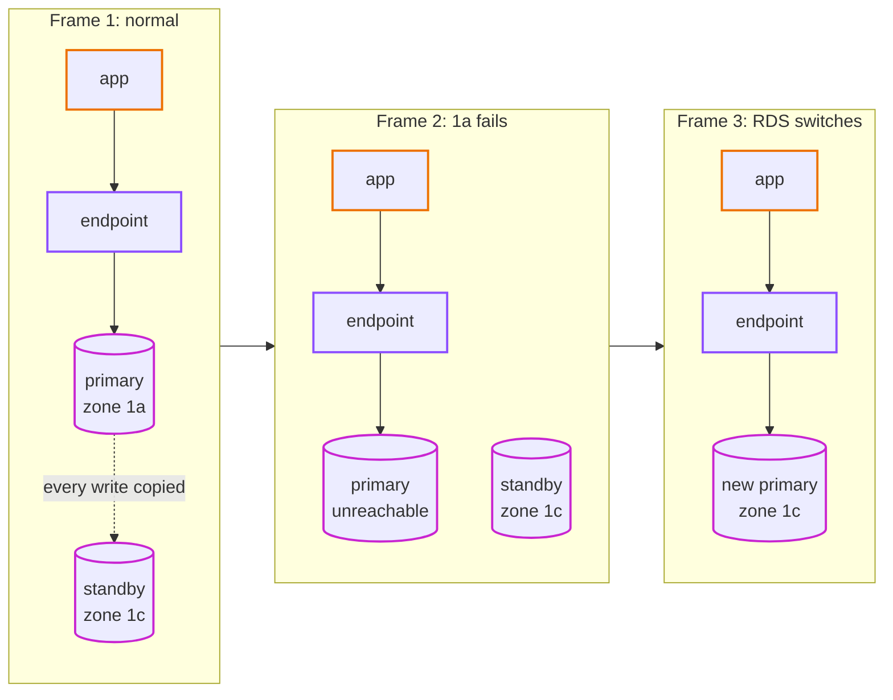
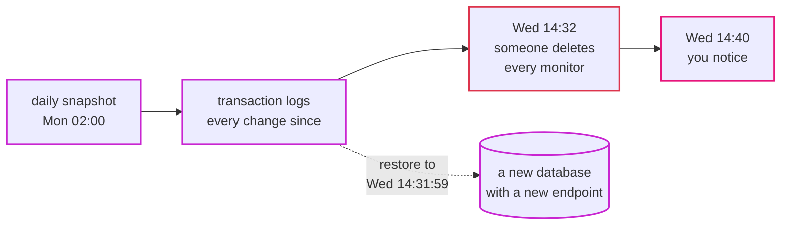

# Episode 7: Data

*From Laptop to Tokyo, part two. About 25 minutes.*

> "The database is easy, though," Zayn said. "It's a MySQL container. I'll run the same image on AWS."
>
> "Sure. And when its disk fills up at 2 a.m., who makes it bigger?"
>
> "I... would, I suppose."
>
> "And the security patch that comes out next month? The backup every night? The test that the backup actually restores? The copy in the other zone for when `1a` goes dark?"
>
> Zayn didn't answer.
>
> "Everything else in this system, we can throw away and rebuild in minutes," Kian said. "Containers, networks, load balancers. The data is the one thing we can't. So it's the one thing where I want someone else doing the boring work, every single night, without being asked."

## The idea: stateless is easy, state is hard

Split everything in a system into two piles.

Stateless things keep nothing that matters between one request and the next. Our api containers are stateless: kill one, start another, and nothing is lost. So are the check and rollup jobs, the load balancer and the network. If they break, you replace them. That's why the rest of the design can be so relaxed about them.

Stateful things hold data you can't get back from anywhere else. For us that's the database (monitors, results, summaries) and the report files. When these break, replacing them isn't enough: you need the data back too.

State has one more awkward property. It has to live somewhere physical, on a disk, in a zone. You can run ten copies of a stateless container in ten places for free, but every copy of your data has to be kept in sync with the others. That's where most of the hard problems in system design live, and why you want as little state as possible, in as few places as possible.

For the state we do have, a database needs a surprising list of things:

- a machine and a disk, sized for the load, that can grow before it fills up
- regular backups, and a way to restore to a moment before something went wrong
- a standby copy somewhere else, for when the machine or its building fails
- security patches and upgrades
- encryption on the wire, so nobody between the app and the database can read or fake the traffic
- no way in from the outside (episode 5 already did this part)

There are two different protections in that list, and people mix them up all the time. A standby keeps the database *available* when hardware fails. A backup keeps the data *durable* when something deletes or corrupts it. A standby is a live copy, so if someone deletes every monitor, the standby deletes them too, a millisecond later. Only a backup from before the mistake gets them back. You need both, for different disasters.

## The AWS answer: RDS for MySQL

RDS (Relational Database Service) runs MySQL for us: it installs it, patches it, backs it up, and fails it over. We keep the same engine we use locally, MySQL 8.4, so nothing in the app changes.

| | dev and staging | prod |
|---|---|---|
| engine | MySQL 8.4 | MySQL 8.4 |
| instance | `db.t4g.micro` (2 vCPU burst, 1 GB memory) | `db.t4g.small` (2 vCPU burst, 2 GB memory) |
| standby in the other zone (Multi-AZ) | no | yes |
| storage | 20 GB gp3, encrypted, grows by itself up to 100 GB | same |
| backups kept | 1 day | 7 days |
| deletion protection | off | on |
| final snapshot when deleted | no | yes |
| cost in Tokyo | about $21 a month | about $77 a month |

Episode 2 said we'd store under 1 GB of real data. The smallest instances are plenty. The interesting decisions aren't about size.

A few RDS pieces worth knowing by name:

- A DB subnet group is the list of subnets RDS may use. Ours holds the two isolated subnets, so the database and its standby can only ever land there.
- A parameter group is MySQL's settings file (`my.cnf`) as an AWS resource. Ours sets `require_secure_transport = 1`: MySQL refuses any connection that isn't encrypted, even from inside the VPC.
- The endpoint is the DNS name the app connects to, like `uptime-dev.xxxx.ap-northeast-1.rds.amazonaws.com`. It keeps pointing at the right machine after a failover, which is the whole trick behind Multi-AZ.

Backups run at 02:00 Tokyo time, and maintenance (patches, minor upgrades) happens on Mondays at 03:00, when nobody is watching the dashboard.

*The map for the data layer: the database in the isolated band, the secrets beside it, and the report bucket outside the VPC, reached through the free S3 endpoint.*

### What a failover looks like

Here's the prod database surviving the loss of zone `1a`, frame by frame.

*Frame 1: every write goes to the primary and is copied to the standby before it's confirmed. Frame 2: zone `1a` fails, and open connections break. Frame 3: RDS promotes the standby and points the endpoint's DNS name at it. The app reconnects to the same name and carries on.*

It takes one to two minutes. During that time the api's `/api/ready` says `503`, a check or two can't save their results, and then everything carries on. Nobody has to wake up. Because the endpoint is a name and not an address, the app doesn't need to know anything happened. That's why the app always connects by name: an IP address would still point at the dead machine.

In dev there's no standby. If the database's zone fails, the database is down until AWS brings it back, which could be minutes or hours. That's the trade we made in episode 2.

### Backups and restores

RDS takes a snapshot every day and also keeps the database's transaction logs, the record of every change. Together they let you restore to any second within the backup window: the last day in dev, the last seven days in prod. This is called point-in-time restore.

*A restore never overwrites the broken database. It builds a new one, as it was at the second you pick. Then you decide what to do with it.*

There's a detail here that surprises people, and it's why step 09 says to practice a restore before you need one. A restore creates a new database with a new endpoint. The app is still pointing at the old one. So you either copy the lost rows across from the new database to the old, or point the app at the new one (a settings change and a redeploy). Either way, it's not one click, and it takes a while. Practicing it once, on a quiet day, turns a panic into a checklist.

### Encryption on the wire, done properly

The app talks to the database over TLS (the same encryption as the padlock in your browser). But encryption alone isn't enough. If the app accepts any certificate, someone who can get between the app and the database can present their own certificate, and the app will happily send them the password.

So the app does two checks. It encrypts the connection, and it checks that the database's certificate was signed by Amazon's RDS certificate authority *and* belongs to the host name it meant to connect to. The RDS certificate bundle is baked into the container image at build time, and the `DB_TLS_CA` setting turns the check on. Locally the setting is empty, and the app talks to the MySQL container in plain text, because there's nobody in the middle to worry about.

### CPU credits: the quiet slowdown

The `t4g` instances are "burstable". They earn CPU credits while they're quiet and spend them when they're busy. If a heavy load lasts long enough to use up all the credits, the CPU is held to a low baseline, and the database gets slow even though its CPU graph never shows 100%. For our steady, tiny load that shouldn't happen, but it's the kind of thing you'd never guess from the outside, so episode 11 puts an alarm on the credit balance.

## The report files

The rollup job writes a CSV file every hour, and the api serves it on the reports page. Locally, both containers share a Docker volume. On AWS that doesn't work, and the reason is worth understanding.

Each container on Fargate gets its own small disk that disappears when the container stops. The rollup job writes the file to its disk, exits, and the disk is gone before the api could ever see it. The api containers never had access to that disk in the first place.

So the reports go to S3, AWS's object storage. S3 holds files ("objects") by name, like `reports/2026-09-29.csv`, keeps copies across several zones by itself, and costs almost nothing for a few KB a day. Our bucket is private, encrypted, refuses plain HTTP, and deletes reports older than 400 days by itself (a *lifecycle rule*). The jobs' role may write to it; the api's role may only read ([episode 6](06-identity-and-secrets.md)). Traffic to it from the private subnets goes through the free S3 endpoint, never the NAT gateway.

The code already had a `reports.Store` interface with a "save to a folder" version. The S3 version sits behind the same interface, and the app picks it when the `REPORT_BUCKET` setting is present. Locally, nothing changes. This is a small example of a big idea: when the code depends on an interface instead of a specific place, moving to the cloud is a new implementation, not a rewrite ([ADR 0010](../adr/0010-reports-on-s3.md)).

## What it costs

| Item | Tokyo price | Dev, per month | Prod, per month |
|---|---|---|---|
| `db.t4g.micro`, single-AZ | about $0.025 an hour | $18.25 | |
| `db.t4g.small`, Multi-AZ (two machines) | about $0.098 an hour | | $71.54 |
| gp3 storage, 20 GB | about $0.138 per GB-month (doubled with Multi-AZ) | $2.76 | $5.52 |
| backups within the retention window | free up to the size of the database | $0 | $0 |
| S3 report bucket | $0.025 per GB-month | pennies | pennies |
| **Total** | | **about $21** | **about $77** |

Multi-AZ on a `db.t4g.small` adds about $38 a month: a second instance and a second copy of the storage. For prod it's worth every cent. A zone failure or a maintenance reboot costs a minute or two instead of the time it takes a person to notice, restore a backup and repoint the app.

## What we didn't pick

**MySQL in a container on ECS, or on a virtual machine.** Cheapest on paper. We'd own the disk, the backups, the patches and the failover, which is precisely the work the requirements said we don't want. Also, containers on Fargate don't keep their disks.

**Aurora MySQL.** AWS's own MySQL-compatible engine, with faster failover and storage that grows by itself. The smallest instance costs about four times a `db.t4g.micro`, and storage I/O is billed separately. We'd move to it if one instance couldn't keep up with writes, or if failover had to be under 30 seconds.

**Aurora Serverless v2.** Scales with load and can pause when idle. Our check job writes every minute, so it would never pause, and a small steady load costs more than a micro instance. It becomes interesting if the checks ever move to a queue and the database is idle most of the time.

**Staying on MySQL 8.0.** Standard support for RDS MySQL 8.0 ended in July 2026. Staying on it now costs an extended-support fee on top of the instance. 8.4 is the long-term release, and it's what we run locally too.

**Read replicas.** Copies of the database that serve reads, for apps with a lot of read traffic. Episode 2 worked out 20 reads a minute. We'd be adding a machine to solve a problem we don't have.

**A shared network file system (EFS) for the reports.** The code wouldn't need to change, but it costs per GB, needs mount points in every zone and another security group, all for a few KB of CSV a day.

**The CSV files inside MySQL.** No new service, but it mixes files into the database and makes the rows big.

All of these are in [ADR 0008](../adr/0008-rds-mysql-single-az-dev-multi-az-prod.md) and [ADR 0010](../adr/0010-reports-on-s3.md).

## What breaks if

Someone deletes every monitor by mistake in prod

The standby deletes them too, instantly, because it copies every write. Multi-AZ doesn't help here at all. A point-in-time restore to a second before the mistake builds a new database; you then copy the monitor rows back into the live one (or switch the app to the new endpoint). The check results between the mistake and the fix are simply missing. Seven days of backups gives you a week to notice. This is the case you practice.

The disk fills up

It shouldn't: storage grows by itself up to 100 GB, and episode 2 worked out we use under 1 GB. If something unexpected writes a lot (a bug that stops rollup from deleting old results, say), the growth buys time, and an alarm fires when free space drops under 2 GB (episode 11).

Someone connects to the database without TLS

MySQL refuses: `Connections using insecure transport are prohibited while --require_secure_transport=ON.` That's the parameter group doing its job, and it applies to everyone, including an admin on the debug host who forgot a flag.

The dev database's zone fails

Dev has no standby. The database is unavailable until AWS recovers the zone. The page loads (`/api/health` is fine), the list fails (`/api/ready` says `503`), and no checks are saved. We decided in episode 2 that this is acceptable for dev, and it saves about $38 a month there.

## Check yourself

1. What's the difference between what a standby protects you from and what a backup protects you from?
2. Why does the app connect to the database by name and not by IP address?
3. A point-in-time restore finishes. Is the app now using the restored data? Why or why not?
4. The app encrypts its database connection but doesn't check the certificate. What can still go wrong?
5. Why can't the rollup job just write its CSV to the container's own disk on Fargate?
6. Why does prod pay for Multi-AZ and dev doesn't?

Answers

1. A standby keeps the database available when hardware or a zone fails. A backup keeps the data safe from deletion or corruption, which a standby would copy instantly.
2. After a failover, the endpoint name points at the new primary. An IP address would still point at the machine that failed.
3. No. A restore creates a new database with a new endpoint. You have to copy the data across or point the app at the new endpoint.
4. Someone who can get between the app and the database could present their own certificate, pretend to be the database, and read the password and every query.
5. Each Fargate task's disk disappears when it stops, and the api containers never had access to it anyway. The file has to go somewhere shared: S3.
6. In prod a zone failure or maintenance reboot should cost a minute or two, not an outage until someone restores a backup. In dev an outage costs nothing, and Multi-AZ would more than double the database bill.

## Try it

Build the database by hand, connect to it over TLS, watch a plain connection get refused, and optionally watch a real failover: [Step 03: Database and secrets](../steps/03-database-and-secrets.md), with its [workbook](../workbook/03-database-and-secrets.md). About three hours; RDS takes a while to create.

> "So the data lives in two places," Zayn said. "Rows in RDS, files in S3. Both backed up by someone who isn't me."
>
> "And nothing else in the system keeps anything that matters." Kian drew a line under the database. "Which means everything above this line can be thrown away and rebuilt whenever we like. That's what makes the next part easy. Let's go and run your code."

Next: [Episode 8: Compute](08-compute.md)
