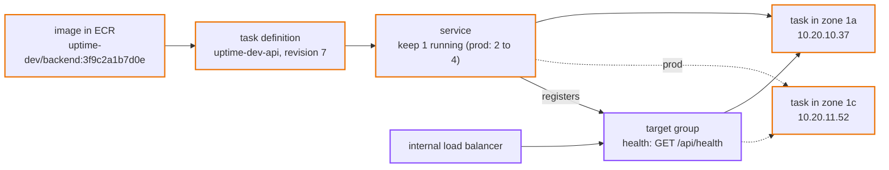
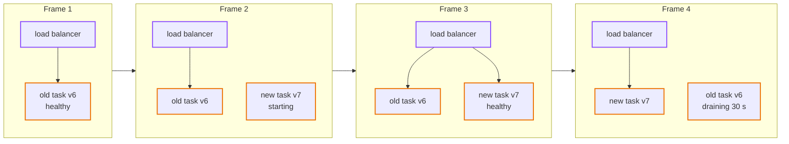

# Episode 8: Compute

*From Laptop to Tokyo, part two. About 25 minutes.*

> "OK, the fun part," Zayn said. "I rent a server, install Docker, and run my containers on it. Like the laptop, but bigger."
>
> "You could. Then you own a server. Its operating system needs patches every month. When it runs out of memory at night, someone restarts it. When its zone fails, you need a second one in the other zone, and something to spread traffic across both. When you deploy, something has to start the new containers, check they work, and stop the old ones without dropping requests."
>
> "That sounds like a lot of somethings."
>
> "It is. The question for this episode is how many of those somethings we want to own ourselves." Kian held up a hand, fingers spread. "I'd like the answer to be zero."

## The idea: what running code really involves

On the laptop, "running the api" meant `docker compose up`. In production, keeping code running involves a whole set of jobs, and most of them have nothing to do with your code:

- Packaging. Build the code into an image once, store it somewhere safe, and give each build a name that always means exactly that build.
- Placing. Find a machine with enough CPU and memory, in the right network, in the right zone.
- Configuring. Hand the running copy its settings and secrets, without baking them into the image.
- Keeping alive. Notice when a copy crashes or stops answering, and replace it.
- Spreading traffic. Put something in front that sends each request to a copy that's healthy, and stops sending to one that isn't.
- Replacing versions. Roll out a new version without dropping requests, and roll back by itself if the new version doesn't work.
- Looking after the machines. Patching, replacing broken hardware, scaling the fleet.

You can do each of these yourself, or hand it to a service. The spectrum goes from renting a bare virtual machine (you do almost everything) to handing over a single function and letting the provider do the rest. Somewhere in the middle is "I give you a container, you run it". Our requirements (two people, no night shifts) push us as far toward "the provider does it" as the app's shape allows.

## The AWS answer: ECS on Fargate

Here are the pieces, with the job each one takes over.

| AWS piece | What it is | The job it takes |
|---|---|---|
| **ECR** (Elastic Container Registry) | a private store for container images | packaging |
| **ECS** (Elastic Container Service) | runs containers for you | keeping alive, replacing versions |
| **Fargate** | the ECS mode where AWS also runs the machines; you only say how much CPU and memory | looking after the machines, placing |
| **task definition** | the recipe: image, command, CPU, memory, settings, secrets, where logs go | configuring |
| **task** | one running copy of a task definition, with its own network card and private IP | |
| **service** | keeps N tasks running, replaces dead ones, registers them with the load balancer, does rolling deploys | keeping alive, replacing versions |
| **Application Load Balancer** (ALB) and **target group** | sends each request to a healthy task, and checks their health every 15 seconds | spreading traffic |

With Fargate there's no server anywhere in our account. An ECS cluster is just a label for our tasks; there are no machines in it.

*One image, one recipe, one service. The service decides how many tasks run and tells the load balancer where they are.*

### Our sizes

| | dev and staging | prod |
|---|---|---|
| api task size | 0.25 vCPU, 0.5 GB memory | 0.5 vCPU, 1 GB memory |
| api tasks | 1 | 2 to 4, scaling on CPU at 60% |
| CPU type | ARM (Graviton) | ARM (Graviton) |
| log retention | 14 days | 90 days |

Episode 2 worked out 20 reads a minute. The smallest Fargate size handles that easily. Prod runs two tasks, one per zone, so the page survives a zone failing, and can grow to four if CPU climbs.

We use ARM processors (AWS's Graviton), which are about 20% cheaper than x86 on Fargate for the same size. Go compiles for ARM with no code changes, and the Dockerfile cross-compiles, so building an ARM image on an ordinary laptop takes seconds and needs no emulation.

The check and rollup jobs have their own task definitions, from the same image with a different command and the jobs security group. Nothing keeps them running: the scheduler starts one when it's time, it runs, and it stops. That's episode 10.

*The map for compute: the internal load balancer and the tasks in the private band, with the services they read from outside the VPC.*

### Names that never lie

Every image is tagged with the git commit it was built from, like `3f9c2a1b7d0e`, and the registry is set to immutable tags: once a tag exists, nobody can push a different image under the same name. So a tag always means exactly one image, byte for byte. A rollback is "run `3f9c2a1b7d0e` again", and you get exactly what ran before.

Which tag each environment should run is stored in one place: a parameter called `/uptime-dev/image-tag` in SSM Parameter Store. Deploying means writing a new tag there and applying the compute layer. Every apply reads it, whether you run it or the pipeline does. Nobody has to remember or type the current version, so nobody rolls the app back by accident ([ADR 0011](../adr/0011-ecs-fargate-arm-with-pinned-image-tags.md)).

We never use a `latest` tag. "Latest" means something different every hour, and a task that restarts at 3 a.m. might pick up an image nobody has tested.

### The start-up order, without Compose

Remember the start-up order from episode 3: the tables must exist before the api starts. Compose enforced that on the laptop. On AWS, each api task has two containers from the same image. The first, `migrate`, creates or updates the tables and exits. The second, `api`, only starts if `migrate` exited with code 0. This is called an init container.

When several api tasks start at once (a deploy in prod, say), all their `migrate` containers try to change the tables at the same moment. They take turns on a MySQL lock called `uptime-migrate`: the first one does the work, the others wait, then find nothing to do ([ADR 0012](../adr/0012-migrate-as-init-container.md)). It's the same locking trick as the check job, used for a different reason.

### A task's life

Here's what happens between "the service wants a task" and "the task gets traffic".

```mermaid
flowchart LR
    prov["PROVISIONING<br/>Fargate finds capacity,<br/>adds a network card<br/>in a private subnet"] --> pend["PENDING<br/>pull the image,<br/>read the secrets"]
    pend --> mig["migrate runs<br/>and exits 0"]
    mig --> run["api starts<br/>RUNNING"]
    run --> init["target: initial<br/>health checks start"]
    init --> healthy["target: healthy<br/>after 2 passes in a row"]
    healthy --> traffic["receives requests"]
    traffic --> drain["draining<br/>30 s to finish<br/>open requests"]
    drain --> stop["SIGTERM, then STOPPED"]
    classDef compute stroke:#ED7100,stroke-width:2px
    classDef network stroke:#8C4FFF,stroke-width:2px
    classDef security stroke:#DD344C,stroke-width:2px
    class prov,run,mig,stop compute
    class pend security
    class init,healthy,traffic,drain network
```

*The whole trip from provisioning to healthy takes a minute or so. The load balancer sends nothing to a task until it has passed two health checks in a row.*

Almost every "my task won't start" problem on ECS happens in the second box. If the task can't reach the registry (no route to the NAT, no S3 endpoint), you get `CannotPullContainerError`. If its execution role can't read a secret, you get `ResourceInitializationError: unable to pull secrets`. Once you know the order, the error message tells you which box failed.

The health check asks `/api/health`, never `/api/ready`, for the reason from episode 1: a short database hiccup must not make every task look broken at once.

### A rolling deploy, frame by frame

Here's a new version going out with no downtime.

*Frame 1: the old version serves everything. Frame 2: ECS starts the new version next to it; nothing changes for users. Frame 3: the new task passes its health checks and starts getting requests. Frame 4: the old task stops getting new requests, has 30 seconds to finish the ones it has, and stops.*

And a bad deploy? Say the new image crashes on start. Frame 2 never becomes Frame 3: the new task never passes its health checks, so the load balancer never sends it a single request. ECS tries a few more times, then the deployment circuit breaker gives up and rolls the service back to the last version that worked. Users never notice. The old task served everyone the whole time.

### Who owns which number

One detail from the Terraform shows a habit worth having. The service's "how many tasks" setting is marked as *ignored* by Terraform. Why? In prod, autoscaling changes that number as CPU goes up and down. If Terraform also owned it, every apply would reset it to whatever the code said, fighting the autoscaler. So each setting has exactly one owner. If you scale the service to zero by hand in the console, a Terraform apply won't bring it back, because Terraform doesn't own that number any more. Knowing which tool owns which setting is part of running a system.

## What it costs

| Item | Tokyo price | Dev, per month | Prod, per month |
|---|---|---|---|
| Fargate ARM, vCPU | $0.04045 per vCPU-hour | | |
| Fargate ARM, memory | $0.00442 per GB-hour | | |
| api tasks | | $8.99 (1 task, 0.25 vCPU, 0.5 GB) | $35.96 (2 tasks, 0.5 vCPU, 1 GB) |
| load balancer (internal, low traffic) | $0.0243 an hour, plus capacity units | $18.30 | $18.30 |
| ECR image storage | $0.10 per GB-month | pennies | pennies |

The load balancer costs twice as much as the api it sits in front of, in dev. That's normal for small apps, and it's worth it: it's what makes health checks, zero-downtime deploys and two-zone spreading possible. Because it's internal, it doesn't pay for public IP addresses.

## What we didn't pick

**ECS on EC2 (our own servers in the cluster).** Cheaper per vCPU at high, steady load. We'd patch and scale the machines ourselves. When we run many services with steady load, Savings Plans or EC2 become worth it.

**EKS (Kubernetes).** Very capable, and a lot to learn and run. The control plane alone costs $0.10 an hour, about $73 a month, more than our whole api. Kubernetes starts making sense when you have many services and a team to run the platform.

**Lambda (functions).** Great for short, event-driven jobs. The api would need an adapter, and the check job holds a database lock and makes many outbound connections at once, which fits a container better. Episode 10 comes back to Lambda for the check job specifically.

**x86 processors.** Work everywhere, and cost about 20% more. We'd switch back only if a library we need didn't support ARM.

**A `latest` tag, or the version as a Terraform variable.** "Latest" changes under you. A variable has to be typed correctly on every apply, and one typo rolls the app back.

**Running migrations inside the api command at start-up.** Simple, but then every api process needs permission to change the schema, and a failed migration looks like a crashing api. The init container keeps the two apart.

**A one-off migration task run by the pipeline before each deploy.** The classic answer, and the one we'll switch to when we need migrations that rename or delete columns, which must run exactly once in a planned order. Until then, the init container lets one apply deploy everything in the right order.

## What breaks if

These are all real experiments in [step 04](../steps/04-containers-on-ecs.md#6-break-it-on-purpose).

Someone stops the running api task by hand

Within a minute the service notices it has fewer tasks than it wants and starts a new one. The load balancer shows the old IP draining and the new one going from initial to healthy. In dev, with one task, the page is down for that minute. In prod, the task in the other zone carries the traffic and nobody notices.

A deploy points at an image tag that doesn't exist

New tasks fail with `CannotPullContainerError`. They never become healthy, so they never get traffic. After a few failures the circuit breaker rolls the service back. The old task kept serving the whole time. A loop of `curl` against the health endpoint never fails once.

Someone removes the rule that lets the load balancer reach the api

Health checks start timing out, the target goes unhealthy, and the load balancer returns `502` or `504`. Then the service replaces the task, because the load balancer says it's broken, and the new one is unhealthy too, for the same reason. It looks like the app is crashing in a loop. It isn't; it's a firewall rule. This is the kind of failure where knowing the order of the boxes saves an hour.

## Check yourself

1. What's the difference between a task definition, a task and a service?
2. A task stops with `CannotPullContainerError: ... i/o timeout`, and the tag is correct. Where do you look?
3. Why is the image tag kept in SSM instead of in a Terraform variable?
4. Two api tasks start at the same moment. What stops both `migrate` containers from changing the tables at once?
5. You deploy a broken image. What do users see?
6. Why does Terraform ignore the service's desired task count?

Answers

1. A task definition is the recipe. A task is one running copy of it. A service keeps a number of tasks running, replaces dead ones and handles deploys.
2. The network path to the registry: the private route to the NAT gateway, the NAT gateway itself, and the S3 endpoint for image layers. Also that the security group allows outbound 443.
3. So every apply, by anyone, runs the version that was chosen last. A variable has to be typed each time, and a wrong one silently rolls the app back.
4. The MySQL lock `uptime-migrate`. The second waits for the first, then finds nothing to do.
5. Nothing. The new tasks never become healthy, so they never get traffic, and the circuit breaker rolls back while the old tasks keep serving.
6. In prod, autoscaling owns that number. If Terraform owned it too, every apply would undo the autoscaler's decisions.

## Try it

Push an image, run the api behind an internal load balancer, deploy a change with no downtime, and watch a bad deploy roll itself back: [Step 04: Containers on ECS](../steps/04-containers-on-ecs.md), with its [workbook](../workbook/04-containers-on-ecs.md). About four hours.

> "It runs," Zayn said, looking at the `{"status":"ready"}` on the debug host. "On AWS. In two zones."
>
> "It does. And nobody on the internet can reach it." Kian smiled. "The load balancer is internal, the tasks are private, the database is isolated. We built a very safe room with no door. Now we need a front door, and a lock on it."

Next: [Episode 9: Front door](09-front-door.md)
