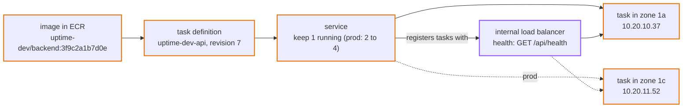
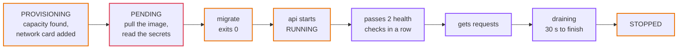
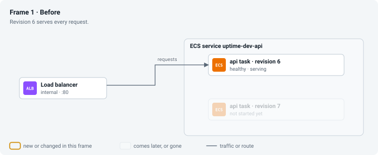
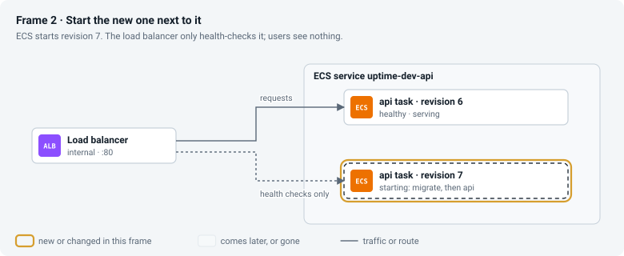
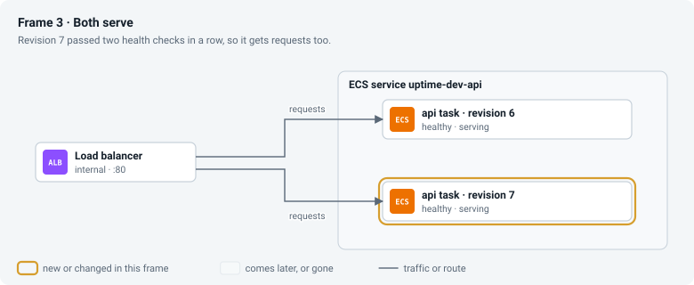
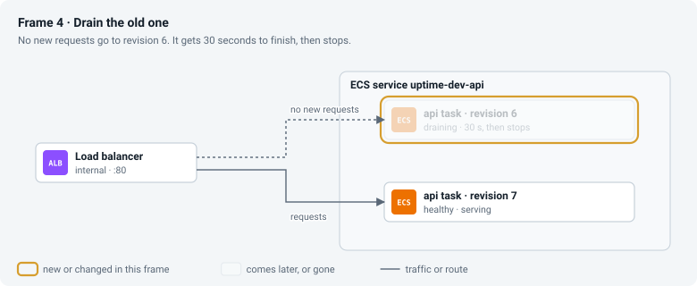

# Episode 8: Compute

*From Laptop to Tokyo, part two. About 18 minutes.*

> "OK, the fun part," Zayn said. "I rent a server, install Docker, run my containers. The laptop, but bigger."
>
> "You could. Then you own a server. It needs patching every month. Someone restarts it when it runs out of memory at night. You need a second one in the other zone, and something to spread traffic across both. And every deploy, something has to start the new containers, check they work, and stop the old ones without dropping requests."
>
> "That's a lot of somethings."
>
> "How many of them do you want to do yourself?"
>
> "Zero," Zayn said. "I want to write Go."

## What running code really takes

On the laptop, running the api meant `docker compose up`. In production, keeping code running is a set of jobs, and most of them have nothing to do with your code.

First, packaging: build the code into an image once, store it somewhere safe, and name each build so the name always means exactly that build. Then placing: find a machine with enough CPU and memory, in the right network and the right zone. Configuring: hand the running copy its settings and secrets without baking them into the image. Keeping alive: notice when a copy crashes or stops answering, and replace it. Spreading traffic: put something in front that sends each request to a healthy copy and stops sending to a sick one. Replacing versions: roll out a new version without dropping requests, and roll back by itself if the new one doesn't work. And under all of it, looking after the machines.

You can do each of those yourself or hand it to a service. The options run from renting a bare virtual machine (you do nearly everything) to handing over a single function (the provider does the rest). In the middle is "here's a container, you run it", and that's where we want to be.

## ECS on Fargate

ECR (Elastic Container Registry) is a private store for container images. ECS (Elastic Container Service) runs containers. Fargate is the ECS mode where AWS also runs the machines, so you only say how much CPU and memory each copy gets. With Fargate there's no server anywhere in our account; an ECS cluster is just a label.

A task definition is the recipe: which image, which command, how much CPU and memory, which settings and secrets, where the logs go. A task is one running copy of it, with its own network card and private IP. A service keeps a chosen number of tasks running, replaces any that die, registers them with the load balancer, and handles deploys. The Application Load Balancer sends each request to a healthy task, checking every task's health every 15 seconds.

*One image, one recipe, one service. The service decides how many tasks run and tells the load balancer where they are.*

Dev runs one api task with 0.25 vCPU and 0.5 GB of memory. Episode 2 worked out 20 reads a minute, and the smallest size handles that easily. Prod runs two tasks of 0.5 vCPU and 1 GB, one per zone so the page survives a zone failing, and can grow to four if CPU passes 60%. Logs are kept 14 days in dev and 90 in prod.

The tasks run on ARM processors (AWS Graviton), which are about 20% cheaper on Fargate than x86 for the same size. Go compiles for ARM with no code changes, and the Dockerfile cross-compiles, so building an ARM image on an ordinary laptop takes seconds and needs no emulation.

The check and rollup jobs get their own task definitions from the same image, with a different command and the jobs security group. Nothing keeps them running: the scheduler starts one when it's due, it does its work, and it stops. That's episode 11.

*The map for compute: the internal load balancer and the tasks in the private band, with the services they read from outside the VPC.*

## Names that never lie

Every image is tagged with the git commit it was built from, like `3f9c2a1b7d0e`, and the registry uses immutable tags: once a tag exists, nobody can push a different image under it. So a tag means one exact image, byte for byte, and a rollback is "run `3f9c2a1b7d0e` again."

The tag each environment should run is stored in one place, a parameter called `/uptime-dev/image-tag` in SSM Parameter Store. To deploy, you write a new tag there and apply the compute layer. Every apply reads it, whoever runs it, so nobody has to remember or type the current version and nobody rolls the app back by accident with a typo ([ADR 0011](../adr/0011-ecs-fargate-arm-with-pinned-image-tags.md)). There's no `latest` tag anywhere. "Latest" means something different every hour, and a task that restarts at 3 a.m. could pick up an image nobody tested.

## The start-up order, without Compose

> "The migrate container," Zayn said. "On the laptop it ran once before the api. What runs it here?"
>
> "Each api task can have two containers. The first runs migrate and exits; the second only starts if the first succeeded."
>
> "Then in prod, when two or four tasks start together, that's two or four migrations changing the same tables at the same moment."
>
> Kian stopped. "I hadn't thought of that. Good catch."

This is the init container pattern. Each api task has two containers from the same image: `migrate` runs first and exits, and `api` starts only if `migrate` exited with code 0. When several tasks start at once, their `migrate` containers take turns on a MySQL lock called `uptime-migrate`. The first one does the work, and the others wait, then find nothing to do ([ADR 0012](../adr/0012-migrate-as-init-container.md)). Zayn borrowed the idea from the check job's lock.

## A task's life

Everything between "the service wants a task" and "the task gets traffic":

*Provisioning to healthy takes about a minute. The load balancer sends nothing to a task until it has passed two health checks in a row.*

Most "my task won't start" problems on ECS happen in the second box. If the task can't reach the registry (no route to the NAT gateway, no S3 endpoint), it stops with `CannotPullContainerError`. If the execution role can't read a secret, it stops with `ResourceInitializationError: unable to pull secrets`. Knowing the order, you can tell from the error which box failed.

The health check asks `/api/health`, for the reason in episode 1: a short database hiccup must not make every task look broken at once.

## A rolling deploy, frame by frame

A new version going out with no downtime. The boxes stay put; watch the arrows and the ring.

*Frame 1: the old version serves everything. Frame 2: ECS starts the new version beside it and the load balancer only checks its health, so users see nothing. Frame 3: the new task passes two checks in a row and starts getting requests. Frame 4: the old task stops getting new requests, has 30 seconds to finish the ones it has, and stops.*

Now suppose the new image crashes on start. Frame 2 never becomes Frame 3: the new task never passes a health check, so it never receives a single request. ECS tries a few more times, then the deployment circuit breaker gives up and rolls the service back to the last version that worked. The old task has been serving everyone throughout, so users never notice.

## Who owns which number

Terraform is told to ignore the service's "how many tasks" setting. In prod, autoscaling changes that number as CPU rises and falls, and if Terraform owned it too, every apply would reset it and fight the autoscaler. So each setting has exactly one owner. The side effect: if you scale the service to zero by hand, a Terraform apply won't bring it back, because Terraform no longer owns that number.

## What it costs

Fargate on ARM costs $0.04045 per vCPU-hour and $0.00442 per GB-hour. For dev's single small task that's $8.99 a month; prod's two larger tasks cost $35.96. The internal load balancer costs about $18.30 a month at low traffic ($0.0243 an hour plus capacity units), and image storage in ECR costs pennies.

In dev the load balancer costs twice as much as the api behind it. That's normal for small apps, and it's what pays for health checks, zero-downtime deploys and spreading across zones. Being internal, it doesn't pay for public addresses.

## What we turned down

ECS on our own EC2 servers is cheaper per vCPU under heavy, steady load, but we'd patch and scale the machines. It becomes worth it, along with Fargate Savings Plans, when there are many services with steady traffic.

Kubernetes, through EKS, is very capable and a lot to learn and run. Its control plane alone costs $0.10 an hour, about $73 a month, which is more than our whole api. It starts to make sense with many services and a team to run the platform.

Lambda is excellent for short, event-driven jobs. The api would need an adapter, and the check job holds a database lock and opens many outbound connections at once, which suits a container better. Episode 11 comes back to Lambda for the check job specifically.

Running migrations inside the api command at start-up is simpler, but then every api process needs permission to change the schema, and a failed migration looks like a crashing api. A one-off migration task run by the pipeline is the classic answer, and we'll switch to it the day we need migrations that rename or drop columns, which must run exactly once in a planned order. Until then, the init container lets a single apply deploy everything in the right order.

## Check yourself

1. A task stops with `CannotPullContainerError: ... i/o timeout`, and the tag is definitely right. Where do you look?
2. Someone removes the security group rule that lets the load balancer reach the api. What happens over the next few minutes, and why does it look like the app is crashing in a loop?
3. At night, someone scales the prod service to zero by hand in the console. The next morning a colleague runs a Terraform apply to fix it. What happens?

Answers

1. The network path to the registry: the private route to the NAT gateway, the NAT gateway itself, and the S3 endpoint for image layers. Then check that the task's security group allows outbound 443.
2. Health checks start timing out, the target turns unhealthy, and the load balancer returns `502` or `504`. The service then replaces the "broken" task, and the new one fails its health checks for the same reason. It looks like a crash loop, but it's a missing firewall rule.
3. Nothing. Terraform ignores the desired task count because autoscaling owns it. Someone has to set it back in the console (or let autoscaling do it, if its minimum is above zero).

## Try it

Push an image, run the api behind an internal load balancer, deploy a change with no downtime, and watch a bad deploy roll itself back: [Step 04: Containers on ECS](../steps/04-containers-on-ecs.md), with its [workbook](../workbook/04-containers-on-ecs.md). About four hours.

> The debug host printed `{"status":"ready"}`. Zayn read it twice. "It runs. On AWS."
>
> "And nobody on the internet can reach it," Kian said. "The load balancer is internal, the tasks are private and the database is isolated. It's a very safe room with no door."

**Next:** [Episode 9: Being found](09-being-found.md)
