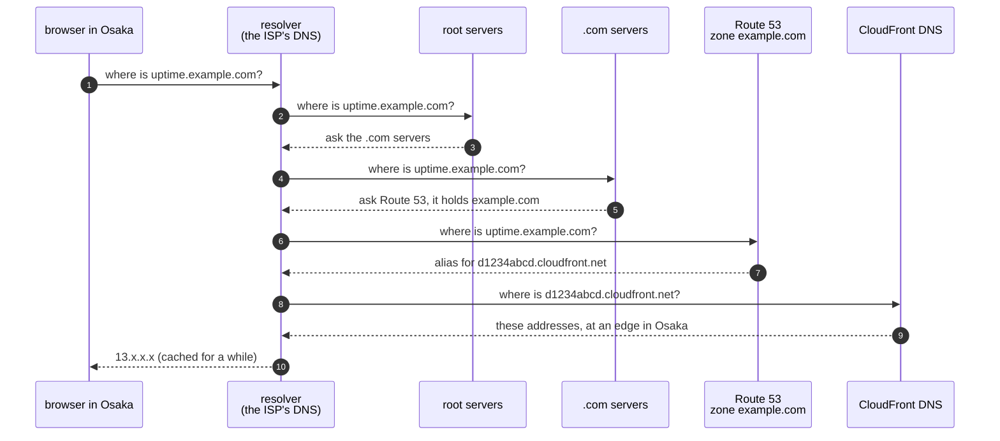

# Episode 9: Being found

*From Laptop to Tokyo, part two. About 12 minutes.*

> The client wrote back: *What's the address? We'd like to send it to our staff.*
>
> "Easy," Zayn said. "CloudFront gives us one. Something like `d1234abcd.cloudfront.net`."
>
> "And next spring, when we tear dev down and rebuild it, or move prod to its own account?"
>
> "Then it's..." Zayn stopped. "A different random name."
>
> "And two hundred people have the old one bookmarked." Kian opened a new tab. "Before we build the front door, let's work out how people find it, and how their browser knows it's really us."

## Two jobs before the first request

Episode 8 ended with a safe room and no door. The next two episodes build the door. This one covers the two jobs that happen before any page loads, and episode 10 covers what happens once the request arrives.

The first job is being findable. People type names, not IP addresses, so something has to turn `uptime.example.com` into an address the browser can connect to. That's DNS (the Domain Name System), the internet's phone book.

The second job is proving who you are. When the browser connects, it needs proof that it reached the real site and not an impostor, and the conversation needs to be encrypted. That's TLS, the protocol behind the padlock in the address bar, and it relies on a certificate: a signed document saying "this key belongs to this name", vouched for by an authority the browser already trusts.

## Being found: DNS

You don't strictly need your own domain. Every CloudFront distribution (a CDN setup, more in episode 10) gets a name like `d1234abcd.cloudfront.net` with a working certificate, and the app works there. But that name is made up by AWS, and a new distribution gets a new one. Hands-on step 09 in this repo tears an environment down and rebuilds it, and the address changes every time. A client's staff need an address that never changes, so production gets its own domain.

The first time a browser in Osaka looks up `uptime.example.com`, this happens:

*Steps 2 to 7 only happen the first time; after that the resolver remembers. In step 9, CloudFront's own DNS picks a site close to the user.*

Route 53 is AWS's DNS service. A hosted zone is where it keeps the records for one domain, at $0.50 a month. The record for `uptime.example.com` is an alias, a Route 53 feature that points straight at the CloudFront distribution without the extra lookup an ordinary CNAME record would add. The domain itself costs about $15 a year for a `.com`.

The last step is worth noticing. CloudFront's DNS doesn't return the same address to everyone. It returns an address at an edge location near the person asking. Users in Osaka and Tokyo both get a nearby site, and neither talks to our servers in Tokyo directly. That's the first thing the CDN does for us, before a single byte of our app is involved.

## Proving who we are: certificates

When the browser connects to that address, it says which name it wants (`uptime.example.com`), and the edge replies with a certificate for that name. The browser checks three things: the certificate was signed by an authority it trusts, it names `uptime.example.com`, and it hasn't expired. If all three hold, the two sides agree on a shared key and everything after that is encrypted. If any check fails, the browser shows a full-page warning and most people leave.

Our certificate comes from ACM (AWS Certificate Manager). ACM certificates used with CloudFront are free and renew themselves. To issue one, ACM needs proof that we own the domain, so it asks us to create a special DNS record. That's called DNS validation, and the Terraform creates the record in Route 53 for us.

Leave that record alone. ACM checks it again at every renewal. If someone tidies up DNS and deletes it, nothing happens for months. Then renewal fails, the certificate eventually expires, and every browser shows a security warning. It's a slow failure with a very long fuse, and one of the few ways to end up with an expired certificate on AWS.

## Why some of this lives in `us-east-1`

This is the oddity episode 4 promised. Almost everything we build lives in Tokyo. But the certificate for CloudFront has to be created in `us-east-1`, northern Virginia, and so does CloudFront's firewall (episode 10).

The reason is that CloudFront is a global service rather than a regional one. Its edge locations are all over the world, and AWS keeps CloudFront's configuration in one home region, `us-east-1`. Anything CloudFront uses directly, such as its certificates and its web firewall, has to be created there too, so CloudFront can hand it to every edge.

In practice the Terraform for this layer has two AWS providers: one for Tokyo, and one pointed at `us-east-1` for the certificate and the firewall. It looks like a mistake when you first read it, but it's required. Nothing about our data or our servers moves to Virginia. Only the settings that CloudFront needs everywhere live there.

## What it costs

With a domain, this layer costs $0.50 a month for the hosted zone and about $15 a year for a `.com` name. The ACM certificate is free. Without a domain it's free, and the address is whatever `dxxxx.cloudfront.net` name AWS picks.

## What we turned down

We didn't use the CloudFront address for production, because a rebuild or an account move changes it. Dev and staging do use it, since nobody bookmarks those.

We didn't buy a certificate from another authority. ACM's are free, renew by themselves and plug straight into CloudFront. A bought certificate has to be renewed and uploaded by hand, and a forgotten renewal is how most expired-certificate outages happen.

We didn't host DNS elsewhere. Any DNS provider can point a name at CloudFront with a CNAME record. Route 53 adds the alias record and lets Terraform create the validation record in the same apply, and at $0.50 a month that's worth it. If the client's domain already lives with another provider, that's a fine reason to keep it there.

## Check yourself

1. A year from now, prod moves to its own AWS account and gets a new CloudFront distribution. With a custom domain, what do the client's staff notice? Without one?
2. The site starts showing a certificate warning in every browser. Nobody changed anything in months. What's your first guess, and where do you look?
3. A reviewer sees `provider "aws" { region = "us-east-1" }` in the edge stack and flags it: "Our data must stay in Japan." How do you answer?

Answers

1. With a domain: nothing. The alias record is updated to point at the new distribution, and the name they use stays the same. Without one: the address changes, and every bookmark and shared link breaks.
2. A failed renewal. The most likely cause is that the DNS validation record was deleted, so ACM couldn't prove ownership. Check the certificate's status in ACM (in `us-east-1`) and whether the validation record still exists in Route 53.
3. That provider only creates the CloudFront certificate and CloudFront's firewall, which must live in `us-east-1` because CloudFront is global. No data, database or server runs there. The monitors, results and reports all stay in Tokyo.

## Try it

The optional domain setup is in [Step 05, section 8.4](../steps/05-cdn-and-waf.md#84-optional-your-own-domain). You need a domain with a hosted zone in the same AWS account. Everything else in step 05 belongs to the next episode.

**Next:** [Episode 10: One door, two rooms](10-one-door-two-rooms.md)
