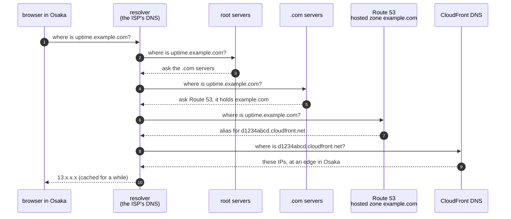
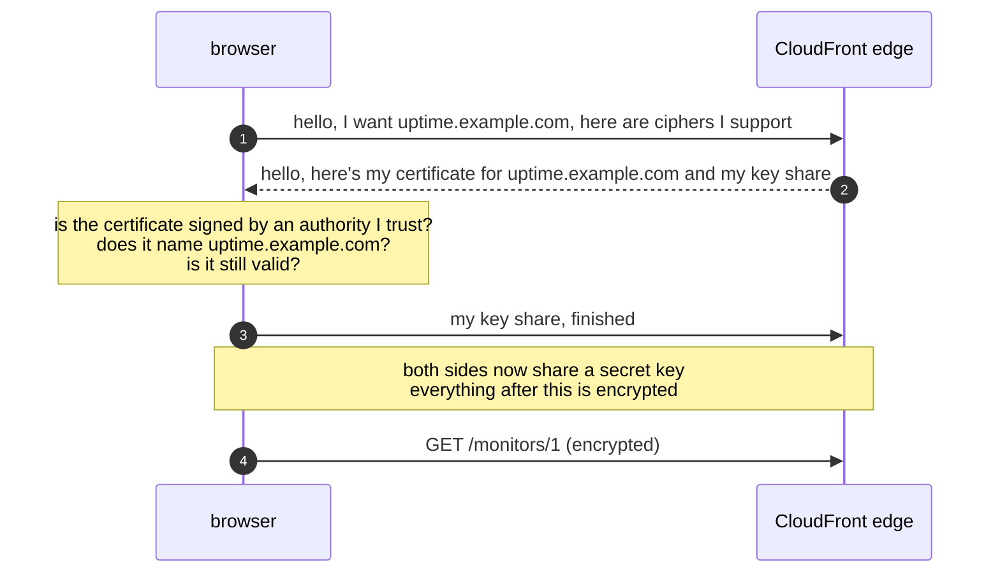
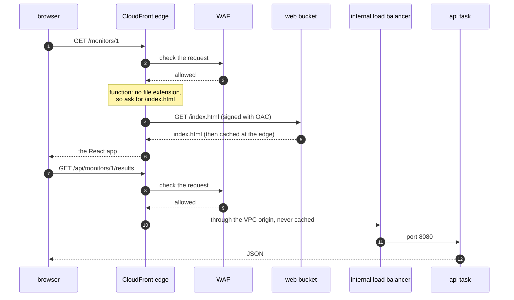

# Episode 9: Front door

*From Laptop to Tokyo, part two. About 25 minutes.*

> "Easy fix," Zayn said. "Make the load balancer public, give it an address, done."
>
> "And the React app? Where does that come from?"
>
> "The api could serve the files."
>
> "So every CSS file wakes up a container. OK. Now someone in Osaka types the address. How does their browser find it? How does it know it's really you and not someone pretending? And when someone starts hammering `/api/monitors` ten thousand times a minute, what stops them before they reach your one small container?"
>
> Zayn counted on their fingers. "A name, a certificate, a place for the files, and a bouncer."
>
> "And one more thing you already promised," Kian said. "The browser only ever talks to one address. Remember Vite? We need something that does Vite's job, in front of the whole world."

## The idea: what a front door does

Everything we've built so far is private. The front door is the one place where the outside world gets in, so it has several jobs at once.

Be findable. People type a name, not an IP address. Something has to turn `uptime.example.com` into an address the browser can connect to. That's DNS, the internet's phone book.

Prove who you are, and encrypt. When the browser connects, it needs proof that it reached the real site, and the conversation has to be encrypted. That's TLS, with a certificate: a signed document that says "this key belongs to this name", vouched for by an authority the browser already trusts.

Be close and fast. Our servers are in Tokyo. A user in Osaka is close anyway, but the React app's files are the same for everyone, so why fetch them from Tokyo every time? A CDN (content delivery network) keeps copies at sites near users, called edge locations, and only goes back to our servers for things it can't keep.

Send each request to the right place. Pages come from a file store. Anything under `/api` goes to the api. The browser should see one address for both, so there's no CORS to worry about. The CDN can do this: it's the job Vite did on the laptop.

Keep bad traffic out. Some requests are attacks: scripts in URLs, paths that try to escape folders, one address sending thousands of requests a minute. A web application firewall (WAF) looks at each request and blocks the bad ones before they reach anything of ours.

## The AWS answer

| Job | AWS service | Cost at our size |
|---|---|---|
| a name | **Route 53** (only if you bring a domain; otherwise CloudFront gives you one) | $0.50 a month per hosted zone |
| a certificate | **ACM** (AWS Certificate Manager) | free |
| close and fast, one address | **CloudFront** | inside the free tier |
| a file store for the React app | a private **S3** bucket | pennies |
| a bouncer | **AWS WAF** | about $9 a month |

Here's the edge layer on its own:

*The map for the front door: one CloudFront distribution with the WAF in front, two ways in behind it. Nothing in our VPC has a public address.*

### Being found: DNS, step by step

You don't need your own domain. Every CloudFront distribution gets a name like `d1234abcd.cloudfront.net`, with a working certificate, and the app works there. But the name changes if you ever rebuild the distribution (step 09 shows this), so a real client gets their own domain.

Here's what happens when a browser in Osaka looks up `uptime.example.com` for the first time.

*Steps 2 to 6 only happen the first time; after that the resolver remembers. In step 9, CloudFront's own DNS picks an edge location close to the user.*

A hosted zone is where Route 53 keeps the records for one domain. The record for `uptime.example.com` is an alias, a Route 53 feature that points straight at the CloudFront distribution without the extra hop a normal CNAME record would cost.

### Proving who we are: TLS, step by step

Once the browser has an address, it connects and starts a TLS handshake. Here's the simplified version (TLS 1.3):

*The browser tells the edge which name it wants (step 1), so one edge can hold certificates for many sites. The checks in the note are what the padlock in the address bar means.*

The certificate comes from ACM. It's free, it renews by itself, and ACM proves we own the domain by asking us to create a special DNS record (DNS validation). Terraform creates that record in Route 53 for us. Leave it there: ACM checks it again at every renewal, and deleting it is one of the few ways to get an expired certificate on AWS.

The catch: a certificate used by CloudFront must be created in `us-east-1`, even though our app is in Tokyo. CloudFront is a global service and keeps its configuration there. The same goes for its WAF. That's why the Terraform for this layer has two AWS providers, one for Tokyo and one for `us-east-1`. It looks odd. It's required.

### Routing: two ways in

A CloudFront distribution has origins (where it fetches from) and behaviors (rules that say which paths go to which origin, and how to cache them).

| Path | Origin | Cached? | Passes to origin |
|---|---|---|---|
| `/api/*` | the internal load balancer, through a **VPC origin** | never | every header except `Host`, so the admin token (`Authorization`) reaches the api |
| everything else | the private web bucket, through **Origin Access Control** | yes | nothing extra |

Both behaviors redirect plain HTTP to HTTPS and add security headers to every response (HSTS, which tells browsers to always use HTTPS, and a few others).

Here's one visit, end to end:

*The browser talks to one address the whole time. Behind it, CloudFront goes to two very different places.*

Three details in there are worth slowing down for.

Origin Access Control (OAC). The web bucket is private. CloudFront signs every request it makes to S3, and the bucket's policy only accepts signed requests from our distribution. Nobody can read the bucket directly, and it never needs to be public.

The VPC origin. CloudFront places its own network cards inside our private subnets and talks to the internal load balancer from there, over AWS's network. The load balancer has no public address, so there's nothing on the internet to lock down. On the load balancer's security group we add one rule: allow port 80 from the security group CloudFront created for its VPC origin. That's the arrow from episode 5.

The deep-link function. `/monitors/1` isn't a file. It's a page the React router draws in the browser. If CloudFront asks S3 for `/monitors/1`, S3 says "access denied", because the bucket doesn't reveal which files exist. The common fix is to turn every error into `index.html` for the whole distribution, but that would also turn a real `404` from the api into a web page with status `200`. So a tiny CloudFront Function (a few lines of JavaScript that run at the edge) rewrites any path without a dot to `/index.html`, and only on the web behavior. The api is never touched.

### Deploying the web app without mixing versions

The web build has two kinds of files. Vite puts a hash of the content into every asset's name (`index-xL97jjkb.js`), so a changed file always gets a new name. Those files can be cached for a year. `index.html` keeps its name and says which assets to load, so it's never cached.

A deploy uploads the new assets, uploads the new `index.html`, and tells CloudFront to forget only `/index.html` (an invalidation). A browser that gets the new `index.html` loads the new assets. A browser that still has the old one loads the old assets, which are still in the bucket. Nobody gets a page that mixes two versions.

### The bouncer: WAF

| Rule | What it blocks | Cost a month |
|---|---|---|
| `rate-limit-per-ip` | any single address sending more than 2,000 requests in 5 minutes, for a while | $1 |
| Amazon IP reputation list | addresses AWS has seen scanning and attacking | $1 |
| common rule set | cross-site scripting, path traversal, huge bodies, missing User-Agent, and more | $1 |
| known bad inputs | request patterns used against known bugs, like Log4j | $1 |
| the web ACL itself | | $5 |

Plus $0.60 per million requests. CloudFront also comes with AWS Shield Standard for free, which absorbs network-level floods. The WAF handles the application-level stuff Shield can't see.

Blocked requests never reach our VPC. They're stopped at the edge, before they cost us a single container cycle.

## What it costs

| Item | Tokyo price | Per month |
|---|---|---|
| CloudFront | first 1 TB out and 10 million requests each month free | $0 at our traffic |
| WAF | $5 per web ACL, $1 per rule, $0.60 per million requests | about $9.10 |
| ACM certificate | free with CloudFront | $0 |
| Route 53 hosted zone (optional) | $0.50 | $0.50 |
| a `.com` domain (optional) | about $15 a year | about $1.25 |
| S3 web bucket | $0.025 per GB-month | pennies |

The whole front door costs about $9 a month, almost all of it the WAF. For a throwaway dev environment, turning the WAF off is a reasonable saving. We keep it everywhere so dev tests the same design as prod.

Price class matters here, though it doesn't show up as a line on the bill. CloudFront's cheapest option, `PriceClass_100`, only uses edge locations in North America and Europe. A user in Tokyo would be served from across the Pacific. We use `PriceClass_200`, which includes Japan.

## What we didn't pick

**Serve the web files from the api container.** One less service, but every CSS file hits Fargate, and every web change becomes an api deploy.

**A public S3 website.** Cheap and simple, but the bucket must be public, and S3 website endpoints can't do HTTPS.

**An internet-facing load balancer, locked down to CloudFront.** The classic layout. You restrict it to CloudFront's address list (which uses about 55 of the 60 rules a security group allows) plus a secret header that CloudFront adds and the load balancer checks. It works. But the load balancer is still on the internet, it pays for a public address in each zone, and traffic between CloudFront and it crosses the internet unless you buy a certificate for it too. The VPC origin makes all of that unnecessary.

**A "custom error response" for deep links.** It applies to every origin, so real api errors would come back as `200` with a web page.

**No WAF.** Shield Standard stops network floods, but nothing would stop application attacks or one client hammering the api.

**A third-party CDN or WAF.** One more vendor, account and bill.

[ADR 0013](../adr/0013-cloudfront-vpc-origin-and-waf.md) has all of these.

## What breaks if

These are real experiments in [step 05](../steps/05-cdn-and-waf.md#6-break-it-on-purpose).

Someone removes the load balancer rule for CloudFront's VPC origin

The page still loads, because it comes from S3. The monitor list fails. `/api/health` through CloudFront returns `504` after about 30 seconds: CloudFront waited for the origin and gave up. The api is perfectly healthy; the door between CloudFront and the load balancer is shut.

Someone removes the deep-link function

The home page works, and clicking around works (React handles that in the browser). But reloading on `/monitors/1`, or opening a shared link, shows an XML page saying `AccessDenied`. That's S3 saying "no such file, and I won't tell you what exists".

Someone sends a request with a script in the URL

`/api/monitors?q=` gets a `403` from the WAF's common rule set. It never reaches our VPC. The WAF's sampled requests show which rule blocked it. No alarm fires, and that's on purpose: a blocked attack is the WAF doing its job, not an incident (episode 11).

Someone deletes the certificate's DNS validation record

Nothing, for months. Then the certificate comes up for renewal, ACM can't prove we still own the domain, and eventually the certificate expires and every browser shows a security warning. It's a slow failure with a long fuse, which is exactly why it's worth writing down.

## Check yourself

1. Why doesn't the web bucket need to be public?
2. Why is `/api/*` never cached, even `GET /api/monitors`?
3. Why does the app use a CloudFront Function for deep links, and not a custom error response?
4. The WAF and the certificate are in `us-east-1`, and the app is in Tokyo. Why?
5. After a web deploy, why do we only invalidate `/index.html`?
6. Name three separate things that would all have to go wrong for someone on the internet to reach the database directly.

Answers

1. Origin Access Control: CloudFront signs every request, and the bucket policy only accepts signed requests from our distribution.
2. The answers change every minute and differ per request (IDs, the admin token). A cached answer would show old data, or one user's response to another.
3. A custom error response applies to every origin, so a real api `404` would become `200` with `index.html`. The function only runs on the web behavior and only rewrites paths without a file extension.
4. CloudFront is a global service whose configuration lives in `us-east-1`. Its certificates and WAF must be created there.
5. Asset names change whenever their content changes, so new assets never collide with cached old ones. Only `index.html` keeps its name.
6. For example: the database would need a route to the internet (it's isolated), a public IP (it has none), and a security group rule letting the internet in (it only allows the app and the jobs). Any one of these alone keeps it unreachable.

## Try it

Put the React app on a private bucket, send `/api/*` through a VPC origin, add the WAF, and watch it block an attack and a flood: [Step 05: CloudFront and WAF](../steps/05-cdn-and-waf.md), with its [workbook](../workbook/05-cdn-and-waf.md). About three hours.

> Zayn opened the CloudFront address on their phone, on mobile data. The monitor list loaded. "It's real. Anyone can open it."
>
> "Anyone can open the page." Kian scrolled down. "But look at the last check. It's the one you ran by hand yesterday. Nothing's checking anything."
>
> "The scheduler. There's no scheduler container on AWS."
>
> "There's no clock at all. Let's build one."

Next: [Episode 10: Work on a timer](10-work-on-a-timer.md)
