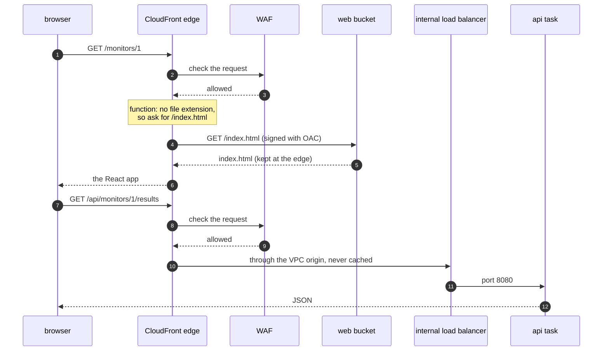

# Episode 10: One door, two rooms

*From Laptop to Tokyo, part two. About 18 minutes.*

> "Simplest thing," Zayn said. "The api serves the React files too. One container, one place."
>
> "So every CSS file wakes up a container in Tokyo."
>
> "They're small."
>
> "They're also identical for everyone, and never change between deploys. Why fetch them from Tokyo at all?" Kian pulled up the list of requests the page makes on first load. Nineteen files, and one call to `/api/monitors`. "Eighteen of these could come from a shelf near the user. One needs your api. And one day, somebody will send you ten thousand requests a minute on purpose."
>
> "So we need a door that sorts people," Zayn said. "And a bouncer."

## Sort at the door

The request from episode 9 has reached an edge location near the user. What happens next is the job Vite did on the laptop, done for the whole world.

The first is sending each request to the right place. Pages and scripts come from a file store, while anything under `/api` goes to the api. The browser sees one address for both, so there's no CORS to worry about.

The second is keeping what can be kept. The React app's files are the same for everyone, so a CDN (content delivery network) keeps copies at sites near users and only goes back to our servers for things it can't keep. Api answers change every minute, so those are never kept.

The third is keeping bad traffic out. Some requests are attacks: scripts in URLs, paths that try to climb out of folders, one address sending thousands of requests a minute. A web application firewall (WAF) inspects each request and blocks the bad ones before they reach anything of ours.

## CloudFront with two origins

CloudFront is AWS's CDN. One CloudFront setup is called a distribution. It fetches from origins, and behaviors are rules that say which paths go to which origin and how to cache them. Ours has two of each:

| Path | Origin | Cached? | Passed through to the origin |
|---|---|---|---|
| `/api/*` | the internal load balancer, through a VPC origin | never | every header except `Host`, so the admin token (`Authorization`) reaches the api |
| everything else | a private S3 bucket holding the React build, through Origin Access Control | yes | nothing extra |

Both behaviors redirect plain HTTP to HTTPS and add security headers to every response, including HSTS, which tells browsers to use HTTPS from then on.

*The front door: one distribution with the WAF in front and two ways in behind it. Nothing in our VPC has a public address.*

One visit, from first page to first api answer:

*The browser talks to one address throughout. Behind it, CloudFront goes to two very different places.*

Most of the design is in that picture.

### The private bucket

The web bucket is private. With Origin Access Control (OAC), CloudFront signs every request it makes to S3, and the bucket's policy only accepts requests signed by our distribution. Nobody can read the bucket directly, and it never has to be public. (S3 can host a public website by itself, but only over plain HTTP, and the bucket has to be open to the world.)

### The VPC origin

The api's load balancer has no public address. CloudFront's VPC origins feature places CloudFront's own network interfaces inside our private subnets, and CloudFront talks to the internal load balancer from there, over AWS's network. On the load balancer's security group we add one rule: allow port 80 from the security group CloudFront created for its VPC origin. That's the first arrow in episode 5's security group diagram. There's nothing on the internet to lock down, because nothing faces the internet.

### Deep links

`/monitors/1` isn't a file. It's a page the React router draws in the browser. Ask S3 for `/monitors/1` and it answers "access denied", because the bucket won't reveal which files exist.

The common fix is a custom error response: turn every error into `index.html` for the whole distribution. That would also turn a real `404` from the api (a deleted monitor, say) into a web page with status `200`, and the React app would be confused by a web page where it expected JSON. So a tiny CloudFront Function (a few lines of JavaScript that run at the edge on every request) rewrites any path without a dot to `/index.html`, and only on the web behavior. The api never sees it.

## Deploying the web app without mixing versions

The web build has two kinds of files. Vite puts a hash of each asset's content into its name (`index-xL97jjkb.js`), so a changed file always gets a new name. Those files can be cached for a year. `index.html` keeps its name and lists which assets to load, so it's never cached.

A deploy uploads the new assets, then the new `index.html`, then tells CloudFront to forget just `/index.html` (an invalidation). A browser that gets the new `index.html` loads the new assets. One that still has the old `index.html` loads the old assets, which are still in the bucket. Nobody ends up with a page built from two versions.

## The bouncer

The WAF sits in front of both behaviors and runs four rules:

| Rule | What it blocks | Cost a month |
|---|---|---|
| `rate-limit-per-ip` | any address sending more than 2,000 requests in 5 minutes, for a while | $1 |
| Amazon IP reputation list | addresses AWS has seen scanning and attacking | $1 |
| common rule set | cross-site scripting, path traversal, huge bodies, missing User-Agent, and more | $1 |
| known bad inputs | request patterns used against known bugs such as Log4j | $1 |

Add $5 a month for the web ACL (the container for the rules) and $0.60 per million requests. Blocked requests never reach our VPC; they're stopped at the edge before they cost a single container cycle. Like the certificate in episode 9, the WAF for CloudFront lives in `us-east-1`.

CloudFront also comes with AWS Shield Standard for free, which absorbs network-level floods. The WAF deals with the application-level attacks Shield can't see.

## What it costs

CloudFront's free tier covers the first 1 TB out and 10 million requests each month, which is far more than we use, so CloudFront itself costs nothing. The WAF is about $9.10 a month and the web bucket costs pennies. For a throwaway dev environment, turning the WAF off is a reasonable saving. We keep it in every environment so dev tests the same design as prod.

One setting doesn't show up on the bill but matters a lot here: the price class. CloudFront's cheapest option, `PriceClass_100`, only uses edge locations in North America and Europe, so users in Japan would be served from across the Pacific. We use `PriceClass_200`, which includes Japan.

## What we turned down

| Option | Why not | When we'd use it |
|---|---|---|
| the api serves the web files | every CSS file hits Fargate, and every web change becomes an api deploy | never, for this app |
| a public S3 website | the bucket must be public, and it only serves plain HTTP | never |
| an internet-facing load balancer locked to CloudFront | still reachable from the internet, so it needs CloudFront's address list (about 55 of a security group's 60 rules) plus a secret header; pays for a public address per zone; traffic from CloudFront crosses the internet, in plain HTTP unless you add a domain and certificate for it | if a partner must call the api directly |
| a custom error response for deep links | it applies to every origin, so real api errors come back as `200` web pages | never, with an api behind the same distribution |
| no WAF | nothing would stop application attacks, or one client hammering the api | a throwaway environment, maybe |
| a third-party CDN or WAF | another vendor, account and bill | if the client already uses one |

[ADR 0013](../adr/0013-cloudfront-vpc-origin-and-waf.md) has the full reasoning.

## Check yourself

1. The page loads, but the monitor list spins and then fails. `curl` on `/api/health` through CloudFront returns `504` after about 30 seconds. The api's own logs show nothing unusual. Where do you look?
2. After a change, the home page works and clicking around works, but reloading `/monitors/1` shows an XML page that says `AccessDenied`. What changed?
3. A user reports that the list sometimes shows stale data for a minute after they add a monitor. A teammate suggests caching `/api/monitors` for 60 seconds to "take load off the api." What's wrong with the suggestion, and what would you check about the report?

Answers

1. Between CloudFront and the load balancer. The most likely cause is the load balancer's security group rule that allows CloudFront's VPC origin. CloudFront waited for the origin and gave up, and the api never saw the request.
2. The deep-link function is no longer attached to the web behavior. React handles clicks in the browser, but a reload asks CloudFront for `/monitors/1`, and S3 says it can't show that.
3. The api is never cached on purpose: fresh results are the whole product, and caching would make the staleness worse, not better. Admin requests carrying the token also go down that path, and they must always reach the api. For the report, check the page's 15-second refresh and whether the new monitor has been checked yet; a new monitor shows its first result within a couple of minutes.

## Try it

Put the React app in a private bucket, send `/api/*` through a VPC origin, add the WAF, and watch it block an attack and a flood: [Step 05: CloudFront and WAF](../steps/05-cdn-and-waf.md), with its [workbook](../workbook/05-cdn-and-waf.md). About three hours.

> Zayn opened the address on their phone, on mobile data. The monitor list loaded.
>
> "Look at the last check time," Kian said.
>
> Zayn looked. "Yesterday. That's the check I started by hand to test the task." They put the phone down. "There's no scheduler. Nothing's checking anything."

**Next:** [Episode 11: Work on a timer](11-work-on-a-timer.md)
