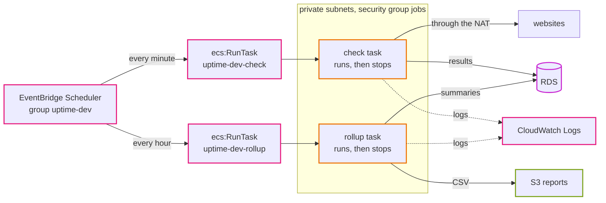
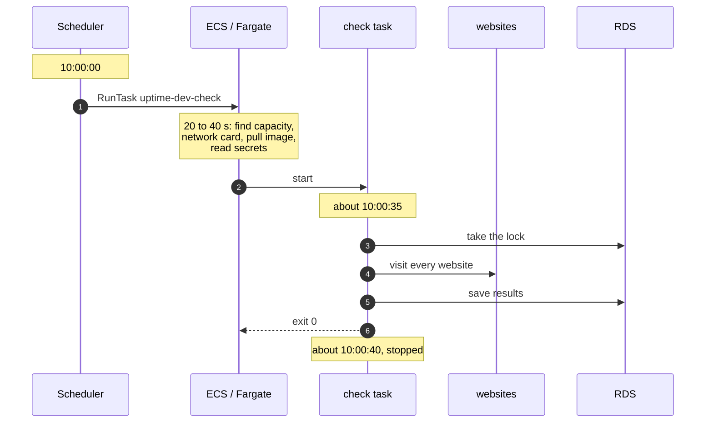
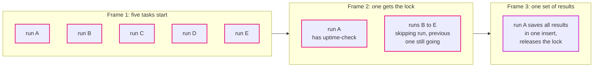

# Episode 10: Work on a timer

*From Laptop to Tokyo, part two. About 20 minutes.*

> "The fix is obvious," Zayn said. "On the laptop, the scheduler is a container running `dev-scheduler`, with timers inside. I'll run the same thing as an ECS service. One task, always on."
>
> "That would work," Kian said. "Let's poke at it. A check run hangs on a website that never answers. What happens to the next minute's check?"
>
> "It waits, I guess. The timer's in the same process."
>
> "And when you deploy a new version, the service replaces the task. What happens to the timers?"
>
> "They restart."
>
> "And tomorrow the client asks why there's a gap at 14:07. How do you find the one run that went wrong?"
>
> Zayn scrolled through a single, endless log stream in their head. "Badly."
>
> "So maybe the clock shouldn't live inside the thing it's timing."

## The idea: an inside clock or an outside clock

There are two ways to do work on a schedule.

An inside clock. One long-running process with a timer. Every minute it wakes up and does the work. It's simple, and it's what `dev-scheduler` does on the laptop. But everything shares one process: a stuck run can block the next one, a restart resets every timer, and all runs blur together in one log.

An outside clock. A separate service that does nothing but keep time. Every minute it starts a fresh, short-lived job, which does the work once and exits. Each run is its own thing, with its own start, its own logs and its own exit code. A stuck run doesn't touch the next one, because the next one is a different job. Deploys don't reset anything, because the clock isn't part of the app.

Whichever you pick, scheduled work in production needs a few properties, and it's worth listing them because they're easy to forget:

- On time, within reason. Our checks can start a few seconds late. They can't skip ten minutes.
- No overlap. If a run takes longer than the gap between runs, the next one must not trample it.
- Safe to run twice. Clocks retry, networks hiccup, people press buttons. A job that runs twice must give the same result as running once. This is *idempotency*, from episode 1.
- Each run visible. You can find one run, see how long it took and whether it failed.
- Sensible retries. Retry the jobs where a late run is better than none. Don't retry the ones where the next run is only a minute away.
- Somebody watches the clock. If the clock itself stops, nothing inside the app will ever notice. That's episode 11's job.

## The AWS answer: EventBridge Scheduler starts a task

EventBridge Scheduler is a managed cron: it calls an AWS API on a schedule. Ours calls ECS `RunTask`, which starts one Fargate task from the check task definition, every minute, and one from the rollup task definition, every hour.



*The scheduler only ever does one thing: start a task. Everything the task does after that is the app's business.*

| Schedule | When | Retries | Why |
|---|---|---|---|
| `check` | `rate(1 minute)` | none | the next run is only a minute away; retries would pile up tasks |
| `rollup` | `rate(1 hour)` | 2, within an hour | it redoes yesterday and today every time, so a late run still catches up |

A few settings carry more weight than they look.

The flexible time window is off. Scheduler can start a job anywhere inside a window to spread load across its customers. We want checks on time, so the window is zero.

The target is the task definition without a revision number. Every deploy makes a new revision of the task definitions. A target that says "the newest" picks up the new image on the next run by itself, without the schedules ever changing. A deploy only has to touch the compute layer.

The tasks run in the private subnets with the jobs security group and no public address. They reach websites through the NAT gateway, like the packet in episode 5.

The scheduler has its own narrow role. It may start only those two task definitions, only in our cluster, and may pass only the execution role and the jobs task role to ECS. That's the `PassRole` trap from episode 6, closed.

One switch pauses everything. `schedules_enabled = false` disables both schedules in an environment without deleting anything. Handy for a dev environment you're not using.

<p align="center"></p>

*The map for scheduled work: the scheduler outside the VPC, the dashed boxes in the private band are tasks that run and stop.*

### One check, on the clock

Here's what "every minute" really means in time.



*The check does its real work about half a minute after it was scheduled. For a monitor with one-minute resolution, that's fine. For a job that needs to start at an exact second, it wouldn't be.*

That half-minute delay is the price of an outside clock and a fresh container every time. We saw it in episode 2's freshness budget, and we decided it's worth it.

### When runs collide

Two runs can overlap in two ways. A slow run at 10:00 is still going when the 10:01 run starts. Or someone starts extra runs by hand. Either way, the MySQL lock from episode 1 handles it. Here's five runs started in the same second, frame by frame:



*Frame 1: five tasks start within a second. Frame 2: run A gets the lock; the other four see it's taken and exit straight away. Frame 3: run A saves one set of results. No website was visited twice, and nothing was saved twice.*

This is why the design can be relaxed about retries and duplicates. The scheduler promises to start the job; the lock and the idempotent writes make sure starting it too often never hurts. The two layers each do the part they're good at.

### A Tokyo detail: whose "today"?

The rollup job works in UTC days, which is standard for servers. Tokyo is nine hours ahead of UTC. So before 09:00 in Tokyo, "today" in the rollup's eyes is still yesterday's date on your clock, and the newest report is named after it. It isn't a bug, but it confuses everyone once. If the client ever wants reports in Japan time, that's a change in the app (the day boundary), not in the scheduler.

## What it costs

| Item | Tokyo price | Per month |
|---|---|---|
| EventBridge Scheduler | first 14 million runs a month free | $0 (we use about 44,500) |
| check task, every minute | Fargate ARM, 0.25 vCPU and 0.5 GB, billed per second with a one-minute minimum | about $9.00 |
| rollup task, every hour | same | about $0.15 |

Here's how the check number is worked out:

```
one task-minute  = (0.25 vCPU x $0.04045 + 0.5 GB x $0.00442) / 60  = $0.000205
runs per month   = 60 x 24 x 30.4                                    = 43,800
per month        = 43,800 x $0.000205                                = about $9.00
```

And here's the surprising part. An always-on task with timers inside, the thing Zayn first suggested, would cost $8.99 a month. The same, to the cent. Because Fargate bills at least one minute per task, a task every minute costs about as much as a task that never stops. So the outside clock doesn't cost more. It just behaves better. That's the kind of number that settles an argument.

## What we didn't pick

**`dev-scheduler` as an always-on ECS service.** Same price. But runs are lines in one log stream, a hung run blocks that task's timer, and every deploy restarts the timers. The outside clock fixes all three.

**EventBridge rules with a schedule.** The older way to do the same thing. Fewer options, no time zones, and AWS points new work to Scheduler.

**Lambda for the check job.** Cheaper for short runs, roughly $1 to $2 a month instead of $9. But the backend would need a second packaging (a Lambda handler), which breaks "one image, many commands", and it would still need the VPC and the NAT gateway to reach the database and the websites. We'd consider it if the $9 mattered more than one image for everything.

**A queue with a pool of workers.** The right answer for thousands of monitors, or checks every few seconds. The scheduler would drop monitors into a queue, and several long-running workers would pull from it in parallel. It's more moving parts than 200 monitors need. Episode 14 comes back to it.

[ADR 0014](../adr/0014-eventbridge-scheduler-runs-ecs-tasks.md) has the full comparison.

## What breaks if

These are real experiments in [step 06](../steps/06-scheduled-jobs.md#6-break-it-on-purpose).

<details>
<summary>The scheduler's role loses <code>iam:PassRole</code></summary>

The scheduler tries every minute and ECS refuses. No task appears in ECS, and not a single log line appears in the app's logs, because the app never started. The page slowly goes stale. The only trace is `TargetErrorCount` on the scheduler's own metrics. A failure that makes no noise at all is the most dangerous kind, and the next episode is about catching it.

</details>

<details>
<summary>The private route to the NAT gateway disappears in one zone</summary>

Tasks placed in that zone fail to start: they can't reach the registry's API to log in, or Secrets Manager to read the password. Tasks in the other zone keep working, so checks become patchy rather than stopping. Patchy is harder to notice than stopped.

</details>

<details>
<summary>The schedule targets a fixed revision, like <code>uptime-dev-check:3</code></summary>

Everything works, until the next deploy. The api gets the new image, and the jobs keep running revision 3, with the old image, forever. The app and its jobs quietly drift apart. That's why the target points at the task definition without a revision number.

</details>

## Check yourself

1. Why does the check schedule have no retries, and rollup has two?
2. A check is scheduled for 10:00:00. Roughly when does it visit the websites, and why?
3. Why is running `check` five times at once harmless?
4. The outside clock starts a fresh container every minute. Why doesn't it cost more than an always-on container?
5. The scheduler can't start tasks. Where would you see that, given that no task and no log line appear?

<details>
<summary>Answers</summary>

1. A missed check is replaced a minute later, and retries would only pile up tasks. A missed rollup leaves the summary stale for an hour, and rollup is safe to repeat.
2. About 20 to 60 seconds later. Fargate has to find capacity, attach a network card, pull the image and read the secrets before the command runs.
3. The MySQL lock `uptime-check`. Only one run gets it; the others exit. The winner saves its results in one insert.
4. Fargate bills at least one minute per task. A one-minute task every minute costs about the same as a task that never stops.
5. On the scheduler's own CloudWatch metrics, like `TargetErrorCount`. And, better, on an alarm that notices checks have stopped finishing, whatever the reason (episode 11).

</details>

## Try it

Put the two jobs on a schedule, start five checks at once and watch four of them back off, and break the scheduler's role on purpose: [Step 06: Scheduled jobs](../steps/06-scheduled-jobs.md), with its [workbook](../workbook/06-scheduled-jobs.md). About two hours.

> The dashboard updated by itself for the first time. Zayn watched the 24-hour uptime column fill in, one minute at a time.
>
> "It just runs now."
>
> "It does." Kian leaned back. "Which means it can also just stop. At 3 a.m., on a Sunday, because someone changed a role on Friday. Nothing in the app will complain, because nothing in the app will be running. How would we know?"

Next: [Episode 11: Seeing the system](11-seeing-the-system.md)
