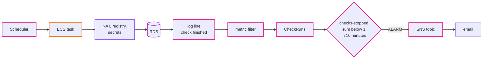
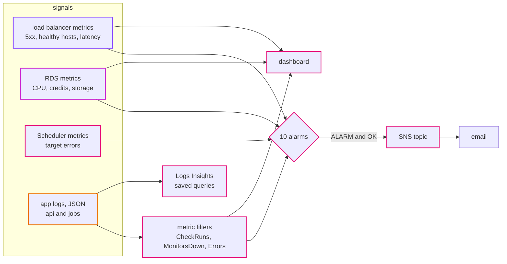
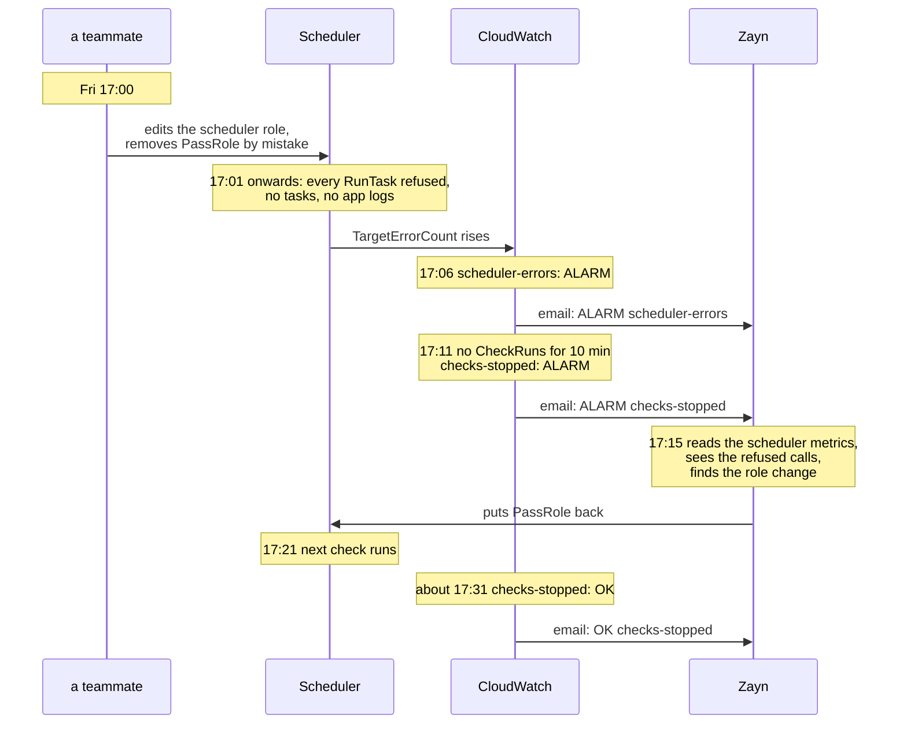

# Episode 11: Seeing the system

*From Laptop to Tokyo, part two. About 20 minutes.*

> "We'll look at the dashboard every morning," Zayn said. "If something's wrong, we'll see it."
>
> "Every morning. And the checks stop on Friday at 17:00. When do you find out?"
>
> "Monday morning."
>
> "Sixty-four hours of missing history. And in the meantime, three of the client's customers had outages that nobody was told about, which is the one thing they pay us for." Kian pulled up the list of failures they'd gathered over the last few weeks. A role losing `PassRole`. A missing route. A deleted rule. "Look at these. How many of them made the app log an error?"
>
> Zayn went down the list. "None. In most of them the app never even started."
>
> "So we can't just watch for errors. We have to watch for silence."

## The idea: start from the failures, not from the graphs

Observability means being able to tell what's happening inside a system from the outside, without logging into anything. Systems give you three kinds of signals:

- Logs: a line for each event. "Request to `/api/monitors` took 42 ms." "Check finished: 200 monitors, 197 up, 3 down."
- Metrics: numbers over time. CPU every minute. Requests per minute. Healthy containers.
- Traces: one request followed across many services. Very useful when a request crosses ten services. We have one api, so we'll skip them.

The trap is to start from the signals. AWS publishes hundreds of metrics for free, and it's tempting to graph them all and alarm on anything that looks high. That gives you a pretty dashboard and a flood of alerts, and a flood of alerts teaches people to ignore alerts.

The better way is to start from the other end. List the failures you care about, the ones a user or the client would notice. For each one, ask what signal would show it, and alarm on that. A few habits come with this:

Alarm on symptoms, not causes. "The api is returning errors" is a symptom. "CPU is at 70%" might be a cause, or might be fine. Users feel symptoms.

Watch for silence. Some of the worst failures produce no errors at all, because the thing that would log the error never ran. The answer is a heartbeat: a signal the system gives off when it's working, and an alarm that fires when the heartbeat stops.

Only alarm on things someone has to fix. A user typing a wrong ID is not an incident. An attack the firewall blocked is not an incident. Alarms are for problems we have to act on.

Choose what "no data" means. For most alarms, no data means nothing happened, which is fine. For a heartbeat, no data *is* the failure.

## The AWS answer: CloudWatch, from metrics and logs

CloudWatch is AWS's monitoring service. The pieces we use:

| Piece | What it is |
|---|---|
| **CloudWatch Logs** | where every container's output goes, one log group per kind of task. Our app writes JSON logs, which matters in a moment. |
| **metrics** | AWS services publish many for free: the load balancer's error counts, RDS's CPU, the scheduler's error count. |
| **metric filter** | a rule that watches a log group and turns matching lines into a metric of our own |
| **alarm** | watches one metric and changes state: `OK`, `ALARM` or `INSUFFICIENT_DATA` |
| **SNS topic** | a mailbox for notifications. Alarms send to it; it forwards to email. |
| **dashboard** | one page of graphs |
| **Logs Insights** | a query language for logs, good at JSON |

### What we want to hear about

Here's the list, built from failures:

| Failure | How we'd notice | Alarm |
|---|---|---|
| the api returns errors | load balancer counts 5xx from the tasks | `api-5xx`: more than 5 in 5 minutes |
| the load balancer fails requests itself | 5xx made by the load balancer (no healthy task, timeouts) | `alb-5xx`: more than 5 in 5 minutes |
| the page is down | no task passes its health check | `api-no-healthy-tasks`: fewer than 1 for 3 minutes |
| the page is slow | response time at p95 | `api-slow`: over 1 second, twice in a row |
| the database is overloaded | CPU | `db-cpu-high`: over 80% for 15 minutes |
| the database is about to be slowed down | `t4g` CPU credits (episode 7) | `db-cpu-credits-low`: under 20 |
| the database disk is filling up | free storage | `db-storage-low`: under 2 GB |
| the scheduler can't start jobs | the scheduler's own error count | `scheduler-errors`: any in 5 minutes |
| **checks stopped, for any reason** | our heartbeat metric, from the logs | `checks-stopped`: no finished run in 10 minutes |
| the code logs errors | our error count, from the logs | `app-errors`: more than 5 in 5 minutes |

*p95 means "95% of requests were faster than this". An average hides a few very slow requests among many fast ones; p95 shows them, and they're what users notice.*

### The heartbeat

The most useful alarm on that list is `checks-stopped`. It's built from a log line.

Every time a check run finishes, the app logs a JSON line with `"msg": "check finished"`. A metric filter turns each of those lines into a `1` in a metric called `CheckRuns`. The alarm adds them up over 10 minutes. If the sum is less than 1, or there's no data at all, it fires.

*Every box on the top row has to work for the log line to appear. Break any one of them, for any reason, and the line stops coming, and the alarm fires.*

This is what makes it so useful. It doesn't care *why* checks stopped. The scheduler's role, the NAT gateway, the registry, the database password, a bug in the code: if anything in the chain breaks, the heartbeat goes quiet. One alarm covers a whole class of failures we never predicted. And it treats missing data as breaching, because silence is exactly what it's looking for.

There's a cost to building metrics from log lines: the log messages become a contract. If someone renames `check finished` to `checks done` in the Go code, the metric silently stops, and `checks-stopped` fires even though checks are running fine. That's the right outcome (a false alarm is better than a silent one), but the names are written down in [step 07](../steps/07-observability.md) so nobody is surprised.

Two more metrics come from logs: `MonitorsDown` (the number of monitors down in each run) and `Errors` (every log line at level `ERROR`, from the api and the jobs).

### The whole picture of signals

*Alarms push to us. The dashboard and Logs Insights are for when we're already looking.*

*The map for observability. It sits beside the system rather than inside it: nothing here is in the request path.*

### An incident, from start to finish

Here's the Friday failure from the opening scene, with the alarms in place.

*Two alarms, one pointing at the cause and one at the symptom. Twenty minutes of thin history instead of sixty-four hours of none.*

Notice there are two alarms here. `scheduler-errors` points at the cause, when the cause is the scheduler. `checks-stopped` points at the symptom, whatever the cause. If the cause had been a missing NAT route instead, `scheduler-errors` would have stayed quiet, and `checks-stopped` would have fired anyway. That's why you want both.

### Answering episode 2's open question

Remember the question about how much data comes back through the NAT gateway? The NAT gateway publishes its own metrics, and `BytesInFromDestination` is exactly the pages coming back from the websites we check. After a week of real traffic, that number, times $0.062 per GB, tells us whether the check job needs to read less of each page. We'd add it as a widget on the dashboard, and probably as an alarm if it crossed a monthly budget. This is what "measure it first" looks like in practice.

## What it costs

| Item | Tokyo price | Dev, per month |
|---|---|---|
| alarms | $0.10 each | $1.00 for ten |
| custom metrics (from log filters) | $0.30 each | $0.90 for three |
| logs sent in | $0.76 per GB | a few cents to a dollar |
| logs kept | $0.033 per GB-month | pennies (14 days in dev, 90 in prod) |
| dashboards | first 3 in an account free | $0 |
| SNS email notifications | effectively free at this volume | $0 |
| **Total** | | **about $2.40** (prod about $3.10, more log data) |

Logs are the part to watch as systems grow: ingestion at $0.76 per GB adds up if an app logs every health check. Ours doesn't. The api skips logging `/api/health`, which the load balancer calls every 15 seconds from each zone and would otherwise drown out everything else.

## What we didn't pick

**Container Insights.** Per-task CPU, memory and network metrics, billed per metric. ECS already publishes the service's CPU and memory for free, which is enough for one service. Worth it when many services share a cluster.

**Distributed tracing (X-Ray, OpenTelemetry).** Valuable when one request crosses many services. We have one api; a slow request shows up in the request log with its `duration_ms`.

**An external tool (Grafana Cloud, Datadog, New Relic).** Better dashboards and tracing. Also another account, agent, bill and set of credentials to manage.

**A pager or on-call tool.** Email is enough for two people who agreed to no night shifts. A team with an on-call rota would route the SNS topic to chat or a pager.

**An alarm on WAF blocks.** Blocked requests are the WAF doing its job. An alarm that fires on normal attacks trains people to ignore alarms. The dashboard shows blocks, and that's enough.

[ADR 0015](../adr/0015-cloudwatch-alarms-from-metrics-and-logs.md) has the details.

## What breaks if

Someone renames the log message <code>check finished</code>

`CheckRuns` and `MonitorsDown` stop getting data. After 10 minutes `checks-stopped` fires, even though checks are running fine. The fix is to update the metric filter together with the code. It's a false alarm, and it's the right kind to have: loud, not silent.

Nobody confirmed the email subscription

Nothing is delivered. SNS doesn't send to an email address until someone clicks the confirmation link, and the subscription sits at `Pending confirmation` forever. Every alarm fires into the void. This is why step 07 has you force an alarm into `ALARM` on purpose and wait for the email, before you ever need it.

An admin deletes a monitor that doesn't exist

The api answers `404` with `monitor not found`. No `ERROR` log line, no alarm. The user made a mistake, and the app handled it correctly. Errors are for problems we have to fix, not for mistakes users make, and keeping that line clear is what keeps the error alarm meaningful.

## Check yourself

1. Why does `checks-stopped` treat missing data as breaching, while `api-5xx` doesn't?
2. Why is `api-slow` based on p95 and not on the average?
3. Name three different failures that `checks-stopped` would catch.
4. Why is there no alarm on requests the WAF blocked?
5. Why is `db-cpu-credits-low` useful, even when the CPU graph looks fine?

Answers

1. For `checks-stopped`, silence is the failure: no data means no check finished. For `api-5xx`, no data means no errors, which is good.
2. An average of many fast requests hides a few very slow ones. p95 says one in twenty requests is slower than this, which is what users notice.
3. Any three of: the scheduler's role breaks, the NAT route disappears, the registry can't be reached, the secret can't be read, the database is down, a bug crashes the check job. Anything that stops a run from finishing.
4. A block is the WAF working. Alarming on normal attacks trains people to ignore alarms.
5. `t4g` instances run on credits. When credits run out, the CPU is held to a low baseline, and the database gets slow even though `CPUUtilization` never showed 100%.

## Try it

Build the heartbeat alarm by hand, test the email path without breaking anything, then pause the scheduler and wait for the alarm to notice: [Step 07: Observability](../steps/07-observability.md), with its [workbook](../workbook/07-observability.md). About two hours.

> Zayn's phone buzzed. *ALARM: "uptime-dev-checks-stopped" in Asia Pacific (Tokyo).* Then, ten minutes after they'd turned the schedules back on, another: *OK.*
>
> "Nobody told it the scheduler was paused," Zayn said. "It just noticed."
>
> "It noticed the silence. That's the whole trick." Kian stretched. "Last domain. Right now, every deploy is you, on your laptop, with AWS credentials, typing commands in the right order. What happens when you're on holiday?"

Next: [Episode 12: Shipping changes](12-shipping-changes.md)
