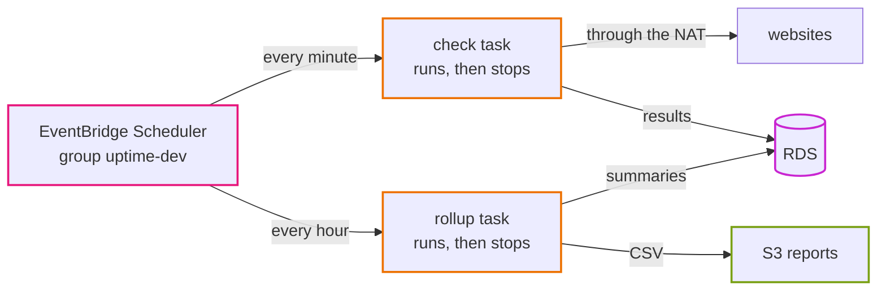
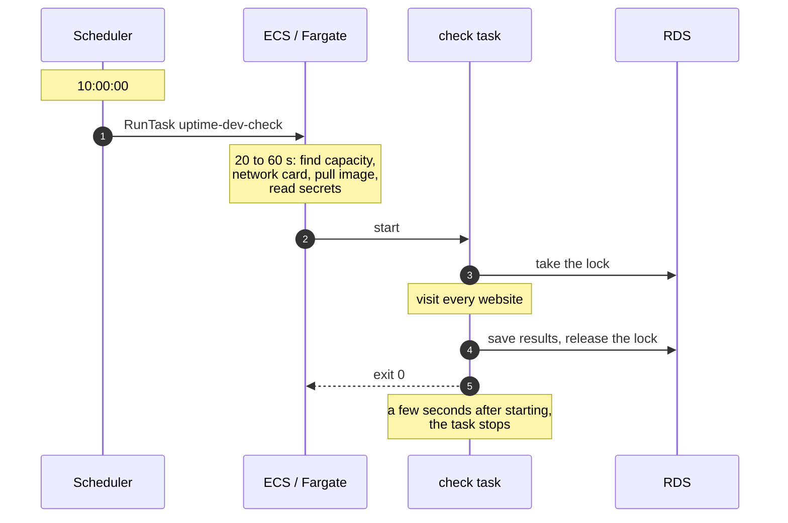
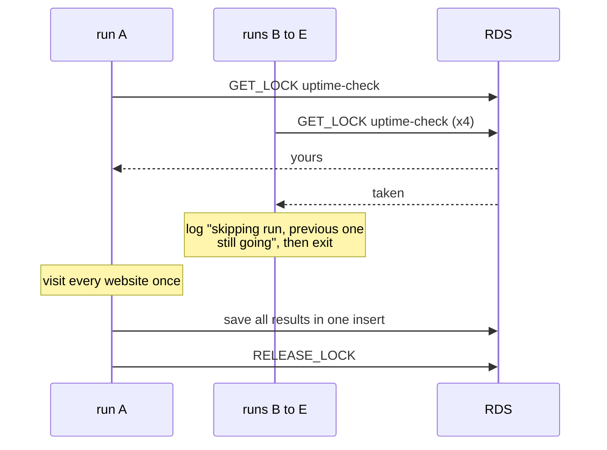

# Episode 11: Work on a timer

*From Laptop to Tokyo, part two. About 16 minutes.*

> "Obvious fix," Zayn said. "On the laptop the scheduler is a container running `dev-scheduler`, with timers inside. I run the same thing as an ECS service. One task, always on."
>
> "That works," Kian said. "Let's poke at it. A check hangs on a website that never answers. What happens to the next minute's check?"
>
> "It waits. The timer's in the same process."
>
> "You deploy a new version. The service replaces the task. The timers?"
>
> "Start over."
>
> "And the client asks why there's a gap at 14:07. How do you find the one run that went wrong?"
>
> Zayn pictured a single log stream, scrolling forever. "Badly."
>
> "So maybe the clock shouldn't live inside the thing it's timing."

## An inside clock or an outside clock

There are two ways to do work on a schedule.

An inside clock is one long-running process with a timer. Every minute it wakes up and does the work. It's simple, and it's what `dev-scheduler` does on the laptop. But everything shares the one process: a stuck run blocks the next, a restart resets every timer, and all the runs blur together in one log.

An outside clock is a separate service that only keeps time. Every minute it starts a fresh, short-lived job, which does the work once and exits. Each run is its own thing, with its own start, its own logs and its own exit code. A stuck run can't block the next, because the next is a different job, and deploys don't reset anything because the clock isn't part of the app.

Whichever you pick, scheduled work in production needs a few properties that are easy to forget. It has to be on time within reason: our checks can start a few seconds late, but not skip ten minutes. Runs mustn't trample each other when one takes longer than the gap. A job that runs twice must give the same result as running once, because clocks retry, networks hiccup and people press buttons (idempotency, from episode 1). You need to be able to find one run and see how long it took and whether it failed. Retries should be sensible: retry jobs where a late run beats none, and don't retry ones where the next run is a minute away. And somebody has to watch the clock itself, because if it stops, nothing inside the app will ever notice. That last one is episode 12.

## EventBridge Scheduler starts a task

EventBridge Scheduler is a managed cron: it calls an AWS API on a schedule. Ours calls ECS `RunTask`, starting one Fargate task from the check task definition every minute and one from the rollup task definition every hour.



*The scheduler does exactly one thing: start a task. Everything after that is the app's business.*

The check schedule has no retries, because the next run is only a minute away and retries would just pile up tasks. Rollup gets two retries within the hour, because it redoes yesterday and today on every run, so a late run still catches up.

A few settings matter more than they look. The flexible time window is off: Scheduler can start a job anywhere inside a window to spread load across its customers, and we want checks on time. The target is the task definition without a revision number, so every run uses the newest revision; a deploy creates a new revision and the schedules pick it up on the next run without changing. The tasks run in the private subnets with the jobs security group and no public address, and reach websites through the NAT gateway like the packet in episode 5. The scheduler has its own narrow role that can start only these two task definitions in our cluster and pass only two roles to ECS (the `PassRole` trap from episode 6). And one variable, `schedules_enabled`, pauses both schedules in an environment without deleting anything, which is handy for a dev environment nobody's using.

<p align="center"></p>

*The map for scheduled work. The dashed boxes in the private band are tasks that run and stop.*

## What "every minute" really means



*The real work happens 20 to 60 seconds after the scheduled time. That's fine for a monitor with one-minute resolution. It wouldn't be for a job that has to start on an exact second.*

That delay is the price of a fresh container every time. Episode 2's freshness budget already counted it, and we decided it was worth paying.

## When runs collide

Runs can overlap in two ways. A slow run at 10:00 might still be going when the 10:01 run starts, or someone might start extra runs by hand. Either way, the MySQL lock from episode 1 settles it. Take five runs started in the same second:



*Only one of the five gets the lock. The other four log a line and exit immediately. No website is visited twice and nothing is saved twice.*

This is why the design can be relaxed about retries and duplicates. The scheduler promises to start the job, and the lock plus the idempotent writes make sure that starting it too often never does harm.

## Whose "today"?

The rollup job works in UTC days, the usual convention on servers, and Tokyo is nine hours ahead of UTC. So before 09:00 in Tokyo, rollup's "today" is still yesterday on your clock, and the newest report is named after that date. It's not a bug, but it confuses everyone once. If the client ever wants reports in Japan time, that's a change to the app's day boundary, not to the scheduler.

## The cost argument

> "One thing, though," Kian said. "A fresh Fargate task every minute won't be free. The always-on worker is probably cheaper. We should say so in the ADR."
>
> "Can I check?" Zayn opened the pricing page. "Fargate bills from when it starts pulling the image, with a one-minute minimum. Pull plus our check usually fits inside that minute." Zayn typed for a bit. "0.25 vCPU and half a gigabyte, 43,800 minutes a month. About nine dollars. A bit more on days the pulls are slow."
>
> "And the always-on one?"
>
> "Same size, 730 hours. Eight ninety-nine." Zayn turned the screen around. "Within a dollar or so. It's a wash."
>
> Kian laughed. "Then the argument's over. The outside clock doesn't cost more. It just behaves better."

The working:

```
one task-minute = (0.25 vCPU x $0.04045 + 0.5 GB x $0.00442) / 60  = $0.000205
runs per month  = 60 x 24 x 30.4                                    = 43,800
per month       = 43,800 x $0.000205                                = about $9.00
```

The rollup task adds about $0.15 a month. EventBridge Scheduler's first 14 million runs a month are free, and we use about 44,500.

Two other options came up and lost. EventBridge rules with a schedule are the older way to do the same thing, with fewer options and no time zones, and AWS points new work to Scheduler. Lambda would be cheaper for short runs, roughly $1 to $2 a month instead of $9, but the backend would need a second packaging (a Lambda handler), which breaks "one image, many commands", and it would still need the VPC and the NAT gateway to reach the database and the websites. We'd reconsider if $9 a month ever mattered more than having one image for everything. For thousands of monitors, the answer changes again, to a queue with a pool of workers; episode 15 covers that. [ADR 0014](../adr/0014-eventbridge-scheduler-runs-ecs-tasks.md) has the full comparison.

## Check yourself

1. On Friday someone tidies up IAM and removes `iam:PassRole` from the scheduler's role. What do you see in ECS, in the app's logs and on the dashboard over the weekend?
2. A teammate changes the check schedule's target to `uptime-dev-check:3` "to be explicit." Everything works. What goes wrong later, and when?
3. The private subnet in `1a` loses its route to the NAT gateway, but `1c` is fine. How do the checks behave, and why is that harder to notice than a full stop?

<details>
<summary>Answers</summary>

1. No tasks in ECS, not one line in the app's logs (the app never started), and a dashboard that slowly goes stale. The only trace is the scheduler's own `TargetErrorCount` metric. A failure this quiet is why episode 12 adds an alarm on silence.
2. At the next deploy, the api moves to the new image and the check job keeps running revision 3 with the old image, indefinitely. The app and its jobs quietly drift apart.
3. Tasks placed in `1a` fail to start (they can't reach the registry or Secrets Manager), and tasks in `1c` work. So checks become patchy rather than stopping: some minutes have results, some don't. The history thins out without anything obviously broken.

</details>

## Try it

Put the two jobs on a schedule, start five checks at once and watch four of them back off, and break the scheduler's role on purpose: [Step 06: Scheduled jobs](../steps/06-scheduled-jobs.md), with its [workbook](../workbook/06-scheduled-jobs.md). About two hours.

> The dashboard updated on its own for the first time. They watched the 24-hour uptime column fill in, a minute at a time.
>
> "It just runs now," Zayn said.
>
> "Which means one day it'll just stop," Kian said. "And nothing in the app will complain, because nothing in the app will be running."

**Next:** [Episode 12: Seeing the system](12-seeing-the-system.md)
