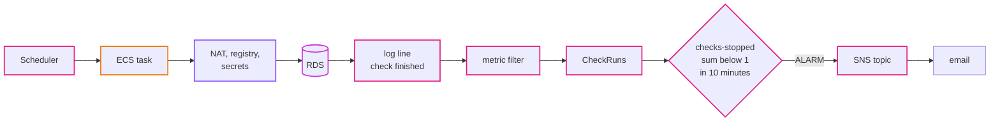
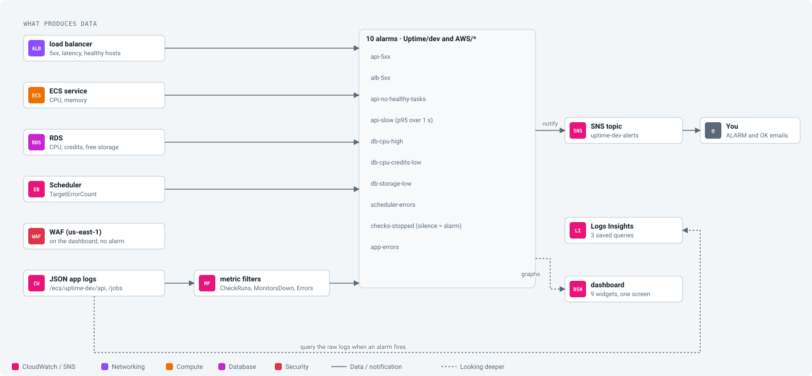
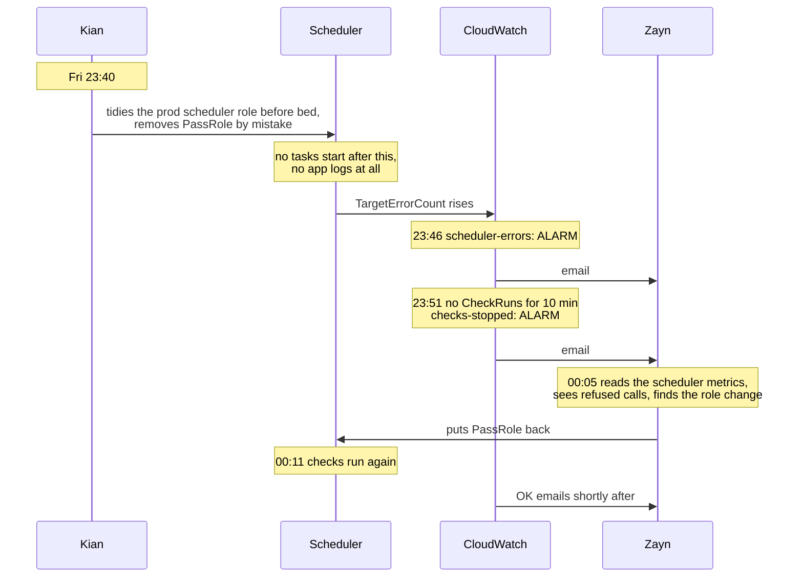

# Episode 12: Seeing the system

*From Laptop to Tokyo, part two. About 17 minutes.*

> Friday, 23:51. Zayn's phone lit up on the bedside table.
>
> *ALARM: "uptime-prod-checks-stopped" in Asia Pacific (Tokyo).*
>
> Three weeks earlier, there had been no such alarm.

## Three weeks earlier

> "We'll look at the dashboard every morning," Zayn said. "If something's wrong, we'll see it."
>
> "And the checks stop at 17:00 on a Friday," Kian said. "When do you find out?"
>
> "Monday morning."
>
> "Sixty-four hours of missing history. And three of the client's customers had outages nobody told them about, which is the one thing they pay for." Kian put up the list of failures they'd collected over the past weeks: a role losing `PassRole`, a deleted route, a removed security group rule. "We alarm on the error rate and the 5xx count. That covers most of these."
>
> Zayn went down the list. "It covers none of them. None of these logged an error. In most of them the app never even started." They looked up. "We can't wait for an error. We have to notice when things go quiet."

## Start from failures, not from graphs

Observability means being able to tell what's going on inside a system from outside, without logging into anything. Systems give off three kinds of signals. Logs are a line per event ("check finished: 200 monitors, 197 up, 3 down"). Metrics are numbers over time (CPU every minute, healthy containers). Traces follow one request across many services, which matters when a request crosses ten of them. We have one api, so we skip traces.

The trap is to start from the signals. AWS publishes hundreds of metrics for free, and it's tempting to graph them all and alarm on anything that looks high. You get a pretty dashboard and a flood of alerts, and a flood of alerts teaches people to ignore alerts.

It works better from the other end. List the failures a user or the client would notice, ask which signal would show each one, and alarm on that. Alarm on symptoms people feel ("the api is returning errors") rather than on numbers that might or might not matter ("CPU is at 70%"). Only alarm on things someone has to fix: a user typing a wrong ID isn't an incident, and neither is an attack the firewall blocked. And decide, for each alarm, what "no data" means. For most, no data means nothing happened, which is fine. For the failures on Kian's list, no data is the failure.

That last point is what Zayn noticed. Some of the worst failures produce no errors at all, because whatever would have logged the error never ran. The answer is a heartbeat: a signal the system gives off only when it's working, with an alarm that fires when the heartbeat stops.

## CloudWatch, from metrics and logs

CloudWatch is AWS's monitoring service. Every container's output goes to CloudWatch Logs, one log group per kind of task. AWS services publish metrics there for free: the load balancer's error counts, RDS's CPU, the scheduler's error count. A metric filter watches a log group and turns matching lines into a metric of our own. An alarm watches one metric and moves between `OK`, `ALARM` and `INSUFFICIENT_DATA`. An SNS topic is a mailbox for notifications: alarms send to it, and it forwards to email.

### The failures we want to hear about

| Failure | Signal | Alarm |
|---|---|---|
| the api returns errors | load balancer counts 5xx from the tasks | `api-5xx`: more than 5 in 5 minutes |
| the load balancer fails requests itself | 5xx made by the load balancer | `alb-5xx`: more than 5 in 5 minutes |
| the page is down | no task passes its health check | `api-no-healthy-tasks`: fewer than 1 for 3 minutes |
| the page is slow | response time at p95 | `api-slow`: over 1 second, twice in a row |
| the database is overloaded | CPU | `db-cpu-high`: over 80% for 15 minutes |
| the database is about to be throttled | `t4g` CPU credits (episode 7) | `db-cpu-credits-low`: under 20 |
| the database disk is filling | free storage | `db-storage-low`: under 2 GB |
| the scheduler can't start jobs | the scheduler's own error count | `scheduler-errors`: any in 5 minutes |
| checks stopped, for any reason | our heartbeat, from the logs | `checks-stopped`: no finished run in 10 minutes |
| the code logs errors | our error count, from the logs | `app-errors`: more than 5 in 5 minutes |

*p95 means "95% of requests were faster than this". An average hides a few very slow requests among many fast ones; p95 shows them.*

### The heartbeat

Every time a check run finishes, the app logs a JSON line with `"msg": "check finished"`. A metric filter turns each of those lines into a `1` in a metric called `CheckRuns`. The `checks-stopped` alarm adds them up over 10 minutes, and fires if the sum is less than 1 or if there's no data at all.

*Every box on the top row has to work for the log line to appear. If any of them breaks, for any reason, the line stops coming and the alarm fires.*

The alarm doesn't care why checks stopped. A broken scheduler role, a missing route, an unreachable registry, a wrong database password, a bug in the code: if anything in the chain fails, the heartbeat goes quiet. One alarm covers a whole family of failures nobody predicted, and it treats missing data as breaching, because silence is exactly what it's watching for.

Building metrics from log lines has a cost: the log messages become a contract. If someone renames `check finished` in the Go code, the metric stops and `checks-stopped` fires even though checks are running fine. A false alarm is better than a silent one, and the names are written down in [step 07](../steps/07-observability.md) so nobody is caught out. Two more metrics come from logs the same way: `MonitorsDown` (how many monitors were down in each run) and `Errors` (every log line at level `ERROR`).

*The map for observability. It sits beside the system rather than in it; nothing here is on the path of a request. The dashboard and the saved Logs Insights queries (a query language for logs) are for when someone is already looking.*

## Friday, 23:51

Back to the phone on the bedside table. What had happened, and what the alarms did:

*Two alarms: one pointing at the cause, one at the symptom. About half an hour of missing checks instead of a missing weekend.*

There were two alarms, and that's deliberate. `scheduler-errors` points at the cause when the cause is the scheduler. `checks-stopped` points at the symptom, whatever the cause. If a deleted NAT route had been to blame instead, `scheduler-errors` would have stayed silent and `checks-stopped` would have fired anyway. The OK emails follow once checks are finishing again; in hands-on step 07's test it took about ten minutes. Kian's message on Monday morning was one line long: *Sorry. Good alarm.*

## Episode 2's open question, answered

In episode 2, Zayn found that the checker reads up to 1 MB of every page, and we didn't know what that would cost. The NAT gateway publishes its own metrics, and `BytesInFromDestination` is exactly the pages coming back from the websites we check. After a week of real traffic, that number times $0.062 per GB tells us whether the checker needs to read less of each page. We'd add it to the dashboard, and probably an alarm on a monthly budget.

## What it costs

Alarms cost $0.10 each, so $1.00 for ten. Each custom metric from a log filter costs $0.30, so $0.90 for three. Logs cost $0.76 per GB sent in and $0.033 per GB-month kept; ours come to cents, or a dollar at most. The first three dashboards in an account are free, and SNS email is effectively free at this volume. That's about $2.40 a month in dev and $3.10 in prod, where there's more log data.

Log ingestion is the number to watch as systems grow. It adds up fast if an app logs every health check. Ours doesn't: the api skips logging `/api/health`, which the load balancer calls every 15 seconds from each zone and which would otherwise drown out everything else.

## What we turned down

Container Insights gives per-task CPU, memory and network metrics, billed per metric. ECS already publishes the service's CPU and memory for free, which is enough for one service; it's worth it when many services share a cluster. Distributed tracing (X-Ray or OpenTelemetry) earns its keep when requests cross many services, and ours crosses one, with a `duration_ms` field in the request log. An external tool (Grafana Cloud, Datadog, New Relic) has better dashboards, and also another account, agent, bill and set of credentials. A pager or on-call tool would make sense for a team with a rota; two people with email are fine. And there's no alarm on requests the WAF blocked, because a block is the WAF doing its job, and alarming on it trains people to ignore alarms ([ADR 0015](../adr/0015-cloudwatch-alarms-from-metrics-and-logs.md)).

## Check yourself

1. A developer tidies up log messages and changes `check finished` to `check complete`. Checks keep running fine. What happens, and what's the right fix?
2. You set up alarms, and a month later a real outage fires one. Nobody gets an email. The alarm shows `ALARM` in the console. What's the most likely cause, and how would you have caught it earlier?
3. The client's operations lead asks for an alarm whenever any of their customers' websites goes down. Where does that feature belong, and why not in CloudWatch?

Answers

1. `CheckRuns` and `MonitorsDown` stop getting data, and after 10 minutes `checks-stopped` fires even though checks are fine. Update the metric filter pattern together with the code, in the same change.
2. The email subscription was never confirmed. SNS doesn't deliver to an address until someone clicks the confirmation link. You catch it by forcing an alarm into `ALARM` on purpose and waiting for the email, before you ever need it (step 07 does this).
3. In the app, as a product feature. CloudWatch alarms tell us that our system is broken. Telling customers their site is down is what the product does, with its own rules, per customer, and it shouldn't depend on our monitoring setup.

## Try it

Build the heartbeat alarm by hand, test the email path without breaking anything, then pause the scheduler and wait for the alarm to notice: [Step 07: Observability](../steps/07-observability.md), with its [workbook](../workbook/07-observability.md). About two hours.

**Next:** [Episode 13: Shipping changes](13-shipping-changes.md)
