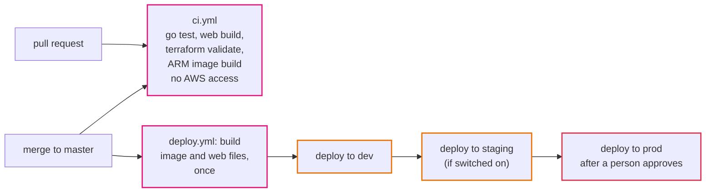
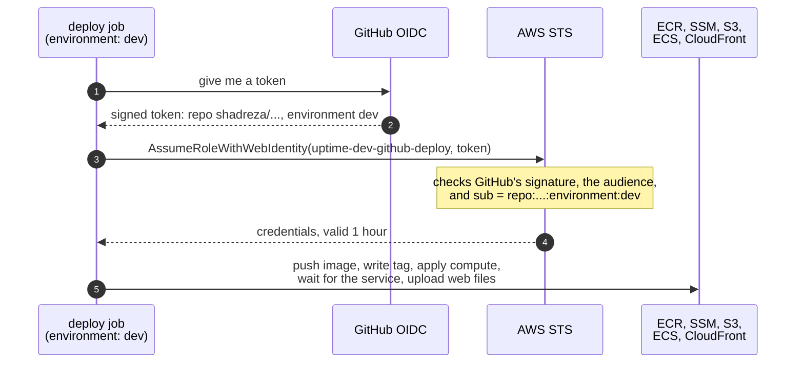

# Episode 12: Shipping changes

*From Laptop to Tokyo, part two. About 20 minutes.*

> Zayn's deploy checklist had seven lines. Build the image for ARM. Push it. Write the tag to SSM. Plan the compute layer. Apply it. Wait for the service to settle. Upload the web files and invalidate the cache.
>
> "I've done it maybe thirty times," Zayn said. "I'm pretty good at it now."
>
> "What's on your laptop that lets you do it?"
>
> "AWS credentials. Admin, I think."
>
> "So anyone who gets into your laptop can do anything in the client's account. And when you're on holiday, nobody can deploy. And nothing stops you from deploying code that doesn't compile, on a Friday, at 18:00." Kian tapped the checklist. "Seven steps, done by hand, by the one person who remembers them. That's not a process. That's a person. Let's make it a process."

## The idea: from a person to a pipeline

A deployment pipeline takes a change from a developer's branch to production without anyone copying keys or remembering steps. It has two halves.

Continuous integration (CI) runs on every change before it's merged: build the code, run the tests, check the infrastructure code is valid, build the container image. If anything fails, the change can't be merged. Broken code never reaches the main branch, so it never reaches production.

Continuous delivery (CD) runs after a change is merged: build what will be deployed, then deploy it to each environment in turn, with a human approval before production.

A few principles make a pipeline trustworthy rather than just automatic.

Build once, deploy the same thing everywhere. The image that reaches prod should be the exact bytes that were tested in dev and staging. If each environment builds its own copy, a new base image or dependency can sneak in between them, and prod runs something nobody tested.

No long-lived keys. The pipeline proves who it is each time and gets credentials that expire within the hour. There's nothing stored anywhere to steal.

The pipeline can deploy, and nothing more. Deploying new code and changing infrastructure are different jobs with different risks. If a change needs a new firewall rule or a bigger database, a person applies that, deliberately. The pipeline's identity isn't allowed to.

One way to deploy. The pipeline runs the same commands a person would. There's no separate "CI way" that drifts away from the documented way.

A person approves production. Automation up to the last step, then a human decision, recorded.

## The AWS answer: GitHub Actions, with OIDC

The repo lives on GitHub, so the pipeline is GitHub Actions: workflows written as YAML files in `.github/workflows`, running on machines GitHub provides (runners).

*CI never touches AWS. CD builds once and carries the same build through every environment.*

`ci.yml` runs on every pull request and every push. It runs the same `make` targets a developer runs (backend tests, web typecheck and build, Terraform validation) plus an ARM image build. It has no AWS access at all. With branch protection on `master`, a pull request can't be merged until all four checks pass.

`deploy.yml` runs when a change to the app or the compute code is merged. One job builds the backend image on an ARM runner (native, fast, and it catches ARM-only problems) and saves it as a file, builds the web app, and stores both as artifacts (files later jobs can pick up). Then the same deploy job runs once per environment: dev, then staging if it's switched on, then prod if it's switched on and someone approves.

Each environment's deploy does exactly what Zayn's checklist did: push the image to that environment's registry, write the tag to SSM, plan and apply the compute layer, wait until the service is stable, upload the web files and invalidate `index.html`. Same steps, same `make` targets, no laptop.

*The map for delivery: GitHub on the left, AWS on the right, and a narrow bridge between them that only accepts one repository and one environment at a time.*

### Logging in without a key: OIDC

How does a GitHub job get AWS credentials without any stored key? Through OIDC (OpenID Connect), a standard way for one system to vouch for another.

The idea: GitHub signs a short token for each job that says "this job is running in repository X, for environment Y". AWS is set up, once per account, to trust tokens signed by GitHub (an identity provider). A role in AWS says "I trust GitHub tokens, but only ones that say repository X, environment dev". The job hands AWS its token, AWS checks the signature and the claim, and gives back credentials for that role, valid for one hour.

*There is no secret anywhere in this picture. The token proves where the job is running, and it's only useful for about an hour.*

Compare that with the old way: an IAM user's access key stored as a GitHub secret. That key never expires. If it leaks (in a log, through a malicious third-party action, through a fork), it works from anywhere until someone notices. An OIDC credential can't be copied out ahead of time, lasts an hour, and only works for a job running in this repository and this environment ([ADR 0016](../adr/0016-github-actions-oidc-deploys.md)).

### What the deploy role may do

The trust policy decides *who* may use the role. The permission policy decides *what* it may do, and here it's deliberately narrow.

| May | May not |
|---|---|
| push to `uptime-dev/backend` in ECR | push to another environment's registry |
| read and write `/uptime-dev/image-tag` in SSM | read any secret |
| read `dev/*` Terraform state, write `dev/compute.tfstate` | write any other layer's state |
| register task definitions, update the `uptime-dev-api` service, pass `uptime-dev-*` roles to ECS tasks | change the network, security groups, the database, IAM, CloudFront settings, the WAF |
| upload to the web bucket, invalidate the distribution | anything in prod (prod has its own role) |

If a merged change needs more than a deploy (a new security group rule, a bigger database), the pipeline's apply fails with `AccessDenied`. That's the design working. Infrastructure changes are applied by a person who reads the plan, and the next deploy goes through normally.

Notice the `PassRole` limit again, only `uptime-dev-*` roles and only to ECS tasks. It's the same trap from episode 6: without it, the pipeline could start a task with an admin role and do anything through it.

### Guard rails around the pipeline

A few smaller settings finish the job:

- GitHub environments (`dev`, `staging`, `prod`) each hold their own role ARN as a variable. The role ARN isn't a secret; it's useless without a valid token from this repository.
- Required reviewers on the `prod` environment. The prod job waits with "Waiting for review" until someone clicks approve, and GitHub records who did.
- Concurrency per environment. Two merges 30 seconds apart start two deploys, but the second waits for the first to finish in each environment. Terraform's state lock would stop them colliding anyway; this makes it orderly.
- Switches (`DEPLOY_DEV`, `DEPLOY_STAGING`, `DEPLOY_PROD`) turn each environment's deploys on. Until `DEPLOY_DEV` is on, merges only run CI.

## What it costs

| Item | Price |
|---|---|
| GitHub Actions, including ARM runners | free for public repositories |
| IAM role and OIDC provider | free |
| **Total** | **$0** |

A private repository needs a paid GitHub plan for ARM runners, or can build on the free x86 runners: the Dockerfile cross-compiles, so the image is still correct for ARM. Only the "native ARM build" check is lost.

## What we didn't pick

**An IAM user's access keys stored as GitHub secrets.** Simple, and a key that never expires, sitting in a third-party system, with permissions someone has to remember to trim.

**Give the pipeline admin, so it can apply every layer.** One pipeline for everything, and one malicious or mistaken workflow change could do anything in the account. Infrastructure layers stay applied by people.

**Build in each environment's job.** Simple, but prod would run a different build from the one tested in dev.

**Plan every layer on every pull request, with a read-only role.** A good next step once more people change infrastructure, with a tool like Atlantis or HCP Terraform applying after review. For two people it's more machinery than it's worth.

## What breaks if

These are real experiments in [step 08](../steps/08-ci-cd.md#6-break-it-on-purpose).

Someone pushes code that doesn't compile

CI fails in the backend and image jobs. With branch protection, the merge button stays grey. Nothing is deployed. This is the cheapest bug you'll ever catch.

A fork of the repository tries to use the deploy role

The login step fails with `Not authorized to perform sts:AssumeRoleWithWebIdentity`. The fork's token says a different repository, and the role's trust policy only accepts `repo:shadreza/aws-three-tier-cloud-ref-architecture:environment:dev`. The same happens to a job in this repository that isn't running in the `dev` environment.

A merged change raises the log retention from 14 to 30 days

The deploy runs, the plan shows the new task definitions and the log group change, and the apply fails with `AccessDenied` on `logs:PutRetentionPolicy`. Terraform updates the log groups before the task definitions that use them, so nothing after the refusal is applied, and the service keeps running the old version. A person applies the compute layer by hand, then re-runs the deploy, which now only has the deploy itself left to do.

## Check yourself

1. What stops a fork of this repository from deploying to the client's AWS account?
2. Why build the image once and pass it between jobs, instead of building in each environment's job?
3. The deploy role can register task definitions and pass roles. What stops it from passing an admin role to a task?
4. A deploy fails with `AccessDenied`. Is the pipeline broken?
5. Why does CI run the same `make` targets that people run by hand?

Answers

1. The role's trust policy. The token's `sub` must be exactly this repository and this environment; a fork's token names a different repository.
2. So prod runs exactly the bytes that were tested in dev and staging. A second build could pick up a newer base image or dependency.
3. `iam:PassRole` is limited to `uptime-dev-*` roles, and only to the ECS tasks service.
4. Usually not. The merged change needed more than a deploy (an infrastructure change the deploy role isn't allowed to make). A person applies that layer, then re-runs the deploy.
5. So there's one way to deploy. A separate "CI way" would drift from the documented way, and one of them would stop working without anyone noticing.

## Try it

Set up the OIDC trust and the deploy role, open a pull request and watch CI, merge it and watch the deploy, and try to use the role from a job it doesn't trust: [Step 08: CI/CD](../steps/08-ci-cd.md), with its [workbook](../workbook/08-ci-cd.md). About two to three hours.

> Zayn merged the pull request and watched the `deploy` run go green: build, then dev. Two minutes later, the health endpoint said `"version": "3"`.
>
> "I didn't touch anything," Zayn said.
>
> "And there's no key on your laptop any more." Kian stood up and stretched. "That's every domain. Network, identity, data, compute, the front door, the timer, the alarms, and now the pipeline. Next time, let's put the pieces on one wall and see if they really fit."

Next: [Episode 13: The whole picture](13-the-whole-picture.md)
