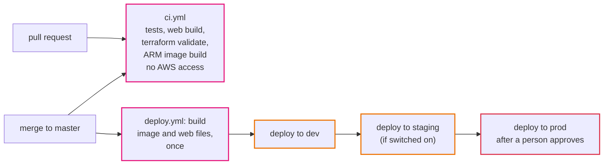
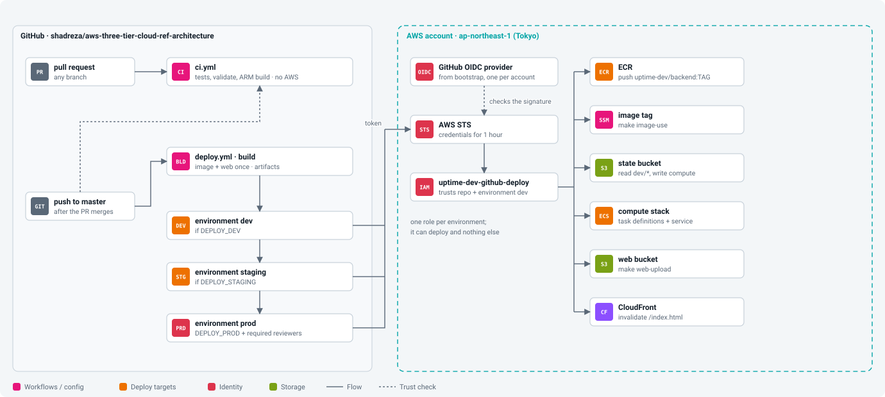
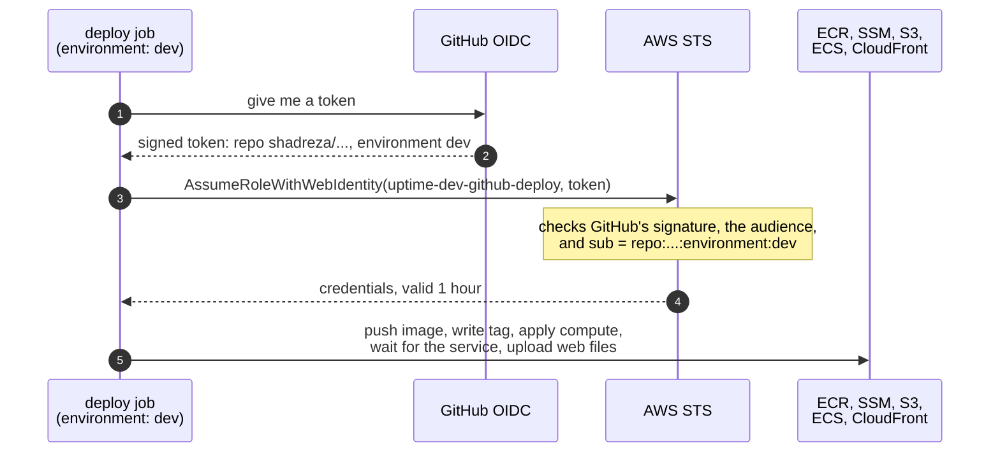

# Episode 13: Shipping changes

*From Laptop to Tokyo, part two. About 16 minutes.*

> Zayn came in late, looking grey. "I left my laptop on the Yamanote line last night. Lost and found had it by nine. It's fine."
>
> "Is it encrypted?"
>
> "Yes. Probably. I think so." Zayn sat down. "It also has admin credentials for the client's AWS account on it. That's how I deploy."
>
> Kian didn't say anything for a moment. "Then for about eleven hours, whoever picked it up could do anything in production. Let's rotate those keys now. And then let's make sure no laptop ever needs them again."

## From a person to a pipeline

Zayn's deploy checklist had seven steps: build the image for ARM, push it, write the tag to SSM, plan the compute layer, apply it, wait for the service to settle, upload the web files and invalidate the cache. Done by hand, by the one person who remembers them, with admin keys on a laptop that travels on trains.

A deployment pipeline does the same steps without anyone copying keys or remembering the order. It has two halves. Continuous integration (CI) runs on every change before it's merged: build, test, check the infrastructure code is valid, build the container image. If anything fails, the change can't be merged, so broken code never reaches the main branch. Continuous delivery (CD) runs after the merge: build what will ship, then deploy it to each environment in turn, with a person approving production.

A few principles decide whether you can trust it.

Build once and deploy that same build everywhere. The image that reaches prod should be the exact bytes tested in dev and staging. If each environment builds its own copy, a newer base image or dependency can slip in, and prod runs something nobody tested.

Keep no long-lived keys. The pipeline proves who it is on every run and gets credentials that expire within the hour, so there's nothing stored anywhere to lose on a train.

Let the pipeline deploy and nothing more. Shipping new code and changing infrastructure carry different risks. If a change needs a new firewall rule or a bigger database, a person applies it on purpose; the pipeline isn't allowed to.

Keep one way to deploy. The pipeline runs the same commands a person would, so there's no separate "CI way" drifting away from the documented way.

## GitHub Actions, with OIDC

The code lives on GitHub, so the pipeline is GitHub Actions: workflows written as YAML files in `.github/workflows`, running on machines GitHub provides.

*CI never touches AWS. CD builds once and carries that one build through every environment.*

`ci.yml` runs on every pull request and every push, using the same `make` targets a developer runs: backend tests, web typecheck and build, Terraform validation, and an ARM image build. It has no AWS access at all. With branch protection on `master`, nothing can be merged until all four checks pass.

`deploy.yml` runs when a change to the app or the compute code is merged. One job builds the backend image on an ARM runner and saves it as a file, builds the web app, and stores both as artifacts that later jobs pick up. Then the same deploy job runs once per environment. Each run does exactly what Zayn's checklist did: push the image to that environment's registry, write the tag to SSM, plan and apply the compute layer, wait for the service to be stable, upload the web files and invalidate `index.html`.

*The map for delivery: GitHub on the left, AWS on the right, and a narrow bridge between them that only accepts one repository and one environment at a time.*

### Logging in without a key

GitHub gets AWS credentials without any stored key through OIDC (OpenID Connect), a standard way for one system to vouch for another. For every job, GitHub signs a short token that says "this job is running in repository X, for environment Y". The AWS account is set up, once, to trust tokens signed by GitHub (an identity provider). A role says "I accept GitHub tokens, but only ones that say repository X, environment dev". The job hands its token to AWS STS, STS checks the signature and the claim, and returns credentials for that role, valid for one hour.

*There's no secret anywhere in this picture. The token only proves where the job is running, and it's useless an hour later.*

Compare that with Zayn's laptop, or with the common alternative of an IAM user's access key stored as a GitHub secret. Either key works from anywhere, forever, until someone notices it leaked. An OIDC credential can't be copied out in advance, lasts an hour, and only works for a job running in this repository and this environment ([ADR 0016](../adr/0016-github-actions-oidc-deploys.md)).

### What the deploy role may do

The trust policy decides who may use the role. The permission policy decides what it may do, and it's deliberately narrow.

| May | May not |
|---|---|
| push to `uptime-dev/backend` in ECR | push to another environment's registry |
| read and write `/uptime-dev/image-tag` in SSM | read any secret |
| read `dev/*` Terraform state, write `dev/compute.tfstate` | write any other layer's state |
| register task definitions, update the `uptime-dev-api` service, pass `uptime-dev-*` roles to ECS tasks | change the network, security groups, database, IAM, CloudFront or WAF |
| upload to the web bucket and invalidate the distribution | touch prod, which has its own role |

If a merged change needs more than a deploy, the pipeline's apply fails with `AccessDenied`. That's intended: a person reads the plan and applies that layer, and the next deploy goes through normally. The `PassRole` limit is here again, only `uptime-dev-*` roles and only to ECS tasks, for the reason in episode 6.

### Guard rails around the pipeline

Each environment is a GitHub environment (`dev`, `staging`, `prod`) holding its own role ARN as a variable. The ARN isn't a secret; it's useless without a valid token from this repository. The `prod` environment has required reviewers, so the prod job waits at "Waiting for review" until someone approves, and GitHub records who did. Deploys to one environment never run at the same time, so two merges 30 seconds apart deploy one after the other. Three switches (`DEPLOY_DEV`, `DEPLOY_STAGING`, `DEPLOY_PROD`) turn each environment's deploys on or off.

## What it costs

GitHub Actions, including ARM runners, is free for public repositories. The IAM role and the OIDC provider are free. A private repository needs a paid GitHub plan for ARM runners, or can build on free x86 runners: the Dockerfile cross-compiles, so the image is still right for ARM.

## What we turned down

We didn't store an IAM user's access keys in GitHub. They never expire and sit in a third-party system. We didn't give the pipeline administrator rights so it could apply every layer: one bad workflow change could then do anything in the account. We didn't build separately in each environment's job, because prod would run a different build from the one tested in dev. And we haven't yet added a Terraform plan on every pull request with a read-only role. That's the next step once more people change infrastructure, with a tool like Atlantis or HCP Terraform applying after review; for two people it's more machinery than it's worth.

## Check yourself

1. Someone forks the repository and edits the workflow to deploy to your account. What stops them, exactly?
2. A merged change raises log retention from 14 to 30 days. The dev deploy fails with `AccessDenied` on `logs:PutRetentionPolicy`. Is dev now half-deployed, and does the change reach staging or prod? What do you do?
3. A teammate wants to "speed things up" by having each environment's job build its own image in parallel. What's the risk, concretely?

Answers

1. The role's trust policy. The token's `sub` has to be exactly `repo:shadreza/aws-three-tier-cloud-ref-architecture:environment:dev`, and a fork's token names a different repository, so STS refuses. The same happens to a job in this repository that isn't running in the `dev` environment.
2. Neither. Terraform changes the log groups before the task definitions that use them, so the refusal stops everything after it and dev's service keeps running the old version. Staging and prod never start, because each environment waits for the one before. A person plans and applies the compute layer by hand, then re-runs the deploy, which now only has the deploy itself to do.
3. Each build can pull a newer base image or dependency, so prod could run bytes that were never tested in dev or staging. Building once and promoting that build rules this out.

## Try it

Set up the OIDC trust and the deploy role, open a pull request and watch CI, merge it and watch the deploy, and try to use the role from a job it doesn't trust: [Step 08: CI/CD](../steps/08-ci-cd.md), with its [workbook](../workbook/08-ci-cd.md). About two to three hours.

> Two weeks later Zayn merged a small change, a new field in the health response, and watched the deploy go green: build, then dev.
>
> "No keys," Zayn said, mostly to themselves. "Anywhere." They closed the laptop and put it in their bag without a second thought.

**Next:** [Episode 14: The whole picture](14-the-whole-picture.md)
