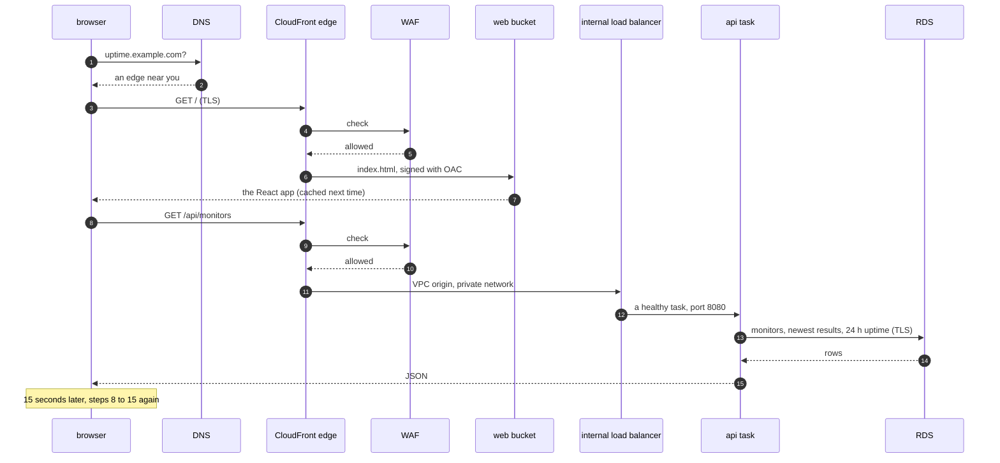
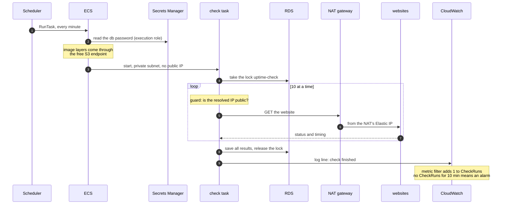
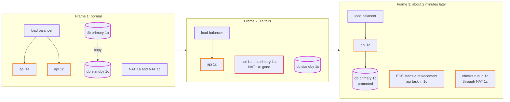
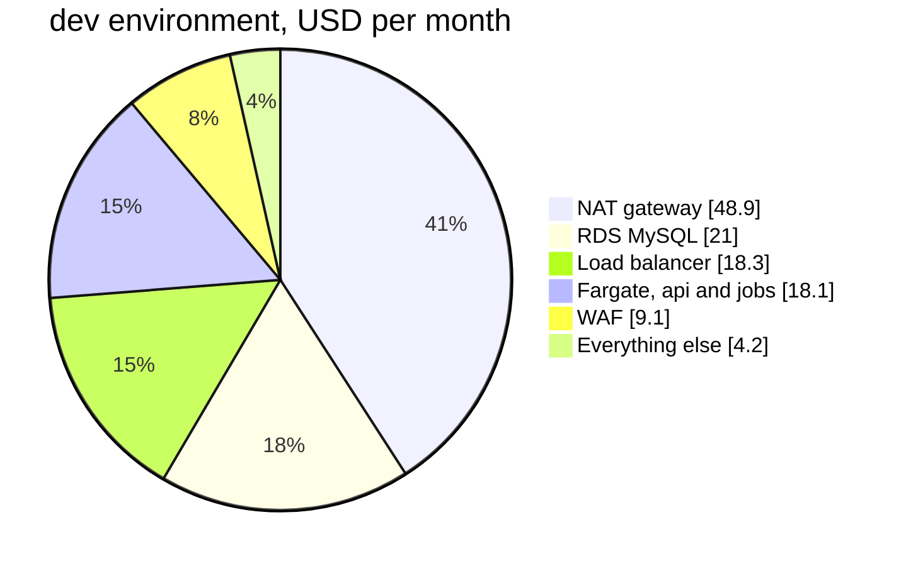

# Episode 13: The whole picture

*From Laptop to Tokyo, part three. About 25 minutes.*

> The client wanted a call. "I don't need the details," they wrote. "Just tell me how it works and what it costs. Five minutes."
>
> "Five minutes," Zayn said. "We've spent weeks on this."
>
> "Which is why we can do it in five," Kian said. "If we can't explain the whole system in five minutes, we don't understand it yet. One picture, three stories, one bill. Let's put it together."

## One picture

Here's the whole system, every domain from part two on one map.

*Read it from the outside in. Users reach CloudFront and nothing else. Everything inside the VPC is private, and the database sits in a band with no route out at all.*

And the same thing in one paragraph, the version for the client call:

Users open the app through CloudFront, which serves the React files from a private S3 bucket and passes anything under `/api` to our api, after a WAF has checked the request. The api runs as containers on ECS Fargate in two zones in Tokyo, behind an internal load balancer that nothing on the internet can reach. Every minute, EventBridge Scheduler starts a fresh check container, which visits every website through a NAT gateway and saves the results in RDS MySQL, in a network with no route out. Every hour, a rollup container adds up the day and writes a report to S3. CloudWatch watches all of it and emails us when checks stop or the api fails. New code reaches production through GitHub Actions, without any stored keys, after a person approves it.

Everything in that paragraph traces back to a need from episode 1 or a requirement from episode 2. Nothing is there because "real systems have it".

## Three stories

A picture shows where things are. Stories show how they work together. Here are the three that matter.

### Story one: a person opens the page

*Two trips through the same front door. The first ends at a file in S3. The second goes all the way down to the database, through four layers that each only accept the layer above.*

### Story two: one check, from clock to alarm

*This is the background half from episode 1, the part the client pays for. Six domains take part in every single run: timer, identity, compute, network, data and observability.*

### Story three: zone `1a` goes dark in prod

This is the story the extra $130 a month buys. Here it is, frame by frame.

*Frame 1: everything has a copy in each zone. Frame 2: zone `1a` disappears, with its api task, its NAT gateway and the database primary. Frame 3: the load balancer has already stopped sending to the dead task, RDS has promoted the standby, ECS is starting a second api task in `1c`, and the checks carry on through `1c`'s own NAT gateway.*

What the users see: a few failed requests while the load balancer notices the dead task, then `/api/ready` saying `503` for a minute or two while the database fails over. What the history shows: one or two check runs missing. What wakes somebody up: nothing. The first anyone hears of it might be the `OK` emails after a brief `app-errors` alarm.

In dev, the same event takes the app down until the zone comes back. We chose that in episode 2, and it's why dev costs half as much.

## Three environments, one design

| Setting | dev | staging | prod |
|---|---|---|---|
| network range | `10.20.0.0/16` | `10.30.0.0/16` | `10.40.0.0/16` |
| NAT gateways | 1 | 1 | 2, one per zone |
| database | `db.t4g.micro` | `db.t4g.micro` | `db.t4g.small`, Multi-AZ |
| backups kept | 1 day | 1 day | 7 days |
| deletion protection, final snapshot | off | off | on |
| api tasks | 1, 0.25 vCPU | 1, 0.25 vCPU | 2 to 4, 0.5 vCPU |
| log retention | 14 days | 14 days | 90 days |
| force-delete buckets and registry on destroy | yes | yes | no |

Every difference is a value in `terraform/envs/<env>/`. The code is the same for all three, and there's no `if prod` anywhere. Notice the last two rows: everything that makes prod hard to delete is also just a value. In prod, deleting anything important takes two deliberate steps.

## One bill

| Piece | dev and staging | prod | Why prod differs |
|---|---|---|---|
| NAT gateway + Elastic IP | $48.91 | $97.82 | one per zone |
| load balancer (internal) | $18.30 | $18.30 | |
| api on Fargate | $8.99 | $35.96 | two bigger tasks, two zones |
| check job, every minute | $9.00 | $9.00 | |
| rollup job, every hour | $0.15 | $0.15 | |
| RDS MySQL + 20 GB | $21.01 | $77.06 | a standby in the second zone |
| Secrets Manager | $1.25 | $1.25 | |
| CloudWatch | $2.40 | $3.10 | more log data |
| WAF | $9.10 | $9.10 | |
| ECR, S3, CloudFront, Scheduler | under $0.50 | under $1.00 | |
| **Total, about** | **$120 a month** | **$253 a month** | |

Where the dev money goes:

*The biggest slice does nothing but let private containers reach the internet. That's the price of keeping them private.*

Two things aren't in the table, and the client should hear about both. First, the outbound traffic from episode 2: with 200 monitors, data through the NAT gateway could add $11 to $54 a month to prod, depending on how big the client's pages are. We'll know after the first week (episode 11 shows where to look). Second, all prices exclude Japan's 10% consumption tax.

So the honest answer for the client call: about $250 to $310 a month for production before tax, and about $120 for a development copy we can switch off when nobody's using it.

## Did we meet the requirements?

Here's episode 2's list, checked against what we built.

| Requirement | How it's met | Episode |
|---|---|---|
| 200 monitors, checked every minute | a fresh check task every minute, 10 sites at a time, protected by a lock | 10 |
| know within a few minutes | about two minutes worst case, from outage to screen | 2, 10 |
| checks survive a zone failing (prod) | a NAT gateway, api task and database copy in each zone | 5, 7, 8 |
| lose no monitors | point-in-time backups, 7 days in prod, a final snapshot on delete | 7 |
| database never public | isolated subnets with no route out, and a security group, and no public address | 5, 7 |
| no secrets in code or state | Secrets Manager, write-only Terraform arguments, OIDC for the pipeline | 6, 12 |
| two people, no night shifts | managed services everywhere, self-healing deploys, email alarms, one heartbeat alarm | 8, 11 |
| under about $300 a month | $253 plus outbound traffic; measure it, and read less of each page if needed | 13 |
| data in Japan | Tokyo region | 4 |

One row is a "probably". That's fine. A design review that finds nothing uncertain wasn't looking hard enough.

## Layers of defense

Count how many separate things stand between someone on the internet and the database:

1. The WAF drops known attacks and floods at the edge.
2. CloudFront is the only way in. Nothing in the VPC has a public address.
3. The load balancer is internal and only accepts CloudFront's VPC origin.
4. The api tasks only accept the load balancer.
5. The api needs the admin token for any change.
6. The database only accepts the app and jobs security groups.
7. The database's subnets have no route to the internet at all.
8. Every connection to the database is encrypted, and the certificate is checked.
9. The database password exists only in Secrets Manager, readable by one role.

Any single one of these could fail, by mistake or by attack, and the database would still be out of reach. That's what defense in depth means in practice: no one mistake is enough.

## The house, not the furniture

The Terraform can rebuild all of this from nothing in about 35 minutes ([step 09](../steps/09-rebuild-and-replicate.md)). It's worth being clear about what it *doesn't* bring back:

| Thing | After a rebuild | What protects it in prod |
|---|---|---|
| monitors and check history | gone | 7 days of backups, a final snapshot on destroy, deletion protection |
| daily reports | gone | the bucket can't be force-deleted |
| the admin token and the db password | new values | nobody needs the password; tell the admin about the token |
| the CloudFront address `dxxxx.cloudfront.net` | a new name | a custom domain, so users never see the change |
| the NAT gateway's public IP | a new address | tell anyone who allowlisted the checker |

Terraform rebuilds the house. The furniture (data, and anything outside the system that depends on a generated name) needs its own plan.

## Before the first real prod deploy

The design is done. What's left are decisions only people can make:

1. Its own AWS account, so a mistake in dev can't reach prod and the bill is separate.
2. A domain, so the address users see never changes.
3. An alert email someone actually reads.
4. The `prod` GitHub environment with required reviewers.
5. A restore drill. Restore a point-in-time copy of the database once, by hand, on a quiet day, and write down how long it took. It's the one thing you can't learn during an incident.

## Check yourself

1. In story one, how many separate security layers does the `GET /api/monitors` request pass through before it reaches the database?
2. In story two, which six domains take part in one check run?
3. In story three, what's the single most expensive thing that makes it possible, and why?
4. The client asks for a staging environment in a separate AWS account. What code changes?
5. After a rebuild, a partner says the checks no longer reach their site. What changed?

Answers

1. The WAF, CloudFront as the only entrance, the load balancer's security group, the api's security group, and the database's security group, over an encrypted connection. The database's isolated subnet is a sixth layer that the request doesn't touch but an attacker would.
2. Scheduled work (the scheduler), identity (the roles and the secret), compute (the task), network (private subnet, NAT, S3 endpoint), data (the lock and the results) and observability (the log line and the heartbeat).
3. The second NAT gateway and the Multi-AZ database together, about $49 and $38 a month more than dev. Without the second NAT, checks in `1c` would lose the internet with `1a`; without the standby, the database would go down with `1a`.
4. None. A new folder of values with a new account ID and state bucket, then the same layers applied in order.
5. The NAT gateway's Elastic IP. Every check leaves through it, and a rebuild makes a new one, so their allowlist has the old address.

## Try it

The final test of the whole design: make staging from values only, tear dev down to nothing, rebuild it from zero and time it. [Step 09: Rebuild and replicate](../steps/09-rebuild-and-replicate.md), with its [workbook](../workbook/09-rebuild-and-replicate.md). For operating the finished system day to day, read the [runbook](../runbook.md).

> The call took four minutes. The client asked one question: "What happens if we grow?"
>
> "Depends how much," Kian said. "Double, nothing changes. Ten times, one part breaks first, and we know which. A hundred times, it's a different system."
>
> After the call, Zayn asked, "Do we know which part breaks first?"
>
> "We worked it out in episode 2," Kian said. "Let's finish the thought."

Next: [Episode 14: Epilogue](14-epilogue.md)
