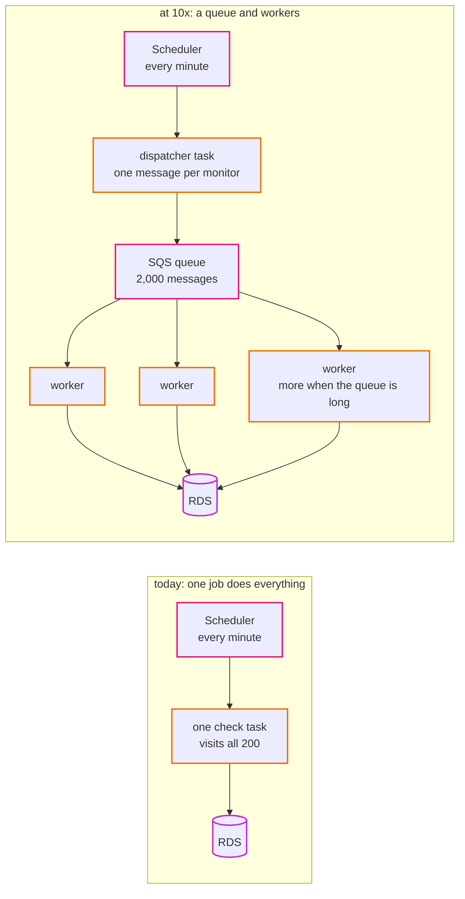

# Episode 14: Epilogue, at 10x and 100x

*From Laptop to Tokyo, part three. About 20 minutes.*

> "So what does break first?" Zayn asked.
>
> "Let's find out properly. Same method as episode 2." Kian wrote three numbers on the board: 400, 2,000, 20,000. "Double, ten times, a hundred times. For each one we go through the numbers and find the first thing that stops working. Not everything that could be better. The first thing that actually breaks."
>
> "And then we build the fix?"
>
> "Then we write it down. We build it when we get there. If we built for 20,000 monitors today, the client would pay for a system they don't need, and we'd have to run it."

## The method: find the first thing that breaks

Scaling a system isn't about making everything bigger. It's about finding the one part that hits its limit first, fixing that, and then finding the next one. Every design has a first bottleneck. A good design knows where it is.

The numbers from episode 2 are the tool. Here they are again, at four sizes:

| | 200 (today) | 400 (2x) | 2,000 (10x) | 20,000 (100x) |
|---|---|---|---|---|
| checks a day | 288,000 | 576,000 | 2.9 million | 29 million |
| typical check run (10 at a time, 0.2 s each) | 4 s | 8 s | 40 s | 400 s |
| worst case (10 s timeouts) | 200 s | 400 s | 2,000 s | 20,000 s |
| raw results kept (30 days) | under 1 GB | about 2 GB | about 9 GB | about 90 GB |
| NAT data, at 20 to 100 KB a page | $11 to $54 | $22 to $108 | $110 to $540 | $1,100 to $5,400 |

*Read down each column and look for the first number that's impossible. At 10x there's one. At 100x there are several.*

## At 2x: nothing changes

At 400 monitors, the typical check run takes about 8 seconds. The database holds about 2 GB. Nothing is close to a limit.

The one number to watch is the NAT traffic, which doubles along with everything else. If the first week's measurement (episode 11) showed large pages, this is where reading less of each page stops being optional. That's a small change in the checker's code, and it would save more money than any infrastructure change could.

This is the most common outcome of a growth question, and it's worth saying out loud to a client: "double" usually costs nothing but a bigger bill for traffic.

## At 10x: the check job breaks first

At 2,000 monitors, the typical check run takes about 40 seconds. That's inside the minute, just. But any slow hour pushes runs past 60 seconds, the lock makes the next run skip, and the history starts to thin out every time a big hosting company has a bad day. The check job is the first bottleneck, exactly as [ADR 0001](../adr/0001-uptime-monitor-as-sample-app.md) predicted.

There's a cheap first step: visit more sites at once. The check job does 10 at a time because that's plenty for 200 monitors. At 50 at a time, the typical run drops to about 8 seconds, and a slightly bigger task handles it. That buys time.

The real fix is to stop doing all the work in one job. Instead of one check task visiting every website, the scheduler (or a small dispatcher task) puts one message per monitor into a queue, and a group of worker tasks pull messages from it and do the visits in parallel. On AWS that's SQS (Simple Queue Service) and an ECS service of workers that grows and shrinks with how many messages are waiting.

*The lock goes away, and so does the ceiling. If a slow hour makes the queue longer, more workers start. A worker that gets stuck only holds up one monitor, not all of them.*

Notice what this changes and what it doesn't. The workers are the same image with a new command (`uptime worker`, say), so "one image, many commands" survives. The network doesn't change at all: workers run in the same private subnets, with the same security group, through the same NAT gateways. The data layer barely notices. Good boundaries mean a big change in one domain stays in that domain.

Three other things start to need attention at 10x, in order:

The NAT bill. $110 to $540 a month in traffic, which dwarfs the NAT gateway's own hourly cost. Reading less of each page is now required. At this volume, private tunnels (interface endpoints) for the registry and for logs also start paying for themselves, because they keep AWS traffic off the NAT gateway's per-GB charge ([ADR 0006](../adr/0006-nat-gateways-per-environment.md) already says so).

The database. 2.9 million new rows a day and about 9 GB of raw results. Size is fine; the problem is the rollup's nightly delete of old rows, which becomes a slow, heavy query. The usual fix is to split `check_results` into one partition per day, so deleting a day is dropping a partition, which is instant. That's a schema change AutoMigrate can't do, which is exactly the moment [ADR 0003](../adr/0003-gorm-automigrate-for-schema.md) says we switch to versioned migrations. The burstable `db.t4g` instance probably also gives way to one with steady CPU.

What customers are told. At 2,000 monitors for many customers, "our staff watch a dashboard" stops working. Customers want an email when *their* site goes down. That's a product feature, built in the app, not a CloudWatch alarm: CloudWatch alarms are for telling *us* the system is broken ([ADR 0015](../adr/0015-cloudwatch-alarms-from-metrics-and-logs.md)).

## At 100x: it's a different system

At 20,000 monitors, almost every number in the table is past a limit, and the answers stop being tweaks.

Checks. The worker fleet from 10x still works, just with more workers. But at this scale checking from one place starts to give false alarms: when the network between Tokyo and some region has a bad minute, hundreds of sites look down at once. Real monitoring products check from several regions and only call a site down when most of them agree. That's a product decision, and it would bring a second and third region into the design for the first time.

Data. 29 million rows a day. MySQL can store it, but results are really a time series (a value per monitor per minute), and a database built for time series, or a much bigger Aurora cluster with read replicas for the dashboards, starts to make more sense. [ADR 0008](../adr/0008-rds-mysql-single-az-dev-multi-az-prod.md) already names Aurora as the step after RDS.

People. A single admin token doesn't work for hundreds of customers. The app needs real user accounts, with each customer seeing only their own monitors. That touches the api, the data model and the security design all at once.

Money. The NAT traffic alone would be thousands of dollars a month at 20 to 100 KB a page. At this point the check job would only fetch headers or the first few KB of each page, and the fixed costs (Fargate, the NAT gateways, the load balancer) become small compared to the traffic. Fargate Savings Plans or EC2 capacity for the workers start to pay off ([ADR 0011](../adr/0011-ecs-fargate-arm-with-pinned-image-tags.md)).

Operations. A bigger team, and a bigger blast radius. The repo already lists the next steps ([step 09](../steps/09-rebuild-and-replicate.md#where-to-go-from-here)), and each one would get its own ADR first:

- a separate AWS account per environment, with AWS Organizations, and a shared account for the image registry
- backups copied to Osaka, and a practiced rebuild there, so losing all of Tokyo takes hours instead of forever
- blue/green deployments, with a test listener before traffic switches
- a Terraform plan on every pull request, with a read-only role, and applies after review
- IAM database authentication, so there's no database password at all
- expand-and-contract migrations, so schema changes never need downtime

None of this is wrong to want. All of it is wrong to build for 200 monitors.

## What changes where

| Domain | 2x | 10x | 100x |
|---|---|---|---|
| network | nothing | interface endpoints for registry and logs | same, plus other regions for multi-location checks |
| identity | nothing | a role for the workers | user accounts for customers; accounts per environment |
| data | nothing | partitions, versioned migrations, steady-CPU instance | Aurora or a time-series store, read replicas |
| compute | nothing | a worker service that scales on queue length | bigger worker fleet, Savings Plans or EC2 |
| front door | nothing | nothing | probably nothing; CloudFront was built for this |
| scheduled work | nothing | the scheduler feeds a queue | same |
| observability | watch NAT traffic | alarm on queue age | per-region views, tracing across services |
| delivery | nothing | nothing | plan on pull request, blue/green deploys |
| the checker code | read less of each page | more at once, then workers | headers only |

*Read across a row to see a domain grow. Read down a column to see how much of the system a growth step touches. At 10x, it's mostly compute and data. At 100x, it's everything.*

Look at the front-door row. CloudFront, the WAF and the static files are the part of the design that needs nothing at any of these sizes, because they were built on services designed for far bigger loads than ours. The places that change are the ones we built ourselves: the job, the schema, the checker. That's typical, and it's a good argument for using managed services wherever a boring one exists.

## Looking back

We started with an app on a laptop and a four-line email. Along the way, Zayn and Kian made maybe fifty decisions: two zones, three kinds of subnet, one NAT in dev and two in prod, a database with no route out, a password nobody typed, a fresh container every minute, an alarm on silence, a pipeline with no keys.

None of those decisions came from a list of best practices. Each one came from the same five habits from the prologue:

Start from what the app needs. The check job calling the internet decided the network. The two kinds of work decided the availability targets.

Draw the boundaries. Network rules for which machine, IAM for which program, and a database behind both, plus a subnet with no way out.

Follow the data. 1,440 rows a day per monitor decided the rollup job, and pages coming back through the NAT gateway found a cost nobody had written down.

Ask what breaks. Every episode had a "what breaks if", and every answer was either "that's fine, and here's why" or a change to the design.

Put a price on it. $120 for dev, $253 for prod, and a clear story about what the difference buys.

And under all of them: write down what you didn't choose, and when you'd change your mind. Every "we didn't pick" section in this series is an ADR in the repo. When the client grows, nobody has to remember why the check job is one task. It's written down, with the exact point at which it stops being the right answer.

The Terraform for all of it is in this repo, and an AI assistant could have written most of it. What it couldn't have done is decide which of the fifty decisions were right for this app, this client and this budget. That part is design, and now you've watched it done from start to finish.

## Check yourself

1. At 10x, why does the check job break before anything else?
2. What's the cheap first fix at 10x, and what's the real one?
3. Why is "partition `check_results` by day" also the moment to leave AutoMigrate?
4. Why does the front door need almost nothing at any of these scales?
5. Why not build the queue and workers now, since we know we'll need them at 10x?

Answers

1. One task visits every monitor, 10 at a time, and has to finish within a minute. At 2,000 monitors the typical run is 40 seconds, so any slow hour pushes runs past a minute and the lock starts skipping runs.
2. The cheap fix is visiting more sites at once (50 instead of 10), with a slightly bigger task. The real fix is a queue with a group of workers that grows with the queue.
3. Partitioning is a schema change that AutoMigrate can't make. ADR 0003 says the first change it can't handle is when we switch to versioned migrations.
4. CloudFront, the WAF and S3 are built for loads far bigger than ours. The parts that change are the ones we built ourselves.
5. It would cost more to run, add moving parts to operate, and solve a problem the client doesn't have. We know where the limit is and what the fix is, and that's enough until we get close.

## Where to go next

- Build it: start at [Step 01](../steps/01-understand-the-application.md) and follow the [learning path](../learning-path.md).
- Teach it: the [teaching guide](../teaching-guide.md) turns the steps into a course.
- Run it: the [runbook](../runbook.md) covers operating the finished system.
- Question it: every decision is in [docs/adr](../adr/README.md), including the ones we'd reverse.

> Kian wiped the whiteboard clean. The three numbers went, and the arrows, and the boxes.
>
> "Next client's app is a booking system," Kian said. "No background jobs at all. Nothing calls the internet."
>
> "So no NAT gateway?" Zayn said.
>
> Kian smiled. "Maybe. What does the app need?"

*End of the series. Back to the [series home](README.md).*
