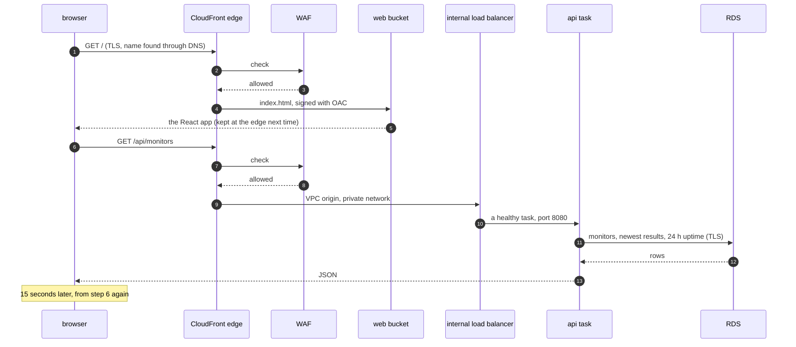
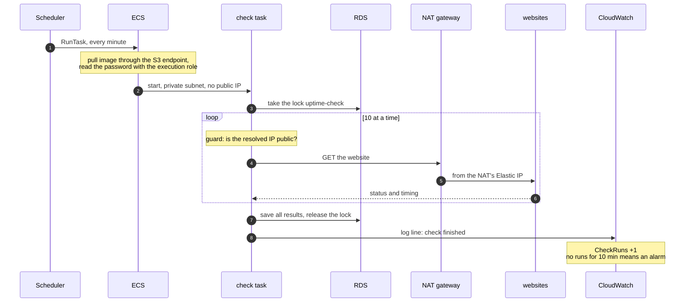
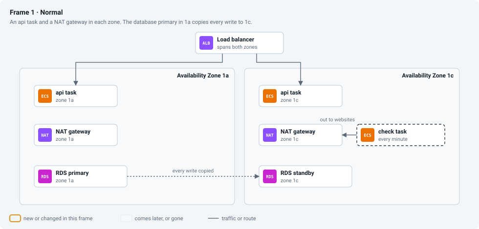
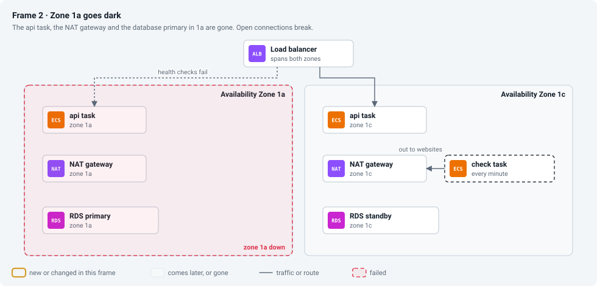
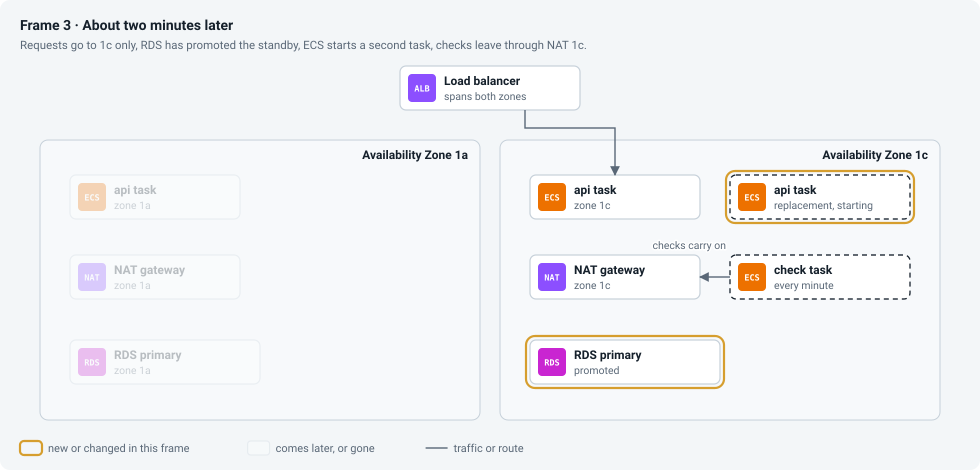
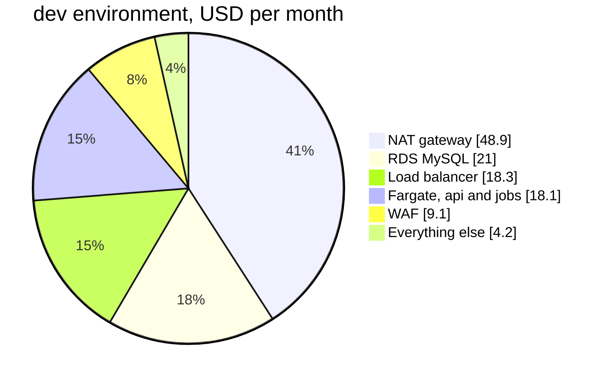

# Episode 14: The whole picture

*From Laptop to Tokyo, part three. About 18 minutes.*

> The client wanted a call. *No details, please. Just how it works and what it costs. Five minutes.*
>
> "Five minutes," Zayn said. "We've spent weeks on this."
>
> "Which is why we can do it in five," Kian said. "One picture, three stories, one bill. You're presenting."
>
> "Me?"
>
> "You built half of it. And you found the most expensive line in it."

## One picture

Every domain from part two, on one map:

*Read it from the outside in. Users reach CloudFront and nothing else. Everything inside the VPC is private, and the database sits in a band with no route out at all.*

And the version Zayn used on the call:

Users open the app through CloudFront, which serves the React files from a private S3 bucket and passes anything under `/api` to our api, after a WAF has checked the request. The api runs as containers on ECS Fargate in two zones in Tokyo, behind a load balancer nothing on the internet can reach. Every minute, EventBridge Scheduler starts a fresh check container, which visits every website through a NAT gateway and saves the results in RDS MySQL, on a network with no route out. Every hour, a rollup container adds up the day and writes a report to S3. CloudWatch watches it all and emails us when checks stop or the api fails. New code reaches production through GitHub Actions, with no stored keys, after a person approves it.

Everything in that paragraph traces back to a need from episode 1 or a requirement from episode 2.

## Three stories

A map shows where things are. These three stories show how the pieces work together.

### A person opens the page

*Two trips through the same front door. The first ends at a file; the second goes all the way down to the database, through layers that each only accept the one above.*

### One check, from clock to alarm

*This is the background half the client pays for, and six domains take part in every run: scheduled work, identity, compute, network, data and observability.*

### Zone `1a` goes dark, in prod

This is what the extra production spending buys. The boxes stay put; watch what fails and what takes over.

*Frame 1: a copy of everything in each zone. Frame 2: zone `1a` disappears with its api task, its NAT gateway and the database primary. Frame 3: the load balancer has stopped sending to the dead task, RDS has promoted the standby, ECS is starting a second api task in `1c`, and checks carry on through `1c`'s own NAT gateway.*

Users see a few failed requests while the load balancer notices the dead task, then `/api/ready` answers `503` for a minute or two while the database fails over. The history shows one or two check runs missing, and nobody has to wake up for any of it. In dev, the same event takes the app down until the zone comes back, which is the trade we made in episode 2.

## Three environments, one design

| Setting | dev | staging | prod |
|---|---|---|---|
| network range | `10.20.0.0/16` | `10.30.0.0/16` | `10.40.0.0/16` |
| NAT gateways | 1 | 1 | 2, one per zone |
| database | `db.t4g.micro` | `db.t4g.micro` | `db.t4g.small`, Multi-AZ |
| backups kept | 1 day | 1 day | 7 days |
| deletion protection, final snapshot | off | off | on |
| api tasks | 1, 0.25 vCPU | 1, 0.25 vCPU | 2 to 4, 0.5 vCPU |
| log retention | 14 days | 14 days | 90 days |
| buckets and registry force-deleted on destroy | yes | yes | no |

Every difference is a value in `terraform/envs/<env>/`. The code is identical for all three, with no `if prod` anywhere. The last two rows are values too: everything that makes prod hard to delete is a setting, so deleting anything important in prod takes two deliberate steps. Each environment's network range is separate, so they could be connected later without clashing. Large companies also give each environment its own AWS account, so a mistake in dev physically can't reach prod, and the repo supports that.

## One bill

| Piece | dev and staging | prod | Why prod differs |
|---|---|---|---|
| NAT gateway + Elastic IP | $48.91 | $97.82 | one per zone |
| load balancer (internal) | $18.30 | $18.30 | |
| api on Fargate | $8.99 | $35.96 | two bigger tasks |
| check job, every minute | $9.00 | $9.00 | |
| rollup job, every hour | $0.15 | $0.15 | |
| RDS MySQL + 20 GB | $21.01 | $77.06 | a standby in the second zone |
| Secrets Manager | $1.25 | $1.25 | |
| CloudWatch | $2.40 | $3.10 | more log data |
| WAF | $9.10 | $9.10 | |
| ECR, S3, CloudFront, Scheduler | under $0.50 | under $1.00 | |
| **Total, about** | **$120 a month** | **$253 a month** | |

*The biggest slice does nothing but let private containers reach the internet. That's the price of keeping them private.*

Two things aren't in the table, and Zayn told the client both. First, the outbound traffic from episode 2: with 200 monitors, data through the NAT gateway adds somewhere between $11 and $54 a month, depending on how big the client's pages are, and the first week's numbers will tell us which. Second, all prices exclude Japan's 10% consumption tax. So production comes to about $265 to $305 a month before tax, and a development copy costs about $120 and can be switched off when nobody's using it.

## Did we meet the requirements?

| Requirement from episode 2 | How it's met |
|---|---|
| 200 monitors, checked every minute | a fresh check task every minute, 10 sites at a time, protected by a lock |
| know within a few minutes | about two minutes in the worst case, from outage to screen |
| checks survive a zone failing (prod) | a NAT gateway, an api task and a database copy in each zone |
| lose no monitors | point-in-time backups, 7 days in prod, a final snapshot on delete |
| database never public | isolated subnets with no route out, a security group, no public address |
| no secrets in code or state | Secrets Manager, write-only Terraform arguments, OIDC for the pipeline |
| two people, no night shifts | managed services, self-healing deploys, email alarms, one heartbeat alarm |
| about $300 a month | $253 plus outbound traffic; measure it, and read less of each page if needed |
| data in Japan | Tokyo |

The $300 row is a "probably" until the first week's traffic numbers are in.

## Layers of defense

Count what stands between someone on the internet and the database. Seven layers control whether anyone can reach it at all:

1. The WAF drops known attacks and floods at the edge.
2. CloudFront is the only way in; nothing in the VPC has a public address.
3. The load balancer is internal and only accepts CloudFront's VPC origin.
4. The api tasks only accept the load balancer.
5. The database only accepts the app and jobs security groups.
6. The database's subnets have no route to the internet, in either direction.
7. The database has no public address.

And two more protect what's said if someone does get a connection: every connection to the database is encrypted with the certificate checked, and the password exists only in Secrets Manager, readable by one role. Any single layer can fail, through a mistake or an attack, and the others still stand: the defense in depth from episode 5, applied to the whole system.

## The house, not the furniture

The Terraform can rebuild all of this from nothing in about 35 minutes (hands-on [step 09](../steps/09-rebuild-and-replicate.md)), but it doesn't bring everything back. Monitors, check history and reports come back only from backups. The admin token and the database password get new values. The CloudFront address changes unless there's a custom domain in front of it (episode 9). The NAT gateway's public IP changes, so anyone who allowlisted the checker has to update it. Terraform rebuilds the house. The furniture needs its own plan.

## Before the first real prod deploy

The design is done. What's left are decisions only people can make: give prod its own AWS account, point a domain at it, send the alert email to someone who reads it, add required reviewers to the `prod` GitHub environment, and practice a restore once, by hand, on a quiet day, as episode 7 describes.

## Check yourself

1. The client's security reviewer asks, "What if someone steals the database password?" Walk through which layers still protect the data.
2. After a planned rebuild of prod, a partner says your checks no longer reach their site. Nothing else is wrong. What changed?
3. The client wants to cut the prod bill by about $90 a month. Which two changes would you offer, and what would each one cost them in resilience?

Answers

1. The password alone doesn't get anyone a connection. They'd still need a network path into the isolated subnets, which have no route out and no public address, and a security group that lets them in, which only allows the app and jobs groups. Layers 1 to 7 all still stand.
2. The NAT gateway's Elastic IP. Every check leaves through it, and a rebuild creates a new one, so their allowlist has the old address. Tell them the new one (and consider keeping the Elastic IP between rebuilds).
3. Drop to one NAT gateway (saves about $49; checks stop in both zones if the NAT's zone fails) and turn off Multi-AZ on the database (saves about $38; a zone failure means the database is down until the zone recovers, and maintenance reboots cause a few minutes of downtime instead of a quick failover). Together that's about $87, roughly dev's design with prod's sizes, and they give up the "survive a zone failing" requirement.

## Try it

The final test of the whole design: make staging from values only, tear dev down to nothing, rebuild it from zero and time it. [Step 09: Rebuild and replicate](../steps/09-rebuild-and-replicate.md), with its [workbook](../workbook/09-rebuild-and-replicate.md). For day-to-day operation, read the [runbook](../runbook.md).

> The call took four minutes. The client asked one question: "What if we grow?"
>
> "Double, nothing changes except the traffic bill," Zayn said. "Ten times, the check job hits its limit first, and we know what replaces it. A hundred times, it's a different system, and we'd sit down and design it again."
>
> Afterwards Kian said, "You didn't need me on that call."

**Next:** [Episode 15: Epilogue](15-epilogue.md)
