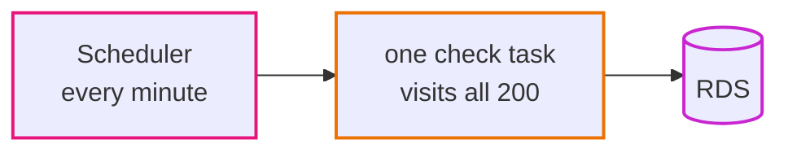
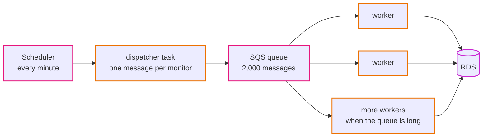

# Episode 15: Epilogue, at 10x and 100x

*From Laptop to Tokyo, part three. About 16 minutes.*

> "You told the client the check job breaks first," Kian said. "Show me."
>
> Zayn wrote three numbers on the board: 400, 2,000, 20,000. "Double, ten times, a hundred times. Same sums as episode 2. For each one, find the first thing that actually stops working. Not everything that could be nicer. The first thing that breaks."
>
> "And then build the fix?"
>
> "Then write it down," Zayn said. "We build it when we get close. If we built for twenty thousand monitors now, the client would pay for a system they don't need, and we'd have to run it."
>
> Kian sat back. "That was my line."

## Find the first thing that breaks

Scaling a system means finding the one part that hits its limit first, fixing that, and then finding the next. Every design has a first bottleneck, and a good design knows where it is. Episode 2's numbers are the tool:

| | 200 (today) | 400 (2x) | 2,000 (10x) | 20,000 (100x) |
|---|---|---|---|---|
| checks a day | 288,000 | 576,000 | 2.9 million | 29 million |
| typical check run (10 at a time, 0.2 s each) | 4 s | 8 s | 40 s | 400 s |
| worst case (10 s timeouts) | 200 s | 400 s | 2,000 s | 20,000 s |
| raw results kept (30 days) | under 1 GB | about 2 GB | about 9 GB | about 90 GB |
| NAT data at 20 to 100 KB a page | $11 to $54 | $22 to $108 | $110 to $540 | $1,100 to $5,400 |

*Read down each column for the first number that's impossible. At 10x there's one. At 100x there are several.*

## At 2x: the bill changes, the design doesn't

At 400 monitors a typical check run takes about 8 seconds and the database holds about 2 GB. Nothing is near a limit.

The only number to watch is the NAT traffic, which doubles with everything else. If the first week's measurement (episode 12) showed large pages, this is where reading less of each page stops being optional. It's a small change to the checker, and it would save more than any infrastructure change could. "Double" usually costs a client nothing but a bigger traffic bill, and it's worth saying that out loud.

## At 10x: the check job breaks first

At 2,000 monitors a typical run takes about 40 seconds. That's inside the minute, just. But any slow hour pushes runs past 60 seconds, the lock makes the next run skip, and the history thins out whenever a big hosting company has a bad day. The single check job is the first bottleneck, as [ADR 0001](../adr/0001-uptime-monitor-as-sample-app.md) predicted.

There's a cheap first step: visit more sites at once. The job does 10 at a time because that's plenty for 200 monitors. At 50 at a time the typical run drops to about 8 seconds, and a slightly bigger task handles it. That buys time.

The real fix is to stop doing all the work in one job. Today it looks like this:

At 10x it becomes a queue and a group of workers. The scheduler starts a small dispatcher that puts one message per monitor into a queue, and worker tasks pull messages and do the visits in parallel. On AWS that's SQS (Simple Queue Service) and an ECS service of workers that grows and shrinks with the number of messages waiting.

*The lock and the one-minute ceiling both go away. A slow hour makes the queue longer and more workers start. A stuck worker holds up one monitor, not all of them.*

Most of the system doesn't change. The workers are the same image with a new command (`uptime worker`, say), so "one image, many commands" survives. The network doesn't change at all: same private subnets, same security group, same NAT gateways.

Three other things need attention at 10x. The NAT bill reaches $110 to $540 a month in traffic alone, so reading less of each page is now required, and private endpoints for the image registry and logs start paying for themselves by keeping AWS traffic off the NAT gateway ([ADR 0006](../adr/0006-nat-gateways-per-environment.md)). The database takes 2.9 million new rows a day. Size is fine, but rollup's hourly delete of old results becomes a heavy query, and the usual fix is to split `check_results` into one partition per day so that deleting a day is instant. That's a schema change AutoMigrate can't make, which is exactly when [ADR 0003](../adr/0003-gorm-automigrate-for-schema.md) says we switch to versioned migrations. The burstable `db.t4g` instance probably gives way to one with steady CPU. And customers start wanting an email when their site goes down, which is a product feature in the app, not a CloudWatch alarm ([ADR 0015](../adr/0015-cloudwatch-alarms-from-metrics-and-logs.md)).

## At 100x: a different system

At 20,000 monitors almost every number in the table is past a limit, and the fixes stop being adjustments.

The worker fleet still works, with more workers. But checking from one place starts giving false alarms: when the network between Tokyo and some region has a bad minute, hundreds of sites look down at once. Real monitoring products check from several regions and only call a site down when most agree. That's a product decision, and it would bring more regions into the design for the first time.

Results are really a time series (a value per monitor per minute), and at 29 million rows a day a database built for time series, or a much bigger Aurora cluster with read replicas for the dashboards, starts to make sense ([ADR 0008](../adr/0008-rds-mysql-single-az-dev-multi-az-prod.md) names Aurora as the next step after RDS). One admin token can't serve hundreds of customers, so the app needs real user accounts, and each customer sees only their own monitors. That touches the api, the data model and the security design at once. The NAT traffic would run to thousands of dollars a month, so the checker would fetch only headers or the first few KB of each page, and the fixed costs would become small next to the traffic. Fargate Savings Plans or EC2 capacity for the workers would start to pay off ([ADR 0011](../adr/0011-ecs-fargate-arm-with-pinned-image-tags.md)).

A bigger team also means a bigger blast radius. The repo lists the next operational steps (hands-on [step 09](../steps/09-rebuild-and-replicate.md#where-to-go-from-here)), each of which would get an ADR first: a separate AWS account per environment with a shared account for the image registry; backups copied to Osaka with a practiced rebuild there, so losing Tokyo means hours of rebuilding instead of waiting for Tokyo to come back; blue/green deployments; a Terraform plan on every pull request; IAM database authentication, so there's no password at all; and expand-and-contract migrations, so schema changes never need downtime.

All of it is worth wanting eventually, and none of it is worth building for 200 monitors.

## What changes where

| Domain | 2x | 10x | 100x |
|---|---|---|---|
| network | nothing | private endpoints for registry and logs | more regions, for checks from several places |
| identity | nothing | a role for the workers | customer accounts; an AWS account per environment |
| data | nothing | partitions, versioned migrations, steady-CPU instance | Aurora or a time-series store, read replicas |
| compute | nothing | a worker service that scales on queue length | a bigger worker fleet, Savings Plans or EC2 |
| front door | nothing | nothing | probably nothing |
| scheduled work | nothing | the scheduler feeds a queue | same |
| observability | watch NAT traffic | alarm on the age of the oldest message | per-region views, tracing across services |
| delivery | nothing | nothing | plan on pull request, blue/green deploys |
| the checker code | read less of each page | more at once, then workers | headers only |

*Read across a row to watch one domain grow, or down a column to see how much of the system one growth step touches. At 10x it's mostly compute and data; at 100x it's everything.*

The front-door row barely changes. CloudFront, the WAF and the static files sit on services built for far bigger loads than ours. The parts that change are the ones we built ourselves: the job, the schema, the checker. That's typical.

## Looking back

We started with an app on a laptop and a four-line email, and along the way Zayn and Kian made something like fifty decisions: two zones, three kinds of subnet, one NAT gateway in dev and two in prod, a database with no route out, a password nobody typed, a fresh container every minute, an alarm on silence, a pipeline with no keys.

None of them came from a best-practices list. The check job calling the internet decided the network. The two kinds of work decided the availability targets. Following one row of data found the rollup job, and following the bytes found a cost nobody had written down. Each "what breaks" question ended in either "that's acceptable, and here's why" or a change to the design. The pieces all have monthly prices, and the options we turned down are ADRs in the repo, each with the point at which it would become the right answer.

The Terraform for all of it is in this repo, and an assistant could have written most of it. What an assistant couldn't have done is decide which of those fifty decisions fit this app, this client and this budget.

## Check yourself

1. The client asks for checks every 10 seconds instead of every minute. Using the numbers above, what breaks first, and which part of the 10x design would you bring forward?
2. A teammate proposes building the queue and workers now, "since we know we'll need them." Make the case against, with numbers.
3. At 100x, why would checking from a single region start producing false alarms, and why is fixing that a product decision rather than an infrastructure one?

Answers

1. Each run would have 10 seconds instead of 60. The typical 4-second run fits, but a single slow site hits the 10-second timeout and overruns, so runs would skip constantly. The outside clock breaks too: EventBridge Scheduler's shortest rate is one minute. And NAT traffic goes up six times. You'd bring the queue and workers forward, fed by a long-running dispatcher instead of a scheduled one.
2. Today's typical run is 4 seconds against a 60-second budget, and the traffic bill is a bigger risk than capacity. A queue, a dispatcher and a worker service add moving parts to operate, monitor and pay for, to solve a problem that starts around 2,000 monitors. The limit and the fix are written down; that's enough until the typical run gets close to the minute.
3. A network problem between Tokyo and part of the internet makes many sites look down at once, even though users elsewhere can reach them. Deciding what "down" means (from where, agreed by how many locations) changes what customers are told, so it's a product rule first. The infrastructure follows from it.

## Where to go next

Build it: start at [Step 01](../steps/01-understand-the-application.md) and follow the [learning path](../learning-path.md). Teach it: the [teaching guide](../teaching-guide.md) turns the steps into a course. Run it: the [runbook](../runbook.md) covers operating the finished system. And question it: every decision is in [docs/adr](../adr/README.md), including the ones we'd reverse.

> Kian wiped the board clean. The numbers went, then the arrows, then the boxes.
>
> "Next client's app is a booking system," Kian said, reaching for the pen. "No background jobs. Nothing calls out to the internet. So, no NAT gateway."
>
> Zayn took the pen first. "Maybe. What does the app need?"

*End of the series. Back to the [series home](README.md).*
