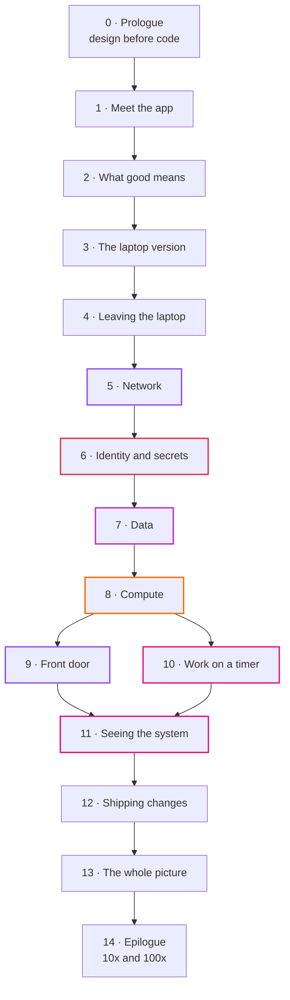

# From Laptop to Tokyo

*Designing a three-tier system on AWS, one decision at a time.*

A series from the JBC Learning Hub about system thinking. We take one small, real app and move it from a laptop to AWS in Tokyo (`ap-northeast-1`). The goal isn't to teach you Terraform, or even AWS. It's to show how people who design systems think: what they ask first, what they give up, and why.

Writing infrastructure code got cheap. An AI assistant will hand you a working VPC module in a minute. What it can't tell you is whether you need two NAT gateways or none, or what your users see when the database fails over at 3 a.m. That part is still on you, and this series is about that part.

## Who it's for

You can read code and you've seen a web app before. You don't need to know AWS, Docker or networking. Every new word gets explained the first time it shows up.

If you already build on AWS, you can skip episodes 0 and 1 and use the rest to check your own reasoning. You may disagree with some choices. That's fine, as long as you can say why.

## The story

Zayn wrote Uptime, a small website monitor: you give it a list of URLs, it checks them every minute and tells you which ones are down. It runs on Zayn's laptop in Docker and works fine there.

Then a client asks to run it for real, for users in Japan, on AWS. Zayn knows the code well and knows almost nothing about the cloud. Kian has run AWS systems for years and helps out, mostly by asking annoying questions.

Each episode starts with a short scene between the two of them, then leaves the story and teaches. The characters and the client are made up. The app, the numbers and the design are real, and they all live in this repo.

## The episodes

The series has three parts.

**Part one: know what you're building.** Before any cloud service, we look hard at the app and at what "working" means for it.

| # | Episode | The question | Main diagrams |
|---|---|---|---|
| 0 | [Prologue](00-prologue.md) | Why design before Terraform? | how to read the series |
| 1 | [Meet the app](01-meet-the-app.md) | What does Uptime do, and for whom? | user journey; data flow from check to results to rollup |
| 2 | [What good means](02-what-good-means.md) | How many monitors, how much downtime, how much money? | back-of-the-envelope numbers; requirements to decisions |
| 3 | [The laptop version](03-the-laptop-version.md) | How does it run today, and what does Docker hide from us? | local architecture; start-up order; laptop-to-cloud mapping |

**Part two: one domain at a time.** Each episode takes one domain (networking, data, compute and so on), explains the idea without any AWS names, then shows the AWS answer, what we didn't pick, what it costs in Tokyo, and what breaks.

| # | Episode | The question | Main diagrams |
|---|---|---|---|
| 4 | [Leaving the laptop](04-leaving-the-laptop.md) | What changes when the computer isn't yours? | Tokyo region and zones; who is responsible for what; the domain map |
| 5 | [Network](05-network.md) | Where does each piece live, and who can reach it? | the VPC built up frame by frame; one packet's path |
| 6 | [Identity and secrets](06-identity-and-secrets.md) | Who is allowed to do what, and where do passwords go? | who can call what; a secret's life, step by step |
| 7 | [Data](07-data.md) | Where does the data live, and what happens when that machine dies? | failover frame by frame; backup and restore timeline |
| 8 | [Compute](08-compute.md) | Where does our code run, and who restarts it? | a task's life; a rolling deploy, frame by frame |
| 9 | [Front door](09-front-door.md) | How does a browser in Osaka find us, safely? | DNS lookup; TLS handshake; static files vs `/api` routing |
| 10 | [Work on a timer](10-work-on-a-timer.md) | Who runs the check every minute, and what if two run at once? | scheduler to task; the lock that stops overlaps |
| 11 | [Seeing the system](11-seeing-the-system.md) | How do we find out something broke before the client does? | signals to alarms to email; an incident timeline |
| 12 | [Shipping changes](12-shipping-changes.md) | How does new code reach production without anyone holding keys? | pipeline stages; the OIDC trust handshake |

**Part three: put it together.**

| # | Episode | The question | Main diagrams |
|---|---|---|---|
| 13 | [The whole picture](13-the-whole-picture.md) | How do all the pieces fit, and what does it cost each month? | final architecture; one request end to end; one zone failure end to end; the monthly bill |
| 14 | [Epilogue](14-epilogue.md) | What would we change at 10 times the load? At 100 times? | what breaks first, and what replaces it |

## How every episode works

Every episode follows the same shape, so you always know where you are:

1. A short scene: Zayn hits a problem or Kian asks a question.
2. The idea in plain words, with no AWS names yet.
3. The AWS answer, and a diagram. When something moves (a request, a deploy, a failover), the diagram comes in numbered frames instead of one crowded picture.
4. What it costs in Tokyo, in US dollars, since that's what AWS bills there.
5. What we didn't pick, and when we would.
6. What breaks if: a thought experiment.
7. Check yourself: a few questions, answers hidden.
8. The map so far: the architecture picture for this layer.
9. Try it: a link to the hands-on step in this repo, if you want to build it.

Episodes 0 to 3 come before any AWS, so they skip the parts that don't apply yet. An episode takes 15 to 20 minutes to read.

## How this fits with the rest of the repo

The series explains why. The [step guides](../steps/README.md) and [workbooks](../workbook/README.md) show how, by hand in the console and then in Terraform. Decisions are written up in the [ADRs](../adr/README.md), and prices come from [costs.md](../costs.md). Episodes link to these instead of copying them, so there's one place to fix a number.

Prices were checked in September 2026. AWS changes them, so treat them as a guide and check the current price before you plan a budget.

The writing rules for the series are in the [voice guide](voice-guide.md).
